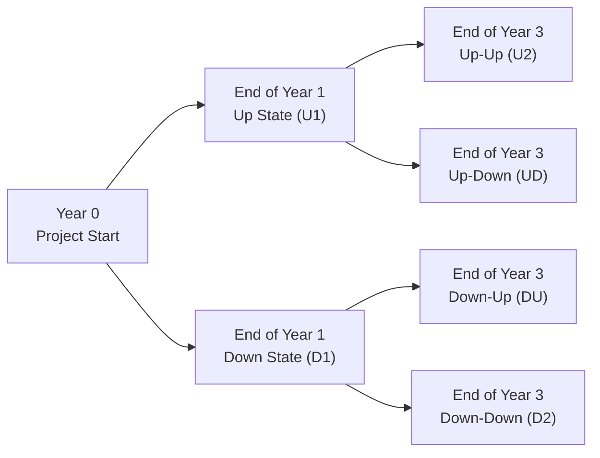

## Setting the Stage

Let’s take a quick step back and imagine you’re a finance manager at a mid-sized manufacturing firm. You’re appraising a large expansion project that, on the surface, looks pretty good in a standard net present value (NPV) framework. You do the usual: forecast cash flows, estimate a discount rate, maybe toss in a salvage value if you plan to sell the equipment after the project is done. But—here’s the twist—this project actually has a built-in strategic flexibility. If demand skyrockets for your specialized product, your firm can expand capacity further at some point. And if the market tanks and margins collapse, you might abandon the project altogether. Those are real options.

Real options are all about decision-making at various points in time. They’re called “options” for a reason: you don’t have to expand (or abandon), but if it becomes advantageous, you can. And that might significantly boost the overall value of your project. 

In a typical CFA Level II reading, you might see a more formula-driven approach, but let’s walk through a scenario-based method (often called a binomial tree) so we can see how all these bits and pieces come together.

## The Real Option Perspective

### Key Assumptions and Terminology

• Forecast Horizon: Let’s say we have a five-year project. But we’ll simplify the binomial approach to just two decision points—one at the end of Year 1 and the other at the end of Year 3.  
• Discount Rate/Cost of Capital: Suppose the project’s required rate of return is 10%. This might be your WACC (weighted average cost of capital) if it’s a typical project for your firm.  
• Volatility and Probability: The real art here is forecasting the volatility of expected cash flows or the volatility of underlying demand. Typically, you’d estimate this from historical data or scenario analysis. You could also rely on your best guess of how wide the range of outcomes might be.  
• Salvage Value: This is crucial if you have an abandonment option. Think of salvage as the disposal value if you decide to terminate early. Under IFRS or US GAAP, salvage (or residual) values are determined based on fair value less costs to sell.  

Let’s define two real options that we’ll weave into our example:

1. Expand Option: If, at the end of Year 1, sales significantly exceed expectations, the firm can invest an additional amount to double capacity.  
2. Abandon Option: If, at the end of Year 3, the project’s net profits are dismal, the firm can sell the equipment and walk away with a salvage value.

### Why Real Options Add Value

In standard financial modeling, we often treat projects as if everything is set in stone from Day 0. But strategic decisions don’t always happen in a vacuum. Managers can adapt, pivot, or exit based on evolving market conditions. That flexibility has value—just like a stock option does—except here it’s an option on a real (tangible or intangible) asset.  

In short:  
• If conditions are favorable, we press on (or expand).  
• If conditions are terrible, we cut our losses (or abandon).  
• If conditions are moderate, we proceed as planned, with baseline assumptions.

## Building a Simple Binomial Tree

Let’s illustrate how you might evaluate this expansion project using a binomial tree. For clarity, we’ll keep the numbers relatively simple, but the idea is the same for more complex or layered real options.

### Step 1: Establish the Base Project

Imagine the project’s initial outlay is $1,000,000 (Year 0). Without any real options, you forecast net cash flows such that the present value of those future cash flows is $1,100,000. So, the base-case NPV is:


\text{Base NPV} = \$1{,}100{,}000 - \$1{,}000{,}000 = \$100{,}000.


That’s a positive NPV, so you might be thinking, “Yay, let’s go for it!”

But let’s see how the real options magnify (or reduce) that figure.

### Step 2: Binomial Tree Setup

We have two decision points—after Year 1 and after Year 3. Let’s create a schematic to visualize the up (U) and down (D) states. We’ll assume a simplified approach:  
• Probability of “up” (U) each period: p  
• Probability of “down” (D) each period: 1 - p  
• In an “up” scenario, your project’s value might rise by 25%.  
• In a “down” scenario, your project’s value might drop by 20%.  

Here’s the basic structure:

• Year 0: You invest $1,000,000 right away.  
• End of Year 1: You see how demand shakes out. If it’s strong (U1), you can choose to expand. If it’s weak (D1), you proceed but keep your eyes on that abandonment possibility later.  
• End of Year 3: If still going strong, you might keep operating until the final year (Year 5), or if things are lackluster, you might salvage.  

### Step 3: Project Values at Each Node

Let’s say that, if you choose to expand after Year 1 in the up state, you spend an extra $300,000. The net effect of that expansion (based on your demand forecast) might add $400,000 in present value terms over the remainder of the project. So effectively, the expand option has an NPV of +$100,000 right at the end of Year 1.  

If you’re in a down-state after Year 1, you make no further investments but soldier on, hoping the market recovers. By the end of Year 3, you see whether conditions bounce back up (DU) or keep trending downward (D2). If it’s D2, maybe you decide to abandon with a salvage value of, say, $150,000.

A simplified table might look like this at the end of Year 3 (not discounted back yet):

| Node | Project Value Without Option | Expansion or Abandonment Decision | Resulting Value |
|------|------------------------------|-----------------------------------|-----------------|
| U2   | $1,500,000                  | No new option exercise (already expanded at Year 1) | $1,500,000 |
| UD   | $1,100,000                  | Already expanded, moderate demand | $1,100,000 |
| DU   | $900,000                    | No expansion, but continue        | $900,000  |
| D2   | $600,000                    | Abandon to salvage: $150,000      | $150,000  |

The differences in these final values reflect the cumulative effect of either expansion or no expansion and how the market evolves. Notice that in the D2 scenario—when conditions go from down to even worse—you’d be better off just selling your assets (abandoning) for $150,000.

### Step 4: Discounting Back Through the Decision Nodes

Now, you’d discount these end-of-Year-3 values back to the end of Year 1, factoring in probabilities. Then from the end of Year 1, you discount back to Year 0. But remember: at Year 1, you also have an immediate investment outlay of $300,000 if you choose to expand. Let’s do a rough calculation for the up branch:

• Probability of going U1 → U2: \\( p \times p = p^2 \\).  
• Probability of going U1 → UD: \\( p \times (1-p) = p(1-p) \\).  

For the down branch:

• Probability of going D1 → DU: \\( (1-p)p \\).  
• Probability of going D1 → D2: \\( (1-p)(1-p) \\).

You’d then incorporate the expansion option’s cost at Year 1 for the U1 branch. If the up scenario hits, you expand, which hopefully leads to the chance of even higher payoff later. If we assume discounting at 10% over a two-year period from Year 3 to Year 1 for the final payoff, and then from Year 1 to Year 0 for one more year, it might look like:


\text{Value at U1} = \frac{1}{(1+0.10)^2}
\Big( p \times \$1{,}500{,}000 + (1-p)\times \$1{,}100{,}000 \Big)
- \$300{,}000 \quad (\text{the expansion cost at Year 1})


Then you discount that quantity by another year at 10% to get the present value at Year 0. In the down branch, you do a similar approach, but there’s no expansion cost. Instead, you incorporate salvage if it’s extremely bad at the end of Year 3. 

Yes, it can get a bit messy. But that’s the gist: you compute partial NPVs at each decision node, incorporate the (up or down) probabilities, discount them, and compare that to the alternative (not expanding, or not abandoning).

### Interpreting the Results

When you add in the real options, you usually get a project value that’s higher than the base NPV. For instance, your base NPV might have been $100,000. But analyzing the possible expansions might add another $30,000 in expected value, while the abandonment option might salvage you from some nasty downside, adding another $20,000 in expected value. Altogether, that puts the “strategic NPV” at $150,000. The example is simplified, but you see how it works.

From an exam standpoint, you might be asked to:

• Compute the project’s base-case NPV.  
• Determine the “with expansion” scenario’s expected value at Year 1.  
• Factor in the salvage or abandonment conditions and see how that changes your final discounted payoff.  
• Offer a short explanation (in a short-answer or multiple-choice format) of why real options are relevant.  

Seriously, do not forget that final part; CFA exam items love testing conceptual understanding too.

## Common Pitfalls in Exam Scenarios

• Overestimating Volatility: If you assume extremely large up or down movements, you might inflate the value of the real option. Be real in your assumptions.  
• Ignoring Managerial Constraints: Sometimes, even if the numbers say “Expand,” managers might not have the capital or the appetite for additional risk. On the exam, read the vignette carefully to see if the text hints that management is reluctant to invest further.  
• Mixing Timelines: You must be consistent with your discounting periods. If you have a three-year gap to the next decision node, discount it at (1 + r)^3, not (1 + r)^2. A small detail, but I’ve seen people slip on that in practice.  
• Missing the Value of Abandonment: People sometimes skip the salvage path altogether. But if a project is performing terribly in the future, that salvage might literally cap your losses.  

## Final Tips for the Exam

• Know your binomial approach: The simplest exam question might give you direct up/down potential NPVs, along with probabilities. Then they ask for the real option value.  
• Watch the wording: If the question says “If net profit margin falls below 10%, management will abandon,” note how that triggers a salvage.  
• Time constraints: In the real world, you might build a more robust model in Excel. On the exam, you’ve got minutes to do quick calculations, so practice your setups.  
• Combine conceptual and quantitative: The item set might have one question about the math (NPV with real options) and another about the conceptual logic (“Why does the real option to abandon increase the project’s value?”).  

## References

• Official CFA Program Sample Item Sets on Equity Valuation – Real Options Section.  
• Trigeorgis, L. “Strategic Capital Budgeting: Valuing Real Options.” Financial Management.  
• The Journal of Applied Corporate Finance.  

Many of these articles dive deeper into advanced modeling. But if you want a more accessible take, you can also look online for real options case studies—some top universities post them for free.

---

## Test Your Knowledge: Strategic Project Decision Making & Real Options Quiz



### 1. A firm invests in a new factory with the option to expand in Year 2 if demand is high. This is an example of:
- [ ] A standard put option on a financial asset
- [ ] A synthetic forward agreement
- [ ] A convertible bond feature
- [x] A real option

> **Explanation:** Real options are embedded managerial flexibilities in real assets—here, the decision to expand is a prime example.

### 2. When computing the value of an abandonment option in a binomial model, the correct approach is:
- [ ] Only value it in the final year of the project
- [x] Compare the project's expected value to the salvage value at each relevant decision node
- [ ] Model it as if it’s always exercised
- [ ] Disregard discounting, since it’s optional

> **Explanation:** You must compare the expected continuation value of the project to the salvage (abandonment) value at the node in question, then choose the higher. This difference must be discounted appropriately if the decision node is in the future.

### 3. In a binomial valuation setting, the probability “p” typically represents:
- [ ] The subjective probability that an outcome will occur, ignoring the risk-free rate
- [x] The risk-neutral probability used for pricing, often derived from the up and down factors and the discount rate
- [ ] The historical frequency of past outcomes
- [ ] The implied volatility from a listed option’s pricing

> **Explanation:** In real option pricing, we often use risk-neutral probabilities to keep the model consistent with arbitrage-free pricing principles.

### 4. Suppose a project’s base NPV is $20 million. After including a valuable real option to expand, the total strategic NPV becomes $24 million. The increase of $4 million is primarily due to:
- [x] The added managerial flexibility to capitalize on upside potential
- [ ] A lower discount rate provided by the expansion decision
- [ ] The salvage value from a potential abandonment
- [ ] An assumption of guaranteed future growth

> **Explanation:** Real options typically add value by allowing the firm to exploit favorable conditions.

### 5. Which of the following best describes the effect of high volatility on the value of real options?
- [ ] It reduces the value, because uncertain cash flows are penalized
- [x] It generally increases the value of real options, because the upside potential becomes more valuable
- [ ] It has no effect once the decision is made
- [ ] It only matters for put-type options

> **Explanation:** Higher volatility tends to increase option value (both financial and real) because there’s more possible upside.

### 6. One critical difference between financial options and real options is that:
- [ ] Real options are always European-style, while financial options can be American-style
- [ ] Financial options must be held to expiration, whereas real options can be exercised anytime
- [x] Real options often involve tangible assets or operational decisions, while financial options are on financial instruments
- [ ] Real options never expire

> **Explanation:** Real options focus on strategic decisions about real assets—machinery, factories, R&D projects, etc.—compared to financial options on stocks or bonds.

### 7. The salvage (abandonment) value is best described as:
- [ ] A premium paid to maintain the option
- [x] The cash flow recovered from selling or repurposing the project’s assets
- [ ] The net present value of the expansion opportunity
- [ ] The expected value of continuing the project

> **Explanation:** If you abandon the project, you reclaim some cash through the sale of assets or scrap value, and that’s your abandonment value.

### 8. When modeling a two-step binomial tree for real options, the final step typically involves:
- [x] Computing the expected payoff or salvage at each possible ending node and discounting back
- [ ] Adding the entire cost upfront to the initial outlay
- [ ] Calculating the internal rate of return instead of NPV
- [ ] Ignoring all probabilities to avoid confusion

> **Explanation:** In the last node of a binomial tree, you assess the value of continuing vs. abandoning (or expanding). You then discount that value upstream.

### 9. A common pitfall when incorporating real options into a project’s valuation is:
- [ ] Assuming cost of capital changes drastically between nodes
- [ ] Overestimating the importance of management’s flexibility
- [ ] Relying too heavily on IFRS guidelines for intangible assets
- [x] Double-counting the option payoff when computing expected project value

> **Explanation:** It’s easy to accidentally double-count future cash flows or expansions if you’re not systematic in your binomial tree approach.

### 10. True or False: A project with a negative base NPV is never worth pursuing, even if it has a substantial real option to expand or abandon.
- [x] False
- [ ] True

> **Explanation:** The presence of a powerful real option can turn a negative base NPV into a positive one by limiting downside or unlocking upside potential.


