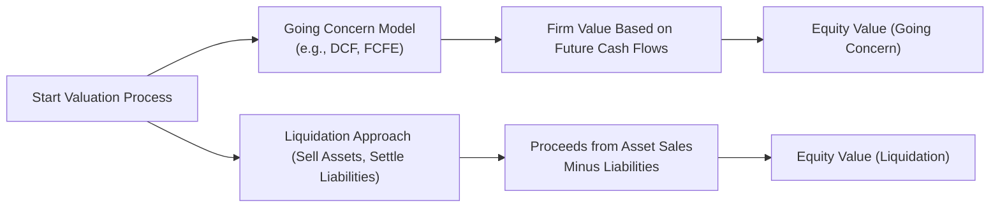

## Conceptual Perspective

I remember one of my first finance jobs where, ironically, I had to figure out whether an industrial-motors manufacturer should be analyzed as a thriving ongoing business or as a possible liquidation candidate. Frankly, I was confused—wasn’t every business supposed to be a “going concern”? Well, not necessarily. The idea behind going concern valuations is to assume that a firm will continue operating indefinitely, steadily generating (and reinvesting) future cash flows. Liquidation valuation, on the other hand, works under the assumption that everything is about to be sold off to pay outstanding debts, and then whatever residual remains is distributed to the equity holders. Understanding these perspectives—and knowing when to use which—lies at the heart of equity valuation.  

Below, let’s explore the key differences between going concern and liquidation values, the typical scenarios for each approach, how partial liquidations or break-ups might impact your analysis, and what might happen when market conditions or time constraints become critical factors.

## Understanding Going Concern Value

The fundamental premise in most equity valuations is that the company will continue to exist into perpetuity (or at least for a financially relevant horizon). You see this assumption embedded in discounted cash flow (DCF) models, dividend discount models, and free cash flow valuations (FCFF or FCFE). These approaches hinge on forecasting future cash flows, forecasting growth, calculating a discount rate, and effectively determining the firm’s share price under “normal” circumstances.  

• Assumption of Future Earnings: We presume that a company’s operations won’t abruptly stop. This insight is crucial for stable or expanding industries—imagine a major tech firm with healthy demand, robust intangible assets (like patents), or strong brand recognition.  
• Positive Growth Momentum: Going concern is generally the default lens for companies that appear to have stable or improving fundamentals. Even if near-term earnings are facing headwinds, the overarching narrative should support ongoing operations (e.g., new product lines, expansions, or cost optimization).  
• Methodology: Typically, you or I might whip out the DCF approach, layering on any relevant risk adjustments, scenario analyses, or sensitivity checks.  

## When Going Concern Valuation Applies

In practice, going concern valuation is the norm—it is what you’ll see in 90%+ of standard equity research reports. But it’s especially relevant when:

• The firm has a proven history of earnings and a forward-looking pipeline, such as stable customer contracts.  
• Management is optimistic about growth potential, possibly with large R&D budgets or expansions into new markets.  
• The macroeconomic environment is not fundamentally hostile—there’s no meltdown that is pushing the company to the brink of bankruptcy.  

It’s also important for your CFA Level II exam to recognize that typical DCF-based approaches and free cash flow valuations are especially potent tools to measure going concern value. You’re relying on a stream of future cash flows that presumably continue indefinitely at a stable or assumable growth rate.  

## Liquidation Value Overview

Now, let’s address the other end of the spectrum. Liquidation value can feel a bit grim—this is the net amount that a business would fetch if everything was sold off piece by piece and the proceeds were used to settle liabilities. Then, you distribute whatever remains to equity holders.  

• Distressed Companies: The most straightforward scenario for this approach is if the firm is distressed or on the cusp of insolvency. A distressed situation might arise from severe operational mismanagement, economic recessions, or a structural decline in an industry (think typewriter manufacturers post-1990).  
• Tangible Assets: If a company has significant real estate holdings, heavy machinery, or other readily salable assets, there may be a strong basis for a simple sum-of-the-parts liquidation approach. Curious as it may sound, sometimes a firm’s real estate alone might be worth more than the entire firm’s current market cap.  
• Forced Sales and Market Discounts: One painful reality is that forced liquidations—especially in a buyer’s market—can produce steep discounts. The company’s specialized equipment may have few buyers, or the general market for such assets may be illiquid.  

Liquidation valuation often yields a lower number than going concern methods, simply because intangible assets (like brand equity, customer loyalty, or intellectual property) are either drastically undervalued in a quick sale or might not convert to cash easily. But there are exceptions. If the company’s assets on the balance sheet significantly exceed the market’s perception of future profitability, a liquidation approach can actually produce a higher valuation than a going concern approach.

## Visual Flow of Valuation Approaches

Below is a simplified diagram illustrating how one typically splits the decision process between going concern and liquidation value:



If you anticipate the business to keep operating over the long haul and see viable growth, you likely land at node F. If you suspect a short runway or a forced shutdown, you end up at node G.

## Hybrid Approaches and Break-Up Analysis

Sometimes, the best solutions are not purely black or white. You might overlay going concern concepts with partial divestitures of non-core assets. Or you might conduct a break-up analysis:  
• Identify and value each segment or asset.  
• Subtotal to see if “the whole is less than the sum of its parts.”  
• Decide if spinning off or selling certain divisions boosts shareholder value.  

This approach can be particularly valuable if some parts of a business are profitable while others drain resources, or if you suspect the market is undervaluing the synergy among the firm’s assets.

## Addressing Market Conditions and Time Constraints

We cannot overlook market conditions—after all, asset prices can swing dramatically with liquidity or investor sentiment. A distressed environment might impose further discounts that hamper the realized proceeds from selling anything. If there’s a short runway (sometimes administration or courts can mandate a fast sale), then the liquidation value may end up even lower due to compromised negotiating power.

From a risk perspective, going concern valuations stretch across multiple periods, leaving you with forecast risk regarding revenues, margins, or required rates of return. Liquidation theoretically occurs over a shorter (but often intense) window, complicated by legal or administrative battles. Don’t forget that trustee fees, severance arrangements, and other miscellaneous costs can further erode net proceeds.

## Practical Numerical Example

Let’s imagine you’re reviewing a small auto-parts manufacturer, AutoSpare Inc. You want a quick sense of its going concern valuation versus liquidation value.  

• Going Concern Assumptions:  
  – Forecast free cash flow for the next five years:  
    – Year 1: $500,000  
    – Year 2: $550,000  
    – Year 3: $580,000  
    – Year 4: $600,000  
    – Year 5: $630,000  
  – Assume a terminal growth rate of 2% and a discount rate (WACC) of 10%.  

Using a standard two-stage DCF approach:

1. Discount each of the five years of free cash flow.  
2. Estimate terminal value at Year 5 using (FCF at Year 6) / (WACC – Growth), where FCF at Year 6 = $630,000 * (1 + 0.02) = $642,600.  
3. Terminal value = 642,600 / (0.10 – 0.02) = $8,032,500.  
4. Discount that terminal value back to present.  
5. Sum up the present values.

Without belaboring the arithmetic, you might get a going concern equity value in the range of $5 million to $6 million after subtracting net debt, depending on your exact discounting.  

• Liquidation Assumptions:  
  – Assets:  
    – Cash: $250,000  
    – Accounts Receivable: $350,000  
    – Machinery (market salvage value): $2.0 million  
    – Inventory (quickly salable): $150,000  
  – Liabilities: $2.3 million  

Liquidation value would be:

Total assets ($2,750,000) – Liabilities ($2,300,000) = $450,000.

So, going concern yields around $5–6 million (depending on exact discounting), whereas liquidation yields just $450,000. Big difference. This gap highlights why continuity assumptions are so vital.  

Here’s a mini Python snippet that might simulate a straightforward calculation of a company’s liquidation:

```python
assets_liquidation = {
    "Cash": 250000,
    "Accounts Receivable": 350000,
    "Machinery": 2000000,
    "Inventory": 150000
}

liabilities = 2300000

net_liquidation_value = sum(assets_liquidation.values()) - liabilities
print(f"Liquidation Value: ${net_liquidation_value:,}")
```

Output might read: “Liquidation Value: $450,000”  

## Risk and Time Considerations

From the exam perspective, be aware that going concern valuations integrate expectations about the future, including growth rates, reinvestment, and so on. Time horizon also matters—if the firm’s future looks stable for only three years, but beyond that the market is murky, you might have to break your forecast into segments and possibly run scenario or sensitivity analyses.  

Liquidation is more immediate. Its time frame is typically compressed, but that also means you must account for any “fire-sale” discounts. In effectively short order, the viability of intangible assets might be negligible.  

## Common Pitfalls and Best Practices

• Overestimating intangible asset recoveries in liquidation. In a forced sale, intangible assets like brand reputation or specialized technology may have limited or no resale value.  
• Forgetting overhead or shut-down costs. Liquidation usually incurs additional fees, severance costs, legal fees—these can be substantial.  
• Ignoring synergy in going concern valuations. A break-up analysis might miss the synergy that certain divisions bring to each other (e.g., shared R&D or distribution channels).  
• Blindly applying a liquidation approach just because a company is performing poorly. Sometimes a strategic reorganization or injection of capital can drastically change the outlook.  

## Glossary

Going Concern Value  
: The value of a company assuming it will continue operating and generating cash flows indefinitely.  

Liquidation Value  
: The net amount that could be realized by selling the firm’s assets individually and settling liabilities.  

Distressed Company  
: A company facing significant financial or operational challenges, raising concerns about its ability to continue.  

Break-Up Analysis  
: A technique analyzing the sum of the values of parts (divisions or subsidiaries) if sold or spun off separately.  

## Conclusion and Final Exam Tips

When approaching equity valuation on the CFA Level II exam, remember that most standard question stems are going to use going concern valuations (DDM, FCFE, or multiples-based). However, you do need to spot the special situations where liquidation might be more realistic. Always check if the vignette hints at financial distress, unserviceable debt burdens, or severe external pressures like repeated negative net income or an imminent default.  

• In item sets, look for cues: high leverage, repeated net losses, or a major question about the firm’s market viability.  
• Be prepared to do quick calculations of net asset values on a liquidation basis—especially if the exam question highlights asset appraisals or forced-sale assumptions.  
• Practice time management: partial or break-up valuations can be data-intensive. Outline your steps carefully.  
• Remember that intangible assets can swing the result. If intangible assets are crucial to the business’s operation but worthless in a forced sale, that’s a big clue that liquidation value might be extremely low compared to going concern.  

Stay flexible, read each case carefully, and always interpret the question’s signals about whether a standard DCF approach or a liquidation approach is best. Good luck!

## References and Additional Reading

- CFA Institute. (Official Curriculum on valuation concepts).  
- Moyer, R. C., McGuigan, J. R., & Kretlow, W. J. (2017). Contemporary Financial Management.  
- Rosenbaum, J., & Pearl, J. (2013). Investment Banking: Valuation, Leveraged Buyouts, and Mergers & Acquisitions.  
- Harvard Business Review articles on restructuring and liquidation strategies.

## Practice Questions: Going Concern vs. Liquidation Values



### If a company is expected to continue operating and generating cash flows indefinitely, which approach is generally the default method to use in equity valuation?

- [ ] Liquidation approach
- [ ] Break-up analysis
- [x] Going concern approach
- [ ] Residual income approach  

> **Explanation:** When a firm operates indefinitely and can generate stable or growing cash flows, we typically apply a going concern approach such as a discounted cash flow or dividend discount model.

### What can often happen to intangible assets during a forced liquidation?

- [ ] They retain nearly all of their book value.
- [ ] They convert directly into a higher terminal value for the firm.
- [x] They may have minimal or zero resale value.
- [ ] They can be sold automatically for a premium in most markets.

> **Explanation:** In a forced sale scenario, intangible assets like brand or specialized technology often yield little or no cash because their value is largely tied to ongoing operations.

### In which scenario is liquidation value more likely to exceed a going concern valuation?

- [x] When the company’s tangible assets are worth more than the future profit potential.
- [ ] When brand equity is strong and intangible assets have high synergy value.
- [ ] When the firm has robust free cash flows and limited competition.
- [ ] When the company is launching new profitable products.

> **Explanation:** Liquidation can exceed going concern if the firm’s tangible assets on the balance sheet are worth more than the market projects for the firm’s future cash flows.

### Which of the following best describes a partial liquidation or break-up analysis?

- [ ] A scenario in which all assets are sold to pay off liabilities with no future operations.
- [x] An approach that values parts of the business separately, considering selling or spinning off unprofitable segments.
- [ ] A form of intangible asset revaluation to boost the equity balance.
- [ ] A standard DCF method but with a higher discount rate.

> **Explanation:** Break-up analysis disaggregates the firm’s divisions or asset groups to determine if selling some or all of them individually results in a higher total value than operating them together.

### When using a going concern approach, what is the most common method to account for terminal value in a standard DCF?

- [ ] Summing all assets at historical cost.
- [ ] Subtracting liabilities from asset fair values.
- [x] Applying a perpetual growth formula or terminal multiple beyond the forecast period.
- [ ] Using the sum-of-the-parts approach for each operating division.

> **Explanation:** Going concern DCF methods typically apply either a perpetual growth model or a terminal multiple to estimate the firm’s value at the end of the explicit forecast horizon.

### Which of the following items is typically not considered in a liquidation analysis?

- [ ] Accounts receivable
- [ ] Machinery or equipment
- [ ] Real estate holdings
- [x] Future growth in product sales

> **Explanation:** Liquidation analysis focuses on selling existing assets as they stand, not any projected growth in product sales.

### In a forced liquidation scenario, which factor can cause realized proceeds to fall short of book values?

- [ ] Synergy premiums  
- [x] Fire-sale discounts  
- [ ] Overstatements of intangible synergy  
- [ ] Excess capital investment  

> **Explanation:** In forced or distressed sales, assets often must be sold quickly at below-market (fire-sale) prices.

### For a distressed company analysis, how does a going concern DCF model differ from a typical stable-firm DCF?

- [ ] It never uses discount rates.  
- [ ] It extends forecasts beyond 50 years.  
- [ ] It applies intangible asset revaluation each year.  
- [x] It may incorporate higher-risk premiums and scenarios reflecting the possibility of insolvency.  

> **Explanation:** Distressed valuations often add extra risk premiums or scenario analyses to reflect elevated probability of default or reduced cash flows.

### Which statement best characterizes the role of synergy in a break-up analysis?

- [x] Synergy is crucial because the combined entity might be more valuable than the sum of its parts.  
- [ ] Synergy is only relevant for intangible valuations.  
- [ ] Synergy cannot exist in going concern valuations.  
- [ ] Synergy typically lowers the overall value of the firm.  

> **Explanation:** Break-up analysis must consider whether the entire operation is worth more as one entity, or if certain segments can fetch a higher price if sold individually.

### True or False: Liquidation valuation typically involves the assumption that the firm continues to generate cash flows from its core operations.

- [ ] True
- [x] False

> **Explanation:** Liquidation valuation does not assume continued operations. Instead, it assumes assets will be sold off individually to pay liabilities, terminating the company’s operations.


