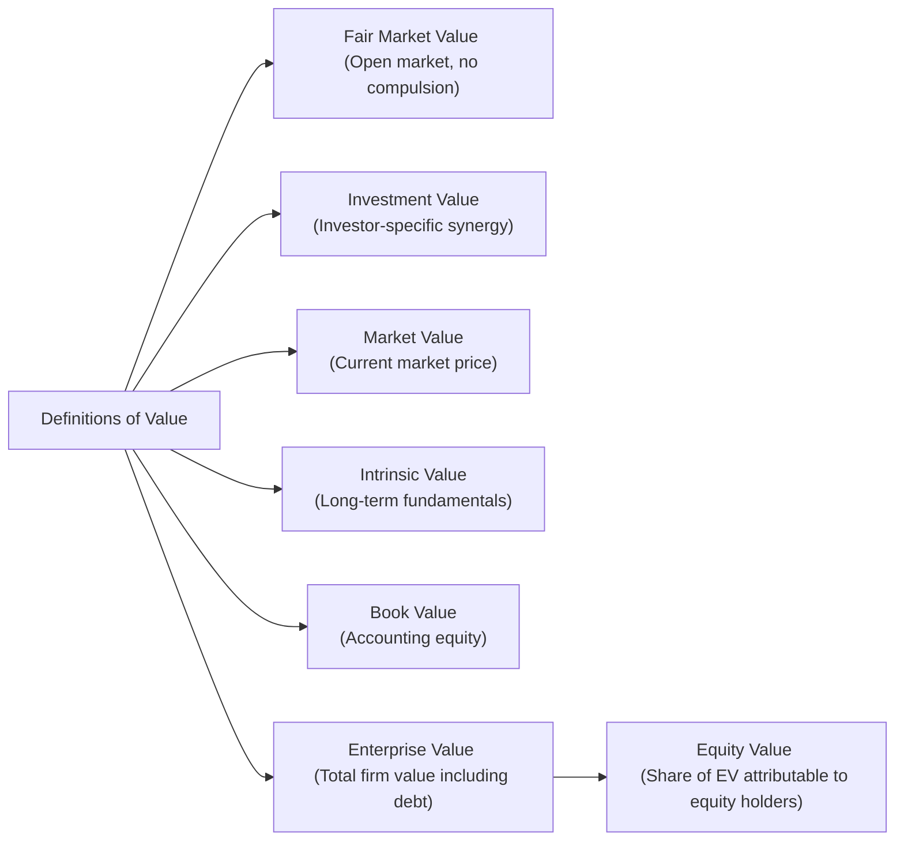

## Introduction

Have you ever seen two analysts argue about the “true” value of a company? One might instantly quote the market price, while the other insists on a more detailed fundamental analysis pointing to drastically different numbers. Honestly, the very first time I watched two senior analysts debate the meaning of “fair value,” I realized something essential: “value” can be defined in more ways than one—and each definition can be valid, depending on the context. Whether you’re building out a discounted cash flow (DCF) model for an upcoming investment pitch or analyzing synergy in a potential M&A deal, you’ll encounter multiple definitions of value. And it’s not just academic—using the right definition at the right time can help you avoid costly mistakes.

Below, we’ll dissect several common definitions of value and walk through how they’re used. We’ll see why “investment value” might be higher than “fair market value,” explore how “book value” can differ dramatically from both “intrinsic value” and “market value,” and look at how growth-oriented investors often prioritize different valuation concepts than their value-oriented counterparts. By the end, you’ll be able to match the needed definition of value to each financial scenario, something you’ll find invaluable on the CFA exam—particularly for item set questions that hinge on subtle but critical distinctions.  

## Why Multiple Definitions Matter

Equity valuation can be a bit like describing an elephant when each observer is focusing on a different part: trunk, tail, tusks, or ears. Everyone might be “correct,” yet each perspective reveals only part of the overall picture. In finance, “value” depends heavily on what you’re measuring, why you’re measuring it, and how you plan to use that measurement. If you’re preparing a valuation for tax purposes, you may adopt “fair market value” in line with widely accepted legal definitions. However, if you’re part of a strategic acquirer seeking synergy from merging with a competitor, you’ll look for “investment value”—which could be larger than the public market’s view. Let’s explore the most common definitions you’ll encounter.

## Fair Market Value vs. Investment Value

### Fair Market Value

Fair market value (FMV) is typically defined as the price at which a property (or security) would change hands between a willing buyer and a willing seller, neither under compulsion and both possessing reasonable knowledge of relevant facts. FMV is often central in legal contexts—think estate tax valuations or fairness opinions. The reasoning is that FMV approximates the “objective” market consensus: if you placed the firm on an open market, what price would normal participants pay?

• Uses:  
  – Estate tax filings, litigation, or divorce settlement.  
  – Standardized measure for certain accounting or legal frameworks (e.g., IFRS fair value disclosures).  
  – Provides a baseline for regulators or courts to ensure transactions occur at arm’s length.

### Investment Value

By contrast, investment value is entirely investor-specific. It depends on how the security fits into that particular investor’s portfolio, strategic objectives, or synergy potential. For instance, if you’re a private equity investor with deep expertise in turning around distressed companies, you might see extra value in an underperforming manufacturer because of your unique operational knowledge. Another investor—unsure how to fix the inefficiencies—would likely pay less.

• Uses:  
  – Mergers and acquisitions, where the buyer sees synergy or strategic fit.  
  – Private equity deals or venture capital, where specialized skill sets bring additional upside.  
  – Personal investment decisions aligned with investor preferences.

In practice, investment value can be above or below fair market value depending on whether the investor’s strategy amplifies the target’s earnings potential or demands a deep discount due to higher perceived risk.  

## Synergetic Value in M&A Contexts

There’s a reason acquirers often pay a premium over a target’s recent trading price: synergies. Imagine you run Company A, a smartphone manufacturer, and you want to buy Company B, a chipset developer, to ensure a stable supply chain and maybe even create new products combining your technologies. Synergetic value is that extra slice of value from combining the companies’ operations—like cost savings (economies of scale, removing duplicate functions) or revenue enhancements (cross-selling or bundling products).

• Stand-Alone Value vs. Combined Entity Value: Analysts should carefully distinguish between:  
  – The target’s “stand-alone” value (as if it continues operating independently).  
  – The incremental synergy that emerges when the target merges with your firm.

It can be tempting to get starry-eyed and overestimate synergy. In exam scenarios, watch for clues about synergy that may or may not be realistic. Overpaying for synergy is a classic pitfall in M&A—something the CFA curriculum frequently highlights.

## Book Value, Market Value, and Intrinsic Value

### Book Value

Book value is the net value of a firm’s assets on the balance sheet—basically total assets minus total liabilities. This is also referred to as shareholders’ equity. If you’ve read financial statements closely, you’ve likely noticed that book value can be way off from the actual economic worth of certain assets. For example, intangible assets like brand recognition or internally developed patents might be underrepresented, while historically recorded property may be vastly understated or—depending on market conditions—overstated.  

Book value is still helpful in certain ratio analyses (e.g., Price-to-Book). Many classic “value investors” keep a keen eye on book value as a baseline. However, always remember that it reflects strict accounting policies rather than real-time economic worth.

### Market Value

Market value, generally, is the price you could get (or pay) in the open market at any given moment. If you’re looking at a public stock, that’s just the share price multiplied by the number of shares outstanding—its market capitalization. Market value can fluctuate daily (even by the minute!) based on investor sentiment, macroeconomic news, supply and demand, and so forth.

Market value may diverge significantly from your personal valuation of a stock’s long-term prospects. For instance, if a wave of negative headlines triggers a market sell-off, you might see a company’s share price sink well below your estimate of its long-term fundamentals—and that’s often where savvy value investors jump in.

### Intrinsic Value

Intrinsic value attempts to capture the true “economic value” or “fundamental worth” of a security. Think of it this way: if you hold the stock forever, what is the present value of all the cash flows you’ll receive (dividends or free cash flow), discounted back at an appropriate required return? That, theoretically, is its intrinsic value.  

• Calculating Intrinsic Value often involves:  
  – Dividend Discount Models (DDM).  
  – Free Cash Flow (FCF) forecasting.  
  – Residual income or EVA approaches.  

It’s more stable than market value because it’s built off fundamental analysis rather than short-term sentiment. Of course, intrinsic value itself can vary from one analyst to another due to differences in growth assumptions, discount rates, and capital structure estimates. That’s precisely what keeps the market so lively—investors place different bets on what that “true” fundamental value might be.

## Growth vs. Value Perspectives

Different investor styles make use of these definitions in distinctive ways. Growth investors typically see untapped potential in a company’s future earnings or revenue expansion. If you’re into growth investing, you might ignore short-term earnings altogether and focus on longer-term top-line growth, technology innovations, or market share expansions. As a result, you might be more comfortable paying a higher price relative to current fundamentals because you believe the market’s discounting future possibilities.  

Value investors, on the other hand, often look at near-term earnings, tangible assets, or moderate long-term growth assumptions. They might compare market value to book value or use metrics like the P/E ratio or EV/EBITDA to see if the stock trades at a discount relative to competitors or its own historical average. When they see a stock trading below their estimate of its intrinsic value, that mismatch suggests an attractive buying opportunity.

## Enterprise Value vs. Equity Value

### Enterprise Value (EV)

Enterprise value is a measure of a company’s total “operational” value, including all financing sources. A typical formula for EV:

EV = Market Capitalization + Total Debt – Cash and Cash Equivalents  

This measure is often used when comparing companies with different capital structures or assessing how much it might cost to acquire the entire firm (i.e., taking on its debt, pocketing its cash, and controlling its assets).

### Equity Value

From EV, subtract net debt (debt minus cash) and you arrive at equity value—the portion of the overall company value theoretically attributable to shareholders. Essentially, it’s what’s left for the owners once all debt claims are accounted for.  

• Why the Distinction Matters:  
  – If you’re analyzing a leveraged buyout (LBO), enterprise value is crucial because you’re looking at the firm’s overall capital structure.  
  – If you’re just interested in the upside for current shareholders, you focus on equity value.  

## Using Definitions Appropriately

One of the biggest challenges for analysts is ensuring they pick the right definition of value for the task at hand. Think of it as choosing the right tool in a toolbox:

• For M&A deals, you’ll emphasize investment value and synergy potential, possibly referencing fair market value as a baseline for negotiations.  
• For minority positions in public equities, your starting point might be market value, but your real interest is in the gap between market and intrinsic value.  
• For tax or legal disputes, fair market value is often mandated.  
• For strategic reviews of a target’s fundamentals, you’ll aim for a well-reasoned intrinsic value.  
• For comparative ratio analysis (like P/B or P/E), market values and book values play a prominent role.  

Speaking from experience, confusion arises when someone tries to impose a “one-size-fits-all” approach—say, applying “fair market value” in a synergy-driven scenario or ignoring intangible assets when the intangible brand is basically the crown jewel.  

### Regulatory Impact

Meanwhile, regulations and accounting standards also influence which valuation definitions are used. IFRS and US GAAP define “fair value” for financial statement reporting. For example, IFRS 13 and ASC 820 in US GAAP outline a “fair value hierarchy” for measuring assets and liabilities. These definitions are similar (but not identical) to fair market value. Make sure to pay attention to the precise definitions if you’re working under a specific regulatory framework.

## Common Pitfalls and Best Practices

- Overestimating Synergy in M&A: The excitement of a potential deal often leads to inflated synergy estimates. A best practice is to document synergy assumptions explicitly and perform scenario analyses.  
- Confusing Book Value with Intrinsic Worth: Book value is great for historical cost references and ratio analysis, but it’s rarely the best measure of economic value. Always adjust for intangible assets or off-balance-sheet items if you’re leaning on book value.  
- Using Market Value as the Definitive Indicator: Market prices can be irrational, especially in moments of euphoria or panic. A best practice is to compare trading multiples with your own fundamental estimates.  
- Failing to Distinguish Between Enterprise and Equity Valuations: For highly leveraged companies, mixing EV and equity metrics produces a muddy analysis. Put simply, be sure you know which level of capital structure you’re valuing.  
- Not Setting the Right Discount Rate: Whether you’re deriving fair market value or intrinsic value, selecting an appropriate discount rate or cost of equity can drastically sway your conclusion.  

## A Visual Overview of Value Definitions

## Comparison Table

Below is a concise table summarizing these definitions:

| Type of Value      | Definition                                                            | Example Use Case                                          |
|--------------------|----------------------------------------------------------------------|-----------------------------------------------------------|
| Fair Market Value  | Price for a willing buyer & seller in an open market                  | Estate taxes, legal disputes, IFRS fair value reporting   |
| Investment Value   | Value to a specific investor, considering unique synergies or strategy| M&A transactions, strategic investments, private equity   |
| Book Value         | Net assets on the balance sheet (equity = assets – liabilities)       | Baseline for ratio analysis (P/B), historical comparisons |
| Market Value       | Price quoted on exchanges, subject to supply-demand and sentiment     | Quick reference for trading, daily price knowledge        |
| Intrinsic Value    | Long-term fundamental worth based on cash flow or other metrics       | Detailed fundamental analysis (DCF, residual income)       |
| Enterprise Value   | Comprehensive firm value = market cap + debt – cash                   | M&A deals, leveraged buyouts, total firm valuation        |
| Equity Value       | The share of firm value attributable to shareholders (EV – net debt)  | Investor-focused analysis, share price examinations       |

## Practical Example: Tech Startup vs. Established Utility

Picture you’re eyeing two companies:

• Tech Startup (Private Company): Minimal revenue, but a patented technology that could disrupt an entire industry. Book value might be quite low because intangible assets overshadow tangible ones. If you have a specialized R&D team that can supercharge the patent’s value, your investment value could be significantly higher than what a general buyer would pay.  
• Established Utility Provider (Public Company): Steady revenue, significant physical assets (infrastructure, plants), and a predictable demand. Its book value might be high but might not fully reflect the possibility of regulatory changes or shifts in energy technology. Meanwhile, its market value could deviate from your intrinsic value analysis if interest rates rise or if there’s fear of new environmental regulations.  

These disparities highlight how definitions of value can lead to wide valuation differences—especially in contrasting industries and investor profiles.

## Exam Relevance and Final Thoughts

On the CFA Level II exam, you’ll often tackle item sets in which you must decide if the correct measure of value is related to synergy (investment value), general market consensus (fair market value or market value), or fundamental, long-term worth (intrinsic value). Watch for distractors that try to tempt you into using the wrong measure. If you see a question about a strategic acquisition, that’s likely pointing to synergy and investment value. If the question hints at a legal setting, fair market value may be the best reference.  

Keep practicing with different valuation scenarios and stress testing your assumptions. Knowing which definition of value applies is almost half the battle—crucial both in exam item sets and in real-world finance roles. Good luck, and don’t forget to brush up on those synergy calculations (and check your optimism at the door!).

## References and Further Reading

- Damodaran, A. (2012). “Damodaran on Valuation.” Wiley Finance.  
- CFA Institute. (Level II Curriculum on specific valuation definitions).  
- Pratt, S. P., & Grabowski, R. (2014). “Cost of Capital: Applications and Examples.” Wiley.  
- PwC Valuation Resources: <https://www.pwc.com>  

--------------------------------------------------------------------------------

## Comprehensive Practice on Definitions of Value



### A prospective buyer values a target company higher than its current market price due to proprietary technology alignment with its existing product line. Which definition of value is this buyer most likely using?

- [ ] Fair market value
- [x] Investment value
- [ ] Book value
- [ ] Market value

> **Explanation:** The buyer’s valuation reflects strategic synergies and a unique viewpoint—hallmarks of investment value.

### Which definition of value is typically mandated for estate tax purposes and other legal valuations?

- [ ] Intrinsic value
- [ ] Investment value
- [x] Fair market value
- [ ] Enterprise value

> **Explanation:** Legal and regulatory contexts often require fair market value, which represents a notional open-market transaction between willing parties.

### What is a key difference between market value and intrinsic value?

- [x] Market value can reflect short-term sentiment, while intrinsic value is based on fundamental cash flow analysis.
- [ ] Market value relies on synergy benefits, while intrinsic value is purely accounting-based.
- [ ] Market value always exceeds intrinsic value.
- [ ] Intrinsic value and market value are necessarily equal in efficient markets.

> **Explanation:** Market value often fluctuates with investor sentiment, while intrinsic value focuses on fundamental valuation methods (e.g., DCF).

### A minority investor checking daily stock quotes sees that a small biotech firm’s share price plummets due to negative news. If the investor’s own valuation suggests the firm’s fundamentals haven’t changed, which term best describes the investor’s personal assessment?

- [ ] Book value
- [x] Intrinsic value
- [ ] Fair market value
- [ ] Investment value (for synergy)

> **Explanation:** The investor is relying on fundamental analysis and concluding that the stock’s “true” worth (intrinsic value) remains intact despite short-term price drops.

### In mergers and acquisitions, which concept primarily captures the additional value arising from combining two companies to eliminate redundant costs or enhance revenues?

- [x] Synergetic value
- [ ] Book value
- [ ] Market value
- [ ] Fair market value

> **Explanation:** Synergetic value is the incremental benefit to the combined entity, above and beyond the stand-alone business values.

### If an analyst wants to assess the total value of a firm’s operations for a potential buyout, including debt but net of cash, which measure should they use?

- [ ] Equity value
- [ ] Book value of equity
- [x] Enterprise value
- [ ] Fair market value

> **Explanation:** Enterprise value incorporates market cap, debt, and subtracts out cash, representing the total company value for potential acquirers.

### What primary factor distinguishes investment value from fair market value?

- [ ] Investment value is always lower than fair market value.
- [x] Investment value considers an investor’s unique circumstances or synergistic benefits.
- [ ] Fair market value cannot be used for legal or tax contexts.
- [ ] Investment value is identical to intrinsic value.

> **Explanation:** Investment value includes buyer-specific synergies or assumptions that may not exist for a typical open-market buyer and seller.

### An equity analyst is reviewing a firm’s balance sheet to find shareholders’ equity. Which definition of value is the analyst most directly observing?

- [ ] Intrinsic value
- [ ] Market value
- [x] Book value
- [ ] Investment value

> **Explanation:** Book value is derived from accounting entries: total assets minus total liabilities on the balance sheet.

### During a bullish market phase, stock prices often move in a way that exceeds most fundamental estimates, suggesting what phenomenon?

- [x] Market value surpassing intrinsic value
- [ ] Book value surpassing intrinsic value
- [ ] Intrinsic value and market value converge
- [ ] Fair market value is disconnected from synergy

> **Explanation:** Market exuberance can drive share prices significantly above fundamental or intrinsic valuations.

### True or False: Enterprise value minus net debt equals equity value.

- [x] True
- [ ] False

> **Explanation:** Equity value is effectively the residual claim after subtracting net debt from the enterprise value.


