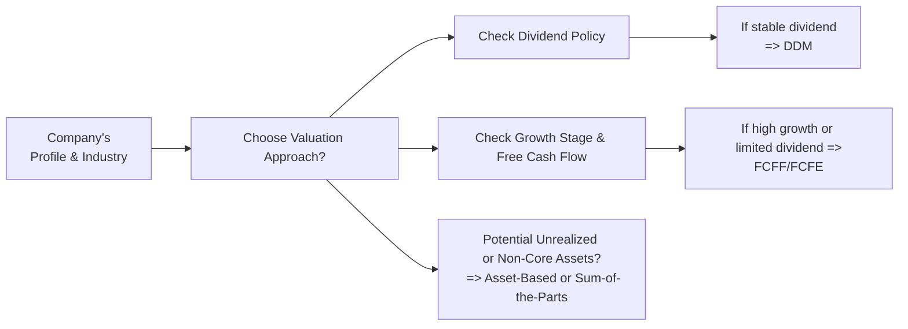

## Overview

Valuing equities can feel a bit like searching for a hidden treasure chest: you suspect there’s value in there somewhere, but you’re not 100% sure which vantage point or map (i.e., valuation method) will give you the clearest view of what lies beneath. In real-life applications—and especially in the CFA® Level II exam—you’ll often encounter “vignette-style” scenarios designed to test not just your knowledge of different valuation models but also your analysis of the company context, industry conditions, macroeconomic factors, and any unique operational or strategic details that affect intrinsic value.

When you pick up a vignette in the testing environment—or even in a real-world investment role—you’ll want to quickly identify the company’s stage of growth, capital structure, and whether it pays dividends or not. You’ll also reflect on potential corporate actions or changes in business strategy. That’s how you’ll figure out if a Dividend Discount Model (DDM), a Free Cash Flow (FCFF or FCFE) approach, or a market-based multiple (like EV/EBITDA) is likely to capture the full story. In this section, we’ll walk step by step through these considerations and then illustrate them using an example-based format closely aligned with CFA exam item sets.

## The Typical Exam Vignette

Picture this: you’re reading a vignette that describes a mid-sized manufacturing company—let’s call them “AlphaSteel Inc.” The scenario might note that AlphaSteel recently secured a large, multi-year supply contract with a big automotive client, expects stable earnings for the next five years, and has historically paid steady dividends. The item set might provide partial financial statements highlighting net income, free cash flow to equity (FCFE) from the cash flow statement, and notes about capital expenditures (CapEx).

The question typically ends with: “Based on the information provided, which valuation approach is most appropriate?” or “Determine the company’s intrinsic value using the most relevant valuation method.” They’re testing your ability to interpret financial data, gauge the firm’s growth prospects, and connect the dots to pick the right approach.  

## Key Steps in the Vignette Analysis

1. Assess the Firm’s Life Cycle Stage  
   Is the firm a mature, dividend-paying juggernaut? Or is it a high-growth tech startup that has never paid a dividend? This quick read on the company’s life cycle can often narrow down your valuation method. A stable, mature firm that regularly pays dividends might be an ideal candidate for a DDM. Meanwhile, if the company reinvests most of its earnings and pays out minimal (or no) dividends, an FCFF or FCFE approach is often a better fit.

2. Evaluate Capital Structure  
   If the company’s debt load is high, or if there is imminent restructuring, you might opt for models that more explicitly incorporate financing decisions—like the FCFE approach that accounts for changes in leverage. In contrast, if you expect the capital structure to remain relatively static, a straightforward DDM or an unlevered valuation might suffice.

3. Look for Dividend Stability  
   In real life, I once worked for a consultancy that helped a small REIT (Real Estate Investment Trust) do an internal valuation. They had a consistent and well-defined dividend policy that had almost no volatility historically. That was a signal that a DDM could be suitable. Alternatively, if a firm has an erratic or non-existent dividend policy, using DDM can get messy unless we adapt a multi-stage or no-dividend approach.

4. Check Profitability and Free Cash Flows  
   If the scenario reveals that the company’s operating cash flows are negative but they project huge revenue growth in the next few years, an aggressive FCFF model with multiple stages for growth and profitability might be the way to go. On the other hand, if free cash flow is consistently positive and lines up nicely with net income, an FCFE or traditional DCF approach can be easier to apply.

5. Consider Industry and Macro Context  
   - Cyclical Industry: If the vignette emphasizes volatile market demand (like commodity-driven industries), you might want to incorporate scenario analysis for the DCF.  
   - Economic Headwinds or Uncertainties: If management commentary suggests big macro risks, then rely on extensive sensitivity analysis or a more robust cash flow model that can handle multiple “what-if” assumptions.

6. Watch Out for Special or One-Time Items  
   - One-time charges or intangible assets might show up. Don’t forget to normalize these items for an accurate forecast.  
   - If brand equity or intellectual property is a key driver of value, the intangible advantage might not appear explicitly in the financial statements but will affect your revenue and margin forecasts.

7. Summarize and Choose the Model  
   In exam scenarios, it’s super important to articulate why you chose one method over another. If you’re justifying a single-stage DDM for a consistent dividend-paying firm, you might underscore the stable payout ratio, the predictable growth rate, and the firm’s maturity in its industry. If you pick EV/EBITDA for a high-growth firm with negative earnings, you might note that EBITDA better reflects operating performance and is more commonly used for such firms.  

## Practical Example Vignette

Let’s illustrate a simplified exam-style setup for “AlphaSteel Inc.”:

“AlphaSteel Inc. is a well-established steel manufacturer operating primarily in a stable region. It recently secured a 10-year supply agreement to provide steel sheets for a large automobile manufacturer. Management has historically maintained a consistent payout ratio of 50%. Dividends over the last four years have grown at about 3% annually. AlphaSteel’s net debt is moderate, and management expects no major changes in the company’s capital structure. AlphaSteel’s latest financial statements suggest the following future estimates:  
• Net Income in Year 1: USD 200 million  
• Expected Growth in Net Income: 3% per year  
• 50% Payout Ratio  
• Required Rate of Return (Cost of Equity): 8%  

Industry analysts note that AlphaSteel’s consistent dividend policy and stable market share make it a strong candidate for a straightforward dividend-based valuation. Meanwhile, a recent surge in infrastructure spending could temporarily boost short-term sales, but management is not adjusting its long-term dividend targets in response.”

### Quick Calculation Using a Single-Stage Dividend Discount Model (DDM)

If you suspect a single-stage DDM is appropriate, you might recall the formula:


P_0 = \frac{D_1}{r - g}


Where \\(P_0\\) is the intrinsic value of the stock today, \\(D_1\\) is the dividend next year, \\(r\\) is the required return on equity, and \\(g\\) is the dividend growth rate.

- Net Income (NI) next year: \$200 million * 1.03 = \$206 million  
- Payout Ratio: 50% => Dividends next year = \$206 million * 0.50 = \$103 million.  

If there are, say, 100 million shares outstanding, then the dividend per share next year \\(D_1\\) = \$103 million / 100 million shares = \$1.03 per share.

Use \\(r = 0.08\\) (8%), and \\(g = 0.03\\) (3%):  


P_0 = \frac{1.03}{0.08 - 0.03} = \frac{1.03}{0.05} = 20.60 \text{ (USD per share)}


That’s your single-stage DDM result. Does that seem logical? Yes, for a stable and mature company, this approach is plausible.  

Below is a quick snippet if you were to calculate it in Python:

```python
dividend = 1.03
req_return = 0.08
growth = 0.03
P0 = dividend / (req_return - growth)
print(P0)  # 20.60
```

In the real exam context, you would simply do this on your approved financial calculator. But the logic remains the same: apply the stable-growth, single-stage DDM when the firm’s dividends appear consistent, the payout ratio is predictable, and the growth rate is fairly stable.

## Diagram of the Valuation Approach Selection

Sometimes, seeing a flow diagram helps tie it all together:



In words: 
• Start with the firm’s profile and industry.  
• Decide if the dividend policy is stable.  
• If not, do they have strong free cash flow or intangible brand assets?  
• Is there a possibility that an asset-based approach or sum-of-the-parts better reflects the underlying value?

## Edge Cases and Caveats

• Very High Growth Companies: If you see a scenario with explosive growth projections, a two-stage or even three-stage DDM or FCFE model might be more suitable than a single-stage approach.  
• Negative Earnings or Cash Flows: If the firm is struggling financially, look to future outlook, or consider an asset-based model if liquidation is plausible.  
• External Shocks: If the firm is in a highly cyclical sector (like mining or oil) and could face large commodity price swings, you might do scenario analysis to handle best/worst case forecasts.  

I recall a situation—this was when I first started in equity research—where the client was analyzing a biotech startup with zero revenue but incredible pipeline potential. A DDM approach made zero sense. They had no dividends, no consistent earnings, so we had to rely on a multi-stage FCFE with bigger margin of error in the forecast. We tested a range of scenarios for clinical trial success or failure outcomes, plugging them into our free cash flow projections.  

In a nutshell, try not to be dogmatic. The chosen approach always depends on the practical realities of the business, management’s track record, and the clarity (or uncertainty) of future projections.

## Conclusion

Selecting the right valuation approach in a CFA vignette—whether it’s DDM, FCFF, FCFE, or a market multiple like Price-to-Earnings (P/E) or EV/EBITDA—comes down to context. You want to check the company’s life cycle, its dividend policy, capital structure, industry risk, and financial statement stability before making your choice. If you can articulate a coherent rationale that ties these variables together, you’re in a strong position to interpret the scenario effectively and arrive at the best-fitting valuation method.

As you practice, focus on reading vignettes carefully, extracting the must-know data points, and matching them to the relevant model. This skill is not just for the exam—it’s the same approach a professional analyst would take when meeting with a new client or evaluating an investment opportunity in the real world.

## References

- CFA Institute. (CFA Exam Prep: Example Item-Set and Vignette Questions).  
- Damodaran, A. (2014). “Applied Corporate Finance.” Wiley.  
- McKinsey & Company. Various articles on corporate valuation strategies and best practices.  
- Corporate Finance Institute. (https://corporatefinanceinstitute.com/)

## Test Your Knowledge: Selecting the Right Valuation Approach



### When analyzing a mature company with stable, predictable dividends, which approach is often preferred?

- [x] A single-stage Dividend Discount Model (DDM)
- [ ] An Asset-Based approach
- [ ] Multi-stage FCFE modeling
- [ ] EV/EBITDA multiple analysis

> **Explanation:** Mature, stable dividend-paying firms are frequently valued using a single-stage DDM since cash flow to equity holders is both consistent and reliably growing at a steady rate.

### A high-growth tech start-up that has yet to pay dividends and might not be profitable for several years is typically best assessed using:

- [ ] A single-stage DDM
- [x] A multi-stage FCFE or discounted free cash flow approach
- [ ] A stable-growth dividend model
- [ ] Market approach using P/B ratio

> **Explanation:** For companies that do not pay dividends and have volatile or negative earnings, a FCFE-based approach (often multi-stage) can capture shifting growth rates and future prospects more accurately than a DDM.

### Which factor would most strongly suggest that an analyst should use an asset-based approach?

- [x] A company whose liquidation value is high in relation to its operating value
- [ ] A thriving company with substantial intangible brand equity
- [ ] A profitable firm with stable cash flows and consistent dividends
- [ ] A tech startup with positive net present value projects

> **Explanation:** An asset-based approach is relevant when a firm’s liquidation or net asset value is highly significant compared to its ongoing operations (e.g., the business could be worth more dead than alive).

### In a vignette, you notice a consistent annual payout ratio for dividends over the past 10 years, matching stable earnings growth. Management also expresses no plans to alter capital structure significantly. Which approach would you likely select?

- [x] A single-stage Dividend Discount Model
- [ ] EV/EBITDA
- [ ] FCFE model with multi-stage growth
- [ ] Residual income approach

> **Explanation:** A consistent dividend pattern, stable earnings growth, and unchanged capital structure are the hallmarks of a situation where a single-stage DDM is both simple and highly effective.

### A cyclical automotive parts manufacturer with volatile raw materials prices and capital-intensive operations requires thorough scenario analysis in its valuation model. Which approach is best suited?

- [x] A two-stage or multi-stage DCF model incorporating scenario analysis
- [ ] A single-stage DDM
- [x] Potentially a market multiple approach with cyclical adjustments
- [ ] Liquidation-based approach only

> **Explanation:** For cyclical firms, scenario analysis within a multi-stage DCF can handle fluctuations in input costs, demand, and working capital. Sometimes, a well-considered market multiple approach can be used in tandem, adjusting for industry cycles.

### Which of the following is a major advantage of using a Free Cash Flow to the Firm (FCFF) approach instead of a Dividend Discount Model?

- [x] It can value companies that do not pay dividends, focusing on the firm’s entire cash-generating capacity
- [ ] It ignores capital structure, thus simplifying the calculation
- [ ] It is not subject to growth rate estimation
- [ ] It is least sensitive to assumptions about operating expenses

> **Explanation:** FCFF valuation is particularly valuable for companies that do not pay dividends but still generate overall cash flows. It captures total firm value before accounting for financing decisions.

### In a vignette, you see that a firm is transitioning from a high-growth phase to a mature phase. Dividends are expected to grow rapidly in the first few years, then settle into a steady rate. Which approach is most appropriate?

- [ ] Single-stage DDM
- [ ] One-year holding period model
- [x] Multi-stage dividend discount model
- [ ] Pure liquidation model

> **Explanation:** Where growth rates aren’t constant—say the firm goes from high growth to stable—an analyst will often employ a multi-stage DDM to capture the initial fast dividend growth and the later stable phase.

### A real estate investment trust (REIT) with a steady payout ratio, moderate leverage, and stable revenue from long-term leases might be best valued with:

- [x] A single-stage DDM or a multi-stage REIT-specific dividend model
- [ ] Residual Income valuation
- [ ] Intrinsic P/E approach only
- [ ] Liquidation approach, ignoring future lease payments

> **Explanation:** REITs often pay relatively predictable dividends tied to their net rental income. Thus, a dividend modeling approach is typically the simplest and most objective method.

### If an analyst spots heavy intangible assets on the balance sheet and a brand-driven competitive advantage, yet sees moderate FCF growth, the best approach might:

- [x] Incorporate intangible value into a cash flow–focused approach
- [ ] Disregard intangible assets as “non-cash” items
- [ ] Default to liquidation-based valuations
- [ ] Ignore free cash flow and rely purely on historical P/E multiples

> **Explanation:** Intangible assets and brand equity often influence top-line growth and margins. A robust discounted cash flow approach can capture the intangible premium in revenue and margin projections, whereas ignoring these assets might lead to undervaluation.

### True or False: The primary reason for choosing an EV/EBITDA approach is that it cannot be affected by capital structure at all.

- [x] True
- [ ] False

> **Explanation:** EV/EBITDA is relatively less sensitive to capital structure than P/E multiples because EV (enterprise value) includes debt and equity, while EBITDA is pre-interest. However, it's not entirely immune to capital structure nuances but is often favored for comparing firms with different leverage levels.


