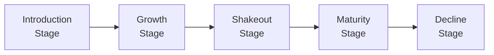

## Overview

When we talk about analyzing an industry in detail, we often turn to the concept of the “industry life cycle.” This framework is essential for equity analysts who want to understand how companies evolve over time, forecast potential developments, and estimate profitability trends. It’s also super handy (in my opinion) for clarifying why some industries thrive while others languish. Let’s dive in by unpacking each of the five main stages of the typical life cycle: Introduction (Emerging), Growth, Shakeout, Maturity, and Decline.

Here’s a quick high-level look at the journey we’re about to take:

Analysts look at these stages to evaluate an industry’s competitive dynamics, profitability potential, and overall stability. It’s not always linear—disruptions can pop up, or cyclical factors might cause odd detours—but these five stages capture the broad arcs most industries follow.

## The Industry Life Cycle Framework

In simple terms, each industry life cycle stage is characterized by a distinct macro-level environment, common patterns in profitability, and unique operational challenges. By identifying an industry’s spot on this curve, you can better gauge what’s behind the revenue numbers, how fierce the competition is, and what kind of investment or strategic decisions might make the most sense. 

But keep in mind: one of the biggest pitfalls here is overgeneralizing. Not every industry hits each stage in textbook form. You might see a “rebirth” if technology or demand shifts bring new life into a declining sector. So, always pair this model with current market data and informed judgment.

## Introduction (Emerging) Stage

Characteristics.
• High uncertainty and risk.  
• Low to moderate market penetration since products or services are new.  
• Massive upfront capital expenditures (e.g., for R&D, production facilities, marketing).  
• Limited or negative profitability because revenues are small while costs can be huge.  

Analyst Focus.  
• Innovation potential: Are there major technological breakthroughs? Does a company have first-mover advantage or superior intellectual property?  
• Barriers to entry: If an entrant’s product or service is easy to replicate, the industry may quickly get crowded.  
• Funding viability: This is the stage where many firms rely on venture capital, private equity, or strategic partners. Without robust financing, they could fizzle.  

Real-World Example.  
I remember a local “synthetic meat” startup that spent years (and heaps of cash) just perfecting its technology. They had minimal revenue initially, but the market found the concept fascinating. The high-risk, high-reward vibe was a classic sign of the introduction stage. 

Investor Approach and Valuation.  
• Investors who jump in here are often seeking explosive returns but should prepare for big risks. Valuations can be tricky. Traditional metrics like P/E might be irrelevant or negative (due to negative earnings).  
• Qualitative analysis (management expertise, product pipeline, patents, growth potential) can be more telling than backward-looking metrics.  

## Growth Stage

Characteristics.  
• Rapid expansion of market demand, with accelerating sales and revenues.  
• Firms may see improving or even strong profit margins as fixed costs get spread over higher volumes.  
• Rising competition. Competitors might flood the space, drawn by new opportunities.  

Analyst Focus.  
• Market share changes: Who’s grabbing the bigger slice of the (rapidly growing) pie?  
• Scalability and capacity expansions: Growth-stage firms often ramp up production or expand geographically.  
• Revenue forecasting linked to overall market expansion, not just competitive dynamics.  

Personal Anecdote.  
I once analyzed a chain of specialty coffee shops during a nationwide coffee-craze (honestly, a dream job if you’re a coffee lover like me!). Sales soared month after month, but so did the number of competitors. This was a picture-perfect growth market: everyone saw there was money to be made.  

Valuation Insights.  
• Multiples such as forward P/E or price-to-sales (P/S) can be relevant. Keep an eye on whether revenue growth is sustainable.  
• PEG ratio (P/E divided by growth rate) sometimes helps, though be careful with wild or volatile growth rates.  

## Shakeout Stage

Characteristics.  
• Growth starts to slow—so many new entrants have poured in that the industry might turn more competitive.  
• Weaker firms struggle: they might lack cost efficiency, brand strength, or product differentiation.  
• Industry consolidation: Mergers, acquisitions, or outright failures can significantly reduce the field of competitors.  

Key Indicators.  
• Profit margins often come under pressure because everyone is fighting for market share.  
• Overcapacity might emerge if too many firms ramped up production or expanded channels.  
• This can be the point where the strongest survive, while less capable players exit.  

Analyst Angle.  
• Keep an eye on leverage: Some companies have financed expansions with loads of debt, which becomes a liability in a more competitive, slower-growth environment.  
• Look for potential M&A targets: Large, well-capitalized players might start acquiring smaller firms to solidify their market positions.  

## Maturity Stage

Characteristics.  
• Stable or modestly growing demand that tracks broader economic growth.  
• Reputation, brand loyalty, and efficient operations matter more than novelty.  
• Pricing power wanes as competition is well-established. Cost leadership and operational efficiency become major profit drivers.  

Analyst Focus.  
• Firms often pay out higher dividends because growth opportunities are not as abundant.  
• Focus on stable cash flows: especially relevant for more predictable discounted cash flow (DCF) models.  
• Industry leadership is less dynamic: top players often remain on top, and barriers to entry can be high.  

Valuation Approaches.  
• Traditional metrics like P/E, P/B, and dividend discount models (DDM) can be more applicable. Earnings and cash flows tend to be less volatile (less, not zero!).  
• Analysts might still do scenario analyses to see what happens in case of economic downturns or tiny shifts in consumer preferences.  

## Decline Stage

Characteristics.  
• Negative growth or shrinking demand due to shifting consumer tastes, obsolete technology, or new competition.  
• Overcapacity becomes acute, leading to margin erosion.  
• Many firms exit or pivot to other lines of business.  

Strategic Options.  
• Innovation or pivot: Some companies try to breathe new life by introducing new products or pivoting to emerging related fields.  
• Harvest strategy: Others accept declining sales but aim to optimize cost structures to squeeze out as much profit as possible before shutting down.  
• Niche play: A few might double down on a loyal subset of customers.  

Analyst Approach.  
• Watch for signs of disruption: If a new technology emerges that might resurrect the industry or shift it into a new life cycle, you need to revise your assumptions.  
• Liquidation value might become relevant for traditional valuations. Some companies in severe decline are worth more broken up than on a going-concern basis.  

## Disruption and Accelerated Transitions

Sometimes, a disruptive innovation (think smartphones or streaming media) quickly catapults an industry from one stage to another. A brand-new technology can swiftly move from Introduction to Growth. Meanwhile, older, established sectors might skip maturity altogether and just fall off a cliff into Decline if they can’t keep pace. 

What’s important is nimbleness in your analysis. You might be used to applying a stable maturity-stage valuation, then realize the entire industry is getting hammered by a new competitor. Stay current with consumer sentiment, competitor moves, and regulatory changes.

## Impact on Valuation and Analytical Approaches

One fundamental lesson from the life cycle model is that an industry’s present position significantly influences the relevant valuation multiples and the reliability of forward estimates. For example:

• Introduction/Emerging. Cash flow is often negative, so DCF valuations rely heavily on terminal value assumptions. Multiples like EV/sales might be the go-to because earnings can be negative.  
• Growth. Multiples (P/E, EV/EBITDA) can be high amid strong expectations. Analysts should question whether these assumptions are realistic or inflated by hype.  
• Shakeout. Valuation can hinge on discerning winners from losers. Distressed valuations might come into play.  
• Maturity. Classic valuation approaches (DDM, FCFF, FCFE, P/E multiples) can produce stable results if the company’s cash flows are predictable.  
• Decline. Analysts may emphasize liquidation or salvage values. If a firm is pivoting, scenario analyses become crucial.  

In practice, you often see a combination approach—maybe a P/E multiple augmented by a sum-of-the-parts if the business segments face different life cycle trajectories.

## Integrating Quantitative and Qualitative Signals

A robust analysis should look at both data (growth rates, profit margins, market share) and intangible factors (consumer preferences, regulatory environment, competitor strategies). For instance, in the Growth stage, a big jump in market share is great quantitatively, but if that share is built on fleeting consumer fads, the quality of that growth might be shaky.

Likewise, in Maturity or Decline, you might see moderate or negative revenue trends, but strong management teams could optimize costs and pivot quickly. This highlights the value of reading the qualitative tea leaves.

## Scenario-Based Analysis

Because industries can move through these phases at different speeds—or even skip around them—scenario analysis is a powerful tool. By creating bull, base, and bear case forecasts, you can see how the value of a company might fluctuate based on how quickly or slowly the industry evolves. 

• Bull Scenario: A new technology or product catches fire, pushing the industry deeper into Growth or extending Maturity.  
• Base Scenario: The industry progresses at a “typical” or “expected” pace.  
• Bear Scenario: Demand flattens sooner than expected, driving the industry toward Shakeout or Decline prematurely.  

## Practical Tips and Best Practices

• Consistency Checks: Make sure your assumptions about revenue growth, margins, and capital structure align with the life cycle stage you believe the industry is in.  
• Watch for Inflection Points: Major catalysts like technological breakthroughs or regulatory changes can flip the narrative quickly.  
• Peer Comparisons: In the Growth or Shakeout stages, compare companies’ cost structures, margin trends, and revenue growth. Those differences can be big signals for survival.  
• M&A Cues: Often, the Shakeout stage sees the highest M&A activity. Keep an eye on capital availability, potential synergies, and consolidation trends.  
• Ethical Considerations: Overoptimism can lead unsuspecting investors astray, especially when hype is high in emerging sectors. As a CFA Program candidate or charterholder, ensure your valuations and communications remain fair, balanced, and in line with the CFA Institute Code of Ethics and Standards of Professional Conduct.

## Common Pitfalls

• Applying Static Multiples: A trailing P/E might be useless in the Introduction or Growth stages. You might overpay if you ignore an imminent Shakeout, or undervalue a stable Maturity player with consistent cash flows.  
• Mistaking Temporary Declines for Lifecycle Decline: Some industries appear to be in decline only to bounce back (for example, cyclical industries reliant on economic upswings).  
• Overlooking Qualitative Shifts: Data is crucial, but so are changes in consumer preferences or technological transformations. Numbers alone can miss emerging threats or untapped avenues.  

## Conclusion

Understanding the industry life cycle framework equips you with a powerful roadmap for evaluating competitive dynamics, revenue potential, and risk factors. It helps anchor your fundamental analysis in a broader context—something that’s especially vital in equity valuation. That said, it’s not a one-size-fits-all approach. Industries can skip steps, circle back, or split into sub-sectors that conquer new frontiers while legacy segments fade away. Ultimately, a balanced combination of quantitative insights (like growth trends and profit margins) and qualitative signals (like brand loyalty or disruptive tech) will deliver the most robust perspective.

As you prepare for the CFA® Level II exam, be ready to integrate the life cycle concept into valuation models, scenario analyses, and fundamental research. Crafting a cohesive view of where the industry is and where it might be headed often differentiates strong candidates from the rest.

## References

• Porter, M. E. (1985). “Competitive Advantage: Creating and Sustaining Superior Performance.”  
• Grant, R. M. (2019). “Contemporary Strategy Analysis.”  
• CFA Institute Level II Curriculum, Equity Investments Sections on Industry Analysis.  
• McKinsey & Company. (2010). “Valuation: Measuring and Managing the Value of Companies.”  

-----------------------------------------------------------------

## Test Your Knowledge: Industry Life Cycle Quiz



### In the Introduction (Emerging) stage, which characteristic is typically observed?

- [x] Negative or minimal profitability due to high start-up costs.
- [ ] Extremely low capital requirements.
- [ ] High and stable dividend payouts.
- [ ] Widespread product acceptance and minimal innovation risk.

> **Explanation:** In the Emerging stage, firms are often unprofitable because revenues are small or uncertain while significant expenditures on R&D, marketing, and infrastructure are required.

### During the Growth stage, which factor often drives valuation multiples?

- [ ] Low fixed costs and minimal market entry.
- [x] Rapid increase in demand leading to revenue expansion.
- [ ] Stagnant competition and stable margins.
- [ ] Strictly limited investor interest.

> **Explanation:** Firms in the Growth stage benefit from rising demand, which can push revenue and earnings growth upward, causing higher valuation multiples (e.g., P/E).  

### A key hallmark of the Shakeout stage is:

- [ ] Explosive growth in revenues and high investment returns for new entrants.
- [x] Consolidation as weaker firms exit and stronger firms look for acquisitions.
- [ ] Introduction of new products with high R&D costs.
- [ ] Extremely steady and predictable profits across the board.

> **Explanation:** As an industry sees growth slowing and competition intensifies, more vulnerable firms fail or become acquisition targets, leading to industry consolidation.

### In the Maturity stage, what tends to happen with company dividend payouts?

- [x] They generally increase due to fewer growth opportunities.
- [ ] They remain at zero because all earnings are reinvested in expansion.
- [ ] They become extremely volatile and unpredictable.
- [ ] They are typically illegal or prohibited.

> **Explanation:** When growth slows and market share stabilizes, many companies opt to return capital to shareholders in the form of dividends, given fewer high-return investment avenues.

### Which statement best describes an industry in Decline?

- [x] Demand erodes, profitability falls, and companies may pursue exit or restructuring strategies.
- [ ] Demand accelerates, driving significant new market entrants.
- [x] Profit margins expand significantly due to minimal competition.
- [ ] Product refresh cycles become the primary engine of high growth.

> **Explanation:** Decline occurs when consumer interest drops and technological or external factors erode demand, squeezing profit margins further and often forcing businesses to exit or pivot.

### A disruptive innovation that suddenly shifts market preference might cause:

- [x] An accelerated transition from Growth to Shakeout or even Decline for existing players.
- [ ] A guarantee of stable success for all current market participants.
- [ ] Removal of all barriers to entry, especially in the Maturity stage.
- [ ] Pricing power to remain constant across all stages.

> **Explanation:** A disruptive innovation can upend established players, accelerate an industry’s life cycle, or even create an entirely new cycle, depending on the scope of the technology.

### Why might a DCF valuation be challenging in the Introduction stage?

- [x] Because cash flows can be very negative or uncertain, making terminal values dominant.
- [ ] Because earnings are uniformly positive and predictable.
- [x] Because interest rates do not matter for emerging industries.
- [ ] Because discount factors are not relevant.

> **Explanation:** In early-stage companies, negative or uncertain cash flows make the discounting of future cash flows heavily dependent on speculative terminal value assumptions, introducing high model risk.

### In the Maturity stage, analysts often shift focus to:

- [x] Cost controls and operational efficiencies driving incremental profit improvements.
- [ ] Blue-sky marketing initiatives and intangible brand potentials.
- [ ] Aggressive R&D spending to capture new markets.
- [ ] Venture capital financing for next-phase expansions.

> **Explanation:** Once growth slows, cost management and operational optimization become critical in sustaining margins and delivering consistent shareholder returns.

### One common pitfall for investors is:

- [x] Relying solely on trailing multiples without assessing the life cycle stage.
- [ ] Overvaluing the synergy of M&A deals in Shakeout phases.
- [ ] Forecasting big expansions for industries in their Growth stage.
- [ ] Analyzing qualitative factors for emerging industries.

> **Explanation:** Static multiples do not capture the reality of shifting growth rates or profitability potential across different life cycle stages. A trailing P/E might, for example, completely miss growth or decline inflection points.

### True or False: In the Decline stage, liquidation value can sometimes exceed going-concern value.

- [x] True
- [ ] False

> **Explanation:** In deepest decline, the sum of a company’s parts (assets) might be worth more sold off than if the business continues operations in a structurally weak industry.


