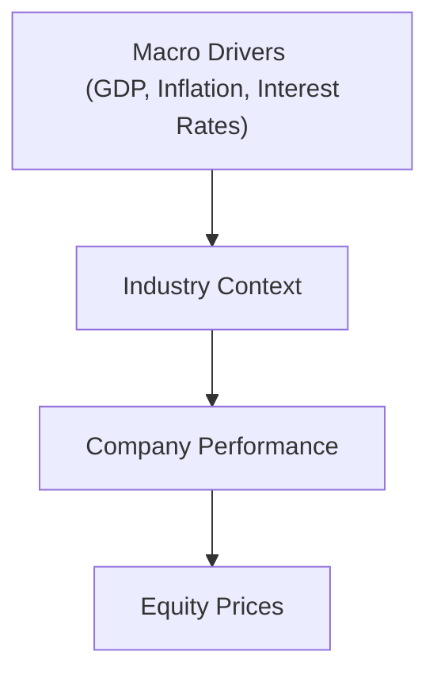
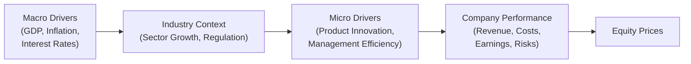

## Understanding the Big Picture: Macro Drivers

It might sound a bit obvious, but sometimes, you know, we get so focused on that single stock or a quick trade idea that we forget how the broader economy can be the wind beneath our wings—or the storm pushing us off course. Macro drivers are broad, economy-wide factors that shape the overall environment in which companies operate. They’re like the weather for the entire region: whether it’s sunny or stormy, everyone is affected to some degree. Here are the key players:

• GDP Growth: Real Gross Domestic Product growth rates can offer a snapshot of how much an economy is expanding or contracting. If GDP is growing quickly, consumers typically have more disposable income. This indirectly boosts consumer-driven sectors like retail or luxury goods. Slower or negative GDP growth often signals reduced consumer spending and business investment, pressuring corporate profit margins across the board.

• Inflation: Rising prices can erode purchasing power, hitting both consumer spending and corporate earnings. Mild inflation, on the other hand, is often considered acceptable—some folks even call it “the grease in the wheels” of economic growth. Excessive inflation, though, can force central banks to tighten monetary policy, thus raising interest rates. And that can slow down business expansions or consumer spending, ultimately impacting company revenues and, by extension, equity valuations.

• Interest Rates: I remember a real-life instance when the Federal Reserve hinted at raising interest rates back in 2015. Suddenly, markets got jumpy, especially sectors like housing and consumer discretionary that are more sensitive to borrowing costs. Higher rates make mortgages, credit cards, and corporate debt more expensive. As a result, companies can face higher costs of capital (which means a higher discount rate when valuing future cash flows). Investors also shift money into bonds because of better yields, flattening stock market returns.

• Monetary and Fiscal Policy: Stimulus packages, tax cuts, or changes in government spending can all boost or stifle equity markets. If a government enacts expansionary policies—like lowering taxes, sending out public stimulus, or implementing quantitative easing—these policies can raise corporate profits and push equity valuations upward. Contractionary policies frequently do the opposite. 

• Currency and Trade Flows: Exchange rate movements can affect exporters, importers, and multinational firms. For instance, a strong domestic currency may hurt local exporters because their goods become pricier abroad, while importers might benefit from cheaper foreign inputs. Trade policies, such as tariffs and quotas, can suddenly reshape competitive landscapes, imposing unexpected costs or opening new markets.

Below is a simple depiction of how macro drivers feed the industry environment and funnel down to equity prices. We’ll add micro drivers in a moment:

All these macro drivers create the baseline platform on which industries and individual companies operate. But, as we’ll see next, that’s only part of the story.

## Zooming In: Micro Drivers

Even if the “weather” is great, there’s no guarantee every single company in a booming industry will thrive. This is where micro-level drivers enter the conversation. These are elements specific to a particular firm, including:

• Product Innovation and Competitive Position: A tech company launching a new wearable device that addresses unmet consumer needs might outperform even if the broader economy is sluggish. Conversely, a failure to keep up with competition can lead to a fall from grace, even in a roaring bull market. 

• Company Management and Operational Efficiency: Good managers adapt quickly to changing macro conditions. But sometimes you’ll see leadership teams overextend themselves with costly acquisitions or poor strategic calls—ultimately dragging a decent firm down. 

• Earnings Quality and Balance Sheet Health: Two companies in the same industry might report similar earnings, but one’s revenue might be ballooned by short-term gimmicks (like channel stuffing) while the other has stable, recurring revenues. Strong companies typically have lower debt-to-equity, more robust cash flows, and stable profit margins.

• Regulatory or Legal Hurdles: Sometimes, idiosyncratic (company-specific) legal disputes or compliance issues can overshadow otherwise rosy earnings. For instance, a healthcare firm might face patent litigation that drastically changes its prospects relative to peers.

Below is a more complete flow of how both macro and micro drivers influence and shape equity valuations:

Notice how it’s not just a linear path from macro to micro. Micro factors feed back into competitive positioning within the industry, potentially reshaping the sector itself.

## Integrating Macro and Micro Drivers in Analysis

Most analysts begin with a top-down approach to estimate how big-picture elements could affect entire industries and, by extension, specific firms. Then they dive into the micro details to differentiate the winners from the losers. Alternatively, some analysts use a bottom-up approach—scanning company fundamentals first—before adjusting for macro influences.

No matter which approach, a thorough analysis attempts to incorporate both sets of drivers into final equity valuations. One of the critical places this happens is in the discount rate. In a discounted cash flow (DCF) model, for example, we typically start with a risk-free rate that’s tied to broader interest rates or government bond yields (a macro factor). Then, we add a risk premium that can incorporate both general market volatility and company-specific risk. A simplified version of the CAPM (Capital Asset Pricing Model) formula might look like this:


r_{\text{equity}} = r_f + \beta \times (E[R_m] - r_f)


Where:  
• \\( r_{\text{equity}} \\) = required rate of return on the stock  
• \\( r_f \\) = risk-free rate (often tied to government bond yields influenced by monetary policy)  
• \\(\beta\\) = measure of the stock’s sensitivity to market movements (captures a slice of both macro and micro influences)  
• \\((E[R_m] - r_f)\\) = market risk premium, reflecting macro-level sentiment and volatility

If central banks raise rates, \\( r_f \\) goes up, and so does \\( r_{\text{equity}} \\). Alternatively, if a company finds a new niche that lowers its business risk, \\(\beta\\) might decline, bringing down the discount rate. Hence, analyzing both macro and micro drivers can help ensure an accurate discount rate and a better sense of fair value.

## Regulation, Trade Policies, and Political Factors

It’s often surprising how a relatively small policy shift can unleash a massive ripple effect on equity markets—especially for resource-heavy or highly regulated industries (think utilities, healthcare, banking). Consider these scenarios:

• Environmental Regulations: Stricter environmental policies might push up costs for energy producers, making renewable energy stocks more attractive.  
• Trade Barriers: Tariffs or restrictions on steel imports can help domestic steel manufacturers (at least in the short run) but hurt industries reliant on imported steel.  
• Tax Incentives and Subsidies: A government might subsidize electric vehicle (EV) manufacturers, while imposing extra taxes on older, gas-powered vehicles. This can tilt the competitive landscape dramatically in a fairly short period.

Analysts often watch for changes in interest rates, currency regimes, trade agreements, or political leadership transitions. Something like a shift from a free-trade environment to a protectionist stance can quickly alter supply chains and market share dynamics for numerous industries.

## Company Fundamentals in a Macro Context

The interplay between macro trends and company-level fundamentals can be starkly observed when distinguishing cyclical from defensive sectors:

• Cyclical Sectors: Cyclical industries (like automobiles, steel, luxury goods) tend to do well when the economy is booming. However, during recessions, these sectors usually get hammered first because consumers and businesses cut back on non-essential spending.  
• Defensive Sectors: Defensive or non-cyclical sectors (like utilities, healthcare, consumer staples) are more resilient during economic downturns. These companies produce goods or services people can’t easily forego—like electricity or basic groceries.

A thorough equity analysis should consider how an individual firm might weather an economic upswing, a downturn, or the dreaded “uneven recovery.” Additionally, micro drivers such as better product lines, lower cost structures, or innovative marketing can help a cyclical firm stand out even in a tough environment. Likewise, regulatory changes, tax incentives, or supply chain improvements could turbocharge a defensive player’s earnings.

## Stress Testing and Scenario Analysis

Even with the most diligent research, the future is uncertain. That’s why employing stress testing or scenario analysis is so valuable in bridging macro and micro perspectives. You create different pathways—like a strong growth scenario, a moderate scenario, and a recession scenario—and see how each might impact your focal industry and specific firms. This typically involves:

1. Adjusting revenue growth assumptions in line with macroeconomic indicators.  
2. Shifting the discount rate to reflect varying interest rates or risk premiums in different scenarios.  
3. Incorporating micro-level updates, like changes in the competitive landscape (more intense rivalry, new entrants, or game-changing innovations).  
4. Evaluating strategic resilience (e.g., can management shift gears quickly if demand collapses or if regulations change overnight?).

Scenario analysis is particularly handly if you’re valuing firms in highly cyclical industries (e.g., airlines, metals, mining) or in volatile emerging markets. It can also highlight whether a promising new product is actually robust enough to withstand macroeconomic headwinds.

## Market Sentiment and Behavioral Triggers

In theory, rational investors weigh macro and micro factors carefully to price equities accurately. In practice, there’s often a strong behavioral component that can amplify or dampen the effects of fundamentals. You might find that markets overreact to macro news—like a slightly higher inflation report or a speech from a central bank official—triggering short-term volatility that goes beyond the “real” fundamental shift.

Similarly, micro-level developments—for instance, a leaked memo about future product releases—can trigger exuberant buying or panic selling, sometimes overshadowing broader macro conditions. This is where investor psychology, herd mentality, and momentum trading come into play, as noted by scholars like Robert Shiller. 

As an analyst, you should be aware of these behavioral shifts. Sometimes, the best opportunities arise when markets are too focused on either macro data (ignoring a particular firm’s fantastic fundamentals) or micro data (missing the fact that the entire sector is about to face fiscal tightening or regulatory shifts).

## Best Practices, Common Pitfalls, and Ethical Considerations

• Balance is Key: Don’t fixate on just one side—purely macro or purely company fundamentals. Equity prices often reflect a combination of both.  
• Avoid Overreaction: Distinguish noise from substance. Some events, such as short-lived trade spats or fleeting political turmoil, can fade faster than the headlines suggest.  
• Data Quality and Transparency: Ensure you’re using credible economic reports (e.g., from central banks, government agencies) and audited corporate filings. Ethical standards require that you present your findings honestly and avoid bias when selecting data sources.  
• Regulatory Compliance: Always stay updated regarding the CFA Institute Code and Standards, along with local regulations on insider information and material nonpublic information. Macro and micro insights come from many places, but you must keep your research aboveboard.  
• Scenario Planning: Resist the urge to rely on a single “best estimate.” Evaluate how the firm’s valuation changes under multiple plausible macro environments.

## Conclusion

Combining macro and micro drivers is crucial to delivering high-quality equity analyses. Whether you’re modeling short-term trading strategies or taking a longer-term perspective on a stock’s fair value, you need that blend of big-picture economic insights and granular company details. Macro conditions may set the tide, but micro-level factors often dictate which boats rise and which ones sink. Learning to juggle both is what truly sets seasoned analysts apart. As you study further in the CFA program, you’ll discover even more advanced ways to apply these insights in item sets, real-life case studies, and your career.

## References

• CFA Institute Level II Curriculum, Economics & Equity Investments (Macro Forecasting)  
• Shiller, R. (2015). “Irrational Exuberance.”  
• Federal Reserve Economic Data (FRED): https://fred.stlouisfed.org  
• Bloomberg & Reuters (Real-time macroeconomic indicators & market data)  

## Test Your Knowledge: Macro and Micro Drivers of Equity Prices



### Which of the following is considered a macro driver influencing equity prices?  
- [x] Changes in government monetary policy  
- [ ] Product innovation strategies of a specific firm  
- [ ] Board of directors’ restructuring plans  
- [ ] Management’s operational efficiency  

> **Explanation:** Government monetary policy (e.g., setting interest rates, altering money supply) is a broad economic factor affecting many companies and is therefore macro in nature.

### When a major central bank raises interest rates significantly, which of the following is the most likely immediate impact on equity valuations?  
- [ ] Lower required rates of return  
- [ ] Reduced cost of capital for firms  
- [ ] Higher present values of future cash flows  
- [x] Higher discount rates applied to company cash flows  

> **Explanation:** An increase in interest rates generally raises the discount rate in equity valuations, often decreasing the present value of future cash flows.

### A car manufacturer experiences higher profits during an economic upturn but struggles during a recession. Which term best describes this industry?  
- [x] Cyclical  
- [ ] Defensive  
- [ ] Countercyclical  
- [ ] Regulated  

> **Explanation:** Car manufacturers are typically sensitive to changes in economic conditions; they perform better in expansions and worse in contractions, making them cyclical.

### How can trade barriers such as tariffs influence equity valuations in a heavily affected industry?  
- [x] They can alter the competitive landscape, impacting revenues and costs  
- [ ] They have no impact on input costs  
- [ ] They only affect defensive industries  
- [ ] They are relevant only to private companies  

> **Explanation:** Tariffs can make inputs more expensive or reduce foreign competition, thus shifting revenues and costs and affecting stock prices.

### Which approach refers to analyzing the broad economy first before focusing on individual stocks?  
- [x] Top-down approach  
- [ ] Bottom-up approach  
- [ ] Lateral approach  
- [ ] Regression-based approach  

> **Explanation:** A top-down approach moves from macroeconomic analysis to sector and then to individual stock selection.

### Company A’s new product launch reduces its business risk, contributing to a lower company beta. Which effect might this have on its equity valuation?  
- [x] It may decrease the firm’s required rate of return  
- [ ] It increases the risk premium associated with the market  
- [ ] It has no effect on the discount rate  
- [ ] It leads to higher cyclical exposure  

> **Explanation:** A reduction in beta typically suggests lower systematic risk, resulting in a decreased required rate of return.

### When conducting stress testing for a manufacturing firm, which of the following scenarios would you include?  
- [x] A severe economic recession scenario that sharply reduces consumer demand  
- [ ] An assumption that the inflation rate remains zero indefinitely  
- [x] A scenario where interest rates rise faster than expected  
- [ ] No change in currency or trade policy  

> **Explanation:** Stress tests commonly include extreme but plausible economic downturns and interest rate spikes to assess potential vulnerabilities.

### A consumer staples company outperforms its peers during a market downturn. Which factor most likely contributed to this outperformance?  
- [x] Defensive nature of consumer staples  
- [ ] High sensitivity to GDP volatility  
- [ ] Its revenues rely primarily on luxury goods  
- [ ] Reduced brand loyalty  

> **Explanation:** Consumer staples often maintain demand even when customers cut back on discretionary items, making them more resilient in downturns.

### If a firm’s management is overconfident and expands capacity aggressively right before a recession, which micro-level driver is at play?  
- [x] Company-specific strategic decision-making  
- [ ] Global interest-rate movement  
- [ ] Government fiscal stimulus  
- [ ] Overall GDP growth forecast  

> **Explanation:** Management strategy and decision-making is a micro-level driver because it pertains to inefficiencies or strengths unique to that firm’s execution.

### True or False: Behavioral factors, such as herd mentality, can amplify or dampen the effects of both macro and micro drivers on equity prices.  
- [x] True  
- [ ] False  

> **Explanation:** Behavioral biases often cause investors to overreact or underreact to fundamental news (macro or micro), affecting equity prices beyond rational valuations.


