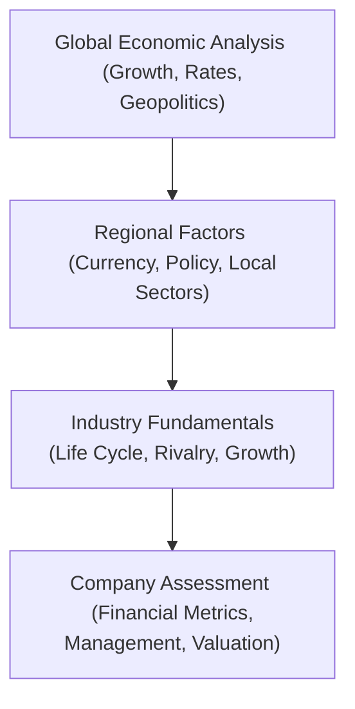

## Introduction and Rationale

Ever wondered how to piece together the big macroeconomic picture before zooming into a company’s financial statements? The top-down framework is precisely about that—methodically starting with global economic conditions, narrowing the lens to regional or national factors, and then drilling down into industry fundamentals. Ultimately, you arrive at the individual company, equipped with an informed set of insights that shape your valuation outlook. 

I still recall the first time I tried this: I was swamped by mountains of data—like overnight policy rates, commodity price indices, and automotive assembly line data in the same day. But the aha moment came when I realized that each piece of information occupies a specific place along a structured chain. If we start from the global environment, we can systematically filter out what's not needed and keep relevant information at each step.

Below, we’ll break down these steps in detail, show how they connect, and highlight best practices for applying them in real-world scenarios and exam-style vignettes.

## The Structured Top-Down Approach

When we say “top-down,” we’re basically taking the big view first, like looking at the forest before analyzing each tree. Let’s outline the major layers:

• Begin with global economics: major growth trends, central bank policy directions, broad geopolitical influences.  
• Narrow down to regional or country-specific variables: currency risks, sector performance, monetary/fiscal policies, and political developments.  
• Focus on the industry or sector: growth stage, competitive pressures, cost structures, and revenue outlook.  
• Finally, scrutinize the specific company: financial health, governance, valuation multiples, investment potential.

### Visual Representation

Below is a simple Mermaid diagram summarizing the top-down flow:

This diagram shows how each stage informs the next. By the time you reach D (company assessment), you have a well-defined context that clarifies which metrics truly matter.

## Step 1: Global Economic Analysis

Step one focuses on the high-level macroeconomic environment. Global GDP growth rates, interest rate trends, and geopolitical risks all shape the trajectory of the financial markets. For example, if central banks in major economies (like the Federal Reserve, European Central Bank, or Bank of Japan) are signaling higher interest rates, borrowing costs will eventually rise, and companies dependent on cheap credit may face lower earnings growth.

• Major economies and policy indicators: Keep an eye on IMF forecasts, World Bank data, and top news sources for signals.  
• Global interest rates: If rates rise globally, equity valuations might compress because of higher discount rates.  
• Geopolitical events: Trade wars, sanctions, and changes in global trade policies can create supply chain bottlenecks or open up new markets.

Personally, I remember reviewing an emerging market shipping company when a sudden trade embargo changed their entire business environment overnight. Good thing we had factored in that risk from the top-down get-go—otherwise, it would have been a rude shock.

## Step 2: Regional or Country-Specific Considerations

Next, you filter your macro knowledge into a regional or country-specific lens. This is particularly important if you’re looking at equities traded in markets with unique currency or political dynamics.

• Currency outlook: Fluctuating exchange rates could make or break the competitive position of export-driven industries.  
• Sector performance: Some economies might have thriving technology sectors, whereas others depend on commodities or tourism.  
• Government policies and regulations: Tax policies, subsidies, environmental regulations—these can significantly alter profitability prospects.

A quick caution: Just because the global outlook is positive doesn’t mean that every region will thrive. For instance, a commodity-focused economy may suffer if global commodity prices slump, even if most other regions enjoy robust economic expansion.

## Step 3: Evaluating Industry Fundamentals

Now, let’s narrow our beam onto the industry or sector of interest:

• Industry life cycle: Is the industry expanding, peaking, or declining?  
• Competitive rivalry: Porter’s Five Forces can help gauge whether new entrants or substitutes threaten the incumbents.  
• Growth prospects: Even in a slow global environment, certain niche industries might still do well (e.g., specialized tech or healthcare).  
• Regulatory landscape: Some industries face stiffer rules, which can limit profits or raise compliance costs.

For instance, evaluating the automotive industry means looking at consumer demand, commodity input prices (steel, aluminum), and technology shifts (electric vehicles, autonomous driving). Also, watch for changes in government policy, like mandates for electric vehicle adoption or carbon emission standards.

## Step 4: Company-Level Analysis

Finally, we arrive at the individual firm. By the time you reach this point, you have context from:

• Macroeconomic backdrop (Step 1)  
• Regional tailwinds or headwinds (Step 2)  
• State of the industry life cycle and competitive environment (Step 3)

At the company level, you want to dive into:

• Financial statements: Income statements, balance sheets, cash flow statements—look for patterns in revenue, margins, capital expenditures, and free cash flow levels.  
• Management quality: Are they experienced? Have they navigated downturns effectively? Do they articulate a strategy aligned with broader macro and industry trends?  
• Valuation metrics: P/E, EV/EBITDA, dividend yields, growth rates, or more advanced approaches like free cash flow valuation or residual income.  
• Risks and potential catalysts: Lawsuits, patents, regulatory approvals, or new product launches.

It might sound like a lot, but trust me—if you’ve done a thorough job in the global, regional, and industry stages, half the puzzle is already solved. You just need to ensure the company fits in with the story you pieced together higher up in the chain.

## Contrasting Top-Down with Bottom-Up Approaches

A bottom-up approach starts at the company level, analyzing fundamentals and management, then interprets that information in the context of the sector and the macro environment. In practice, many analysts blend both perspectives:

• Top-Down: Quick at capturing big macro shifts (e.g., changes in interest rates or sudden geopolitical events).  
• Bottom-Up: Great for identifying hidden gems or misunderstood companies that are undervalued—regardless of macro headwinds.

Combining the two can be powerful. For example, you might first discover a great company (bottom-up), then confirm that the industry and global setting also provide tailwinds (top-down). Or you might begin with a bullish stance on a certain economy (top-down) and then search for the companies best positioned within that region (bottom-up).

## Dynamic Adjustment to New Data

Real-world investing is not static. Central banks can change tone in a matter of days. Government elections can disrupt a market’s entire regulatory framework overnight. Analysts using a top-down framework should remain flexible:

• Revise industry forecasts if global growth data or interest rate policies shift.  
• Red-flag sectors that become vulnerable to tariffs or trade barriers.  
• Overhaul models if there is a regime change in a key policy-making body (e.g., treasury official, prime minister, or central bank governor).  

“Dynamic vantage point” simply means you’re always scanning the horizon for fresh data that might impact your earlier assumptions. If you hold an investment over multiple quarters, you must continually reassess the layered contexts (macro, regional, industry, company).

## Illustrative Example: From Global Growth to a Single Automaker

Let’s walk through a short case study:

1. Global Outlook: Suppose the IMF forecasts an uptick in world GDP growth from 2% to 3.5% over the next two years. Central banks signal moderate interest rate hikes.  
2. Regional Focus: You look at Southeast Asia, noticing strong consumer demand, relaxed import-export rules, and stable monetary policy across the region’s developing economies. Currency risk appears moderate since inflows of foreign investment are fairly healthy.  
3. Industry Analysis: Within that region, the automotive sector sees rising demand for compact cars because of labor mobility in urban areas. Domestic manufacturers and foreign participants are jockeying for market share. R&D in electric vehicles is climbing, and government subsidies for greener cars are rumored.  
4. Company Selection: You zero in on a local automaker with a decent brand reputation, stable finances, and improving sales. You confirm that management is pivoting to electric vehicles right when consumer preferences appear to be shifting that way. Valuation metrics (say, EV/EBITDA) are below the global median for automakers, suggesting potential undervaluation.

This hypothetical scenario shows how top-down analysis can highlight a specific opportunity. You’d confirm your final view with a bottom-up check—scrutinizing that autofirm’s strategy and fundamentals. The synergy of both approaches might reveal a hidden gem.

## Flexibility for Macro Shocks

No matter how rigorous your plan is, be prepared for surprises:

• A sudden trade war might impose tariffs on auto parts.  
• A region might face an unexpected political scandal, causing a currency devaluation.  
• Catastrophic weather events can alter supply chains or raw materials.

If these events transpire, go right back to your top-down model:  
1. Reassess the global and regional macro risk.  
2. Re-run the industry outlook in light of new tariffs or currency fluctuations.  
3. Revisit valuations and see if that local automaker can still thrive.

## Best Practices and Common Pitfalls

• Best Practices  
  – Keep your data current. Outdated macro data can mislead your entire analysis.  
  – Use scenario planning. Build at least three scenarios (base, optimistic, pessimistic) to accommodate unpredictable shifts.  
  – Engage in ongoing learning. Macroeconomics evolves, especially with new monetary tools and digital economies.  

• Common Pitfalls  
  – Overfitting your model to a single set of macro forecasts. The world rarely follows one neat script.  
  – Dismissing company-specific strengths because of cloudy macro conditions. Some companies can outperform even in tough times.  
  – Failing to integrate bottom-up checks. A purely top-down view can lead you to broad assumptions that overlook unique company drivers.

## Exam Focus and Tips

On the CFA exam, item set (vignette) questions often require you to shift from a big-picture perspective to a discrete valuation question. They may give you graphs of global interest rates, a snippet from a central bank press release, and partial sector data, then ask you about a specific company’s valuation or strategic shifts.

• Read the entire vignette carefully and categorize info as macro, sectoral, or company-specific.  
• Watch for subtle hints that the exam might embed, like “the currency is expected to depreciate” or “regulatory environment loosened,” which can sway your growth assumptions.  
• Show your reasoning if in essay portions: The exam often wants a justification, not just a yes/no or a single calculation output.

## References

• Damodaran, A. (2021). Investment Valuation: Tools and Techniques for Determining the Value of Any Asset.  
• CFA Institute Level II Curriculum, Equity Investments: Top-Down and Bottom-Up Forecasting Approaches.  
• World Bank Economic Indicators: https://data.worldbank.org/  
• International Monetary Fund (IMF) World Economic Outlook Reports: https://www.imf.org/en/Publications/SPROLLS/world-economic-outlook-databases  

---

## 10 Top-Down Framework Mastery Questions



### When applying a top-down equity valuation approach, an analyst typically:

- [ ] Starts with individual publicly traded firms and aggregates their metrics up to the macro level.
- [x] Reviews global economic conditions, narrows down to regional and sector specifics, and finally analyzes company-level data.
- [ ] Focuses solely on micro-level data such as cash flow statements and management expertise.
- [ ] Ignores geopolitical events because they are difficult to predict.

> **Explanation:** The hallmark of the top-down approach is to begin with broad macro factors before honing in on more granular aspects like industries and companies.

### Which of the following is most accurate regarding the role of industry analysis in a top-down framework?

- [ ] Industry analysis is unnecessary if macroeconomic data is positive.
- [ ] Industry conditions are irrelevant if the company has stable earnings.
- [x] It bridges macroeconomic trends and company performance by focusing on growth, competition, and regulatory shifts.
- [ ] Industry trends rarely affect equity valuations.

> **Explanation:** Industry fundamentals help an analyst connect macro conditions (like GDP trends) and micro elements (like company-specific margins or product elasticity).

### A key difference between top-down and bottom-up approaches is that top-down analysts:

- [x] Begin with global economic data and then move to company specifics.
- [ ] Only examine companies in the technology sector.
- [ ] Rely solely on discounted cash flow models for firm valuation.
- [ ] First study individual company metrics and later consider industry and macro factors.

> **Explanation:** The defining characteristic of top-down is starting from macro data and working downward to micro details, whereas bottom-up is the opposite.

### Which factor is least likely to be considered during the regional or country-specific stage of the top-down process?

- [ ] Regional currency stability.
- [x] The company’s specific inventory turnover cycle.
- [ ] Government monetary policy.
- [ ] Sector performance outlook in that country.

> **Explanation:** Company-specific inventory turnover is a micro-level factor. At the regional stage, analysts focus on currency trends, policy, and general sector performance.

### An analyst is using a top-down approach for an emerging market consumer goods company. Which of the following would best illustrate a dynamic vantage point?

- [x] Updating the demand-growth forecast when a new policy reduces consumer taxes.
- [ ] Leaving the forecast model unchanged for three years despite major data revisions.
- [ ] Using the same discount rate across all emerging markets.
- [ ] Focusing only on the local inflation rate and ignoring global commodity prices.

> **Explanation:** A dynamic vantage point means continuously adjusting forecasts and assumptions when new macro or policy changes arise that materially impact the outlook.

### In a well-constructed top-down valuation, the industry analysis:

- [ ] Is completely detached from macroeconomic shifts.
- [ ] Precedes global economic assessment to identify top-performing companies.
- [x] Follows macro and regional analysis but informs the subsequent company valuation.
- [ ] Is interchangeable with the company-level analysis.

> **Explanation:** The industry stage is intentionally positioned after macro/regional considerations and before specific company-level evaluation.

### Which statement correctly describes how geopolitics might influence an analyst’s top-down approach?

- [x] Political tensions and trade policies can reconfigure entire supply chains, necessitating revisions to industry growth assumptions.
- [ ] Geopolitics are irrelevant if interest rates remain constant.
- [ ] Geopolitical factors never affect currency risk.
- [ ] Geopolitical shocks strengthen the reliance on bottom-up approaches alone.

> **Explanation:** Geopolitical events and tensions can disrupt tariffs, trade routes, or currency valuations, so top-down forecasts must adjust accordingly.

### If a top-down analyst encounters a favorable global outlook but identifies a depressed region with negative growth expectations, he or she would likely:

- [ ] Conclude that all companies in that region are undervalued with no further analysis.
- [ ] Assume no correlation between global and regional growth, discarding the global forecast entirely.
- [x] Adjust valuations for region-specific risks, recognizing that the global trend may not apply uniformly.
- [ ] Abandon the top-down approach in favor of purely technical analysis.

> **Explanation:** Strong global growth doesn’t guarantee uniform performance across all regions. Valuations must reflect local growth and risk factors.

### Contrasting the top-down and bottom-up approaches, which statement is most accurate?

- [x] A blended approach can incorporate the broad macro picture from top-down while leveraging firm-specific insights from bottom-up.
- [ ] Both approaches ignore macro data and focus on specific operational details.
- [ ] The bottom-up approach starts with industry fundamentals then moves to global data.
- [ ] The top-down method excludes any consideration of management quality.

> **Explanation:** A combined approach leverages macro insights and individual firm analysis. Typically, top-down starts globally, while bottom-up starts at the company level.

### True or False: Scenario planning using base, optimistic, and pessimistic assumptions is recommended only in a bottom-up analysis.

- [ ] True
- [x] False

> **Explanation:** Scenario planning is recommended for both top-down and bottom-up analyses, as macro factors (top-down) as well as company-specific factors (bottom-up) can shift unexpectedly.


