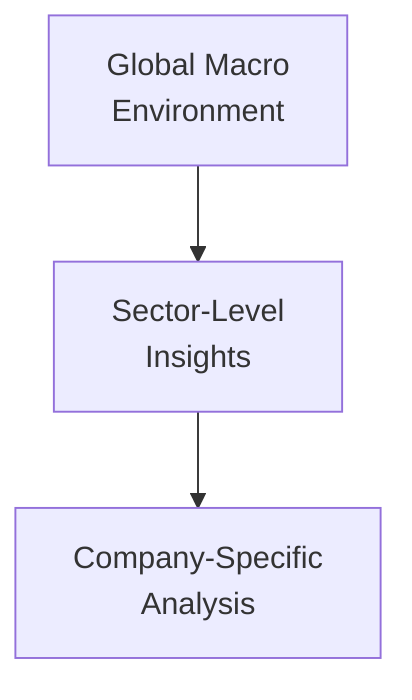
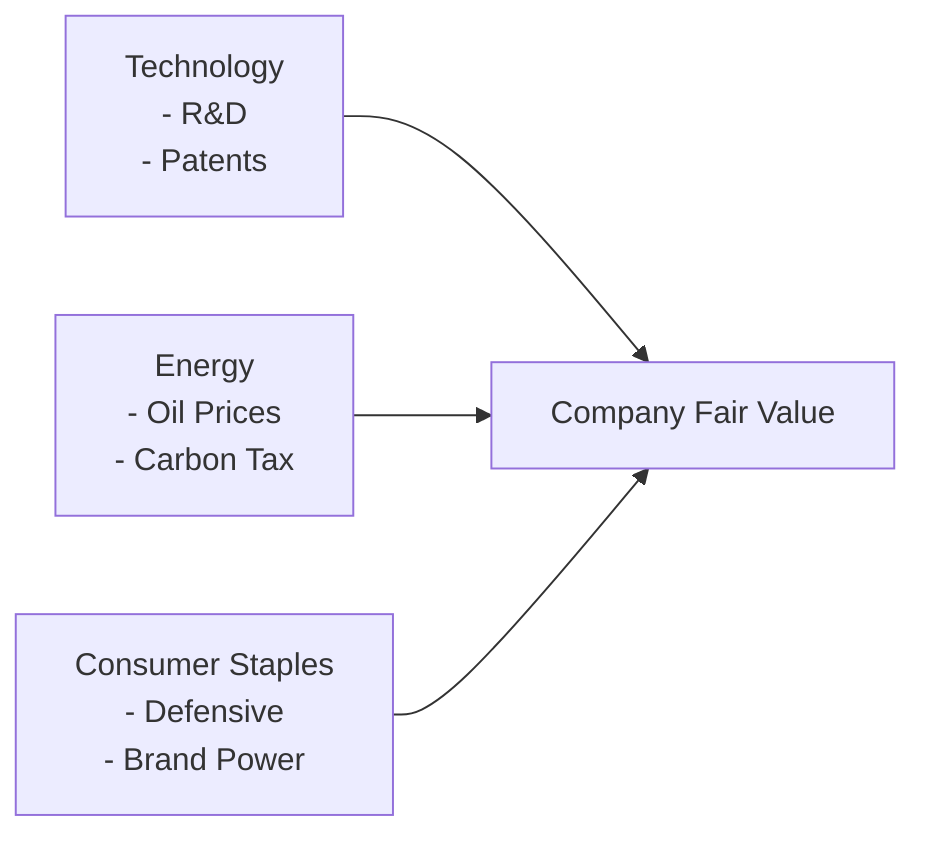

## Real-World Vignette: The Cross-Sector Challenge

Let’s imagine you’re working on a project that requires diving into multiple sectors—technology, energy, and consumer staples—to figure out where the best opportunities lie for your equity portfolio. Before you get panicky: This is exactly the sort of multi-dimensional problem you’d face on exam day in a vignette. And in real life too, for that matter!

Below, we walk through a scenario that challenges you to integrate macro data (think GDP forecasts, inflation rates), sector-level insights (like oil price trends or consumer confidence), and individual company details (like product launches or R&D budgets). By the end, you’ll see how different valuation signals can emerge depending on which sector you’re analyzing. We’ll also break down common mistakes, so you know what to avoid.

## The Scenario: Interpreting Macro Trends

Let’s say we have the following macro environment:

• GDP growth is forecast at 3.0% for the next 12 months—a moderate but healthy rate.  
• Inflation stands at 4.2% and is expected to remain somewhat elevated due to supply-chain disruptions.  
• Central banks are raising rates slightly (think +0.5% over the next year) to keep inflation in check, which may cool demand for certain cyclical goods.  

Now let’s overlay some broad sector-level information:

• Technology: R&D spending as a percentage of GDP is rising in your country of interest. Tech companies have been announcing new project launches, especially in cloud computing and artificial intelligence.  
• Energy: Global oil prices are moving in a narrow band around $85 per barrel, but the introduction of a regional carbon tax is looming, potentially affecting operating costs for traditional energy firms.  
• Consumer Staples: Consumer-confidence indices have dipped slightly, though demand for essential goods remains relatively stable. Input costs are rising due to inflation, squeaking margins for companies that can’t pass costs on to customers quickly.  

Interestingly, you might think, “Wait, I see how inflation and interest rates might matter, but do R&D budgets or carbon taxes really move the needle on valuations?” Yes, they do! Overlooking these details can lead to some major mispricing—on the exam or in real-world portfolio decisions.

### Visualizing the Top-Down Approach

Below is a simple Mermaid diagram summarizing the top-down framework—starting from Macro conditions, filtering through Sector fundamentals, and finally drilling down to Company analysis:

In a typical Level II item set, you’ll have a chunk of text for each layer—macro, sector, and company. The questions will test how well you piece all the data together.

## Sector Overviews

### Technology Sector

Technology companies often have high growth potential but can be more sensitive to interest rate changes (especially in the start-up or high-R&D phase, where they need continuous funding). In our scenario:

• R&D Spending: Tech firms with a strong pipeline can grab market share through innovation.  
• Valuation Multiples: Price-to-Earnings (P/E) multiplies in tech might look lofty, but they could be justified if future growth is robust.  
• Regulatory Factors: The risk of new data security or anti-trust legislation is always hanging around.  

On the flip side, rising interest rates might prompt some investors to rotate out of high-growth, high-valuation tech names into more stable or commonly value-oriented sectors. So you have a tug-of-war between growth expectations and discount-rate pressures.

### Energy Sector

Energy gets more interesting when you factor in commodity prices and carbon taxes:

• Oil Price Trend: Consistent prices around $85 may stabilize revenue forecasts in the short term. However, any sudden price swings—due to geopolitical events or supply shocks—could rattle earnings.  
• Carbon Tax: An upcoming carbon tax increment will increase operational costs for traditional energy producers. Alternatively, it’s an opportunity for renewables if they can illustrate a lower carbon footprint and capture fresh demand.  
• Cyclicality: Energy demand often correlates with broader economic activity. If GDP growth slows, energy consumption could decrease, pressuring revenues.  

Given inflation and regulatory momentum around carbon emissions, many analysts might demand a higher risk premium for energy stocks, especially if those firms aren’t established as “greener.” So discount rates are likely to be slightly higher.

### Consumer Staples Sector

Now let’s peek at consumer staples, those must-have daily-use products:

• Defensive Attributes: Demand for staples tends to hold up during economic downturns. Even if inflation is rising, people generally keep buying food and household essentials.  
• Margin Pressure: Inflation in raw materials can narrow margins, especially for companies working with thin cost structures. Consumer staples can pass some costs on, but it might hurt volumes if shoppers get price-sensitive.  
• Consumer Confidence: A moderate dip in confidence doesn’t necessarily crater sales, but it might deter new product launches or expansions into premium segments.  

Consumer staples are generally lower in volatility and might attract capital when uncertainties swirl around, say, a high-flying tech or a carbon-tax-challenged energy provider. So, these companies might trade at relatively higher multiples, given their “safety” halo.

## Step-by-Step Analysis

The key is to integrate the macro data, sector fundamentals, and company-level details into a cohesive valuation approach. Let’s break it down:

Interpret the Macro Environment  
• If GDP is rising at 3%, it suggests moderate growth. Despite some inflation, the overall demand outlook remains constructive. But it also means higher interest rates could dampen riskier investments.  
• A 4.2% inflation rate can erode margins for sectors that can’t pass on cost increases, but it might help commodity-related sectors if prices of goods are rising.  

Compare Profitability and Growth Prospects  
• Tech: Potential for high growth if R&D’s paying off. Watch out for sensitivity to rate hikes.  
• Energy: Commodity-driven revenue, cyclical demand. Factor in carbon taxes as an added cost.  
• Consumer Staples: Stable but less upside in boom times. Margins are squeezed if inflation persists.  

Identify Competitive Advantages  
• Tech Firm Example: A top-tier AI software provider with large brand recognition, a big library of patents, and the best developer talent. If they can harness new technologies, they might outgrow the sector.  
• Energy Company Example: A midstream operator with stable pipeline operations and a partial renewable footprint, lowering carbon tax risk.  
• Consumer Staples Company Example: A household brand with entrenched distribution channels that can pass along moderate price increases without losing significant sales volumes.  

Calculate Fair Value with Scenario-Based Valuation  
• DCF Model: Project free cash flows under different assumptions—like oil at $90, $85, or $70 per barrel, or an R&D success scenario in tech. Discount rates should reflect both macro (risk-free rate, inflation) and sector-specific risk (carbon taxes, regulatory overhead).  
• Relative Multiples: Compare P/E, EV/EBITDA, or P/S within the same sector. For tech, you might use forward P/E for hyper-growth; for energy, EV/EBITDA is common; for staples, P/E might do the trick. Adjust multipliers for cyclical vs. defensive profiles.  
• Residual Income: Some analysts prefer residual income for stable sectors with well-known book values. For energy, intangible assets and fluctuations in commodity prices sometimes complicate book value comparisons.  

A Quick Mermaid Diagram for Inter-Company Valuation:

In practice, you might run a scenario analysis:  
• Base Case: GDP at 3%, inflation at 4%, oil at $85, interest rates up 0.5%, moderate R&D success.  
• Bull Case: GDP at 4%, oil at $100, R&D breakthroughs accelerate, consumer spending lifts.  
• Bear Case: GDP below 2%, oil at $70, inflation persisting, interest rates rising 1%, negative impact on consumption.

## Common Pitfalls

• Using the Same Discount Rate for All Sectors: Don’t forget sector risk. Tech may require a higher equity risk premium if it’s a smaller, innovative firm. Energy is commodity-driven and subject to regulatory changes. Staples might have a lower beta.  
• Overlooking Cyclical vs. Defensive Factors: Energy is cyclical, consumer staples is defensive, and tech can be all over the place. Failing to classify them can cause big mistakes in your valuation assumptions (e.g., ignoring the cyclical downturn or upturn).  
• Ignoring Policy & Regulations: A carbon tax or new data privacy regulation can change cost structures or hamper growth. It’s easy to skip that part if you’re focused solely on growth rates.  
• Not Checking Company Guidance: Sometimes management guidance is more conservative (or more bullish) than your base assumption. Failing to reconcile your model with official guidance can cause big mismatches and lost credibility in an exam answer.  
• Failing to Mention Sensitivity and Scenario Analysis: Step on the exam’s “land mine” by ignoring the possibility that your assumptions might shift. Examiners love to see you consider “What if…?”

## Putting It All Together

As we near the final highlight: always keep in mind that any piece of data—macro indicator, sector insight, or company-level fact—might drastically alter your final valuation. This is precisely why the top-down approach is so powerful (and tested!). You evaluate the broader economy, refine your perspective by sector fundamentals, then pinpoint a company’s unique strengths or weaknesses. After that, you estimate fair value with robust modeling, double-checking your discount rates, growth estimates, industry multiples, and intangible factors like brand strength or regulatory pressure.

A personal note: I once got caught off-guard analyzing a consumer staples giant that was about to face a new import tariff on raw materials I barely researched. The tariff hammered their margin structure. I learned the hard way that skipping “small” regulatory changes can unravel an entire valuation and cause you to look, well, unprepared.

## References

• CFA Program “Equity Investments” Vignette Practice Examples.  
• Standard & Poor’s (S&P) Sector Reports: https://www.spglobal.com/  
• MSCI Industry Classification Benchmarks for data and analytics.  
• Corporate Finance Institute Industry Valuation Guides: https://corporatefinanceinstitute.com/resources/  

---

## Test Your Knowledge: Sector-Specific Valuation Signals



### Assuming a global GDP forecast of 3% and moderate inflation, which sector typically benefits from stable output across all economic cycles in a scenario-based valuation?

- [ ] Technology
- [ ] Energy
- [x] Consumer Staples
- [ ] Utilities

> **Explanation:** Consumer staples companies often see less fluctuation across economic cycles because their products are essential and demand remains relatively stable, even when GDP growth is moderate.

### In the technology sector, which of the following is most relevant when assessing competitive advantage?

- [x] R&D spending and patent portfolio
- [ ] Relationship with midstream pipeline operators
- [ ] Carbon tax exposure
- [ ] Consumer confidence index

> **Explanation:** For technology firms, intellectual property (like patents) and ongoing R&D can be critical to securing future growth and fending off competition. Carbon tax is more applicable to energy-intensive sectors, and consumer confidence is significant but not the primary factor in tech’s growth engine.

### Which factor is most likely to push analysts to add a premium to the discount rate for an energy company in today’s scenario?

- [ ] High consumer confidence
- [x] Imminent carbon tax legislation
- [ ] Lower supply chain costs
- [ ] Falling oil prices

> **Explanation:** An imminent carbon tax typically increases costs and introduces regulatory uncertainty. Analysts often add a risk premium to the discount rate to account for these sector-specific challenges.

### A consumer staples firm announces they cannot pass the next wave of inflation-driven costs to customers. What is the immediate valuation impact?

- [ ] Potentially higher earnings
- [ ] Immediate surge in cash flows from cost savings
- [ ] Lower perceived risk, so the discount rate declines
- [x] Margin compression that lowers projected earnings

> **Explanation:** If the firm can’t pass on costs, profit margins shrink. This compression reduces the present value of future earnings, potentially lowering the company’s fair value.

### An item set provides data about multiple technology companies. One firm has stable EBITDA and minimal R&D spending, while another invests heavily in R&D. Which approach is generally more relevant for the high-R&D firm?

- [x] Scenario-based DCF capturing probable R&D outcomes
- [ ] EV/EBIT multiples of the stable EBITDA firm only
- [ ] P/E ratio ignoring intangible value
- [ ] Residual income ignoring intangible R&D

> **Explanation:** A scenario-based DCF that includes intangible asset creation (like new patents or product lines) can better capture the potential payoff of R&D spending versus ignoring it in a simple EV/EBIT or P/E multiple.

### Which of the following is a common pitfall when valuing both energy and tech companies in the same model portfolio?

- [ ] Assuming identical long-term growth rates
- [ ] Accounting for differences in discount rates
- [x] Applying the same discount rate across vastly different sector risks
- [ ] Including scenario considerations for each

> **Explanation:** Different risk exposures across sectors mean each sector might need a distinct discount rate. Using the same rate lumps together risks that are fundamentally different between, say, commodity-driven companies and high-innovation tech firms.

### A carbon tax is introduced at a rate higher than forecast. What is the logical next step in your energy sector valuation?

- [ ] Decrease the cost of capital
- [x] Increase cost assumptions and recalculate net operating cash flows
- [ ] Assume no change in operating expenses
- [ ] Immediately upgrade the stock rating

> **Explanation:** A more aggressive carbon tax leads to higher operating costs for energy companies. You’d need to remodel your forecasts accordingly, generally leading to lower free cash flows.

### A consumer staples firm presents guidance that is more bullish than your initial base-case scenario. How should you address this in your valuation?

- [x] Run a sensitivity analysis reflecting the new management guidance
- [ ] Disregard the guidance since it’s typically biased
- [ ] Immediately raise your price target by 10%
- [ ] Reduce your discount rate

> **Explanation:** While management guidance can be optimistic, it’s a useful piece of data. The best approach is to test how your valuation changes under management’s assumptions, rather than dismiss it out of hand or adopt it blindly.

### Which statement best describes scenario-based valuation for a tech firm?

- [ ] Use only a single-stage DDM model
- [ ] Assume linear growth in perpetuity
- [x] Incorporate multiple growth narratives based on potential R&D outcomes
- [ ] Avoid discounting future CFs for the first five years

> **Explanation:** Technology firms often have multiple possible growth trajectories, driven by R&D breakthroughs or market acceptance. Scenario-based valuation allows for different outcomes—helping capture variable growth paths more accurately.

### True or False: When comparing a tech company and an energy company, the same P/E ratio can be used without adjustment, as long as the economy’s GDP growth rate remains constant.

- [ ] True
- [x] False

> **Explanation:** Different industries have different capital structures, growth prospects, and risk profiles. Simply using the same P/E ratio without any sector adjustment or risk assessment is a common oversight that may lead to mispricing.


