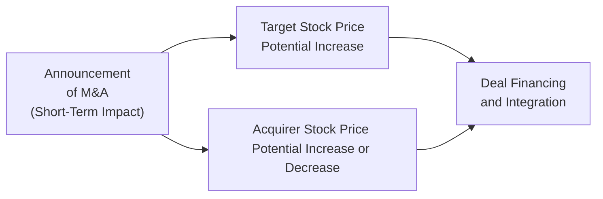

## Introduction

Mergers and acquisitions (M&A) can feel like the corporate equivalent of a wildly unpredictable roller coaster, especially around the time the deal is announced. In my early days as an analyst, I remember rushing to my desk to see how the market would react whenever a big acquisition popped up on the newswire. You’d see the target’s stock spike—frequently in double-digit percentages—while the acquiring firm’s stock might move in either direction. Some of us would be saying, “Ah, this is going to be a killer deal,” while others worried that the buyer might have overpaid. 

Anyway, the truth is that M&A transactions reshape both target and acquirer equity in ways that last well beyond that initial flurry of media coverage. Some deals lead to real synergy, with cost savings and new opportunities that boost combined value; others fail to deliver and weigh on share prices for years. Below, we’ll break down how these transactions work so you can evaluate the equity implications for both firms in a practical, exam-relevant way.

## Immediate Market Reaction

When an M&A announcement hits, the first thing to observe is the target’s share price. Typically—and you’ve probably seen this many times—the target’s stock price skyrockets. Why does it jump so quickly? The market immediately prices in a takeover premium, which is an expected per-share amount above the pre-offer price. The acquiring firm is paying that premium to gain control of the target’s assets, strategic advantages, or synergy opportunities.

For the acquirer, the share price reaction isn’t so straightforward. If the market perceives the deal as value-enhancing (e.g., strong synergy potential, attractive purchase price, or good strategic fit), the acquirer’s share price might also rise. On the other hand, if investors think the buyer is overpaying, using too much debt financing, or biting off more than it can chew in post-merger integration, the acquirer’s share price could drop. And, sure, sometimes it’s a bit anticlimactic and trades flat if the market deems the transaction fair but not transformative.

### Visual Overview

Below is a simple diagram capturing the short-term feedback loop between announcement, target stock price, and acquirer stock price.

## Changes in Ownership Structure

One of the biggest factors that determines how the acquirer’s share price reacts is the method of financing the deal. If the acquisition is financed primarily with equity (i.e., the acquirer issues new shares to pay for the target), existing shareholders may experience dilution. Here’s a quick example to illustrate:

• Suppose Company A wants to buy Company B for USD 500 million in an all-stock transaction.  
• Company A’s share price is USD 50, and it has 100 million outstanding shares → market capitalization is USD 5 billion.  
• To raise USD 500 million, it needs to issue 10 million new shares (simplified for illustration).  

After the deal, Company A has 110 million shares outstanding—so each share now represents a slightly smaller ownership stake in the combined entity. That’s dilution for existing shareholders. However, if the new assets, revenue, or synergy from Company B more than offset the effect of those extra shares, the net effect could still be positive.

If the deal is financed with cash, there’s no direct dilution, but the acquirer’s balance sheet might be restructured with more debt, lower cash reserves, or other changes that can influence future dividend capacity and perceived risk. Understanding these trade-offs is crucial:

• Stock financing → ownership dilution.  
• Cash financing → potential increase in leverage or reduction in liquidity.  

## Valuation Shifts and Control Premium

From a valuation perspective, the target company often captures most of the deal’s immediate dollar-value gains (the “target premium”), since its share price jumps to a level approaching the offer price. Post-announcement, target shareholders effectively have a built-in exit price if the deal closes. Investors in the acquirer must now scrutinize whether the premium paid is reasonable or whether the firm is overextending itself.

### Control Premium

The premium is paid because controlling a company can unlock synergies—operational, financial, or strategic—that aren’t possible through simple minority ownership. If the acquirer’s management has a vision for merging product lines or cutting overlapping redundancies, the control premium might be well justified. However, if synergy assumptions are too optimistic or the bidding is overly competitive, the premium might exceed the actual synergy value, leaving the acquirer’s shareholders to foot the bill.

A quick formulaic approach for synergy value is:

(1) Synergy Value = (Value of Combined Firm) – (Value of Acquirer) – (Value of Target)

If the purchase price is more than the synergy value, the acquirer could be destroying shareholder value. On the flip side, if synergy is underestimated and the combined firm outperforms after integration, you might see the acquirer’s stock climb over time.

## Post-Merger Equity Performance

M&A deals don’t end at the signing ceremony. The post-merger integration (PMI) period is prone to all sorts of opportunities for success or failure. If the management teams navigate cultural conflicts, IT system integrations, staff reallocations, and brand strategy effectively, synergy can manifest in meaningful EPS growth, margin improvement, or new market share that lifts the acquirer’s stock price. 

It’s also not uncommon to see short-term volatility around the deal’s close, as investors reassess the combined firm’s fundamentals and wait for signals that synergy is actually happening. Many deals fail to live up to synergy promises due to:

• Inadequate due diligence—missing key liabilities or future capital needs.  
• Corporate culture clashes—particularly in cross-border deals.  
• Overambitious synergy targets that prove unrealistic once the day-to-day reality sets in.

## Importance of Corporate Governance

Let’s say the target company’s board or executive suite goes through a major overhaul after the merger. This might be a boon if the integration plan is well-managed, but it could also introduce confusion. Changes in governance structures, such as adding or removing board members, adopting different compensation policies, or even relocating headquarters, can alter risk profiles and shift how investors value the new entity.

• Targets: The board of the target usually ends up with less control or may be fully absorbed into the acquirer’s structure.  
• Acquirers: Might add executives from the target to capture industry expertise.  

In practice, strong governance often correlates with smoother PMI, and that fosters investor confidence.

## Accretion vs. Dilution

When analyzing a potential acquisition, many equity analysts focus on whether the deal is accretive or dilutive to the acquirer’s earnings per share (EPS). Accretion means the combined EPS is higher than what the acquirer would have on its own; dilution means the combined EPS is lower.

• Accretive deals are often welcomed by the market, particularly if that accretion occurs faster than forecast.  
• Dilutive deals can weigh on share price and require the acquirer to demonstrate longer-term strategic value.  

### A Simplified EPS Example

Imagine Company C is acquiring Company D:

• Company C’s net income: USD 200 million; shares outstanding: 100 million → EPS = USD 2.00.  
• Company D’s net income: USD 50 million; shares outstanding: 50 million → EPS = USD 1.00.  
• Acquisition financed by issuing 25 million new shares of Company C.  
• Expected post-merger net income (with moderate synergy) = USD 270 million.  

Post-merger, total shares of Company C = 125 million.  

Hence new EPS = 270 million / 125 million = USD 2.16.  

That’s above the original USD 2.00, which is accretive.  

The key question is: does this synergy level hold up in reality, and does it warrant the premium paid for Company D? If synergy disappoints (say net income is only USD 240 million), the EPS would be USD 240 million / 125 million = USD 1.92, which is then dilutive. The stock could suffer unless the market believes better times are ahead.

## Regulatory Considerations

Regulations can delay or even derail M&A transactions. Antitrust approvals and industry-specific regulations can be significant:

1. Antitrust / competition laws: If the combined firm has too large a market share, regulators might impose conditions or block the deal.  
2. Cross-border rules: Government approvals, ownership limitations, and tax treaties can complicate the process.  
3. Sector restrictions: Some industries (e.g., defense, utilities, telecommunications) are heavily scrutinized for national security or public interest reasons.  

While these items don’t directly determine whether a deal is accretive or dilutive, they create uncertainty that can affect share prices. If approvals take longer than anticipated or come with negative conditions (like forced asset sales), the combined entity’s valuation might be lower than originally expected.

## Due Diligence and Integration Risks

Two “hidden” risk areas often show up after the excitement of the deal announcement:

• Inadequate Due Diligence: If the acquirer fails to uncover hidden liabilities—such as pending lawsuits, environmental cleanup costs, or unrealistic pension obligations—it may pay more than the target is worth.  
• Integration Complexity: Merging different corporate cultures, processes, and technology systems is no small feat. Failure to outline a clear integration plan can erode synergy or even create new inefficiencies.

From an analyst’s perspective, it helps to be a bit skeptical about synergy claims. Already I’ve sat in numerous “post-merger synergy” meetings where the synergy projections were confident but lacked clear timelines or specifics. You’ll learn to spot the difference between realistic synergy assumptions and the more optimistic “we’ll make magic happen somehow!” approach.

## Best Practices and Common Pitfalls

• Conduct Thorough Valuation: Evaluate the combined entity’s free cash flow, synergy potential, and the cost of capital.  
• Model Different Scenarios: A sensitivity analysis around synergy assumptions, integration costs, and financing structures can highlight whether the deal makes sense under various outcomes.  
• Monitor Capital Structure: If the acquirer’s leverage becomes excessive, its risk profile may spike, which can undermine share price.  
• Don’t Overlook Integration Details: Ensure post-merger strategies (sales channels, supply chains, branding) are realistic.  
• Prepare for Inherent Uncertainties: Regulatory approvals, macroeconomic shifts, or changes in leadership can move share prices in unexpected ways.

## Real-World Mini Case: TechCo Acquires Innovate Inc.

Let’s look at a simplified scenario to see how all these factors tie together:

• TechCo (the acquirer) is a mid-sized software provider with steady cash flows. Its stock trades at USD 40, total market cap USD 4.0 billion.  
• Innovate Inc. (the target) is a smaller, high-growth AI developer. It trades at USD 20, total market cap USD 1.0 billion.  
• TechCo offers Innovate shareholders 0.5 shares of TechCo for each of Innovate’s shares, which amounts to a ~25% premium over Innovate’s market price.  

Immediately after the announcement, Innovate’s share price jumps close to the implied takeout price (roughly USD 25). TechCo’s stock initially drops 5% as investors question TechCo’s ability to integrate AI capabilities and worry about share dilution. Over the next six months:

• The deal gets delayed by an unexpected regulatory review around data privacy issues. TechCo’s stock price remains suppressed.  
• Innovate’s founder and CEO decides to leave post-merger, shaking confidence in synergy potential.  
• Eventually, once the deal closes, TechCo invests heavily in R&D integration. A year later, synergy starts appearing in new AI-driven product lines, and the combined firm edges out competitors. TechCo’s share price rebounds as these moves yield strong earnings growth.

This story shows how complicated M&A can be. Near-term share price fluctuations don’t always reflect the ultimate outcome once integration is fully realized.

## Conclusion

M&A transactions spark immediate, sometimes dramatic, market reactions for both target and acquirer firms. Target shareholders often benefit right away from a premium, while acquirer shareholders must wait to see if synergy justifies the premium. Ownership structure changes, financing choices, regulatory hurdles, corporate governance shifts, and the integration process can all have material effects on equity valuation over time.

For your CFA exam and for real-world practice, pay close attention to the synergy assumptions, deal structure, and post-merger implications. Don’t forget to look back at the bigger picture—M&A is about creating value that exceeds the combined standalone value of both companies. If it does that, great! If not, the acquirer’s stockholders might question whether they paid too high a price.

---

## References and Further Reading

• Gaughan, P. (2021). “Mergers, Acquisitions, and Corporate Restructurings.” New York: John Wiley & Sons.  
• Damodaran, A. (2012). “Investment Valuation.” New York: John Wiley & Sons.  
• CFA Institute. (Official Curriculum Readings on Corporate Finance and Equity Investments).  
• Articles on M&A success drivers from Harvard Business Review: https://hbr.org/  
• Industry reports on recent M&A trends (Deloitte, PwC, KPMG).  

---

## Test Your Knowledge: Effects of M&A on Target and Acquirer Equity



### Which of the following best describes the typical short-term reaction of a target’s share price upon the announcement of a takeover?

- [ ] It immediately falls below the acquirer’s share price due to dilution concerns.  
- [ ] It usually trades sideways without significant changes.  
- [x] It generally increases due to the anticipated takeover premium.  
- [ ] It often declines while the market awaits regulatory approval.  

> **Explanation:** The target’s share price typically jumps to reflect the premium the acquirer offers. This premium acknowledges the value of control and synergy potential.

### An acquisition financed with newly issued stock will most likely:

- [ ] Increase the acquirer’s leverage ratio while preserving existing shareholders’ proportional ownership.  
- [x] Dilute the existing acquirer shareholders’ ownership stake in the combined firm.  
- [ ] Have no impact on the acquirer’s capital structure.  
- [ ] Immediately lower the target’s share price.  

> **Explanation:** Issuing new shares to fund an acquisition dilutes existing shareholders of the acquirer. Each original share represents a smaller fraction of the ownership in the combined entity.

### What is the principal reason a control premium is paid to acquire a target company?

- [x] To account for the value of synergies not available to a minority investor.  
- [ ] To reward existing managers of the target for past performance.  
- [ ] To hedge against currency risk in cross-border M&A transactions.  
- [ ] To comply with antitrust regulations.  

> **Explanation:** The control premium typically reflects the strategic or operational synergies that controlling investors can unlock, which minority investors cannot directly access.

### In a transaction viewed as “accretive” to EPS, which of the following is most likely true?

- [ ] The acquirer’s stock price fell after the merger announcement.  
- [ ] The combined EPS is lower than the acquirer’s stand-alone EPS.  
- [x] The combined EPS is higher than the acquirer’s stand-alone EPS.  
- [ ] The acquirer borrowed heavily to finance the deal.  

> **Explanation:** An accretive deal indicates that the post-merger EPS exceeds the acquirer’s original EPS, often a positive sign for investors.

### Which of the following factors would MOST likely cause the acquirer’s share price to drop upon announcement of an acquisition?

- [x] Overpaying for the target and minimal expected synergies.  
- [ ] A low debt-to-equity ratio used in deal financing.  
- [x] A strong immediate increase in the target’s share price.  
- [ ] A well-crafted post-merger integration plan.  

> **Explanation:** If the market perceives that the acquirer is paying too much relative to the actual synergy potential, the acquirer’s stock may decline. Another red flag is a high purchase price versus minimal synergy advantage.

### Which of the following is NOT a key concern when a deal is financed with cash?

- [ ] Potential changes in the acquirer’s leverage ratio.  
- [ ] The acquirer’s liquidity position dropping significantly.  
- [x] Immediate dilution of the acquirer’s existing shareholders.  
- [ ] The acquirer’s future capacity to pay dividends.  

> **Explanation:** Cash deals do not dilute existing shareholders. However, they can weaken liquidity, increase leverage, and reduce the flexibility around dividends.

### Why might regulatory approvals delay the realization of M&A benefits for shareholders?

- [x] Because regulators may impose conditions that reduce synergy or require divesting certain assets.  
- [ ] Because regulators are primarily responsible for setting the exchange ratio in a deal.  
- [ ] Because only the target firm’s government must approve the deal.  
- [ ] Because shareholders cannot vote until a full year after the announcement.  

> **Explanation:** Regulatory bodies can require asset sales or impose other constraints that slow down and potentially reduce synergy benefits, culminating in deal delays and possible changes to the original transaction scope.

### When assessing an M&A transaction’s effect on shareholder value, analysts should:

- [ ] Ignore synergy assumptions as they are typically too speculative.  
- [x] Evaluate a range of synergy scenarios and consider post-merger integration costs.  
- [ ] Base their calculations solely on the target’s historical EPS growth.  
- [ ] Assume regulators will always approve the deal without conditions.  

> **Explanation:** Analysts must approach synergy assumptions with realistic scenarios, factoring in integration costs, regulatory constraints, and a margin of safety when projecting combined earnings or cash flows.

### Which of the following describes a typical pitfall that diminishes synergy realization in M&A?

- [ ] Paying a low control premium.  
- [x] Cultural clashes that hamper effective integration of employees and processes.  
- [ ] Eliminating redundant activities to reduce costs.  
- [ ] Board retention from both the target and acquirer.  

> **Explanation:** Culture clashes often disrupt operations, reduce employee morale, and hamper synergy—ultimately harming the long-term performance of the combined entity.

### True or False: A stock-financed acquisition may be dilutive at first but can become accretive if post-merger synergies exceed initial expectations.

- [x] True  
- [ ] False  

> **Explanation:** Even if the deal initially dilutes earnings, successful integration and stronger-than-expected synergies can boost net income to a level that raises EPS beyond the original projection, turning it accretive.


