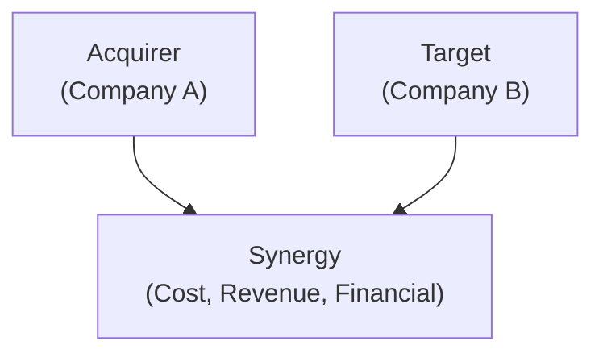

## Synergies: Why They Matter

Mergers and acquisitions (M&A) often rise or fall on one simple question: “Are the combined companies together worth more than the sum of their parts?” That extra value—or synergy—is the engine that justifies premium prices and bold strategic moves. If you’re wondering why acquirers are sometimes ready to pay what seems like a jaw-dropping premium to buy a target, it’s typically because they anticipate cost savings, new revenue streams, or other financial perks that are only possible when Company A and Company B become one.

I remember back when I was assisting in a mid-sized industrial merger—everyone was excited to talk about synergy benefits like cross-selling and eliminating redundant factories. But, um, you know, synergy doesn’t magically appear. You have to plan meticulously and ensure both companies actually integrate properly. Without real synergy, paying a fat premium can quickly become a nightmare for the acquiring shareholders.

In this section, we break down the different types of synergies, discuss how to measure them, delve into purchase premiums and factors that drive them up, and explore the varied ways a deal can be structured, including when it might be more “friend or foe.”

## Types of Synergies

It’s helpful to view synergies in three broad categories: cost, revenue, and financial. Each category has unique drivers, but all are rooted in the idea that the combined entity can do something better, faster, or cheaper than the two standalone firms ever could.

### Cost Synergies

Cost synergies are usually the most straightforward to quantify—and often the first ones people talk about. They arise from:

• Economies of scale: Combining manufacturing efforts for increased production volumes, leading to lower average costs.  
• Purchasing power: Negotiating raw material or component costs more aggressively as a bigger buyer.  
• Reduction of redundant expenses: Consolidating back-office operations, IT systems, or overlapping sales teams, so you don’t pay for two sets of everything.  

I once worked on a healthcare merger where the biggest cost synergy was shutting down half of the administrative offices across overlapping geographies. Some folks lost their jobs in that scenario, which is always a delicate subject, but from a purely financial perspective, it did reduce overhead drastically.

### Revenue Synergies

Revenue synergies can be more exciting to talk about but are often trickier to pin down in precise numbers. Common sources include:

• Cross-selling opportunities: Picture a new combined sales team offering complementary products to each other’s client base.  
• Geographical expansion: A target with a strong presence in a new region can help the acquirer quickly gain market share or distribution channels there.  
• Product line upgrades: If Company A’s technology can supercharge Company B’s product line, the new integrated offerings can command higher prices or capture fresh customers.

Revenue synergies can be overshadowed by the complexity of sales channels, brand perceptions, and even cultural differences in combined marketing teams. So yes, you can dream big here, but be sure to back it up with thorough research and ground-level execution plans.

### Financial Synergies

Financial synergies typically center on improving the cost of capital or tax advantages:

• Access to cheaper credit: The combined entity may have stronger collateral or more stable cash flows, leading to lower interest rates.  
• Tax benefits: Net operating losses (NOLs) or differences in corporate tax structures could reduce the effective tax rate.  
• Cash flow smoothing: The combined firm might enjoy more stable earnings if the constituent businesses are countercyclical. That stability can help reduce costs of financing.  

These financial synergies sometimes get overlooked in discussions, but they can be significant. For instance, an acquirer might choose a target primarily to diversify its revenue stream, thereby convincing lenders they’re safer to lend to at better rates.

## Visual Representation of Synergies

Below is a simple diagram illustrating how acquirer and target combine to generate synergy benefits. Even though synergy is an intangible concept, some folks find it helpful to visualize its drivers:

Think of synergy as the meeting point where cost reductions, expanded sales, and financing benefits converge.

## Calculating and Valuing Synergies

To put a number on synergy, analysts typically follow these steps:

• Identify synergy sources: Are we looking at cost-cutting or new revenue from cross-selling, or both?  
• Forecast future synergy benefits: Estimate how much cost savings or extra revenue you’ll see each year for a specific period.  
• Discount to present value: Like any other cash flow, synergy projections need to be discounted using an appropriate rate (often the firm’s weighted average cost of capital, WACC).  

### Example: Synergy Calculation

Imagine you forecast a merger will yield annual cost savings of $20 million for five years. You estimate the present value of these savings to be $80 million today. Additionally, you see potential new revenue streams generating $50 million in present value. So, total synergy is $130 million. If you pay a premium of $100 million above the target’s standalone net present value, the synergy comfortably covers the premium (with $30 million to spare). If your synergy estimates are correct, the deal might be considered financially attractive.

Mathematically, you can outline synergy value with the basic formula:


\text{Value of Combined Firm} = \text{V(A)} + \text{V(B)} + \text{Value of Synergies} 


If  

\text{Value of Synergies} > \text{Premium Paid for B}

the acquirer’s shareholders, in theory, benefit.

## Purchase Premiums

A purchase premium is the extra amount above a target’s “fair” or “intrinsic” value that an acquirer must pay to secure control. It’s not uncommon to see premiums in the range of 20%–40%, or higher, especially if the target is a fast-growing company or if multiple bidders are involved.

### Factors Influencing Premium Size

• Growth prospects: Targets with strong revenue growth or blockbuster product pipelines command higher premiums.  
• Competitive landscape: Bidding wars can easily inflate the premium beyond original estimates.  
• Intangible assets: Proprietary technology, patents, or brand reputation add to a target’s intangible value.  
• Management quality: Strong leadership teams are sometimes valued highly; the acquirer often wants to retain key talent, which can nudge the premium upward.  

All else equal, the more strategic the target is (e.g., if controlling it locks down a segment of the market), the more you can expect to pay up.

### Control Considerations

In many deals, having control is worth a considerable price. If the acquirer can break into a new market or fold the target’s capabilities into its product line smoothly, it might justify paying more than most typical valuations. However, there’s always the danger of overpaying. Ever seen a big “merger of equals” that flops because synergy projections were overly optimistic? Overestimates of synergy often lead to buyer’s remorse—so proceed with caution when running the numbers on synergy and deciding how big a premium you’ll offer.

## Deal Structures

How do you actually pay for an acquisition? You can arrive with a briefcase of cash (figuratively speaking), or you can offer your own shares, or maybe something in between. The structure you choose impacts control, risk, and tax consequences, both for you and for the target.

### Cash Offers

In a cash deal, the acquirer transfers an agreed-upon amount of cash to target shareholders in exchange for their shares:

• Pros: Simple, offering target shareholders immediate liquidity. There’s no diluting the acquirer’s shareholder base.  
• Cons: If funded by debt, it can lever up the acquirer’s balance sheet. Also, target shareholders miss out on any future upside of the combined firm (often a sticking point in negotiations).

### Stock-for-Stock Transactions

Here, target shareholders get stock in the new or expanded entity:

• Pros: Acquirer doesn’t need immediate cash outlay; target shareholders participate in the combined firm’s potential gains.  
• Cons: Ownership dilution for existing acquirer shareholders. Valuation can get trickier since you’re basically swapping one set of stock for another.  

In highly dynamic industries—think tech—stock-for-stock deals can be popular because everyone wants a piece of the future growth possibilities.

### Mixed Payment

A bit of both. Maybe you pay half in cash and half in the acquirer’s stock (or 70/30, 60/40, etc.). This can be a nice compromise:

• Reduces the acquirer’s immediate cash requirement.  
• Lets target shareholders participate in some of the combined entity’s upside.  
• Helps manage risk and ownership dilution.

Sometimes, a firm without enough cash on hand or with a preference to maintain certain debt ratios may creatively structure the mix—especially if they expect synergy to take a while to materialize.

## Hostile vs. Friendly Transactions

If the board of directors at the target says, “Sure, we love your offer. Let’s talk,” that’s a friendly deal. But not every takeover is welcomed.

### Friendly Deals

They’re collaborative and usually less dramatic than hostile deals. The acquirer and target negotiate quietly, hammer out terms, work out synergy estimates together, and eventually present the deal to both sets of shareholders. Because both boards cooperate, these transactions often involve smoother integration planning from the get-go.

### Hostile Takeovers

In a hostile takeover, the target’s board rejects the offer or refuses to negotiate. The acquirer might then make a public tender offer directly to shareholders or, in some cases, attempt a proxy fight to replace the target’s board with members who are pro-acquisition.

Hostile deals can get messy, with higher legal fees, potential public acrimony, and the possibility of “poison pills” (target defenses) or “white knight” alternatives. Synergy can still happen, of course, but cultural integration becomes trickier if the target’s management is actively opposed to the merger.

## Negotiation and Due Diligence

When I think of due diligence, I picture a giant data room full of financial statements, product roadmaps, intellectual property documents, and legal contracts. The acquirer’s job is to dig in and confirm the target’s real value, especially synergy assumptions. If the synergy doesn’t materialize once you have full transparency into operations, your carefully crafted synergy calculations might be thrown out the window.

• Financial Due Diligence: Thoroughly validate revenue forecasts, synergy assumptions, cost structures, capital expenditures, and potential liabilities.  
• Cultural and Strategic Fit: Even if the numbers look spectacular, synergy can unravel if the two firms’ cultures clash after the merger.  
• Legal, Regulatory, and Tax Compliance: Some jurisdictions have strict antitrust rules or get particularly fussy about foreign ownership. Make sure your synergy plan won’t be axed by regulators.

It’s way better to invest in the right professional reviews up front than to discover a huge accounting landmine a month after the deal closes.

## Common Pitfalls and Best Practices

• Overestimating Synergies: Resist the urge to paint synergy in overly rosy hues—be conservative and use sensitivity analysis.  
• Ignoring Integration Costs: Achieving synergy takes money (layoff expenses, system consolidations, rebranding, etc.). Net synergy is what really matters.  
• Misjudging Cultural Issues: If the workforce of one company sees the deal as threatening, synergy can vanish in the face of turnover and poor morale.  
• Aligning Deal Structure with Strategy: If you need to maintain a certain debt ratio, or if your shareholders crave synergy-driven growth, tailor your cash vs. stock approach accordingly.

## Glossary

**Cost Synergy**: Operating efficiencies that lower production or operating costs post-merger.  
**Revenue Synergy**: Opportunities to increase sales or market share by combining strengths of merging firms.  
**Financial Synergy**: Enhanced capital structure, tax advantages, or other corporate finance benefits.  
**Hostile Takeover**: A takeover attempt opposed by the target’s management and board of directors.  
**Friendly Acquisition**: A negotiated deal with collaboration from both boards of directors.  
**Tender Offer**: A public invitation by one company to buy shares of another company at a specified price.  
**Mixed Payment Deal**: Transaction using both cash and stock to pay target shareholders.  
**Strategic Fit**: How well the target’s business complements the acquirer’s goals and resources.

## References, Further Reading, and Resources

• Weston, J. F., & Weaver, S. (2001). “Mergers and Acquisitions.” New York: McGraw-Hill.  
• Berk, J., & DeMarzo, P. (2020). “Corporate Finance.” Boston: Pearson Education.  
• M&A briefs and deal structure analyses from Reuters or Bloomberg intelligence.  
• Deloitte M&A Trends Reports for transaction structure insights: https://www2.deloitte.com  

## Test Your Knowledge: Synergies and Deal Structures Quiz



### Which type of synergy is typically the easiest to quantify and often the first targeted in a merger?

- [ ] Revenue synergy
- [x] Cost synergy
- [ ] Financial synergy
- [ ] Market synergy

> **Explanation:** Cost synergies—like reducing redundant staff or consolidating facilities—are usually the most straightforward to identify and measure.

### Which of the following is NOT a driver of purchase premiums?

- [ ] Growth prospects of the target
- [ ] Presence of multiple bidders
- [x] Low cost of debt for the acquirer
- [ ] Strong intangible assets

> **Explanation:** While low cost of debt can help finance a deal, it does not necessarily drive up the purchase premium. Premiums often rise with high growth prospects, bidding wars, and intangible asset values.

### When valuing expected synergies, which is the best approach?

- [x] Forecast future synergy benefits and discount them to the present
- [ ] Use last year’s net income and multiply by a synergy factor
- [ ] Calculate intangible assets at book value
- [ ] Estimate synergy savings as 2% of combined revenue

> **Explanation:** The appropriate approach is to forecast the synergy benefits each year and discount them to their present value, ensuring they are aligned with realistic assumptions.

### Which synergy type can include tax advantages and improved access to credit?

- [ ] Cost synergy
- [ ] Revenue synergy
- [x] Financial synergy
- [ ] Business synergy

> **Explanation:** Financial synergy often stems from a stronger combined capital structure, tax optimization, and more favorable borrowing rates.

### In a hostile takeover, the acquirer typically:

- [x] Makes a tender offer directly to the target’s shareholders
- [ ] Waits for the target board to approve
- [ ] Only uses stock-for-stock payments
- [ ] Engages the target’s management in friendly discussions

> **Explanation:** Hostile takeovers go around the target board by directly appealing to shareholders, often through a tender offer.

### Which of the following statements is correct regarding mixed payment deals?

- [ ] They typically involve only small targets
- [x] They combine cash and shares in varying proportions
- [ ] They are considered “friendlier” than stock-for-stock deals
- [ ] They avoid any premium for control

> **Explanation:** Mixed payment deals simply involve using both cash and stock to pay the target’s shareholders, blending benefits and mitigating risks.

### An acquirer overpays for a target when:

- [x] The premium paid exceeds the present value of expected synergies
- [x] Synergistic integration costs exceed anticipated benefits
- [ ] The due diligence period is shorter than a month
- [ ] The cost of debt is high

> **Explanation:** Overpaying occurs if the extra price offered to buy the target is larger than the net present value of synergy. Underestimating integration costs can also lead to overpayment.

### Which factor is LEAST likely to escalate a purchase premium?

- [x] A distressed seller with limited negotiation power
- [ ] Multiple bidders competing for the same target
- [ ] Strategic fit in a high-growth sector
- [ ] High intangible assets in the target

> **Explanation:** A distressed seller with limited power generally decreases the premium required, because the seller is under pressure to sell.

### A primary advantage of a stock-for-stock transaction is:

- [ ] No dilution of the acquirer’s shareholders
- [x] Opportunity for target shareholders to share in future growth
- [ ] Greater simplicity than a cash deal
- [ ] Limited legal requirements

> **Explanation:** Stock-for-stock deals allow the target’s shareholders to benefit if the combined firm’s stock price rises over time.

### True or False: Cost synergies are always more difficult to achieve than revenue synergies.

- [ ] True
- [x] False

> **Explanation:** Cost synergies are often easier to achieve and measure because they involve cutting specific, identifiable expenses. Revenue synergies, on the other hand, depend on factors such as cross-selling and market expansion, which can be more uncertain and harder to pin down.


