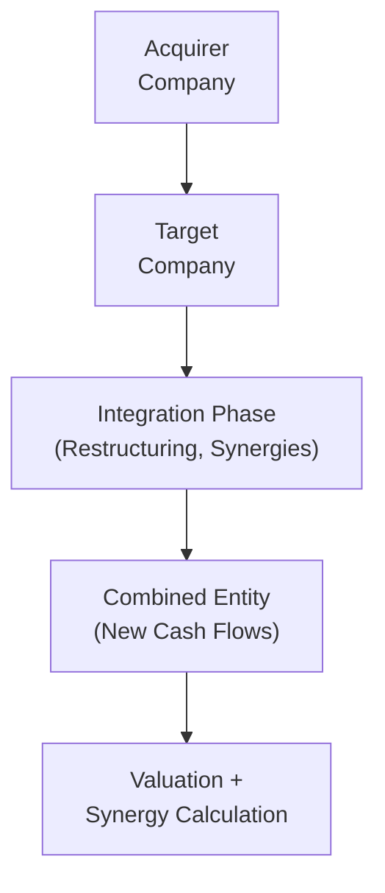

## Approach to M&A Valuation in a Vignette

Mergers and acquisitions can be thrilling—or downright intimidating—when you first encounter them in an exam vignette setting. One moment, you’re reading about a fancy synergy announcement in the press, and the next, you realize you need to forecast intangible benefits while factoring in integration expenses and discount rates. Don’t worry if it feels overwhelming at first. Here, we’ll walk through a structured approach you can apply. By focusing on the logic behind each step, you can simplify the process—even if it’s “just” in a vignette.

Below is a brief overview of how to navigate a typical M&A item set or case scenario, from capturing the strategic rationale to pinning down the final offer price.

• Establish the Strategic Rationale.  
  Yes, every deal has a story—maybe it’s expanding market share, tapping into a new technology, or eliminating a pesky competitor. Understand the synergy thesis. Is management bragging about cost savings? Revenue expansion? Sometimes both? This rationale is more than fluff. It helps you identify where to expect synergy (e.g., cost or revenue) and how quickly it might be realized.

• Forecast the Target’s Cash Flows.  
  You might recall from your reading on free cash flow to the firm (FCFF) or free cash flow to equity (FCFE) that we want to isolate the cash flows attributable to the target. Now add synergy: are there immediate cost reductions or cross-selling opportunities that boost top-line revenue projections? Spell them out. If you haven’t already, think carefully about timing—fast synergy vs. synergy that arrives years later impacts the valuation differently.

• Project Integration Costs.  
  This is my personal “uh-oh” step. In some deals, synergy is easy to imagine, but folks forget the rocket-fuel bills that come with it. Workforce realignments, layoffs, and software integration are pricey. Make sure to subtract these from any synergy benefits in the cash flow forecast. The net synergy is what counts, not the starry-eyed synergy that management might promise in investor calls.

• Estimate a Discount Rate.  
  Often, we’ll adjust the acquirer’s weighted average cost of capital (WACC) for the combined firm’s risk profile. Alternatively, if the target’s business is drastically different, you might need a separate discount rate. Remember from your earlier chapters on return concepts: the cost of equity might change if the target operates in a riskier region or industry.

• Compute Standalone and Combined Values.  
  Value each entity on a standalone basis before adding synergy. If the combined entity is supposed to be more efficient, the difference between the combined valuation (with synergy) and the sum of the standalone valuations is effectively the synergy’s present value. That synergy is a big reason behind the M&A dance.

• Determine the Maximum Offer Price.  
  Here’s where the negotiation juice is: the acquirer typically can’t pay more than the target’s standalone value plus some share of synergy. If an acquirer pays the entire synergy to the target, the net benefit to the acquirer could be zero or even negative. Keeping synergy gains is the reason M&A can create value for the acquirer’s shareholders—assuming, of course, synergy is real.

• Evaluate Financing Impacts.  
  Don’t ignore how the deal’s financed. If you’re piling on debt, you might see a higher risk, changing WACC, or affecting your capital structure. With an equity offering, watch for share dilution or altered ownership stakes.

• Sensitivity and Scenario Analysis.  
  Finally, if synergy is uncertain, or if laws might block the deal, we do scenario analysis to see “What if synergy is half of what we expect?” or “What if integration costs run double?” These analyses can be your rescue net in understanding the true range of possible outcomes.

Below is a simple flowchart illustrating how M&A synergy flows from separate companies to an integrated entity:

## Practical Example of Synergy Computation

Let’s do a miniature example. Suppose you have a target firm generating $10 million in FCFF annually, expected to stay constant if it remains standalone. The acquirer sees a synergy opportunity: by merging, they can reduce the target’s operating expenses by $1 million per year and increase the target’s revenue by $1.5 million annually (net of costs). However, the first year after acquisition, the acquirer must pay $3 million in restructuring costs.

Imagine a constant WACC of 10%, and estimate synergy over a 5-year horizon followed by a terminal value. Let’s call the synergy in year t: Sᵗ. The present value of synergy might be:


\text{NPV of Synergy} = \sum_{t=1}^{5} \frac{S_t}{(1 + 0.10)^t} + \frac{\text{Terminal Value}}{(1 + 0.10)^5} - \text{Integration Costs}


If S₁ is (1.0 + 1.5) − 3.0 = –0.5 million (a negative synergy in the first year due to the big restructuring cost), you see synergy might not even be positive right away. That’s what integration is all about—pain up front, reward later. Over the next few years, synergy might run +2.5 million each year as new efficiencies kick in. Then the final year includes a terminal value. Summing discounted synergy might yield a net synergy NPV of, say, $5 million. This $5 million in synergy belongs partly to the acquirer (and sometimes to the target, depending on deal negotiation). If the target’s standalone value was $80 million, and synergy is $5 million in present value, you might not want to pay more than $85 million total in a perfect world. Of course, real negotiations get messy.

This example is simplified, but it underscores the importance of carefully listing synergy assumptions, discounting them properly, and deducting integration costs.

## Item-Set Question Tips

M&A vignettes in the exam context usually have a lot of data crammed into a few paragraphs: synergy assumptions, forecasts, interest rates, capital structure, and maybe a line about lawsuits or “brand realignment.” Sometimes they sneak in “deal breaker costs” or random regulatory fees.

• Break Down the Data.  
  Skim quickly for synergy assumptions, discount rates, relevant cash flow forecasts, and any unique cost drivers. It’s basically a puzzle where each piece is found in a different paragraph.

• Watch for Trick Details.  
  The exam might mention synergy that’s partially outside the time frame you’re valuing. Or they might bury some marketing expense that offsets synergy. Or, you know, they quietly mention increased regulatory compliance in certain markets. Keep your eyes wide open.

• Summarize Key Elements.  
  Before you crunch numbers, outline synergy expectations, integration timeframe, financing approach (debt or equity), discount rate, and your method for calculating terminal value. Then do your math systematically.

## Common Pitfalls in M&A Valuation

• Overstated Synergy.  
  M&A hype can inflate synergy estimates. A classic example: revenue synergies that never materialize because of cultural clashes or brand confusion after the merger.

• Understated Integration Costs.  
  Systems integration, rebranding, severance payments—these can be painfully big yet easy to skip when reading quickly.

• Misapplied Discount Rate.  
  Maybe the WACC shoots up when you load on new debt. Or the target is in a riskier industry and you rely on the acquirer’s discount rate—a mismatch can give you the wrong synergy value.

• Ignoring Financing Structure.  
  A scrip (equity) deal can be dilutive; a debt-financed deal can raise financial risk. Factor in how that changes the future cost of capital or the capital structure.

• Missing Terminal Value Nuances.  
  If synergy is short-lived, it may not affect terminal value. Or if synergy is indefinite, you might reflect it in a perpetuity. Don’t forget the terminal value is often the biggest chunk of your DCF.

## Glossary

• Restructuring Costs. Expenditures related to reorganization, layoffs, facility closures, or major changes during post-merger integration.  
• Combined Valuation. The estimated value of the merged entity after incorporating synergies and integration costs.  
• NPV (Net Present Value). The present value of future cash flows (inflows minus outflows).  
• Terminal Value. The value of a business beyond the forecast period, often using a perpetuity growth or exit multiple approach.  
• DCF (Discounted Cash Flow). A valuation method projecting future cash flows and discounting them at an appropriate rate (e.g., WACC or required rate of return).  
• WACC (Weighted Average Cost of Capital). The weighted average of the required returns on all components of the firm’s capital structure—both equity and debt.  
• Integration Timeframe. The expected duration over which synergy benefits are realized (and associated costs are incurred).  
• Deal Breaker Costs. Fees or penalties if an acquisition fails to close (e.g., termination fees).

## References and Further Reading

• Bruner, R. F. (2004). Applied Mergers and Acquisitions. New York: John Wiley & Sons.  
• CFA Institute (Official Curriculum): Practice Problems on M&A and Equity Investments.  
• The Journal of Financial Economics: Peer-reviewed articles on M&A synergy outcomes.  
• Consulting Firms such as McKinsey or Bain: Practitioner guides on synergy modeling and scenario analysis.

## Test Your Mastery of M&A Valuation Vignette Analysis



### Which of the following is a typical example of an integration cost that must be considered in an M&A scenario?

- [ ] Reduced costs due to supply-chain optimization
- [ ] Incremental revenue from cross-selling
- [x] Severance payments due to workforce realignment
- [ ] Expanding product distribution channels

> **Explanation:** Supply-chain optimization and cross-selling represent synergy benefits, whereas severance payments are a restructuring cost. Severance payments must be deducted from synergy to get the net benefit.

### An acquirer values a target at $120 million on a standalone basis. The estimated synergy NPV is $10 million, and the acquirer wants to ensure it does not overpay. What is the maximum amount the acquirer should be willing to pay?

- [ ] $110 million
- [ ] $145 million
- [ ] $130 million
- [x] $130 million (or below)

> **Explanation:** Standalone value ($120 million) + synergy M&A value ($10 million) = $130 million. Paying more than this amount could result in a negative NPV for the acquirer.

### In determining the discount rate for a combined entity post-merger, which factor should analysts most likely consider first?

- [ ] The target’s historical dividend policy
- [ ] The acquirer’s corporate governance structure
- [x] Changes in the firm’s capital structure and business risk
- [ ] The laws of the stage-of-entry country

> **Explanation:** The primary driver for a changed discount rate post-merger is the modification of capital structure (e.g., additional debt) and the new, possibly divergent, business risk profile.

### Which of the following statements correctly describes a best practice in synergy valuation?

- [ ] Use the same discount rate to value both companies and synergy, regardless of risk differences
- [ ] Factor in synergy but ignore any required integration or restructuring costs
- [ ] Always assume synergy can be capitalized indefinitely
- [x] Estimate synergy separately, discount its benefits, and offset by integration costs

> **Explanation:** Analysts must isolate synergy, discount its cash flows, and subtract integration costs to find net synergy. Using a single discount rate indiscriminately or ignoring costs creates inaccurate valuations.

### How do revenue synergies differ from cost synergies in terms of uncertainty?

- [ ] Revenue synergies are generally easier to predict
- [x] Revenue synergies often involve more uncertainty than cost synergies
- [ ] Cost synergies require no integration costs
- [ ] Revenue synergies do not affect terminal value

> **Explanation:** Revenue synergies typically require new sales channels or cross-selling, which can be uncertain. Cost synergies are often more predictable if the cost savings are well-defined.

### A common pitfall in M&A valuation is overstating synergy. This is often due to:

- [x] Overlooking integration challenges and cultural differences
- [ ] Using multiple discount rates
- [ ] Applying the target’s cost of capital to the acquirer
- [ ] Underestimating growth in the target’s existing product lines

> **Explanation:** Managers often underestimate integration challenges, which leads to inflated synergy projections.

### In the first year after acquisition, synergy can sometimes be negative. Which factor can cause negative synergy?

- [ ] Issuing new shares for financing
- [x] Paying high restructuring and severance costs
- [ ] A drop in the acquirer’s share price
- [ ] A new marketing campaign for the combined entity

> **Explanation:** Integration can require hefty restructuring costs, offsetting any synergy. If these costs exceed the immediate synergy realized, net synergy can be negative initially.

### If a firm’s synergy calculation excludes certain regulatory compliance expenses, the projected synergy NPV is likely:

- [x] Overstated
- [ ] Correct
- [ ] Understated
- [ ] Irrelevant

> **Explanation:** Missing compliance expenses will artificially inflate projected net synergy, thus overstating its present value.

### What is the primary rationale behind performing sensitivity analysis on synergy estimates?

- [ ] Minimize the time spent on due diligence
- [ ] Exhibit compliance with GAAP
- [x] Understand how changes in key assumptions affect the deal’s viability
- [ ] Eliminate the need for scenario analysis

> **Explanation:** Sensitivity analysis reveals how the M&A valuation outcome changes when critical assumptions—like synergy timing, cost of capital, or integration costs—are tweaked.

### True or False: The combined valuation of the merged firm should ideally exceed the sum of the standalone values of the individual firms if the M&A creates positive synergy.

- [x] True
- [ ] False

> **Explanation:** When synergy is positive and properly accounted for, the combined firm’s value should be higher than the sum of the standalone valuations—this difference is the synergy’s present value.


