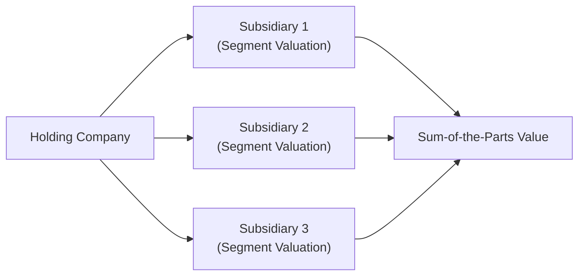

## Introduction

If you’ve ever looked at those big corporations that seem to own everything from snack foods to industrial machinery to technology patents, you’ve encountered a conglomerate. And sometimes you’ll see a holding company that holds various stakes in separate businesses yet rarely gets its own hands dirty with day-to-day operations. Several real-world examples might come to mind—perhaps Berkshire Hathaway (with its insurance, railroads, and consumer-goods interests) or Japan’s sprawling keiretsu structures. At first glance, valuing such entities can feel like trying to juggle a dozen balls in the air. But don’t worry. In this section, we’ll break down the fundamentals of conglomerates, figure out why they’re formed, and learn how to approach their valuation step by step, all while acknowledging the illusions (or realities) of synergies and the dreaded “conglomerate discount.”

Anyway, I remember the moment I tried my first full-blown conglomerate valuation as an analyst. I had so many Excel worksheets open—each one for a different segment—that my laptop sounded like it was about to blast off. Regardless of the hardware meltdown threats, the method itself was eye-opening. What I learned is: to handle these behemoths effectively, we need a structured approach tailored to their sprawling nature. Let’s explore that approach.

## Understanding Conglomerates and Holding Companies

Conglomerates and holding companies share a key similarity: they bring multiple businesses under one umbrella. However, the style of management and integration can differ:

• A conglomerate typically manages distinct (often unrelated) business lines within a single legal entity. There’s usually a corporate headquarters with oversight over all operating segments.  
• A holding company often holds controlling (and sometimes minority) stakes in several legally separate subsidiaries. The holding company might not be heavily involved in day-to-day operations, focusing instead on governance and strategic decision-making.

In practice, both structures present a puzzle for analysts because each part can follow its own distinct set of rules—different risk profiles, growth trajectories, capital requirements, and regulators. Plus, factors like overhead cost allocations among segments, intercompany transactions, and shared central services can muddy comparisons and mask the true performance of any single segment.

### Why Form a Conglomerate or Holding Company?

• Risk Diversification: Management might believe that owning unrelated businesses will smooth out earnings. If one sector’s in decline, another might be booming.  
• Capital Allocation Flexibility: Top management can deploy free cash flow from a mature subsidiary to fund a fast-growing upstart or to acquire another target.  
• Access to Wider Cash Flows: From the perspective of investors, the stable combined cash flows could be appealing—though some argue investors can diversify on their own.  
• Managerial Ambition and M&A Culture: Sometimes conglomerates are born from a series of mergers and acquisitions led by executives eager to expand their empire.  

## Key Valuation Challenges

Valuing a conglomerate or holding company can require advanced detective work. You often have to break out each operational segment separately, estimate its intrinsic value, and then consider how everything fits back together.

1. Limited Segment-by-Segment Details  
   Many conglomerates do not provide granular data for each segment, or the data they do provide might be selective. Transfers, intangible synergy claims, and overhead allocations often get buried in consolidated financial statements.

2. Diverse Growth Drivers and Risks  
   Valuation assumptions that make sense for an industrial machinery division may be irrelevant to a consumer goods subsidiary. Different segments can have wildly different cost structures, time horizons, capital intensity, and risk levels.

3. Corporate Overheads, Transfer Pricing, and Centralized Functions  
   When a conglomerate has a shared finance department or invests heavily in group-level R&D, it may be tricky to allocate central costs fairly. Transfer prices, including intangible assets or brand-related charges between divisions, can distort how profitability appears at the segment level.

4. Governance and Control  
   Holding companies sometimes own minority stakes, meaning less direct control. The presence of other large shareholders, board dynamics, or cross-shareholdings can complicate both valuation and synergy realization.

5. The Conglomerate Discount (or Premium)  
   Historically, many conglomerates trade at a discount relative to their theoretical sum-of-the-parts (SOTP) valuation. In some cases, though, unique synergies or a stellar capital allocation track record might result in a premium.

## Capital Allocation and Management Track Record

Something that often gets overlooked is the role of senior management in capital allocation. A well-managed conglomerate can be a beautiful engine. You might see:
• Swift reallocation of capital from low-return segments to higher-return segments.  
• Timely divestitures of underperforming divisions.  
• Smart acquisitions that generate real synergies.  

Unfortunately, not all management teams are created equal. Some undertake ill-fated acquisitions at high valuations, or maintain “pet projects” that destroy value. Scrutinizing management’s historical record—like synergy targets met, successful spin-offs, or well-executed share buybacks—can reveal a lot about future prospects.

## Sum-of-the-Parts Analysis (SOTP)

A bedrock approach to valuing conglomerates is the sum-of-the-parts (SOTP). In plain language, you ask: “What’s the company worth if I valued each segment on a standalone basis and simply added them up?” SOTP can be performed with various methods:

• Comparable Multiples: Value each division using relevant price multiples (P/E, EV/EBITDA, P/B, etc.) from similar pure-play companies.  
• Discounted Cash Flow (DCF): Project free cash flows for each segment (or subsidiary) and discount them at an appropriate cost of capital that reflects the segment’s risk.  
• Residual Income or EVA Analysis: Evaluate each segment’s ability to generate returns above its cost of capital.

Once you have your partial valuations, add them up. Then you typically adjust for the net debt at the holding-company level (and any other unallocated corporate items), and voilà: you have a “theoretical” total value. In practice, you may or may not add a synergy premium (if you believe the segments create incremental benefit by being under one roof) or you might subtract a conglomerate discount if the market usually penalizes complexity or perceived lack of strategic focus.

Here’s a simple conceptual flow in a diagram, showing the relationship between the parent (holding entity) and its subsidiaries—plus how we roll up their valuations.



## Handling Minority Stakes and Control Premiums

Holding companies may own 51% of one subsidiary, 40% of another, and 100% of a third. You should:
1. Apply a control premium if the conglomerate’s ownership stake allows for control over that subsidiary’s cash flows and strategic decisions.  
2. Value partial stakes at the market value or fair value of that portion of equity. However, be cautious: if the minority stake is large but not controlling, there may still be some influence—estimate an “influence” premium if relevant.  

Meanwhile, if you’re analyzing from the perspective of an external investor with no direct control, you might consider a discount for lack of control (a minority discount) if you think control is a significant part of the subsidiary’s overall attractiveness.

## The Conglomerate Discount… or Premium

The so-called “conglomerate discount” remains a hot debate in academic and practitioner circles. Many argue that a conglomerate trades below the SOTP for these reasons:

• Complexity: Analysts struggle to model each segment accurately (or they just don’t trust management to place the right bets).  
• Lack of Focus: The market can be suspicious when the parent invests in widely disparate or unaligned businesses.  
• Corporate Governance Issues: Large, sprawling organizations can hide inefficiencies or questionable capital deployment.  

On the flip side, some conglomerates trade at a premium. Examples are those where the CEO’s capital-allocation ability is revered, or there’s a strong synergy that is actually realized (for instance, leveraging a powerful distribution network across multiple product lines). So it’s not a universal rule. Instead, a wise approach is to perform a thorough SOTP, then gauge whether the market’s discount or premium is justified by analyzing synergy, complexity, or managerial skill.

## Scenario Analysis for Conglomerates

Scenario analysis is super handy for segment-by-segment assumptions. Imagine you have a conglomerate with three main business lines:

• Consumer Apparel (high brand equity, strongly cyclical sales).  
• Telecom Infrastructure (steady cash flow, regulated environment).  
• Streaming Services (high growth, fierce competition).  

One scenario might revolve around strong consumer demand but stiffer regulations for telecom, while another scenario might assume a global recession or new disruptive technologies. By adjusting up or down the revenue growth, cost structures, or synergy assumptions in each scenario, you get a range of outcomes—and see how resilient (or vulnerable) the overall conglomerate is. It’s especially helpful if the synergy story changes drastically with market conditions.

## Python Code Example: SOTP Valuation with Synergy

Below is a toy snippet in Python that illustrates how you might fuse together a sum-of-the-parts valuation. This is obviously simplified but shows one possible approach:

```python
import numpy as np

segment_vals = {
    'SegmentA': 1500,  # e.g., Consumer
    'SegmentB': 2200,  # e.g., Telecom
    'SegmentC': 800    # e.g., Streaming
}

# Suppose synergy is derived from scale or cross-selling
synergy_value = 200

net_debt = 500

sotp_total = sum(segment_vals.values()) + synergy_value - net_debt

print(f"Sum-of-the-parts valuation (in millions): {sotp_total}")
```

In this miniature illustration, we’re adding the synergy value to the sum of each segment’s standalone valuation (1.5B + 2.2B + 0.8B + 0.2B synergy = 4.7B), then subtracting the net debt of 0.5B for a total of 4.2B. Of course, real-life synergy analysis is rarely that straightforward, but it’s a starting point.

## Governance Structures and Intercompany Transactions

Something else that can get lost in the shuffle is the governance structure. If the holding company is a loose federation with each subsidiary practically acting independently, synergy might be minimal. Alternatively, if the parent sets a unified corporate strategy, invests in the subsidiaries collectively, and fosters cross-selling, synergy can be significant. Also keep an eye on intercompany transactions:

• Transfer Pricing: Are subsidiaries “charging” each other fair market rates for goods or services?  
• Overhead Allocation: Is the parent accurately allocating overhead, or is one profitable subsidiary bearing disproportionate cost burdens?  

In short, a thorough understanding of how each business line interacts with the others is vital when deciding whether synergy (or dis-synergy) might occur.

## Best Practices in Valuing Conglomerates

• Get Segment-Level Data: Dive into every footnote, management discussion, and investor presentation. Analysts often glean hidden insights from conference calls and segment breakouts.  
• Separate Operating vs. Nonoperating Items: If the conglomerate has large real estate holdings that are not central to operations, consider valuing those separately.  
• Adjust for Corporate Overheads and Unallocated Items: These can significantly reduce or inflate individual segment profitability.  
• Apply Different Discount Rates: A cyclical, capital-intensive business probably needs a higher required rate of return than a stable utility-like segment.  
• Quantify Synergies, Don’t Just Assume Them: Evaluate synergy claims carefully. Does the data reflect cross-selling, lower capital costs, or scale economies?  
• Revisit Assumptions: In addition to scenario analysis, watch for changes in strategy or management—these can dramatically alter synergy.  
• Look for Divestiture or Spin-Off Signals: In some transactions, the sum of the pieces is greater than the current share price. Management might consider a spin-off, so keep an eye on any announcements.

## Common Pitfalls

• Overestimating Synergy: It’s easy to get caught up in a synergy narrative, layering synergy upon synergy. But synergy is notoriously elusive—always verify data.  
• Ignoring Culture Clashes: Two subsidiaries that “should” cross-sell might not, if managers at each subsidiary prefer to run their own show.  
• Treating All Debt as a Single Bucket: If a subsidiary is highly leveraged but ring-fenced from the parent or the rest of the group, you might overestimate the risk to the entire conglomerate.  
• Double Counting: Watch that you’re not inadvertently adding the same intangible synergy benefit multiple times in your SOTP approach.  
• Missing the Cost of Complexity: Overheads, compliance, or taxes in certain jurisdictions can be higher for a multinational conglomerate.  

## Potential for Value Creation or Destruction

Conglomerates can be incredible value creators if they make profitable additions or harness synergy. They can also be huge value destroyers if management invests in money-losing ventures or encumbers the profitable segments with inefficient overhead. Whether the market discounts them or not often depends on how well they articulate (and deliver on) an integrated strategy.

## Conclusion and Exam Tips

Evaluating a conglomerate or holding company demands a methodical approach. That includes segment-by-segment valuation, synergy analysis, recognition of possible discounts or premiums, and thorough due diligence on management’s track record. On exam day (and in real life), stick to the fundamentals: gather as much segment detail as possible, apply the relevant valuation techniques carefully, and ensure your final analysis reconciles the parts back into a coherent whole.

• Practice handling complex item sets with multiple segments, each requiring separate assumptions.  
• Watch for clues about overhead allocations or synergy claims in the vignette.  
• If synergy is a big theme in the question, dig into whether the synergy is “just talk” or actually supported by factual data.  
• Don’t forget to factor in different discount rates for each business line and then sum them carefully.

With that approach, you stand a good chance of nailing any conglomerate or holding company valuation analysis the exam throws at you—without your laptop spontaneously combusting in the process.

---

## References and Further Exploration

- Damodaran, A. (2012). Investment Valuation. John Wiley & Sons.  
- Penman, S.H. (2013). Financial Statement Analysis and Security Valuation. McGraw-Hill.  
- “Do Conglomerates Discount Themselves?” – CFA Institute Research Foundation.  
- OECD (https://www.oecd.org): “Corporate Governance and Value Creation.”  

---

## Conglomerate Valuation Mastery Quiz



### In performing a sum-of-the-parts valuation on a conglomerate, which factor typically leads to a discount relative to the theoretical total?

- [ ] Transparent segment-level reporting.
- [x] Complexity and potential misallocation of resources.
- [ ] Limited debt and strong cash positions.
- [ ] Positive free cash flow across all divisions.

> **Explanation:** A common reason for a conglomerate discount is the perceived complexity of the business mix, which can lead to concerns over resource misallocation and obscure reporting.  

### Which of the following best describes when a conglomerate may trade at a premium rather than a discount?

- [ ] When it has more than three distinct subsidiaries.
- [ ] When financial statements combine all divisions in one line item.
- [x] When management demonstrates effective capital allocation that yields genuine synergy.
- [ ] When the conglomerate focuses on only one line of business.

> **Explanation:** Effective management that can harness synergy and reallocate capital profitably often justifies a premium relative to the sum-of-the-parts.  

### In analyzing the governance structure of a holding company, which issue most directly complicates valuation?

- [x] Intercompany transactions that may distort segment-level profitability.
- [ ] External auditors signing off on financial statements.
- [ ] A single board of directors for the entire group.
- [ ] Availability of a segment-level footnote in the annual report.

> **Explanation:** Intercompany transactions, such as transfer pricing, can misrepresent true profitability across units, making segment valuation less straightforward.  

### What is one major benefit of performing scenario analysis on a multi-segment conglomerate?

- [x] You can see how different economic environments impact each segment and the overall value.
- [ ] You can justify ignoring corporate overhead allocations altogether.
- [ ] You avoid having to estimate discount rates for different segments.
- [ ] You no longer need to perform ratio analysis.

> **Explanation:** Scenario analysis allows you to test varying assumptions across segments, revealing how changes in macro conditions or internal dynamics can affect the combined entity’s value.  

### A holding company owns 60% of Subsidiary A. The remainder is publicly traded. The appropriate way to reflect the subsidiary’s value in a sum-of-the-parts analysis would typically be:

- [ ] Add 100% of Subsidiary A's market capitalization to the holding company.
- [x] Add only 60% of Subsidiary A’s implied market value (considering a control premium if justified).
- [ ] Exclude Subsidiary A entirely because it is partially owned.
- [ ] Use the equity value of Subsidiary A’s peers as a proxy.

> **Explanation:** If the holding company has a controlling interest, you typically apply the holding’s percentage ownership to Subsidiary A’s equity value. If control meaningfully changes the subsidiary’s value, you might add a control premium.  

### Why might a conglomerate discount persist even after the parent company provides detailed segment-level reporting?

- [ ] Markets always add a premium to diverse business models.
- [x] Investors may still question management’s ability to allocate capital effectively.
- [ ] The discount only applies if the conglomerate is in regulated industries.
- [ ] The discount disappears after the second year of segment reporting.

> **Explanation:** Even with better transparency, markets may maintain a discount if investors remain skeptical about strategic direction, synergy realization, or leadership’s track record on capital allocation.  

### Which of the following statements is true regarding synergy in conglomerates?

- [x] Synergy may increase the overall valuation if it is supported by evidence of cost savings or revenue enhancements.
- [ ] Synergy is always double-counted in sum-of-the-parts valuations.
- [x] Synergy never appears in consumer-facing segments.
- [ ] Synergy is rarely realized in real-world conglomerates.

> **Explanation:** Genuine synergy, such as cost savings or cross-selling opportunities, can elevate the total value above the sum of the parts, but it must be supported by actual data.  

### In applying a discounted cash flow approach to each subsidiary within a conglomerate, how should the discount rate be determined?

- [x] By matching each subsidiary’s cash flows with a cost of capital relevant to its unique risk profile.
- [ ] By using the weighted average cost of capital (WACC) solely for the parent.
- [ ] By averaging the parent’s and each subsidiary’s CAPM betas.
- [ ] By applying the lowest discount rate across the entire conglomerate.

> **Explanation:** Each subsidiary may have distinct risk factors based on industry, leverage, or geographic exposure. Therefore, applying a segment-relevant discount rate ensures more accurate valuations.  

### Which artifact of corporate structure can lead to overstated segment profitability in a conglomerate?

- [x] Artificially low transfer prices from a cost center.
- [ ] Full consolidation of minority stakes.
- [ ] Market-based segment reporting.
- [ ] High levels of segment synergy.

> **Explanation:** If transfer prices are set artificially low (or high) between segments, one segment’s profitability may be overstated (or understated) at the expense of another, confounding valuation.  

### True or False: A conglomerate will invariably trade at a discount to its sum-of-the-parts valuation.

- [x] True
- [ ] False

> **Explanation:** Although “invariably” might be too strong a term in real-world contexts, the prevailing market phenomenon is often that conglomerates trade at a discount. However, there are certainly exceptions where they can trade at a premium if synergy and strong management performance are evident.


