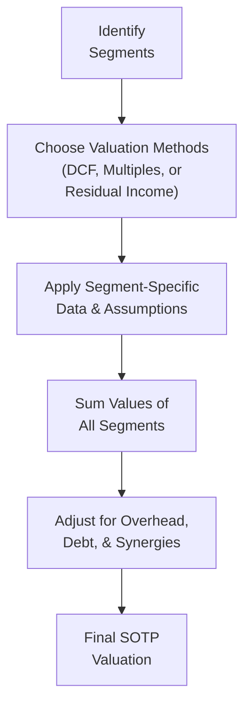

## Introduction

So, you know how some companies are like giant umbrellas covering multiple distinct businesses? Think of a global conglomerate that manufactures sports apparel in one division, runs a media network in another, and maybe even invests in real estate through yet another arm. When a single company runs so many different segments, we often need to value each piece separately and then sum them up to get a clearer picture of overall worth. That’s exactly what the Sum-of-the-Parts (SOTP) method is all about. It’s like a puzzle: you put each segment’s valuation piece in the right place, consider any extra synergy that magically happens when these pieces connect, subtract any corporate-level debt, and—voilà—you get a big-picture valuation.

This article walks us through SOTP step-by-step, detailing when to use discounted cash flow (DCF), relative valuation (multiples), or even residual income for each segment’s unique profile. Because let’s face it: that media network might not have the same risk profile or growth assumptions as the real estate business. And the last thing we want is to mash them together with a single discount rate that doesn’t make sense.

We’ll also take a look at overhead cost allocation, intangible assets, synergy benefits (like cross-selling or brand expansion), and best practices to ensure we’re neither double-counting nor leaving out anything crucial. In my experience, it can be surprisingly easy to slip up—especially if you forget that one segment is carrying the entire group’s brand reputation or if you fail to properly account for each segment’s cost of capital. Anyway, let’s dive in!

## The Sum-of-the-Parts Approach

At its core, the SOTP approach is straightforward:  
1. Identify each discrete segment.  
2. Value each segment on a standalone basis.  
3. Add up these standalone values.  
4. Adjust for debt, overhead, synergies, and intangible or unallocated assets.  

To visualize the broad steps, here’s a quick diagram:

This method acknowledges that different segments can exhibit remarkably different risk, growth, and profitability profiles, so a “one-size-fits-all” approach to valuation doesn’t cut it.

## Identifying the Segments

Identifying the right segments to value might sound trivial, but it’s super important. Under IFRS or US GAAP, publicly traded companies are often required to break out their operations by operating segment if they represent significant parts of the business. However, not all segments in the financial statements are actually relevant for separate valuations—some might be too small or might be combined due to shared operational flows. The key is to isolate segments that truly have different risk-return characteristics or managerial structures.  

When deciding how granular you want to be, keep in mind your ultimate goal: to reflect different drivers of cash flows. For instance, if a conglomerate sells sports apparel and runs a TV network, these two product lines face very different competitive environments, capital needs, and pricing demands, so separate segment valuation is warranted. If there’s a small “other” category that’s immaterial, that might be aggregated.

## Choosing Valuation Methods for Each Segment

After identifying each segment, we decide on the best valuation technique based on industry standards and data availability:

• DCF Valuation (Segment-Specific):  
  Discounted cash flow is often the most robust approach, especially for segments generating predictable cash flows. You’ll forecast free cash flows for a multi-year horizon, apply a segment-appropriate discount rate, and compute a terminal value. Sum them up for the segment’s intrinsic value.

• Relative Valuation (Comparison to Market Multiples):  
  This works well if comparable companies exist for that segment. For instance, if the segment is a luxury apparel business, you might look at the average EV/EBITDA or Price-to-Earnings ratio for peers in the luxury market.  

• Residual Income:  
  For segments where intangible assets or heavy R&D might drive future profits (e.g., a pharma or tech research unit), residual income models can capture value not fully reflected in current earnings. If a segment invests heavily in intangible assets, this method can keep better track of how economics differ from standard operating segments.

Remember that some segments might require a combination of approaches. I recall a friend who was valuing a media conglomerate that also had a streaming service. The streaming side was unprofitable but had high growth, so they used a specialized multi-stage DCF for that segment, while for the stable, ad-based TV business, they used an EV/EBIT multiple. It can get that specific.

## Clarifying Segment-Specific Assumptions

Segments rarely share the same growth rates or cost structures, so be sure to develop distinct assumptions:

• Growth Rates: Reflect demand prospects, competitive dynamics, and each segment’s stage in the life cycle.  
• Profit Margins: The apparel segment’s margins might differ markedly from a brand licensing segment.  
• Capital Expenditures: Some segments might require large ongoing investments, others might be capital-light.  
• Cost of Capital: A biotech R&D unit has a dramatically different risk profile (and hence discount rate) than a stable utility segment.

### Cost of Capital and Risk Premiums

One of the biggest traps is applying the same Weighted Average Cost of Capital (WACC) across all segments. If you’re dealing with a high-growth and high-risk 5G telecom segment and an established consumer goods business, using a single rate for both would overstate one’s value and understate the other’s.

You might assign a segment-specific discount rate by building up from a baseline CAPM approach, then adding or subtracting risk premiums based on the segment’s volatility, operational leverage, and even geographic exposure. For example:


\text{Segment-Specific WACC} = r_f + \beta_{\text{segment}} \times (r_{\text{market}} - r_f) + \text{other risk premiums}


(Where \\( r_f \\) is the risk-free rate, \\(\beta_{\text{segment}}\\) is the segment’s beta, and \\((r_{\text{market}} - r_f)\\) is the market risk premium.)

## Handling Shared Resources and Overhead

Well, here’s a tricky aspect: the corporate parent often provides administrative, legal, IT, or HR services. Some folks are tempted to lump these overhead costs into a single pot and leave them out of segment valuations. But that would inflate segment values if those overhead costs are real and necessary. A best practice is to allocate overhead to each segment in a fair manner—like by revenue, headcount, or usage of corporate resources.

Same goes for intangible brand-building expenses that might spill over from one segment to another. If the parent is launching a big brand campaign that indirectly benefits all divisions, break out how much each segment gains from that brand intangible value.

## Consolidating Valuations: Summation and Post-Calculation Adjustments

After you’ve gone through the mechanics of valuing each segment, you sum up all segment-level valuations. That’s not the end, though. We often have to make a few more adjustments:

1. **Corporate Net Debt:** If there’s debt at the holding-company level, subtract that from the aggregated equity values of the segments to arrive at the total equity value. Sometimes segments might have specific loans assigned to them; if so, that should be factored into the segment’s own valuation.  
2. **Inter-Company Investments:** If one segment invests in another segment, ensure you’re not double-counting.  
3. **Minority Interests:** If some segments are not fully owned, you might need to carve out the portion of net income or cash flows that belong to minority shareholders.  
4. **Unallocated or Intangible Assets:** Certain brand or patent values may not be fully included in standard segment reporting. Possibly you do a separate intangible valuation. Add that after you sum the main operating segments.  

## Synergy Adjustments

So, synergy is that magic sauce that just might make the whole bigger than the sum. If the segments feed off each other—like a media business cross-promoting an apparel brand—there could be additional revenue or cost savings. Identifying cross-selling or procurement synergy can be challenging, but it’s key to capturing a realistic composite valuation.

Typically, synergy is valued by estimating incremental cash flows or cost savings that arise specifically from combining the segments:


\text{Synergy Value} = \sum_{t=1}^{T} \frac{\text{Synergy Cash Flow}_t}{(1 + r)^t}


You then add this synergy value to the sum-of-the-parts total. Make sure you don’t double-count synergy if you’ve already accounted for it in your segment forecasts.

## Special Considerations for Intangible or Unallocated Assets

When intangible assets like brand names, trademarks, or proprietary technologies are not assigned to a single segment, we may need a standalone valuation:

• **Brand Value:** If the brand is a major factor that affects multiple segments (say, a famous parent brand that all segments leverage), you might treat the brand as a separate “segment.”  
• **Patents and R&D:** If your segments conduct R&D under a shared platform, consider the possibility that one segment’s R&D might also benefit others.  
• **Real Estate Holdings:** Sometimes the parent might own multiple properties used by all segments. Valuing them separately can provide transparency, especially if those properties can be sold or redeployed.

## Putting It All Together: A Brief Example

Let’s imagine a simplified conglomerate that has two main segments:

• Segment A: Apparel Business (using an EV/EBIT multiple approach)  
• Segment B: Streaming Media Service (using a multi-stage DCF)  

Segment A Valuation:  
• EBIT of \$200 million  
• Appropriate EV/EBIT multiple: 8×  
• Enterprise Value for Apparel: \$1.6 billion  
• Apparel has \$200 million of net debt specific to that segment, so the segment’s equity value is \$1.4 billion.

Segment B Valuation:  
• Forecast free cash flows over 5 years, growing at 15% in the first 3 years, then 10% in years 4–5.  
• A terminal growth rate of 3%.  
• Discount at 12% to reflect streaming sector risk.  
• Suppose the NPV calculates to \$2.0 billion for the streaming operations.  

Now sum them: \$1.4B (Apparel) + \$2.0B (Streaming) = \$3.4B.  

We also find synergy from cross-promotion: Let’s say we estimate synergy cash flows of \$20 million annually in perpetuity, at the same discount rate of 12%. That synergy alone is worth \$20M / (0.12) = \$167 million (assuming a perpetuity). So, total sum-of-the-parts = \$3.4B + \$167M ≈ \$3.57B.  

Finally, if there’s additional corporate debt of \$300 million at the holding-company level not assigned to any specific segment, we subtract that from the \$3.57B for a net equity value of \$3.27B.  

This simplified example demonstrates the step-by-step nature of SOTP, the difference in methods between segments, and the synergy add-on that can tip the scale.

## Common Pitfalls and Challenges

• **Double-Counting Synergy:** Resist the temptation to bake synergy into each segment’s forecast, then add synergy again at the end.  
• **Misallocation of Overhead:** Not attributing overhead properly can overstate segment values.  
• **Lumping All Segments Under One Discount Rate:** This can severely distort valuations, especially if the segments have vastly different risk profiles.  
• **Forgetting Minority Interests:** If a segment is partially owned, adjust for the share not owned by the parent.  
• **Ignoring Capital Structure Differences Across Segments:** Some segments might hold standalone debt or cash positions.  

## Best Practices and Exam Tips

• **Use the Most Suitable Valuation Approach:** One segment might be prime for a DCF, while another might align with multiples.  
• **Check for Red Flags:** Pay close attention to intangible assets, synergy assumptions, and overhead allocations. Examiners love testing your attention to detail here.  
• **Be Ready to Reconcile with Consolidated Statements:** In item set scenarios, they’ll often provide partial segment data, overhead details, synergy tidbits, and expect you to piece it all together.  
• **Explain Your Assumptions:** On exam day, you can’t just pick a discount rate without justification. Outline your logic.  
• **Manage Your Time on Vignette-Style Questions:** SOTP often involves complex calculations. Keep an organized approach and watch your time.

## Further Reading and References

- Pratt, S.P., & Grabowski, R.J. (2014). Cost of Capital: Applications and Examples. John Wiley & Sons.  
- Koller, T., Goedhart, M., & Wessels, D. (2020). Valuation: Measuring and Managing the Value of Companies. McKinsey & Company.  
- CFA Institute Articles on Determining Segment-Specific Risk Premiums.  
- IFRS 8 Operating Segments and US GAAP ASC 280 Segment Reporting for guidelines on segment disclosures.

These resources go into even more detail on discount rates, synergy valuation, intangible asset considerations, and case studies. In particular, Koller et al. provide step-by-step instructions for building robust SOTP models, while Pratt & Grabowski detail how to handle cost of capital differences among business lines.

----

## Test Your Knowledge: Segment Valuation Mastery Quiz



### Which of the following is a key reason for using a sum-of-the-parts valuation approach?
- [ ] It assumes all segments share the same risk profile.  
- [x] Different segments can have distinct growth and risk characteristics.  
- [ ] It always yields a lower valuation than a consolidated approach.  
- [ ] It is only used when there is no synergy between segments.

> **Explanation:** SOTP is used because each segment may have unique risk, growth, and return characteristics, making a one-size-fits-all approach less accurate.

### In a sum-of-the-parts valuation, what is the main rationale for using segment-specific discount rates?
- [ ] It minimizes overall operating expenses.  
- [ ] It ensures overhead allocations are consistent.  
- [ ] It standardizes valuation across different industries.  
- [x] It reflects the unique riskiness of each segment.

> **Explanation:** Different segments have different betas, industry risks, and capital structures. Hence, each segment’s projected cash flows should be discounted using a rate reflecting its own risk profile.

### Which of the following is the best definition of “synergy” in an SOTP context?
- [ ] The additional expenses incurred when combining two segments.  
- [ ] The net debt of each operating division.  
- [x] The incremental economic benefit from combining segments.  
- [ ] The market risk premium specific to each segment.

> **Explanation:** Synergy arises when the combined segments produce additional cash flows or cost savings exceeding what they would achieve if valued independently.

### When valuing a high-growth technology segment with heavy R&D investments, which approach might be most appropriate?
- [ ] Single-stage dividend discount model.  
- [ ] Simple P/E multiple only.  
- [x] Multi-stage or residual income-based approach.  
- [ ] Asset-based liquidation method.

> **Explanation:** High-growth, R&D-heavy businesses often require multi-stage DCF or residual income models to capture their intangible asset contributions and evolving profit patterns.

### If a conglomerate’s holding company has debt not allocated to any segment, how should this be treated in an SOTP valuation?
- [ ] Ignored entirely since it doesn’t appear in segment-level statements.  
- [ ] Deducted from each segment individually in proportion to its revenue.  
- [x] Subtracted from the total value of the summed segments at the end.  
- [ ] Added to the synergy benefits.

> **Explanation:** Any debt at the holding-company level should be netted out after summing the standalone equity values of the segments.

### What is a potential pitfall if synergy is already reflected in individual segment forecasts?
- [ ] It will reduce the consolidated valuation.  
- [ ] It will cause overhead costs to be underestimated.  
- [x] It may lead to double-counting synergy values in the final sum.  
- [ ] It eliminates the need to adjust for corporate net debt.

> **Explanation:** If synergy is baked into each segment’s projections, adding a separate synergy line again at the end would inflate the overall valuation.

### To avoid overestimating segment value, overhead expenses should generally be:
- [ ] Excluded from the calculation, as they are corporate-level.  
- [x] Fairly allocated to each segment based on a logical driver.  
- [ ] Added after each segment valuation in a lump sum.  
- [ ] Assigned only to the largest segment.

> **Explanation:** Allocating overhead to each segment helps ensure each one accounts for a fair share of corporate costs, preventing inflated valuations.

### A company’s manufacturing division owns its own factories, while the other divisions rent properties from the parent. How should these factories be treated in an SOTP valuation?
- [ ] Not at all; all real estate belongs to the parent.  
- [ ] As intangible assets unrelated to the division.  
- [ ] As synergy benefits gained by the manufacturing division.  
- [x] As part of the division’s asset base, potentially raising its standalone valuation.

> **Explanation:** Any real property directly owned and operated by a segment is typically embedded in that segment’s valuation, reflecting its contribution to the segment’s cash flow.

### A major difference between DCF and a relative valuation approach (e.g., EV/EBITDA) in SOTP is:
- [x] DCF focuses on a segment’s projected cash flows, while multiples rely on comparing financial ratios to peers.  
- [ ] DCF is always more accurate and is never combined with multiples.  
- [ ] Relative valuation is only used for segments with negative cash flows.  
- [ ] Relative valuation cannot be applied to cyclical industries.

> **Explanation:** DCF relies on forecasted cash flows discounted at an appropriate rate, while relative valuation uses market-derived multiples to benchmark a segment’s value.

### True or False: Skeletonizing intangible assets in an SOTP model means completely excluding their value from each segment.
- [x] True  
- [ ] False

> **Explanation:** “Skeletonizing” intangible assets could mean treating them as separate or unallocated. Often, appraisers exclude intangible value from segment-level statements and value it separately to avoid double-counting or misallocation.


