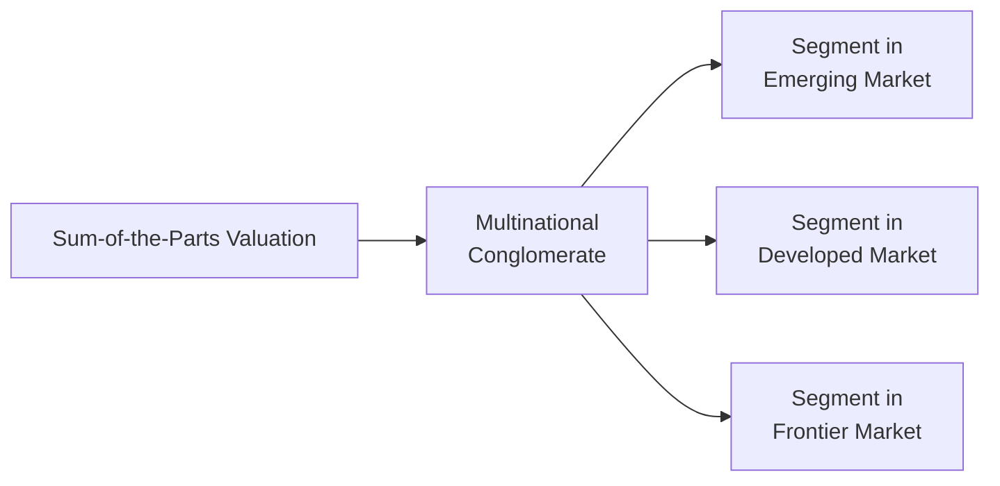

**Introduction**  
So, here we are discussing a fascinating yet tricky dimension of Equity Investments: cross-border and emerging market considerations in sum-of-the-parts (SOTP) valuation. When conglomerates operate in multiple countries—often in both emerging and developed markets—valuation can quickly get complicated. Different accounting standards? Check. Exchange rate uncertainties? Check. Varied political risk and tax obligations? You name it. If you've ever felt like your head might spin off trying to juggle all these variables, well, you're definitely not alone. I once spent two weeks wrestling with a multinational firm’s statements because they had subsidiaries scattered from South America to Southeast Asia, each with its own local idiosyncrasies. It was a puzzle, but super satisfying once all the pieces finally aligned.

Below, let's walk through the essential concepts you need to master for a robust approach to cross-border valuations, especially if you need to break the overall value down by segments or business lines.

## Complexities of Multinational Conglomerates
A single business might be tough enough to value, but dealing with multiple divisions across different geographies is next-level. Each segment can be influenced by:

• Different economic growth trajectories: A stable business in a developed market might offset growth from an emerging region, or vice versa.  
• Varying political conditions: Regulatory shifts, changes in leadership, or policy instability can amplify uncertainty.  
• Diverse accounting standards: You might see IFRS in one region, US GAAP in another, and local GAAP in yet another. Trying to reconcile these can be a nightmare if data is inconsistent.  
• Currency risks: Fluctuations in exchange rates can distort reported earnings, especially if the functional currency is different from the parent’s reporting currency.

It’s crucial to realize that a simple aggregated cash flow forecast might not capture these nuances adequately. That’s where sum-of-the-parts or multi-segment valuation can help you pinpoint specific drivers and risk factors in each geography.

In a chart like this, each segment is valued independently according to local conditions, then aggregated to arrive at the total enterprise value. This approach allows more precise adjustments for currency risk, inflation, regulatory environment, and so on.

## Adjusting Discount Rates for Country- or Segment-Specific Risk
One major question: How do we apply different discount rates for separate segments operating in different countries? Well, we frequently build a sovereign risk premium or a country risk premium (CRP) into our required rate of return for the segment in an emerging market. A typical approach:

1. Start with a base cost of equity for a developed market (via CAPM or a multi-factor model).  
2. Add a country risk premium to reflect political, economic, and liquidity variations.  
3. Adjust further for inflation and exchange rate expectations that differ from your base country’s assumptions.

Mathematically, you might see something like:


\text{Required Return} = R_f + \beta \times (\text{Equity Risk Premium}) + \text{Country Risk Premium} + \text{Other Adjustments}


Where “Other Adjustments” could include additional risk factors such as liquidity or currency risk if not adequately captured by \\(\beta\\).  
Anyway, you want to be sure you don’t double-count. For instance, if you’re using a local market beta that already factors in some of the market’s risk, you may reduce or skip an extra “political risk premium.” Always check your inputs carefully for overlap.

## Taxation and Legal Differences
Cross-border valuations often need a segment-by-segment analysis of various tax regimes. For instance, you could have withholding taxes on repatriated dividends, local compliance costs, and differing corporate tax rates. In some jurisdictions, you might even encounter alternative minimum taxes or special levies on foreign enterprise activities.

A personal cautionary tale: I once factored in a standard 25% corporate tax rate across all segments, only to discover that one particular emerging market subsidiary actually had a 40% effective rate—and an additional 5% withholding when sending dividends back home. That oversight alone almost halved that segment’s discounted value.  
So, try building a clear schedule that lays out each geographic region’s tax environment, how dividend repatriation works, and any legal friction that could hamper cash flow generation:

• Withholding taxes on cross-border income.  
• Differences in capital gains tax if you sell the segment.  
• Transfer pricing guidelines that might shift costs and revenues across borders.  

## Exchange Rate Assumptions and Hedging
Currency fluctuations can easily scramble your valuation. Some broad guidelines:

• Identify the functional currency for each segment. Often, the parent might report in USD, but local subsidiaries use their domestic currency for operational purposes.  
• Forecast how the currency pairs (e.g., EUR/USD, USD/BRL, etc.) might move. If you can find credible forward rates or consensus forecasts, that might be your starting point—though the forecast is, of course, always uncertain.  
• Evaluate hedging strategies or natural hedges. For instance, if a segment exports goods to the US but pays its expenses in US dollars, it might implicitly hedge part of its currency exposure.  
• Incorporate inflation differentials. Emerging markets with higher inflation might see weaker currencies over time.

For discounted cash flow (DCF) modeling, you can convert all local cash flows into a single “home” currency at expected forward rates and then discount them. Alternatively, you can discount local-currency cash flows using a local-currency discount rate and then translate back at the prevailing spot rate. Just be consistent in your approach, and remember that big currency swings might overshadow operating performance changes, especially in high-volatility regions.

## Data Availability and Reliability
Valuing emerging market segments can feel like detective work. Sometimes, annual reports from a local exchange might be only partially translated into English. Or the data might simply be lacking in historical length. If 10 years of data is not available, you might have to approximate volatility or growth rates from peer markets. There's also the possibility of misreporting, especially in certain low-transparency jurisdictions.

Pro tips to navigate data uncertainty:

• Cross-check with third-party sources like the IMF, World Bank, or local central bank data.  
• Consider using region-wide proxies for certain inputs (like inflation or interest rates) if company-level data is incomplete.  
• Look out for off-balance-sheet items that are not standardized across countries.  

## Transfer Pricing and Profit Shifting
Transfer pricing can get complicated because multinationals sometimes allocate profits across regions to minimize taxes. When you’re working on a sum-of-the-parts valuation, it’s tough to figure out the real economic profitability of each segment if internal pricing is artificially set. You might see:

• Costs allocated disproportionately to high-tax regions to reduce total tax bills.  
• Intellectual property transferred to lower-tax jurisdictions, shifting intangible asset revenue.  
• Transfer prices on goods and services sold among subsidiaries that distort local margins.

Even if the overall firm’s financial statements are correct in the aggregate, each subsidiary’s reported profit might deviate from its actual standalone profitability. So be mindful not to double count or misinterpret inflated or deflated margins in your model—you may need to normalize them based on an “arm’s length” pricing assumption.

## Local Market Multiples vs. Global Comparisons
Market-based valuation using multiples such as EV/EBITDA or P/E can differ drastically across regions. In some emerging markets, for instance, P/E ratios might generally be below developed-market averages due to higher perceived risk, lower liquidity, or less investor familiarity. Conversely, certain “hot” emerging segments with high growth expectations might trade at lofty multiples surpassing their developed-market peers.

You’ll likely need to harmonize or adjust these multiples to reflect:

• Differences in regulatory environment.  
• Accounting policy variations (like revenue recognition or depreciation).  
• Liquidity differences and trading volumes in local capital markets.  
• Macroeconomic expectations (is the region on the cusp of a major boom or a cyclical downturn?).

Sometimes it makes sense to weigh local comparables more heavily when analyzing an emerging market subsidiary, but also reference global peers for a broader perspective. Often, a bit of healthy judgment is essential: you might apply a blend of local and cross-border multiples, adjusting for risk premium and liquidity differences.

## Practical Tips for Implementation
• Keep distinct models for each segment: One for the mature developed-market operation, another for the high-growth emerging-market offshoot, etc.  
• Ensure that discount rates reflect local conditions: The underestimation or overestimation of country risk can be one of the biggest pitfalls in cross-border valuations.  
• Normalize data where necessary: Adjust for outliers or incomplete data in the emerging market subsidiaries.  
• Be mindful of synergy: Sometimes, parts of a global conglomerate are more valuable together than in isolation, especially if they share brand platforms or operational know-how.  
• Maintain a scenario-based approach: Stress-test your assumptions for currency moves, political shifts, or spikes in local inflation.

## Common Pitfalls
• Double counting risk premiums in both the discount rate and in the cash flow adjustments.  
• Overestimating or underestimating exchange rate stability.  
• Neglecting local inflation and ignoring the practical complexities of converting nominal local-currency growth to a real foreign-currency basis.  
• Failing to investigate the actual effective tax rates or ignoring repatriation constraints.  
• Blindly applying a single-company multiple across all subsidiaries without acknowledging local market realities.

## Final Exam Tips
On the CFA Level II exam, a cross-border valuation vignette might throw multiple segments at you, each with a distinct risk profile, currency, and growth rate. Be systematic. Jot down:

1. The discount rate for each segment.  
2. The relevant currency assumptions.  
3. Differences in tax or withholding rates.  
4. Potential synergy or transfer pricing issues that might crop up.  

Take a moment to confirm you aren’t mixing up nominal vs. real rates or duplicating risk premiums. And keep an eye out for any clues in the text about local market multiples or the possibility that the examiner wants you to isolate operations as if they stood alone.

## Glossary
• **Sovereign Risk Premium:** The extra return demanded by investors to compensate for possible default risk or policy change by a government.  
• **Functional Currency:** The primary operating currency in which transactions are recorded and financial statements are prepared.  
• **Repatriation of Earnings:** Bringing foreign-produced profits back to the parent company’s home country, often subject to withholding taxes or other limitations.  
• **Emerging Market Factors:** Unique risks associated with less-developed, fast-growing economies, such as political instability, higher inflation, and volatile currencies.  
• **Transfer Pricing:** The practice of setting prices for goods/services sold between subsidiaries in different jurisdictions to allocate revenue and costs across the company.  
• **Market Liquidity:** The ease with which an asset can be traded without significantly affecting its price.  
• **Regulatory Environment:** The framework of laws, rules, and standards that can vary significantly across countries.  
• **Hedging Strategies:** Instruments (like forward contracts or options) used to mitigate currency or interest rate risks.

## References & Further Reading
• Butler, K.C. (2008). *Multinational Finance: Evaluating the Opportunities, Costs, and Risks of Multinational Operations.* Wiley.  
• CFA Institute Publication: “Emerging Market Valuation: Approaches and Adjustments.”  
• OECD, IMF, and World Bank websites for up-to-date macroeconomic data and tax guidelines.  

---

## Test Your Knowledge: Cross-Border and Emerging Market Valuation



### When valuing a multinational conglomerate using a sum-of-the-parts approach, which factor most commonly affects emerging market segments' discount rates?  
- [ ] A single blended cost of capital for the whole firm.  
- [ ] Misalignment of IFRS and local GAAP.  
- [x] A sovereign risk premium to reflect higher country-specific risk.  
- [ ] Uniform corporate tax policies across all geographies.

> **Explanation:** Emerging market segments often require a sovereign risk premium to capture the heightened country-specific uncertainty, political risk, and other macro-level factors not included in a base cost of capital.

### A firm’s subsidiary in an emerging market has cash flows denominated in local currency. The analyst decides to discount those cash flows using a local discount rate and then translate the results into the parent’s currency. Which primary consideration applies here?  
- [x] Ensuring consistency of inflation assumptions between cash flows and discount rates.  
- [ ] Eliminating all foreign exchange exposure by translation.  
- [ ] Simplifying the model by ignoring sovereign risk.  
- [ ] Preventing affiliates from hedging currency risk.

> **Explanation:** When discounting local-currency cash flows, it’s vital to align the discount rate’s inflation assumption with that used in the projected cash flows. You don’t remove currency risk entirely; you merely keep the risk consistent with the local environment and then convert at the spot rate or forward rate.

### Which of the following best describes the role of functional currency in cross-border valuation?  
- [ ] The currency in which the parent’s investors prefer to receive dividends.  
- [x] The currency that most faithfully represents the primary economic environment in which an entity operates.  
- [ ] A standard global currency used in IFRS-based statements.  
- [ ] The official reporting currency mandated by the subsidiary’s host government.

> **Explanation:** A company’s functional currency is determined by where it primarily generates and expends cash, reflecting its principal economic environment.

### Which of these is a frequent complication when assessing segment profitability in a cross-border sum-of-the-parts valuation?  
- [ ] The existence of intangible assets.  
- [ ] Local acceptance of IFRS.  
- [x] Transfer pricing policies that shift profits between subsidiaries.  
- [ ] Availability of five years of operating data.

> **Explanation:** Profit shifting through internal transfer pricing can distort reported profitability at the individual segment level, requiring adjustments for a more accurate valuation.

### An analyst observes that the effective corporate tax rate for a U.S.-based parent company is only 15% on foreign earnings, while the statutory rate in the parent’s home country is 25%. This difference is most likely due to:  
- [ ] Changes in IFRS requiring uniform tax across regions.  
- [x] Withholding tax efficiencies and transfer pricing strategies.  
- [ ] A temporary one-off tax holiday.  
- [ ] Elimination of double taxation through economic treaties.

> **Explanation:** Multinationals often use transfer pricing and withholding tax management to lower their effective tax rate compared to their home country’s standard statutory rate.

### When using market-based multiples to evaluate an emerging market subsidiary, which variable might cause systematic differences from comparable multiples in developed markets?  
- [ ] A higher standard of corporate governance in emerging markets.  
- [x] Lower liquidity and higher perceived risk leading to lower multiples.  
- [ ] Uniform global discount rates.  
- [ ] Fixed exchange rates mitigating currency risk.

> **Explanation:** Emerging market stocks often trade at lower multiples due to lower liquidity, higher perceived risk, and less robust market infrastructure, making direct comparisons to developed-market multiples challenging without adjustments.

### A subsidiary in a fast-growing frontier market has significantly higher forecasted inflation than the parent’s domestic market. Which measure is most critical to incorporate when discounting the subsidiary’s projected cash flows?  
- [x] A nominal local discount rate that aligns with higher local inflation forecasts.  
- [ ] A risk-free rate based on the parent’s home country’s treasury bond.  
- [x] A single real discount rate across all segments.  
- [ ] A lower cost of debt to adjust for rapid growth prospects.

> **Explanation:** High local inflation demands a fitting nominal discount rate that captures the expected inflation in that market. Using a parent-based risk-free rate would underestimate local inflation risk.

### Which scenario may justify adopting a higher beta for the emerging market division than for the developed market division?  
- [x] The emerging division is exposed to significant political unrest and currency volatility.  
- [ ] The emerging division is fully hedged against exchange rate movements.  
- [ ] The emerging division’s major customer base is in developed markets.  
- [ ] The emerging division is subject to uniform international accounting standards.

> **Explanation:** Heightened political and economic volatility typically leads to a higher beta, reflecting higher systematic risk in the emerging market division.

### An analyst converts all future cash flows of a foreign subsidiary to the parent’s currency at forecasted forward rates and applies a single discount rate derived from the parent’s perspective. Which potential pitfall might this approach introduce?  
- [x] Inconsistent treatment of local inflation if the discount rate is not adjusted.  
- [ ] Inability to incorporate synergy benefits across business units.  
- [ ] Double-counting the sovereign risk premium in the cash flows.  
- [ ] Eliminating all currency-related risks from the valuation.

> **Explanation:** You must ensure that converting local-currency cash flows at forward rates and using a parent-based discount rate doesn’t ignore local inflation or economic conditions. Always keep the currency risk treatment consistent.

### Is repatriated earnings withholding tax always applied to subsidiaries’ profits in cross-border valuation scenarios?  
- [x] True  
- [ ] False  

> **Explanation:** Many countries impose withholding taxes on repatriated earnings, although rules can vary widely. Failing to account for these taxes can inflate valuations because post-tax repatriated cash flow is what truly matters.


