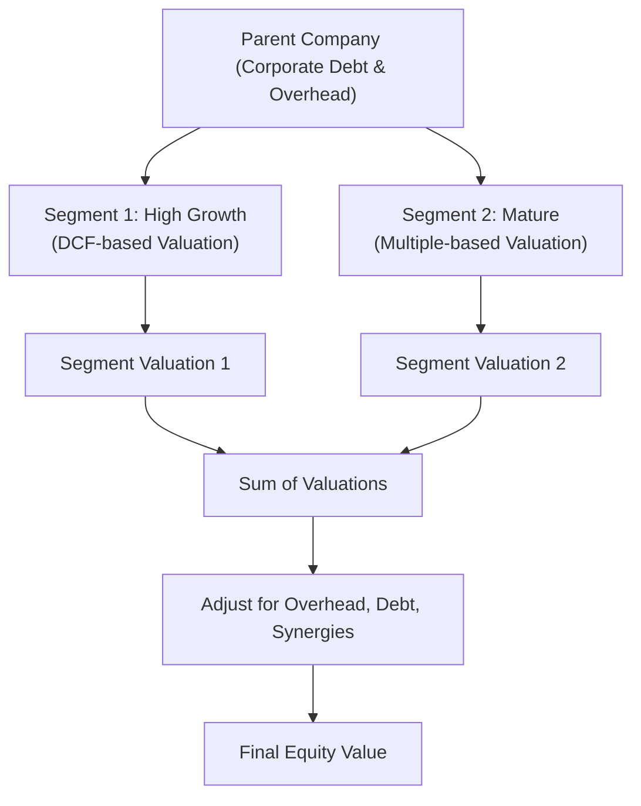

### Reading the Item-Set Carefully
Imagine you’re flipping through a CFA exam vignette on a big, sprawling conglomerate. At first glance, you spot multiple business segments—maybe one is a high-growth tech division, and another is a stable manufacturing arm. Then, there’s a hidden real estate segment quietly earning rental income. You also see scattered references to overhead expenses, a chunk of parent-level debt, and, oh yeah, a little footnote about the possibility of spinning off one segment someday. These details are your roadmap.

In Level II item sets, each piece of information is a potential clue. You might see revenue splits by segment, margin differences, and capital expenditures specified in a table. Perhaps one segment is hammered with high R&D costs, while another is near zero. Or there’s mention of “unallocated corporate overhead” that needs to be fairly split among the various divisions. Your mission? Figure out how to value each segment individually and then stitch those pieces back together to form a coherent total—also known as a sum-of-the-parts (SOTP) valuation.

SOTP can get tricky when you have to incorporate synergy or differences in risk profiles. You’ll also need to keep your eyes peeled for currency issues if, say, the manufacturing arm is operating in an emerging market (for more on that, check out Chapter 24: Equity in Emerging and Frontier Markets).

### Segment-by-Segment Valuation Approaches
In sum-of-the-parts analysis, each segment is treated as if it’s a standalone business. The method you choose—Discounted Cash Flow (DCF), relative valuation, or perhaps an asset-based approach—will depend on the nature of that particular segment.

- High-Growth Segments: For the tech division that’s doubling revenue every year (well, maybe “doubling” is a stretch, but you get the idea)—a multi-stage DCF often fits the bill. You’ll project elevated growth in the early years and taper it down over time. Or maybe you apply a venture-capital sort of approach if it’s a pre-profit startup.
- Mature, Stable Segments: If your manufacturing or consumer goods segments are more predictable, you might do a simpler single-stage DCF or even rely on market-based multiples such as EV/EBITDA or P/E. 
- Niche or Asset-Heavy Segments: Sometimes a segment’s value is mostly in real estate or intangible assets. In that case, an asset-based or residual income approach could be better, especially if cash flows can be lumpy.

And remember to keep an eye on standardization. If you’re using multiples (like EV/EBITDA), check if the peers you’re comparing it to deal with a similar business model, capital structure, and geographic footprint.

### Overhead Allocation and Corporate Costs
One of the biggest sources of confusion in SOTP? Overhead allocations. The corporate parent often centralizes functions such as HR, IT, finance, or marketing. These corporate costs can be hammered out to segments in proportion to revenue, headcount, or segment profit. However, item-set vignettes sometimes bury the overhead allocation policy on page two of the exhibits, or in the footnotes. Don’t skip it.

If you don’t properly allocate overhead, you might overvalue some segments and undervalue others. Or you may forget to consider the portion of overhead that remains even if the segment is hypothetically spun off. Hang on; I once chatted with a friend who mishandled overhead. They assigned all overhead equally, even though one segment was just a tiny fraction of the business. That friend ended up with a wildly inflated valuation for the smaller division. Talk about a costly exam-day slip!

Also, consider corporate debt. If the parent owes a huge chunk of consolidated debt, some portion of that might be related directly to acquiring or funding a particular segment.

### Synergies, Spinoffs, and Potential Premiums
Now let’s talk synergy. It’s not unusual to see a mention of “shared R&D” or “procurement savings.” Sure, synergy can boost consolidated cash flows above the sum of each segment’s standalone forecast. If synergy is significant, you might add an explicit synergy value on top of the individual segment valuations.

On the flip side, spinoffs might increase or decrease value. The exam vignette could hint that the market loves “pure-play” segments because they’re easier to understand. Hence, investors might reward that pure-play with a higher multiple. At times, the synergy that once existed is overshadowed by the “conglomerate discount”—the phenomenon where the market penalizes a firm for complexity. The net effect could be that the spinoff scenario is more valuable. Make sure you read carefully: does the vignette say the spinoff is planned? Is it just an option? Any mention of intangible synergies or intangible dis-synergies should be weighed carefully.

### Cross-Border Segment Considerations
If your conglomerate’s manufacturing segment is in an emerging market, while the tech segment is in a developed market, you might have to apply different discount rates. A higher cost of capital can reflect the elevated political or currency risk in some geographies. Even if the base discount rate is, say, 10% in the developed market, you might add a country risk premium for the segment in the emerging market. Also, watch for currency translation. The item set might present all results in the parent’s home currency or keep them separate. Chapter 24: Equity in Emerging and Frontier Markets delves deeper into these special adjustments.

### Final Steps to Arrive at Equity Value
When you’re done valuing each segment (using the right approach for each), sum them up. This total is your enterprise value for the combined businesses. Then you subtract net debt (all interest-bearing debt minus cash) and any other consolidated liabilities not captured within the segments. If the parent’s management has intangible items or off-balance-sheet obligations lurking somewhere, factor that in too. Finally, you divide the net figure by the number of shares outstanding to arrive at an equity value per share.

Here’s a simplified formula in KaTeX you may find on the exam:


\text{Equity Value per Share} = \frac{\sum_{i=1}^{n} \text{Segment Value}_i - \text{Net Debt} }{\text{Shares Outstanding}}


That’s the gist. But guess what? The item set might have you run a sensitivity analysis. For instance, how does the equity value per share change if the discount rate for the emerging market segment is 2% higher than you initially assumed? Or what if synergy arrives one year later than planned?

### Practical Mermaid Diagram for SOTP
Below is a quick diagram to illustrate the flow of a sum-of-the-parts analysis for a firm with two segments. It’s simplified but should give you a mental image of how these pieces connect.

### Illustrative Example: A Tech and Manufacturing Conglomerate
Let’s say your vignette is about a fictional conglomerate, Titania Corp. Titania Corp. has two primary segments:

• Tech Solutions Segment (40% of total revenue): High growth in revenue and operating margin. Projected free cash flows might justify a multi-stage DCF.  
• Manufacturing Segment (60% of total revenue): Stable margins, slower revenue growth. A relative valuation using EV/EBITDA multiples could work.

Suppose we do the following quick calculations:

• Tech Solutions: A multi-stage DCF gives us an enterprise value of $2 billion (assuming a 12% discount rate in a developed market context).  
• Manufacturing: We apply a 7x EV/EBITDA to an annual EBITDA of $300 million, giving $2.1 billion in enterprise value.  

So far, the sum would be $4.1 billion. But we haven’t allocated overhead or considered synergy. Let’s say the item set indicates Titania’s total corporate overhead is $200 million per year, 70% of which we attribute to the tech division and 30% to manufacturing. Allocating these overhead costs might reduce the standalone valuations or shift them slightly. Additionally, there’s a synergy note: if these units remain together, they share an R&D platform worth $150 million in present value terms. So, we might add that synergy back in if we believe it is incremental to each segment’s standalone value. 

In the end, you might land at a total enterprise value of $4.25 billion. Then, subtract $1 billion of net debt at the parent level, leaving $3.25 billion in equity value. With 100 million shares outstanding, that’s $32.50 per share. That might be your final answer in the item-set question—unless you realize the examiner wants a “post-spinoff scenario,” which juggles overhead differently or removes synergy. Good times.

### Common Pitfalls
- Double-Counting Synergy: Make sure synergy is either fully accounted for in segment-level valuations or added on top overall—never both.
- Neglecting Corporate Debt: If the question states that the parent’s debt is guaranteed by all subsidiaries, that belongs in your final net figure.
- Incorrect Overhead Allocation: Overhead can distort your segment margins. Always check the footnotes for that policy or method. 
- Confusing Currencies: If part of the business is in euros and another in US dollars, confirm the consistent currency for the final sum. 
- Mistaking “Stated” Multiple for “Applied” Multiple: The guide might say a 7x multiple is typical for manufacturing, but your item set might hint that 8x is more appropriate due to a superior brand or an above-average margin.

### Closing Thoughts
Sum-of-the-parts valuation can feel like you’re juggling half a dozen balls in the air at once—DCF, multiples, synergy, overhead allocation, cross-border discount rates, and more. But if you carefully break down each piece, systematically apply the correct approach, and then reassemble them with an eye to synergy, overhead, and consolidated debt, you’ll be well equipped for a typical CFA Level II item set on this topic. Plus, you’ll have a more nuanced perspective on real-world equity analysis. Because let’s be honest: in practice, large, diversified companies aren’t always straightforward to value—yet that’s half the fun.

### Glossary
- **Pure-Play Premium:** Extra valuation that investors might assign to a standalone segment or company focused on a single business line.  
- **Multi-Stage DCF:** A valuation model that accommodates multiple phases of growth; typically used for businesses transitioning from high growth to steady state.  
- **Spinoff:** Restructuring in which a parent firm spins out a subsidiary as an independent entity, distributing shares to existing shareholders.  
- **Overhead Allocation Methodology:** A method for distributing centralized costs (e.g., corporate HR, legal, IT) across multiple business units.  
- **Consolidated Debt:** Debt carried at the parent-company level but supported by the combined creditworthiness of all subsidiaries.  
- **Equity Value per Share:** The total value of equity, net of debt, divided by the number of outstanding shares.  
- **Sensitivity Analysis:** Evaluating how changes in a key assumption (e.g., discount rate, growth rate) affect the final valuation.

### References and Further Reading
- CFA Institute’s Learning Ecosystem, Sample Item Sets for Equity.  
- Chapter 24 of this Volume (Equity in Emerging and Frontier Markets) for discount rate adjustments in volatile markets.  
- Damodaran on Valuation (Aswath Damodaran) for in-depth multi-stage DCF examples.  
- Equity Research Reports from Morgan Stanley, Goldman Sachs, or other sell-side analysts illustrating real-world sum-of-the-parts analyses.  
- “Advanced Financial Modeling and Valuation” courses (various providers) for hands-on training with complex SOTP modeling.

---

## Evaluate Your Understanding: Breaking Down a Multisegment Firm



### Which valuation approach is typically preferred for a rapidly growing tech segment of a conglomerate?

- [ ] Price-to-Book (P/B) Ratio
- [x] Multi-stage DCF
- [ ] Single-stage Constant Growth DDM
- [ ] Excess Earnings Method

> **Explanation:** High-growth segments often benefit from a multi-stage DCF because of their evolving growth patterns and potentially volatile early-year cash flows.

### A CFA item set indicates that a parent company carries $500 million in consolidated debt for its two segments. If you’re performing a sum-of-the-parts valuation for the whole company:

- [ ] Ignore the debt since each segment is valued independently.
- [x] Subtract the $500 million in net debt after calculating segment enterprise values.
- [ ] Apply half of the debt to each segment equally.
- [ ] Treat the debt as overhead expense for each segment.

> **Explanation:** In a sum-of-the-parts analysis, you value each segment independently to obtain total enterprise value, then subtract consolidated net debt at the parent level to arrive at total equity value.

### How might synergies between two segments manifest in the final sum-of-the-parts valuation?

- [x] They may be added as an incremental value on top of each segment’s standalone valuation.
- [ ] They should automatically be accounted for by each individual segment’s EBITDA multiple.
- [ ] They should never be included unless the segments are spun off.
- [ ] They must replace overhead allocations in the final calculations.

> **Explanation:** If synergies aren’t captured in each segment’s standalone calculation, you can add them as a separate incremental value to reflect combined cost savings or revenue enhancements.

### When dealing with an emerging-market manufacturing subsidiary, which additional component might be added to the discount rate?

- [ ] Liquidity risk premium used for developed markets.
- [ ] A negative country risk premium to reflect currency benefits.
- [x] A positive country risk premium to account for heightened political and economic risk.
- [ ] Elimination of the risk-free rate altogether.

> **Explanation:** Valuating a segment in an emerging market typically involves adding a country risk premium to reflect higher uncertainty and potential political or macroeconomic instability.

### Which of the following is a key guideline for allocating corporate overhead in a sum-of-the-parts approach?

- [x] Allocate expenses to each segment based on a justifiable metric (e.g., revenue or headcount ratios).
- [ ] Always spread the total overhead equally among segments.
- [ ] Exclude overhead entirely from segment valuations to simplify calculations.
- [ ] Include overhead only if the segment is profitable.

> **Explanation:** Overhead allocation should match each segment’s consumption of corporate resources, typically measured by revenue, headcount, or another logical cost driver.

### You discover that each segment’s valuation already accounts for certain synergy. To avoid double-counting in the final total, you should:

- [x] Omit adding another synergy figure on top of the segment valuations.
- [ ] Add the synergy again to each segment to reflect increased total value.
- [ ] Deduct synergy from net debt.
- [ ] Distribute synergy costs evenly as overhead.

> **Explanation:** If synergy is already embedded in the standalone valuations, there’s no need to tack on an extra synergy line at the end. Double-counting synergy artificially inflates total valuation.

### A parent company’s overhead cost is $100 million per year. The item set states 80% of overhead is due to the tech segment. In your sum-of-the-parts perspective:

- [x] Deduct $80 million from the tech segment’s cash flows before final valuation, and $20 million from the other segment(s).
- [ ] Subtract the entire $100 million from the manufacturing segment if it’s more mature.
- [ ] Put the entire $100 million in synergy costs.
- [ ] Omit overhead and rely on gross margins only.

> **Explanation:** Overhead should be proportionately allocated to each segment based on the data you have—here, 80% to tech, 20% to the other segments.

### Why might investors view a “pure-play” spinoff more favorably than a diversified conglomerate?

- [ ] Because conglomerates usually have lower overall debt ratios.
- [x] Because pure-plays are easier to analyze and may command a higher multiple.
- [ ] Because synergy is always better in a single segment.
- [ ] Because overhead is inherently lower in a single-line business.

> **Explanation:** Investors often prefer pure-play companies due to clearer financials, more specialized strategic focus, and fewer complexities, potentially leading to a valuation premium relative to a broad conglomerate.

### Which of the following is a potential pitfall in sum-of-the-parts valuations?

- [ ] Using different valuation methods for segments
- [ ] Adjusting for overhead in segment performance
- [x] Failing to properly consolidate or allocate debt
- [ ] Conducting sensitivity analysis on discount rates

> **Explanation:** One common mistake is ignoring consolidated debt at the holding-company level or incorrectly attributing it to the segments, leading to inaccurate equity value calculations.

### True or False: If two segments operate in vastly different industries, it is acceptable to value them using different methods (e.g., multi-stage DCF for one segment and EV/EBITDA for the other).

- [x] True
- [ ] False

> **Explanation:** It’s perfectly valid to mix valuation methodologies if they best reflect the economic realities of each segment. A fast-growing segment may warrant a multi-stage DCF, whereas a stable segment might fit a multiple-based approach.


