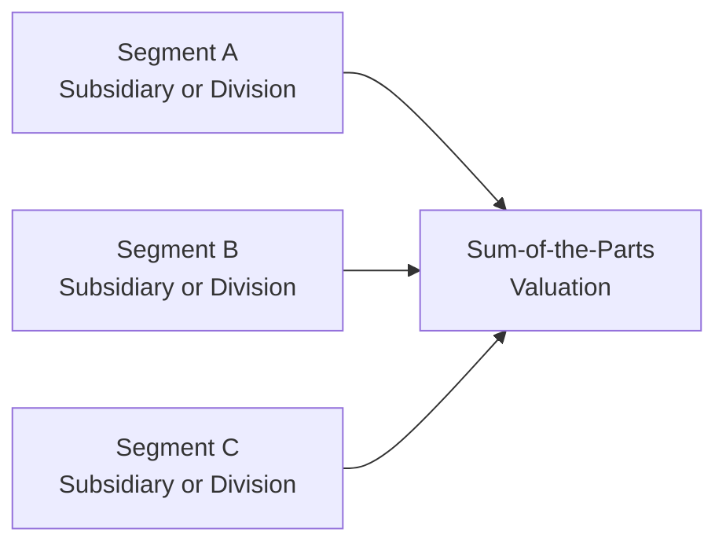

Sum-of-the-parts (SOTP) valuation is a powerful method to assess large, diversified companies—conglomerates, holding companies, or even smaller firms with multiple distinct segments. Rather than relying on a single multiple or a blanket discount rate, an SOTP approach recognizes that each segment, division, or subsidiary can have radically different operating characteristics, risk profiles, and growth trajectories. When done correctly, this approach can zero-in on hidden value or overvaluation. But in practice, it’s easy to slip into pitfalls—double counting an intangible, for example, or missing key overhead adjustments that can significantly skew final results. Let’s dig into these pitfalls, highlight some real-life experiences, and provide practical considerations for ensuring your SOTP valuation remains grounded in reality.

Double Counting or Missing Values  
It’s surprisingly common to either count the same set of cash flows in two places—sometimes because of intercompany transactions that are not eliminated in consolidation—or to omit them altogether. I remember a time—this was before I’d fully embraced the discipline required for SOTP—when I was analyzing a manufacturing conglomerate with four major divisions. Two of those divisions contributed heavily to each other’s production. The top-line revenue in each division’s disclosure initially looked impressive, but about 10% of those revenues were actually coming from internal sales. I almost ended up overvaluing the whole entity by a good margin of 10–15% because I was adding those internal sales again when I aggregated each division’s revenue. It was a “learning the hard way” moment for me.

In general, watch carefully for intercompany transactions such as:  
• Sale of goods or services among segments.  
• Licensing deals and intangible asset “rent” across divisions.  
• Corporate overhead allocations that might be double counted in separate unit budgets.

A straightforward formula for an SOTP approach might look like:

$$
\text{Value}_{\text{SOTP}} = \sum_{i=1}^{n} \left(\text{Value of Segment } i \right) \;-\; \text{Elimination Adjustments} - \text{Corporate Overhead (unallocated)}
$$

Intercompany transactions, shared intangibles, and overhead must be carefully netted out as “Elimination Adjustments” in the final sum so that you are left with a realistic total.

Management Intent and Spinoffs  
Sometimes the biggest intangible in an SOTP analysis is management’s potential plan to either spin off or consolidate business segments. You may see rumors swirl in the press—“Company X is preparing to carve out its consumer business”—and that can swiftly inflate or depress the perceived valuation. The key question is: do you incorporate a spinoff premium (or discount) into your model, or do you assume the current structure remains unchanged?

If synergy benefits remain unexploited within the current structure, you might factor in an upside scenario in which the company reorganizes. Or, if there are cost inefficiencies from housing multiple segments under one roof, you might observe a discount. In practice, it’s helpful to incorporate scenario analysis, especially if rumors and signals from management hint that a spinoff is likely. That said, be careful not to double count synergy or spinoff benefits if you’ve already valued each segment independently with an assumption that synergy is either fully realized or nonexistent.

Reliability of Segment Disclosure  
Not all segments are defined equally. One firm might define “Consumer Products” as an all-encompassing unit that lumps everything from fast-food packaging to premium beverages, while a competitor might separate those lines into multiple standalone divisions. And trust me, if you ever think you’ve fully “mastered” the intricacies of segment reporting, you’ll discover a company that redefines an entire division mid-year or merges two lines with minimal explanation. For that reason, it’s critical to do your due diligence, examine the footnotes meticulously, and confirm that each segment is indeed a coherent unit with consistent reporting practices over time.

In some cases, you might need to reclassify or re-aggregate segments in a way that’s consistent with your valuation purpose. For example, if the footnotes reveal that “Entertainment and Media” includes a small but profitable streaming business and a large, moderately profitable cable network, you might consider a deeper breakdown. That could lead you to apply different multiples (e.g., a higher multiple for the streaming portion than the older cable portion).

Here’s a small diagram to visualize how you might consider various segments in an SOTP framework:



In this simplified diagram, each segment (A, B, C) is independently valued, adding up to D (Sum-of-the-Parts). However, intangible issues such as synergy, overhead, and intercompany transactions require adjustments that might appear as bridging arrows or blocks in a more complex real-world model.

Consistency in Discount Rates  
One major pitfall that can throw off your entire analysis is mixing discount rates across segments without a solid rationale. If, for instance, one segment is in a high-growth market with riskier cash flows (say it’s heavily reliant on new technology or it’s in an emerging market), you’d likely use a higher cost of equity or Weighted Average Cost of Capital (WACC). Meanwhile, a stable utility-like business in a different segment might justify a much lower discount rate. You need to make these distinctions explicit.

On more than a few occasions, I’ve seen analysts forget that the corporate capital structure might not be equally relevant for each segment. If you have one segment that finances itself heavily with its own project-level debt, it’s not accurate to assume a uniform corporate capital structure. Instead, you might adjust the discount rate if that segment is more levered or has riskier debt covenants. The key is not to overcomplicate or oversimplify. Instead, aim for internal consistency and clarity. If you differ from the official corporate structure, note it clearly in assumptions.

Reconciling with Consolidated Financial Statements  
When you sum up the valuations of each segment, it should ideally reconcile to the overall group’s consolidated statements (keeping in mind that inter-segment eliminations and overhead have been appropriately accounted for). For instance, if the total segment-level operating profits drastically exceed the total consolidated operating profit disclosed by the firm, you might be double counting or forgetting about overhead. A quick reasonableness check is to compare key line items:

• Segment-level revenue total vs. consolidated revenue (minus inter-segment sales).  
• Segment-level operating income total vs. consolidated operating income.  
• Aggregated segment-level assets vs. consolidated total assets (once inter-segment items are netted out).

If the differences are large, investigate. Sometimes the culprit is intangible or corporate overhead that was “buried” in a catch-all unit. Other times, it’s an innocent timing difference or mislabeled data. But it’s always worth verifying before finalizing your valuation.

Factoring Intangible Considerations  
In some lines of business, intangible assets like patents, brand equity, or even a robust corporate culture drive significant value. The challenge is that these aren’t always captured perfectly by standard financial statements. You might see the intangible as part of a marketing intangible that’s recognized on the books only if it was purchased in an acquisition. The rest might exist in an intangible “no-man’s land,” leaving you to rely on industry benchmarks or specialized modeling.

If multiple segments rely on the same intangible—for instance, a shared technology platform or brand umbrella—you must decide how to allocate that intangible’s value. Over-allocating to each segment can easily lead to double counting. Conversely, ignoring the intangible synergy can result in undervaluing the business. This intangible synergy can be vital, especially if the synergy is the reason a conglomerate structure makes sense.

Avoiding a Uniform Multiple  
Each segment might warrant its own valuation multiple, depending on the industry outlook, profitability, and risk. Misapplication of one uniform multiple across the entire entity can lead to some truly lopsided results. For example, if you apply a tech-like price-to-earnings (P/E) multiple to a stable but low-growth manufacturing segment, you’re likely overstating that division’s fair value. Conversely, applying a low-growth multiple to a potentially disruptive e-commerce segment could severely undervalue it.

Take the time to compile relevant peer groups for each segment or use an appropriate discounted cash flow (DCF) approach that reflects the unique growth expectations. Even if it feels a little cumbersome, carefully curated sector multiples can be your friend. This is especially important if you’re dealing with companies that straddle multiple industries like healthcare, finance, and consumer staples under one roof.

Practical Steps and Example  
Let’s illustrate the tension between these common pitfalls with a hypothetical scenario:

Say that The Jade Group, Inc. (TJG) operates in three main segments:

• Pharmaceutical Products (Segment P)  
• Fashion Retail (Segment F)  
• Specialty Chemicals (Segment C)  

Segment P might deserve a higher multiple given the robust pipeline of patent-protected drugs. However, an internal R&D center, considered as “Corporate R&D,” is shared by both Pharmaceutical Products (70% of usage) and Specialty Chemicals (30% usage). The intangible synergy is that some chemical research outputs could benefit pharmaceuticals, and vice versa. If you allocate the full cost of the R&D center to Segment P, you may understate C’s overhead. Meanwhile, if you treat brand equity as exclusive to the fashion retail business, you might ignore a potential brand extension synergy that helps sell lifestyle-based prescription products (perhaps a wellness line under the same brand).

To keep it consistent, you might do something like the following:

1. Identify each segment’s revenue, operating income, and assets—both stated and intangible.
2. Trace any inter-segment sales (e.g., chemicals sold from Segment C to Segment P), removing them from the segment-level totals to avoid double counting.
3. Allocate corporate overhead proportionally or based on usage factors if the data is available.
4. Apply appropriate discount rates or multiples for each segment’s discounted cash flow or relative valuation.
5. Adjust for synergy or intangible overlap with thorough documentation.  
6. Sum the adjusted segment valuations and compare the total to consolidated results for reasonableness.  

A small Python snippet can help demonstrate how you might gather and sum these segments while handling overhead:

```python
segment_values = {
    "Pharma": 4500.0,  # value in millions after DCF
    "Retail": 1200.0,
    "Chemicals": 1800.0
}

unallocated_overhead = 300.0

elimination_adjustments = 150.0

sotp_value = sum(segment_values.values()) - unallocated_overhead - elimination_adjustments

print("Sum-of-the-Parts Valuation:", sotp_value, "million")
```

Here, the code sums the individually computed valuations for each segment (in million dollars) and subtracts overhead and elimination adjustments. If done carefully, this approach can produce a more accurate total.

In sum, the big watchword, ironically, is “consistency.” Keep your discount rates, overhead allocations, synergy assumptions, and intangible attributions consistent and well-documented throughout.

References and Further Reading  
• CFA Institute Standards of Practice Handbook: Particularly relevant regarding due diligence and the responsibilities of presenting accurate research.  
• “Complex Corporate Structures and Valuation Issues” (Journal of Applied Finance): Explores real-world cases where segment disclosures are incomplete.  
• Forensic accounting textbooks: Provide tools to detect hidden or misstated items within segment disclosures, overhead allocations, and intangible valuations.

--------------------------------------------------------------------------------

## Key Terms and Pitfalls Quiz



### Which of the following best describes "double counting" in sum-of-the-parts valuations?

- [ ] Recognizing intangible benefits in only one segment.
- [x] Recording the same asset or cash flow more than once in total valuation.
- [ ] Using an inflated discount rate for multiple subject segments.
- [ ] Ignoring intercompany transactions in consolidated accounting.

> **Explanation:** Double counting occurs when an asset or cash flow is accounted for more than once. This can often happen if intercompany transactions or shared intangibles across segments are not carefully eliminated.

### How should corporate overhead typically be treated in an SOTP valuation?

- [ ] Entirely assigned to the largest segment to maintain simplicity.
- [ ] Ignored because it does not directly affect each segment.
- [x] Allocated appropriately to each segment or treated as a stand-alone cost center.
- [ ] Deducted evenly across all segments regardless of usage.

> **Explanation:** Overhead should be allocated or treated as its own line item if necessary. Blindly ignoring or evenly spreading overhead can distort the valuation of each segment.

### When dealing with management’s potential plan for a spinoff, which of the following statements is most reasonable?

- [x] Analysts may consider a scenario analysis to adjust for possible synergy changes or break-up premiums.
- [ ] Plans for a spinoff should never be included until officially announced.
- [ ] The same discount rate applies whether or not a spinoff occurs.
- [ ] A rumor of spinoff automatically doubles the valuation of the rumored segment.

> **Explanation:** A scenario analysis is typically the best route because it allows the valuation to incorporate possible spinoff outcomes without fully committing to them as certainty.

### What is a common approach to reconcile an SOTP valuation with the consolidated financial statements?

- [ ] Assume each segment is self-sufficient and ignore corporate eliminations.
- [ ] Use only GAAP measures without segment-level analysis to avoid confusion.
- [ ] Add up segment values and completely disregard overhead and intercompany transactions.
- [x] Compare aggregated segment revenues, operating income, and assets to the consolidated totals, adjusting for eliminations.

> **Explanation:** Reconciling SOTP results with consolidated statements is critical. The sum of segment-level data should align with the firm-wide picture after proper eliminations and overhead allocations.

### Why might applying a uniform P/E multiple to all segments of a diversified conglomerate be problematic?

- [ ] It simplifies the process without reducing valuation accuracy.
- [x] Each segment may require a distinct multiple reflecting unique risk, growth, and market conditions.
- [ ] Uniform multiples are standard practice in advanced valuations.
- [ ] A single multiple always guarantees an accurate result if drawn from a relevant peer group.

> **Explanation:** Different businesses within a conglomerate often operate in distinct industries, each with its own valuation norms and inherent risk profiles, making a single multiple often unsuitable.

### What is one major sign that a company’s segment disclosures might be insufficient or misleading?

- [ ] The reported sums of segment revenues exactly match the total consolidated revenues.
- [ ] Management frequently highlights synergy between segments in earnings calls.
- [x] The company merges or redefines segments mid-year without clear explanation.
- [ ] The firm’s intangible assets are mostly recognized on the balance sheet due to acquisitions.

> **Explanation:** Sudden or unexplained redefinitions of segment structures without transparent detail can often obscure the actual performance and hamper reliable analysis.

### How can intangible synergies be fairly accounted for without causing double counting?

- [ ] Ignore all synergy so you can maintain a purely segmented approach.
- [x] Clearly identify the shared intangible and allocate its value or benefit appropriately across segments.
- [ ] Add synergy benefits to each segment to ensure robust valuations.
- [ ] Deduct synergy from each segment’s valuation because intangible assets are not on the balance sheet.

> **Explanation:** Shared intangibles, such as brand names or technology platforms, must be allocated carefully, ensuring the synergy isn't counted multiple times in the overall valuation.

### A key consideration when selecting discount rates for each segment is:

- [ ] Using a single WACC for simplicity, reflecting the overall corporate capital structure.
- [x] Reflecting each segment’s unique risk profile and potential capital structure differences.
- [ ] Matching the discount rate to the CFO’s recommended internal hurdle rate.
- [ ] Using the local currency risk-free rate, regardless of the segment’s operations.

> **Explanation:** Each segment may have a different risk profile and capital structure, necessitating a tailored discount rate to avoid a distorted valuation.

### Which of the following describes a proper approach to overhead allocation?

- [ ] Entirely ignoring overhead saves time and doesn’t affect the final SOTP value.
- [ ] Doubling overhead in each segment ensures a margin of safety for synergy.
- [x] Apportion overhead based on segment usage, or treat it as a stand-alone cost in the final SOTP calculation.
- [ ] Roll overhead into intangible assets.

> **Explanation:** Overhead should be carefully allocated to reflect actual resource usage or accounted for as a distinct line item in the SOTP model. Arbitrary or ignored overhead can lead to mispricing.

### True or False: When factoring in rumored spinoffs or restructurings, an analyst must treat such changes as absolutely certain.

- [ ] True
- [x] False

> **Explanation:** Rumors or unconfirmed strategic shifts are best handled using scenario or sensitivity analyses, rather than assumed as inevitable, to avoid overstating or understating the valuation.



--------------------------------------------------------------------------------

Final Exam Tips:  
• Consistency is king. Make sure all assumptions about discount rates, overhead allocations, and intangible assets align with each other.  
• Don’t ignore spinoff rumors, but do treat them with caution—scenario analyses are an excellent tool here.  
• Identify each segment’s unique drivers (risk, growth, intangible benefits) and apply valuation techniques that reflect those drivers accurately.  
• Always remember to reconcile your SOTP approach to the company’s published consolidated statements to catch potential double counting or missing values.  

By weaving these practical considerations into your SOTP valuations, you’ll be well-prepared to isolate the true worth of diverse segments—and that’s a skill that not only helps on exam day but in real-world equity research and investment decisions.
