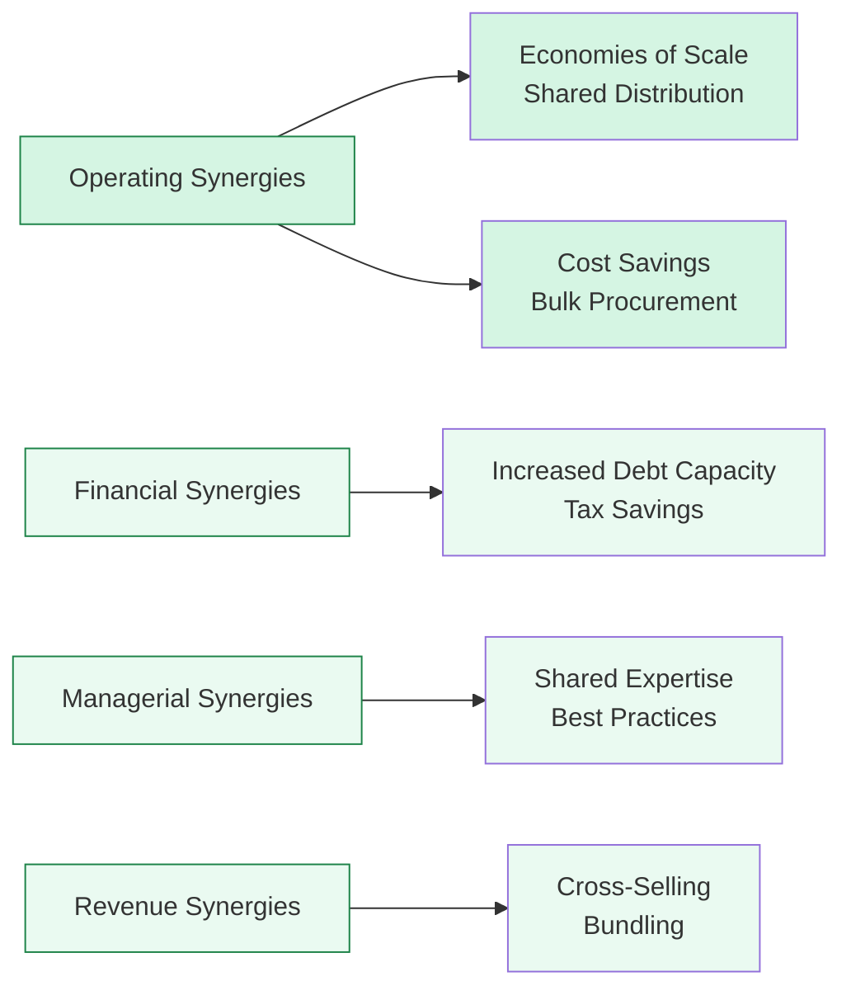

## Exploring Synergies and Overlaps in Segment Valuation

Sometimes—maybe more often than we’d like—the challenge of valuing a conglomerate or multi-segment firm isn’t just about toting up the standalone values of each line of business. There are often hidden overlaps, intangible resource sharing, or cost-saving combinations that can boost or erode overall value. This is where a discussion of “synergies” becomes really important. Synergy can transform an ordinary sum-of-the-parts (SOTP) analysis into a strategic deep dive into how different segments support—or hinder—each other’s performance.

Below, we’ll explore some major categories of synergy, how to estimate synergy-derived cash flows, how potential negative synergy might emerge, and how to fairly integrate these benefits (or drawbacks) into a segment-based valuation.

## Understanding the Four Main Types of Synergies

The term “synergy” is often tossed around casually, especially when discussing mergers, restructurings, or expansions. But synergy is more than a buzzword—it’s about creating incremental value above and beyond what each segment or entity could achieve on its own. Let’s classify the four main types:

### Operating Synergies
Operating synergies often come from sharing resources or infrastructure. You might see:
• Economies of scale: For instance, two divisions in the same industrial group might combine their distribution channels to reduce average shipping costs.  
• Combined logistics or procurement: Purchasing raw materials in bulk sometimes leads to better negotiating power.  
• Shared administrative costs: Instead of two separate HR systems, you merge them into one.  

I remember working with a manufacturing conglomerate that pulled together all its purchasing for raw materials under a single umbrella, shaving millions off annual costs simply by standardizing what had once been scattered orders. Operating synergy is usually (though not always) the easiest to quantify because you often have a direct measure of cost reductions.

### Financial Synergies
Financial synergies hinge on the idea that combining segments can improve the overall capital structure or unlock tax advantages:
• Better debt capacity: If a stable segment’s cash flow can support more debt, the firm might be able to borrow cheaply overall.  
• Tax savings: Certain segments might use losses or credits from others to reduce the overall tax burden.  
• Potential share buybacks: Cash from one segment might be used to repurchase shares if that drives more optimal capital efficiency.

One cautionary note: these synergies heavily depend on jurisdiction and tax policy. Simply going bigger doesn’t always guarantee a reduced weighted average cost of capital (WACC), especially if you end up with a messy corporate structure that lenders view as overly complex.

### Managerial Synergies
Managerial synergies revolve around sharing strategic expertise, specialized knowledge, or leadership acumen across segments:
• Best practices: A high-performing division’s processes or rigorous internal controls might be replicated in weaker segments.  
• R&D collaboration: Tech and pharmaceutical companies frequently pool knowledge to fuel new product development.  
• Streamlined decision-making: A strong leadership team can coordinate strategy across business units, eliminating duplication of efforts.

These synergies can be tricky to measure in purely financial terms. Sometimes, they manifest indirectly as improved quality, elevated employee retention, or better brand reputation. But they can be absolutely crucial.

### Revenue Synergies
Revenue synergies typically arise from cross-selling opportunities or bundling solutions. Examples:
• Cross-selling: A consumer electronics segment might leverage the marketing channels of a media streaming segment to reach a broader audience.  
• Bundled products: A financial services conglomerate could bundle insurance and investment offerings for an all-in-one package.  
• Expanded relationships: Tapping into existing customer relationships in one segment can open new markets for another.

Although revenue synergies can lead to real top-line growth, they’re often the hardest to reliably forecast. Overly optimistic synergy proclamations can derail valuations if they aren’t properly validated or tested with real data.

## Visualizing Synergy Classifications

Below is a simple Mermaid diagram to help summarize these synergy categories:

## Identifying and Quantifying Synergy Value

### Defining Synergy-Derived Cash Flows
A segment’s standalone valuation might miss out on incremental savings or revenue that only arise once it’s combined (or continues to share resources) with another. To quantify synergy, you can project synergy-derived cash flows—an incremental cash flow that wouldn’t exist if the segment were evaluated alone.

### Scenario Analysis
Synergy is rarely all-or-nothing. An important exam tip: model at least three scenarios—best case, base case, and worst case—especially when synergy projections are largely forward-looking:
• Best case: The synergies scale up quickly, and cost savings or revenue gains exceed expectations.  
• Base case: Mid-level synergy realization in line with management’s standard forecast.  
• Worst case: Synergy is delayed or mostly fails to materialize, offering marginal enhancements, if any.

### Discounting Synergy
You can treat synergy-derived cash flows as separate lines in your forecast. In practice, many analysts discount them at the same cost of capital used for the segment. If synergy is uncertain, you might apply a higher risk premium. A typical formula might look like:

$$
\text{NPV}_\text{Synergy} = \sum_{t=1}^{T} \frac{\text{Synergy CF}_t}{\bigl(1 + \text{WACC}\bigr)^t}
$$

If synergy is more speculative (like ambitious cross-selling plans), you might dial up your discount rate a bit, or you might place a probability weighting on the synergy cash flows.

## Potential Negative Synergies

Let’s not forget that synergy can go the other way—unproductive overlaps might create friction:

• Cultural Clashes: If two segments have wildly different work cultures, merging them can cause employee turnover or conflict.  
• Diseconomies of Scale: Sometimes, bigger isn’t always better. Complex, sprawling operations can jack up overhead costs.  
• Brand Dilution: If a premium lifestyle product line merges with a discount offering, brand identity can become muddled.  
• Overlapping Management Layers: Mergers that fail to integrate properly keep redundant structures, creating confusion and inflated SG&A costs.

When we do a sum-of-the-parts, it’s not just about what’s gained—it’s also about what might be lost. Factor in these potential negative sparks. If a synergy is negative, your net synergy flow might become a cost rather than a benefit.

## Reflecting Synergy Realities in Segment Valuations

### Avoid Overinflated Estimates
You might come across an item set in the CFA exam describing a corporate executive who’s “certain” about massive synergy. The trick is to be skeptical. If synergy isn’t actually guaranteed for a segment, don’t inflate that segment’s value. Rely on data, especially if historical figures show synergy hype that never fully materialized.

### Value Add or Value Drag
Conversely, synergy can sometimes push a segment’s value above that suggested by standalone comparisons. Suppose one segment’s product line is a perfect complement to a second segment’s distribution network—that synergy actually lifts both valuations in tandem.

### Allocation of Synergy Across Segments
What if synergy is disproportionately benefiting one segment? That’s often fine, but re-check your overhead cost allocation. For instance, if synergy is all about a manufacturing synergy for Segment A’s new product line, is Segment B contributing costs or resources? This gets complicated, and that complexity should surface transparently in your calculations.

## Overlaps with Shared R&D or Intangibles

Segments might share intangible assets: brand capital, technology licenses, or proprietary processes. Think of a food conglomerate that uses a single brand name for multiple product lines. Overlapping intangible resources might create synergy not easily captured by simple cost or revenue metrics.

• Shared IP: Software or platform technology used across multiple divisions.  
• Centralized R&D: A single research facility could create breakthroughs that benefit multiple product lines.  
• Marketing Synergies: One brand campaign lifts all segments under that umbrella.

Keep an eye out for item-set vignettes where intangible synergy is implied through references to brand expansions or intangible licensing. They can be subtle, but they’re key in uncovering additional value.

## Best Practices for Synergy Analysis in a Sum-of-the-Parts Valuation

• Conduct separate standalone valuations first, so you know the baseline.  
• Identify clear synergy drivers (operational, managerial, financial, revenue) and estimate incremental costs/savings or revenue.  
• Build synergy scenarios (best, base, worst), reflecting different degrees of realization.  
• Discount synergy cash flows at an appropriate rate, factoring in synergy-specific risks.  
• Subtract or add negative synergy costs if synergy is more trouble than it’s worth.  
• Reassess synergy distribution across segments—particularly if intangible resources or overhead allocations are in flux.  

## Exam Tips and Common Pitfalls

1. Overconfidence in Synergy: Don’t inflate synergy estimates without data. The exam might test your ability to second-guess unrealistic forecasts.  
2. Double Counting: Be sure you’re not counting synergy benefits twice across multiple segments.  
3. Failing to Address Time Frame: Some synergies take years to materialize, while cost synergy might appear faster than revenue synergy.  
4. Neglecting Negative Synergy: The exam might highlight subtle cultural or brand conflicts. If you neglect them, you risk an unrealistic sum-of-the-parts output.  

## References and Further Exploration

• Bruner, R.F. (2004). Applied Mergers and Acquisitions. Wiley Finance.  
• “Synergy Realization in Conglomerates: Myth or Reality?” Journal of Corporate Finance.  
• CFA Program curriculum cases on synergy valuation modeling.  

Recommended for additional reading is any up-to-date merger integration guide from consulting firms, which often illustrates real-world synergy pitfalls and best practices.

-----

## Test Your Knowledge: Synergies and Overlaps Quiz



### Which of the following best describes operating synergies across multiple segments?

- [ ] They relate primarily to optimizing the capital structure of the combined firm.
- [x] They occur when combined operations reduce redundant distribution networks.
- [ ] They arise from better capital expense planning or a lower cost of debt.
- [ ] They represent incremental revenue derived from cross-selling activities.

> **Explanation:** Operating synergies typically refer to gains from combining operations, such as shared distribution networks or jointly managing purchasing functions.

### Which synergy is most likely if two segments can pool their operating losses and profits to reduce their overall taxes?

- [ ] Managerial synergy
- [ ] Revenue synergy
- [ ] Operating synergy
- [x] Financial synergy

> **Explanation:** Financial synergy often involves tax advantages, debt capacity, and the overall capital structure.

### A large conglomerate is poised to combine its research teams in an effort to share expertise on new product development. This is primarily an example of:

- [x] Managerial synergy
- [ ] Operating synergy
- [ ] Revenue synergy
- [ ] Control premium synergy

> **Explanation:** Managerial synergy encompasses knowledge sharing, leadership pooling, and R&D collaboration to improve combined effectiveness.

### A sum-of-the-parts valuation may fail to capture synergy when:

- [ ] Each segment is individually valued using comparable multiples.
- [x] The valuation does not consider incremental cash flows arising from resource sharing among segments.
- [ ] The valuation includes a capital expenditure budget item for each segment.
- [ ] The analysis focuses on competitive dynamics within each segment separately.

> **Explanation:** If the SOTP overlooks cost savings or revenue enhancements from combined efforts, synergy goes unaccounted for.

### When projecting revenue synergies, which aspect often makes them harder to forecast than cost synergies?

- [ ] Mixed operating cost data
- [ ] Capital structure complexities
- [x] The uncertain realization of incremental sales
- [ ] The higher discount rate used for synergy

> **Explanation:** Revenue synergies depend heavily on sales and market adoption, often more speculative than directly measurable costs.

### Suppose you model a “best case” synergy scenario. Which discount rate approach is most appropriate for synergy cash flows judged to be more uncertain than the base business?

- [ ] Using a lower discount rate than the base case
- [x] Using a higher discount rate to compensate for increased risk
- [ ] Using the same discount rate, since cost of capital is constant
- [ ] Not discounting these uncertain flows

> **Explanation:** Riskier or more uncertain cash flows generally require a higher discount rate, particularly in synergy scenario modeling.

### Which of the following situations is a common negative synergy often overlooked in mergers?

- [x] Cultural clashes leading to employee turnover
- [ ] A reduction in outstanding debt
- [x] Streamlined management layers
- [ ] Balancing intangible goodwill across segments

> **Explanation:** Cultural misalignment can drive up turnover, hamper productivity, and hurt overall performance—this is a classic negative synergy.

### If one segment disproportionately benefits from a major synergy, which action should an analyst consider?

- [x] Reassessing cost allocation and strategic alignment
- [ ] Stopping the valuation altogether
- [ ] Assigning the synergy solely to the underperforming segment
- [ ] Splitting synergy equally across all segments

> **Explanation:** When synergy is unevenly distributed, verifying that internal cost transfers and overhead allocations are accurate becomes crucial.

### Under which circumstance might synergy estimates be overstated, leading to an inflated overall valuation?

- [x] When management assumes immediate success of cross-selling initiatives without historical evidence
- [ ] When negative synergy costs are weighed more heavily than cost savings
- [ ] When intangible assets are recognized across multiple segments
- [ ] When higher discount rates are applied to synergy cash flows

> **Explanation:** Management’s selective optimism about revenue synergies is a classic cause of overstating synergy. Typically, synergy ramp-up takes longer than projected.

### True or False: A sum-of-the-parts approach always adequately captures synergy for multi-segment firms.

- [x] True
- [ ] False

> **Explanation:** This is a trick question—some might say “False” because synergy is often missed in practice. However, when performed correctly—by adding synergy adjustments to the standalone valuations—the SOTP can capture synergy comprehensively. So, the statement is technically true if the analysis is done properly, but it’s also a cautionary reminder that synergy collection is only as good as the examiner’s thoroughness.


