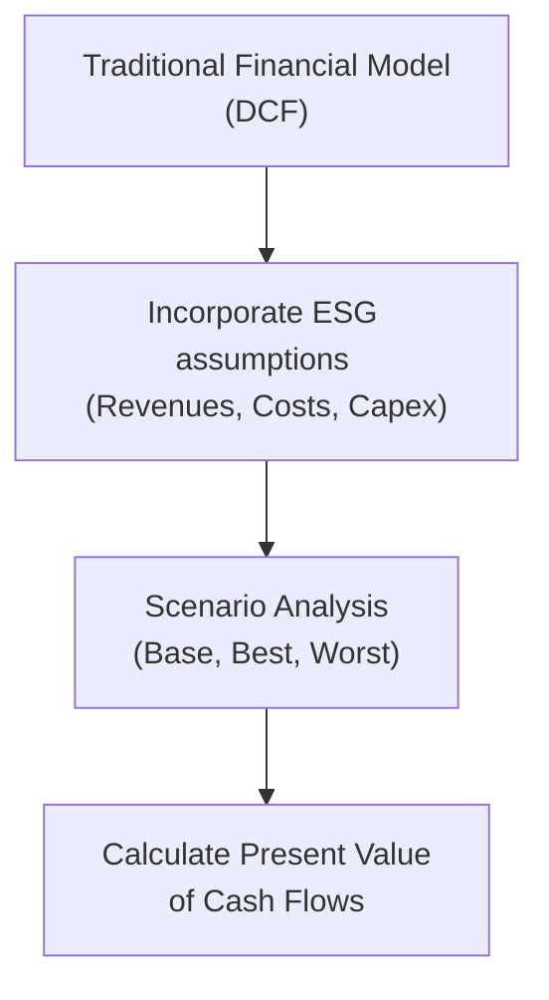

## Introduction

Imagine you’re having coffee with a friend who also happens to be a portfolio manager, and they casually mention how ESG (Environmental, Social, and Governance) factors have become an integral part of their valuation process. You might lean in and ask, “But how do you actually, you know, fold ESG data into your traditional stock valuation models?” That’s exactly what we’re here to walk through. We’ll show you how to systematically adjust revenues, expenses, multiples, and even discount rates to accommodate ESG considerations.

Before diving in, it’s worth recalling that ESG can be both a risk and an opportunity. Solid ESG performance may lead to more robust brand loyalty, better regulatory standing, and loyal customer bases. Conversely, poor ESG metrics can bring lawsuits, fines, and reputational damage. As you move through the content, keep in mind that ESG data is still somewhat messy or incomplete in many cases—so you’ll need to get comfortable with a bit of uncertainty.

## Incorporating ESG in Discounted Cash Flow (DCF) Models

DCF analysis often forms the backbone of equity valuation, anchoring on revenue growth, operating margins, capital expenditures, and terminal value assumptions. So how do we weave in ESG?

### Adjusting Revenue Growth Assumptions

Let’s say you’re analyzing a renewable energy manufacturer that prioritizes sustainability. You might project slightly higher revenue growth compared to industry peers because:
• Customers could favor their eco-friendly products.  
• Regulatory environments may grant them tax incentives.  
• Long-term brand value might steadily improve.  

But if a company faces environmental controversies or social backlash—maybe they’re an apparel firm caught up in labor disputes—then you could dial revenue growth assumptions downward to reflect potential loss in consumer trust or higher compliance costs.

### Factoring in Operating Expenses and Capital Expenditures

ESG can alter both the cost structure and capital investment strategy. For instance, new environmental regulations might impose carbon taxes on heavy emitters, or a company might need to upgrade its machinery to reduce its carbon footprint. On the flipside, better governance might mean improved operational efficiency, thereby lowering some overhead. When projecting cash flows, consider:

• Carbon pricing or environmental fines (if relevant).  
• Additional capital expenditures for cleaner technologies.  
• Energy cost savings from sustainable operations.  

Your best bet is to capture these items in scenario analyses: a base case with moderate ESG impact, a best case where regulation is lenient yet the company invests in green initiatives, and a worst case featuring strict regulations and costly compliance measures.

### Illustrative Diagram of ESG within the DCF

By layering ESG into financial projections, you make the DCF more reflective of a company’s real-world operating environment.

## ESG in Relative Valuation (Multiples)

Relative valuation commonly uses metrics like P/E, EV/EBITDA, or P/B. If you’re doing a comps analysis but ignoring ESG, you might be missing fundamental drivers of future profitability or risk.

### ESG and Comparable Companies

First, you’ll want to narrow your comparable set to companies with similar ESG footprints. For instance, comparing a high-emissions shipping company to a low-emissions player might distort your multiples if the latter has a strong rating for sustainability. Some analysts even refine their search to peers recognized for robust corporate governance—like minimal executive controversies or transparent reporting.

### Impact on Multiples

A firm with exemplary ESG practices might justifiably trade at a higher multiple because:
• Investors perceive lower regulatory or reputational risk.  
• There may be intangible brand value that leads to higher pricing power.  
• Stable labor relations could reduce turnover costs and improve consistency.  

Hence, if you filter out peers with major ESG controversies, you might observe that “cleaner” players trade at a premium multiple, reinforcing the idea that markets are rewarding better ESG performance.

## Integrating ESG Risk in Cost of Capital

The cost of capital—particularly the cost of equity—is sensitive to perceived risk. If a company is embroiled in governance scandals or is heavily reliant on coal (and thus vulnerable to future regulation), analysts might tack on a small risk premium. This incremental adjustment is not always straightforward, but some approaches include:

• Adding a company-specific risk premium in a CAPM-based model if the firm has significant ESG controversies.  
• Incorporating a “general ESG factor” alongside a country-risk premium for companies operating in environmentally sensitive regions.  
• Adjusting the beta if the company’s ESG profile might lead to more cyclical valuations in market downturns.

Remember that ESG risk is not binary. A single data provider might flag governance issues, but upon deeper review, you could decide the severity is lower than it first appears. This is where professional judgment really kicks in. Don’t just blindly add 1% to the discount rate—investigate the nature of the ESG risk and how it might impact the firm’s cash flows.

## Data Challenges and Subjectivity

Sadly, data isn’t always neat and tidy. Sometimes you sense that corporate sustainability reports might be a bit of “greenwashing,” or you notice that a key ESG metric is absent. In these cases:

• Use recognized frameworks such as SASB (Sustainability Accounting Standards Board) and TCFD (Task Force on Climate-Related Financial Disclosures) to standardize analysis.  
• Triangulate from multiple sources—annual reports, third-party ESG data, and directly from management’s investor presentations.  
• Apply conservative assumptions if data is incomplete or contradictory, and be transparent about your assumptions in your valuation notes.

## Limitations of ESG Scores

You might be wondering, “Why not just take an off-the-shelf ESG rating and call it a day?” Because scoring agencies often differ in how they define material ESG issues, weigh them, and gather data. Two agencies may give the same company wildly different ESG scores—so don’t rely on a single rating.

• Always investigate the specific methodology behind ESG scores.  
• Consider how well the agency’s methodology aligns with the industry’s unique ESG drivers.  
• Cross-check multiple scores or review underlying key performance indicators (KPIs).

## Advanced Metrics: Carbon Footprinting and Stranded Assets

If you’re working in energy, heavy manufacturing, or any carbon-intensive field, carbon footprinting can become crucial. You might:
• Estimate future carbon pricing and build added taxes into your operating expense forecasts.  
• Identify the possibility of stranded assets, such as fossil-fuel reserves that might never be extracted due to evolving regulations or shifting demand.  

The idea of stranded assets can dramatically rewrite a company’s terminal value: the once-lucrative assets may effectively become worthless if new environmental legislation or consumer preferences move away from carbon-intensive products.

## Best Practices and Pitfalls

• Be explicit about assumptions: State your carbon price assumption or how you adjusted beta for ESG risk.  
• Balance quantification with qualitative insight: Quantitative data on board diversity is useful, but a deeper read on corporate culture might offer an even better perspective.  
• Don’t over-optimize: ESG data can be patchy, so watch out for false precision.  
• Maintain flexibility in scenarios: ESG regulation is currently evolving—be prepared to re-rate your assumptions swiftly if new legislation passes.

## Glossary

DCF (Discounted Cash Flow):  
A valuation method that projects future cash flows and discounts them back to present value using an appropriate discount rate.

SASB (Sustainability Accounting Standards Board):  
An organization that develops industry-specific accounting standards focused on material sustainability information.

TCFD (Task Force on Climate-Related Financial Disclosures):  
A framework guiding firms on the disclosure of climate-related financial risks.

Stranded Assets:  
Assets (e.g., coal mines or oil fields) that risk losing value before the end of their useful lives because of regulation, market shifts, or technological changes.

Relative Valuation (Multiples):  
An approach comparing a company’s valuation ratios—like P/E or EV/EBITDA—to those of peers to judge fair market value.

Bloomberg ESG Data:  
A widely used database providing ESG metrics, controversies, and ratings for corporations globally.

Material ESG Issue (MEI):  
A factor considered highly relevant (and financially material) by ESG data providers and frameworks.

## References, Suggested Readings, and Links

• CFA Institute Research Foundation: “Climate Change Analysis in the Investment Process”  
• SASB Standards Navigator: https://www.sasb.org/  
• TCFD Knowledge Hub: https://www.tcfdhub.org/  
• Bloomberg ESG Data Solutions  

Feel free to check out these resources for deeper dives. Each reference offers unique insights on how analysts can systematically incorporate ESG factors into valuations and investment decisions. 

## Test Your Knowledge: Integrating ESG Data into Traditional Models



### Which of the following is a primary reason to adjust revenue growth projections for high-ESG companies in DCF models?
- [ ] Lower cost of debt
- [x] Potential for increased demand due to strong brand and sustainability focus
- [ ] Reduced need for capital expenditures
- [ ] Consistent dividend payout

> **Explanation:** Firms with strong ESG practices can benefit from a reputational boost, often resulting in increased demand for their products or services.  

### Which statement best captures how a carbon tax could be incorporated into a DCF valuation?
- [ ] Ignore it since it is a one-time cash flow
- [x] Increase projected operating expenses to reflect carbon pricing
- [ ] Decrease the firm’s beta in the CAPM formula
- [ ] Defer all tax implications to the terminal year

> **Explanation:** Carbon taxes affect operating expenses; they should be integrated into the ongoing cost assumptions in the DCF forecast.

### When using P/E multiples, how can ESG factors justify a higher multiple for a company?
- [x] Strong ESG performance can reduce perceived risk and enhance brand value, potentially raising valuation
- [ ] ESG factors never affect valuation multiples
- [ ] Lower ESG scores typically lead to a higher P/E multiple
- [ ] ESG simply shifts cash flows to later years

> **Explanation:** Good ESG credentials are often seen as reducing long-term risks (e.g., litigation, regulation) and boosting intangible value, leading to higher multiples.

### An analyst wants to incorporate higher governance risk into the cost of equity calculation for a particular firm. Which approach is most appropriate?
- [ ] Excluding governance risk entirely
- [ ] Deducting the risk from the equity risk premium
- [x] Adding a company-specific risk premium to reflect poor governance
- [ ] Lowering the corporate tax rate

> **Explanation:** Poor governance is often reflected by adding a risk premium on top of the firm’s cost of equity or adjusting its beta upward.

### What is a key challenge with relying solely on third-party ESG scores?
- [x] Different providers may use varying methodologies and weightings, leading to inconsistent scores
- [ ] There are no recognized ESG scoring agencies
- [ ] All providers have identical scoring rubrics
- [ ] Scores are strictly governed by IFRS standards

> **Explanation:** ESG scores can lack consistency because rating agencies define and weight ESG factors differently.

### Which scenario best illustrates a “stranded asset?”
- [x] A coal plant that becomes obsolete due to stricter pollution regulations
- [ ] A tech start-up that invests in R&D facilities
- [ ] A software company that upgrades its servers
- [ ] A pharmaceutical firm that invests in new patents

> **Explanation:** Stranded assets lose significant value because of market or regulatory changes—like a coal plant in an era of declining fossil-fuel demand.

### In adjusting multiples for ESG, which step is advised?
- [ ] Disregard ESG altogether and focus strictly on financial statements
- [x] Filter comparable firms to those with similar ESG intensities
- [ ] Use the highest multiple from any peer group
- [ ] Average all multipliers in the industry without adjustments

> **Explanation:** ESG considerations warrant refining your comps to firms with similar ESG profiles to ensure more relevant comparisons.

### How might an analyst address subjectivity in ESG data disclosures?
- [x] Supplement company-reported figures with third-party ESG metrics and multiple data sources
- [ ] Assume all disclosures are accurate and comprehensive
- [ ] Double the discount rate to compensate for unknowns
- [ ] Omit ESG considerations altogether

> **Explanation:** Triangulating from multiple sources helps reduce the risk that any one data set is incomplete or overstated.

### Why should analysts develop different ESG-based scenarios in DCF modeling?
- [x] ESG outcomes can vary widely, so multiple scenarios capture a range of regulatory or market-driven outcomes
- [ ] It is necessary to confuse investors
- [ ] Regulators mandate at least three official scenarios
- [ ] Doing so decreases the accuracy of the model

> **Explanation:** Because ESG-related factors (e.g., carbon pricing, new regulations) can unfold in varied ways, scenario analysis captures the potential range of impacts on valuations.

### True or False: All else being equal, a firm with robust ESG practices often faces a lower cost of capital compared to a similar firm with poor ESG practices.
- [x] True
- [ ] False

> **Explanation:** Firms with strong ESG track records can be perceived as lower-risk investments, potentially reducing their cost of debt and equity.


