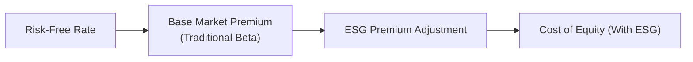

When folks first encounter the question of how environmental, social, and governance (ESG) criteria impact a company’s cost of equity, they sometimes wonder, “Is this really that big of a deal?” Actually, yes! ESG is no longer just an added footnote in fancy corporate presentations. More and more, these factors can shift perceived risk—thus changing the required rate of return on a company’s equity. When we talk about cost of equity, we’re referencing the return investors demand to compensate them for the risks of owning that firm’s shares. Let’s break down why ESG matters so much in setting that required return, how it’s integrated into classical models like CAPM, and what analysts actually do in practice.

Rationale for ESG-Adjusted Risk Premiums  
It’s possible you’ve seen headlines about major oil spills or widely publicized corporate scandals. In those situations, companies faced harsh regulatory fines, legal battles, and a flood of bad press. Suddenly, investors felt uneasy about the firm’s prospects, and the stock price sank. That’s the classic story illustrating the power of ESG in shaping risk. Essentially, if a company is doing poorly on environmental or social metrics, or is governed in a questionable way, it may be riskier:

• Reputational Risks: Slip-ups can spark controversy and negative public sentiment, leading to brand damage and potential boycotts.  
• Legal and Regulatory Risks: Firms with weak adherence to environmental and social guidelines frequently face litigation or fines.  
• Operational Risks: Low employee satisfaction or poor governance oversight can lead to inefficiencies, strikes, and internal fraud.

All these added risk factors may boost the equity risk premium (ERP) that investors demand. On the flip side, strong ESG can insulate a firm from some of these dangers. If you’ve ever had that feeling of trusting a firm more when it invests in green tech, fosters an inclusive culture, or demonstrates real accountability at the executive level, you’re tapping into the same phenomenon. Investors perceive lower risk, so they might settle for a slightly lower return, reducing the firm’s cost of equity.

Theoretical Integration into CAPM  
In the traditional CAPM framework:

(1)  r_e = R_f + β (E[R_m] – R_f)

where r_e is the required return (cost of equity), R_f is the risk-free rate, β is the stock’s beta relative to the market, and (E[R_m] – R_f) is the original market risk premium.

But let’s say we have a firm with a tricky environmental footprint and frequent controversies that aren’t yet captured in market beta. How would we account for that? Well, some practitioners tack on an “ESG adjustment.” In practice, that might look like:

(2)  r_e = R_f + β (E[R_m] – R_f) + α_ESG

where α_ESG indicates the extra cushion investors demand to bear the ESG risk. Picture it like an incremental premium for controversies or poor governance in the same way a smaller, riskier firm might face a size premium. Others might incorporate an “ESG beta” if they believe that ESG factors create systematic (rather than idiosyncratic) exposures. That would shift the formula to something more multifactor-like, with an added factor for ESG risk or ESG momentum.

Expanded CAPM and Multifactor Models  
Some of us are used to hearing about Fama-French’s three- or five-factor models (including size, value, profitability, and investment factors), or Carhart’s four-factor model (adding momentum). Now we see an emerging trend of plugging in “ESG factor” data. The logic goes: if ESG risk or momentum systematically influences a broad cross-section of stocks, it’s a factor worth including. Analysts could do something like:

(3)  r_e = R_f + β_1 (Size Factor) + β_2 (Value Factor) + β_3 (Momentum Factor) + β_4 (ESG Factor) + …

The sign on β_4 might reflect how sensitive a stock is to good or bad ESG news relative to the general market. It’s not quite as widely standardized or academically accepted as, say, the size or value premium, but it is gaining traction. Many factor-based funds have begun offering ESG-tilted products, underscoring their belief that ESG risk/return dynamics matter in explaining stock price movements.

Empirical Evidence on ESG and Cost of Equity  
If you’ve ever read a journal article linking corporate governance to stock performance, you’ll see countless references to how boards with robust oversight, diversity, and shareholder-friendly policies show better risk-adjusted profits. There’s also data suggesting that strong environmental policies (like reduced emissions) can attract a more stable investor base, potentially lowering volatility and narrowing the bid-ask spread—factors that may reduce cost of equity indirectly. But these correlations differ across industries:

• Heavy Industrials and Energy: Environmental factors often dominate. Poor records can mean big lawsuits and cleanup costs.  
• Consumer-Facing Tech: Social controversies like data privacy can become front-page news.  
• Financials: Governance is huge, especially after high-profile misconduct cases or systemic issues that prompt government intervention.

Still, ESG is not a panacea, and some historical data suggests that strong ESG performance doesn’t guarantee higher stock returns. The key takeaway is that ESG can modify risk perceptions (and thus required returns) in meaningful, if not always uniform, ways.

Practical Steps to Incorporate ESG into Required Rate of Return  
Analysts who want to factor ESG into cost of equity typically begin by reviewing the firm’s ESG scores from a recognized rating agency, then adjusting for sector or region. Let’s walk through some common steps:

• Governance Quality: Check whether the board composition is independent, diverse, and transparent. If the board seems to be in the CEO’s back pocket, that’s a major red flag.  
• Social Risks: Maybe a tech firm reliant on user data security has a high chance of data breaches. That could lead to more volatility, so you add a small premium.  
• Environmental Liabilities: This is a big one for mining, manufacturing, or any firm with compliance burdens or carbon taxes. Build in a cost for potential regulation or cleanup.

After identifying these ESG concerns, you might add, say, 50 basis points to the equity risk premium for “below-average” ESG. In a best-case scenario— say, a firm widely recognized for top-notch sustainability— you might subtract some portion of the risk premium.

Sensitivity Analysis on Risk Premium  
Let’s say you’re a portfolio manager analyzing a utility company with a puny budget allocated to upgrading old power plants. The risk is that looming carbon taxes or legal liabilities will force them to shell out big sums for modernization or clean-up later:

• You might model a high-pollution scenario in which new emissions regulations come into force, raising the firm’s cost of equity by an additional 100bps.  
• Another scenario might see lenient regulation or more ESG-savvy improvements, leading to a smaller ESG risk premium.

Those scenario-based adjustments help you see how drastically the Weighted Average Cost of Capital (WACC) might swing. If a few hundred basis points difference in the equity risk premium leads to a big jump in WACC, that might kill an otherwise borderline capital project.

Diagram: Constructing Cost of Equity with ESG Premium  
Below is a simple flow to visualize how ESG fits into the cost of equity:

In this illustration, the additional ESG Premium Adjustment sits on top of the usual CAPM-based computation, reflecting the possibility that certain ESG concerns (or strengths) deserve their own recognition in the cost of equity estimate.

Best Practices, Common Pitfalls, and Strategies  
• Integration, Not Isolation: Don’t just tack on an “ESG factor” as an afterthought. Integrating ESG with fundamental analysis ensures a more holistic view of risk.  
• Avoid Double Counting: If a firm’s carbon liabilities are already captured in its beta (e.g., the entire industry is hammered by carbon taxes), you may not need an extra premium.  
• Data Quality: ESG data can be inconsistent across agencies. A low controversy score in one rating system might be average in another. Cross-check your inputs.  
• Constant Updates: ESG controversies strike quickly—like a data breach that surfaces out of nowhere. Revisit assumptions regularly.  
• Watch the Time Horizon: Some ESG benefits or penalties play out over many years, so consider the long-term discount rate implications in your scenario analysis.

Practical Example—Governance Overlay  
Imagine analyzing a mid-cap consumer goods firm that recently replaced half its board after a major accounting scandal. The new board is highly reputable, with transparent policies and a strong risk-control committee. The market starts pricing this governance improvement into the equity. Over the next year, the firm’s cost of equity might drop from 12% to 11.4%, as investors see lower governance risk. This 60bps difference might seem small, but it can meaningfully bump the present value of future cash flows.

References, Suggested Readings, and Links  
• CFA Institute: “ESG Integration in Equity Analysis and Fixed Income”  
• PRI (Principles for Responsible Investment) Research Library: https://www.unpri.org/  
• Journal of Corporate Finance and Financial Analysts Journal articles on ESG metrics  
• Industry-Specific ESG Frameworks (SASB, GRI)

Test Your Knowledge: ESG’s Impact on Cost of Equity Quiz



### Which of the following best describes how poor ESG performance typically affects a firm’s cost of equity?

- [ ] It decreases the firm’s risk profile by attracting more investors.  
- [x] It increases the firm’s risk profile, raising the required rate of return.  
- [ ] It only affects risk if the firm is in a highly regulated industry.  
- [ ] It has no effect because ESG is not priced in corporate valuation models.  

> **Explanation:** Poor ESG performance heightens regulatory, legal, and reputational risks, which makes investors demand a higher return to compensate.

### A firm with strong governance practices and a diverse board is likely to:

- [x] Benefit from a lower perceived risk, potentially reducing its cost of equity.  
- [ ] Face higher systematic risk due to increased regulatory burdens.  
- [ ] Disregard environmental or social exposures.  
- [ ] Necessarily lose market share to competitors.  

> **Explanation:** Good governance is often seen as a risk mitigator, and investors reward lower risk with a reduced risk premium.

### Which of the following statements is true concerning ESG factors in CAPM?

- [ ] ESG factors are always captured by the traditional beta coefficient.  
- [x] Analysts may add an additional premium or factor to capture ESG-specific risk.  
- [ ] ESG factors only matter if they affect market index weighting.  
- [ ] ESG risks cannot be integrated into asset pricing models.  

> **Explanation:** Many analysts adjust or expand the CAPM framework to incorporate ESG factors that may not be captured in the traditional market beta.

### In multifactor models, an ESG factor:

- [ ] Must always have a positive coefficient to confirm market risk.  
- [x] Is introduced similarly to size or value factors, reflecting systematic ESG-related risks.  
- [ ] Replaces the entire set of macroeconomic factors in the model.  
- [ ] Makes the CAPM calculation irrelevant.  

> **Explanation:** ESG can be added as one among multiple explanatory factors. It doesn’t replace other factors but sits alongside them.

### Empirical studies generally suggest which of the following regarding ESG’s effect on cost of equity?

- [x] Strong governance and environmental performance can lower cost of equity.  
- [ ] ESG factors significantly raise the equity risk premium across all firms, all the time.  
- [ ] There is no measurable relationship between ESG and cost of equity.  
- [ ] Weak social practices always reduce cost of equity.  

> **Explanation:** Broadly, research finds that strong ESG is correlated with lower risk and thus a lower cost of equity, although results may vary by sector and region.

### How might a severe ESG controversy (e.g., major data breach) affect the Weighted Average Cost of Capital (WACC)?

- [x] It may increase the firm’s equity risk premium, thereby raising the WACC.  
- [ ] It has no effect on WACC because it affects only the stock price, not the cost of capital.  
- [ ] It typically reduces borrowing costs for the firm.  
- [ ] It only influences dividend policy and share buybacks.  

> **Explanation:** A controversy signals higher risk, which increases the cost of equity, pushing up WACC if equity represents a substantial portion of capital structure.

### Which statement best represents a potential pitfall in integrating ESG into cost of equity calculations?

- [x] Double counting risk that is already reflected in the firm’s beta.  
- [ ] Considering ESG relevant only for certain industries or regions.  
- [ ] Adding an ESG premium for better environmental practices.  
- [ ] Ignoring negative screening as part of the process.  

> **Explanation:** If the firm’s beta already accounts for the broad industry risks, layering on an additional ESG factor for the same risk might double count it.

### A scenario analysis adjusting for regulatory changes related to carbon emissions is most likely to:

- [ ] Remain independent of any effect on cost of equity.  
- [ ] Overestimate cost of capital in all feasible outcomes.  
- [x] Show that cost of equity might shift under different ESG regimes.  
- [ ] Guarantee a lower required rate of return for high-polluting firms.  

> **Explanation:** Different regulations can elevate or reduce environmental risks, thereby affecting investors’ required return.

### By incorporating an “ESG Premium” into CAPM:

- [x] Analysts can more accurately reflect unique risks tied to poor ESG performance.  
- [ ] The model becomes obsolete for non-ESG-compliant firms.  
- [ ] The risk-free rate is automatically adjusted to reflect sustainability.  
- [ ] Equity risk premiums become negative.  

> **Explanation:** Adding an ESG premium is a flexible approach for capturing ESG-related risks or opportunities that traditional beta might miss.

### True or False: A firm with strong ESG credentials will always have a lower cost of equity than an identical-size competitor without strong ESG credentials.

- [x] True  
- [ ] False  

> **Explanation:** While “always” can be a strong word, in practice, robust ESG profiles often reduce perceived risk relative to identical peers. This can lead to a lower cost of equity, though the magnitude may vary case by case.


