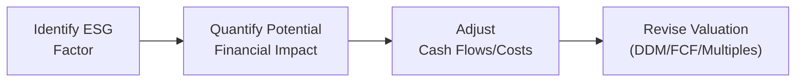

## Introduction and Context

So, tell me something: have you ever gotten that uneasy feeling when a major headline hits about a company's labor or environmental practices, and you think, “Hmm, I wonder how that’s going to impact their stock price?” Well, that’s precisely what we face in ESG (Environmental, Social, and Governance) investing—understanding and quantifying the effect of those non-financial factors on a firm’s intrinsic value. ESG-driven investment cases are integral to modern equity valuation, even more so at the CFA Level II exam stage, where item-set (vignette) questions often incorporate these themes.

ESG can be tricky: environmental regulations might pressure operating costs, or social controversies can lead to reputational damage. But these dimensions can also create opportunities—imagine a surge in consumer demand for sustainably produced products, or improvements in resource efficiency that reduce long-term expenses. In the following sections, we’ll look at a thorough approach to evaluating ESG factors in a typical exam vignette. We’ll walk through an example scenario and highlight best practices (and pitfalls!) that could make or break your analysis.

## Understanding ESG Vignettes

Exam vignettes covering ESG typically weave a story around strategic shifts, regulatory changes, or reputational challenges. The narrative might mention an internal audit revealing environmental mishaps, or fresh commitments to reduce carbon footprints. Your job, as the analyst, is to parse these details for their impact on assumptions about growth, cost of capital, or risk factors.

Often, a vignette will present:

• Background on the company’s industry and competition.  
• Recent ESG-related news or controversies.  
• Management’s response, such as a new sustainability report, an internal correction plan, or a shift in corporate governance.  
• Potential financial statement implications, either immediate (litigation expenses) or longer term (enhanced brand loyalty).

Your challenge is to connect the ESG storyline to tangible financial metrics. After all, the exam expects you to apply fundamental valuation techniques—like dividend discount models (DDM), free cash flow analysis (FCF), or comparable multiples—through the lens of ESG to see where big changes might arise.

## Step-by-Step Approach to ESG-Driven Vignettes

To make sure you capture everything, here is a structured (but slightly informal) approach we can use:

1. Carefully Read the Scenario  
   Pause, take a breath, and read the entire vignette meticulously. Look for social or environmental risks, governance red flags, or any intangible asset mentions (e.g., brand equity, stakeholder trust).

2. Identify ESG Risks and Opportunities  
   Mark up the text. Circle or highlight the parts indicating potential fines, reputational damage, or new markets for “eco-friendly” offerings. These can directly inform changes in costs, revenue growth, or capital structure.

3. Map ESG Factors to Financial Statements  
   • Could forced-labor allegations lead to supply chain restructuring (raising cost of goods sold)?  
   • Will new environmental commitments reduce future energy bills or usage intensity (improving margins)?  
   • Do you need to capture intangible brand damage or a drop in sales in certain markets?

4. Evaluate Impact on Cost of Capital  
   Let’s say the controversy raises the perceived risk—this might add a premium to the discount rate. Or the firm’s improved governance could lower its required return on equity. Consider a small ESG risk premium or discount in your Weighted Average Cost of Capital (WACC) estimate.

5. Adjust Valuation Inputs  
   You might:  
   • Nudge the terminal growth rate lower if you see a negative long-term reputational effect.  
   • Raise or lower the discount rate to reflect the net effect of ESG issues.  
   • Tweak near-term cash flows for litigation costs, compliance spending, or new capital investments in green tech.

6. Reconcile Adjusted and Baseline Valuations  
   Compare your ESG-adjusted valuation to the baseline. How big is the difference? Sometimes it’s a minor margin tweak, but occasionally it’s significant enough to alter the investment recommendation.

7. Document Your Assumptions  
   Exams often reward transparency. If you raise the discount rate by 1% to account for ESG controversies, note your reasoning. Doing so demonstrates that you understand cause and effect rather than adjusting numbers arbitrarily.

Here is a simple flowchart to visualize this:

## Cross-Referencing ESG and Traditional Metrics

ESG analysis doesn’t exist in a vacuum. It should intertwine with fundamental financial measures. You might see:

• Revenue Growth: A brand known for forced labor might lose loyal customers, leading to immediate top-line declines. Or a company recognized for eco-friendly practices might unlock new markets or premium pricing.  
• Margins: Efficiency from sustainable production methods can lower resource usage, potentially raising operating margins. Conversely, ramped-up spending for compliance or reputational damage control can drag margins down.  
• Cost of Capital: Reputation, governance, and sustainability can influence a stock’s systematic risk. Some ESG controversies can lead to higher beta values or default risk, thereby increasing cost of equity or debt.  
• Terminal Value: If the company is forging a stable, sustainable growth path with robust governance, you might justify a slightly higher terminal growth rate (or at least not penalize it as harshly).

A typical error is to overfocus on immediate costs (like fines or restructuring) while ignoring intangible positives, such as stronger brand loyalty. Conversely, it’s equally possible to underestimate how deeply a labor or environmental scandal can affect a brand over the long term.

## Common Pitfalls in ESG Vignette Analysis

1. Ignoring Non-Quantifiables  
   A negative headline can slash a firm’s market value, even if you can’t easily quantify it. Avoid brushing off intangible influences—reputation, brand identity, political tenor—simply because they’re harder to measure.

2. Overgeneralizing Across Industries  
   Not all ESG issues apply uniformly. Mining companies and consumer banks have markedly different risk exposures. For instance, environmental liabilities loom large for miners, while data privacy and cybersecurity may be more pressing governance issues for banks.

3. One-Size-Fits-All Approach  
   It can be tempting to add a standard “ESG premium” to the discount rate for any controversy. But context matters: some controversies might be fleeting or easily resolved, while others may fundamentally alter a firm’s capital structure.

4. Failing to Evaluate Side Effects  
   Sometimes ESG controversies lead to beneficial changes. For example, a forced-labor scandal can spur a major supply chain overhaul, boosting efficiency and transparency. Don’t assume an ESG event is purely negative.

## Example: Forced Labor Allegations and Updated Sustainability Report

Let’s imagine a multinational consumer goods firm, GreenVista, that sells everything from soap to snack bars. GreenVista is suddenly in the media spotlight for alleged forced labor practices in Supplier X located in a developing region:

• Near-Term Reputational Impact  
  News breaks about forced labor. Consumer groups threaten a boycott. Some distribution partners are reevaluating their relationship. Possibly, near-term sales contract 3%–5% in certain regions. Meanwhile, the firm might face regulatory scrutiny.

• Company Response  
  Management issues an updated sustainability report, promising a complete audit of supply chains and stricter labor standards. They also vow to invest in new technologies that track working conditions in real time. These initiatives could cost $20 million in the first year.

• Potential Long-Term Benefits  
  By revamping its supply chain, GreenVista expects to reduce resource wastage by 10%, resulting in $15 million in annual savings starting in Year 3. The better oversight might also bolster brand loyalty among ethically conscious consumers, gradually lifting sales by 2%–3% in that same timeframe.

In a typical exam item set, you might be given:

1. The original baseline forecast for revenues, EBIT margin, and scaling costs.  
2. Additional data illustrating the cost of the new supply chain auditing system.  
3. Customer survey data showing brand perception shifts and willingness to pay.  
4. GreenVista’s cost of equity (e.g., 9%) and after-tax cost of debt (e.g., 4%) to compute WACC.  

Your job: incorporate the new data on forced labor allegations and supply chain improvements. Perhaps you raise the discount rate from 8% to 9% due to heightened risk. You reduce near-term sales growth from 5% to 3% but increase long-term stable growth from 2% to 2.25%, reflecting the efficiency and brand-improvement potential. The net effect is, say, a slight drop in the present value. However, if management effectively implements the new improvements, the valuation might recover or surpass the original baseline in a few years.

## Practical Tools: Sensitivity Analysis and Scenario Testing

Sensitivity analysis is one of the best ways to incorporate ESG factors. Let’s consider performing a simple ±1% shift in the discount rate:

• If WACC is 8%, the DCF-based valuation might be $40 per share.  
• If WACC is 9%, the valuation might plunge to $35 per share.  
• If WACC is 7%, the valuation might bump up to $45 per share.

This tells you how vulnerable the stock price is to changes in perceived risk. On exam day, you don’t always have time for complex modeling, but a quick sensitivity table can highlight the potential range of outcomes under different ESG scenarios. You might see:

| WACC \ Growth | 1.5% TGR  | 2.0% TGR  | 2.5% TGR  |
|---------------|----------:|----------:|----------:|
| 7%            |   $42.00  |   $45.00  |   $48.00  |
| 8%            |   $37.00  |   $40.00  |   $43.00  |
| 9%            |   $33.00  |   $35.00  |   $38.00  |

From this table, you can see that the interplay between discount rate and terminal growth rate can have a dramatic effect on final valuation. You might assume, for instance, that internal reforms to fix forced labor practices will reduce risk in the long run, effectively pushing your WACC back down after a spike.

## Best Practices for ESG Vignette Success

• Always connect the dots between ESG talk and actual numbers in the income statement, balance sheet, or cash flow.  
• Use specific, defensible assumptions (like “I assumed a 1.0% additional risk premium from forced-labor controversy for the next two years, fading thereafter”) rather than vague or indefinite estimates.  
• Don’t be afraid to articulate intangible benefits—like brand loyalty or intangible asset creation—alongside tangible cost savings.  
• If an ESG controversy is industry-specific, leverage any relevant data (like typical remediation costs or competitor best practices) to benchmark your forecast.

## Preparing for Exam Day

• Brush up on standard ESG terminology (e.g., “forced labor,” “Scope 1–3 emissions,” “stakeholder engagement,” “sustainability reporting”). An exam question might test your knowledge of these definitions in addition to your valuation chops.  
• Familiarize yourself with major rating agencies’ approach to ESG scoring—although you might not need extreme detail, it helps to know the general frameworks (like MSCI ESG Ratings or S&P Global ESG Scores).  
• Practice reading item-set questions with layered ESG details. The key is to identify relevant data quickly and not get lost in the narrative.  
• Consider the link between unidentified ESG risks and forecast volatility. A question might hint that you should reflect risk in a higher discount rate or more conservative growth assumptions.

## Summary

It can feel daunting to integrate intangible factors like labor controversies into your valuation. But the process can be surprisingly straightforward once you get the hang of reading vignettes carefully, adjusting discount rates, and modifying growth or margin assumptions. ESG controversies can impose near-term costs but also prompt changes that create long-term benefits. Our job, ultimately, is to weigh all relevant factors—financial statements, intangible brand impacts, and strategic reforms—into a cohesive valuation analysis.

Use the step-by-step approach outlined in this section. In your exam practice, get comfortable with the interplay of discount rate adjustments, near-term vs. long-term effects, and intangible brand or reputational risk. That’s where the real artistry of equity valuation merges with the conscientious perspective of ESG investing.

## Glossary

• Forced Labor Allegations: Social risk that can lead to reputational damage, reduced brand loyalty, and regulatory scrutiny.  
• Stakeholder Engagement: Proactive process of consulting parties influenced by firm actions.  
• Remediation Costs: Funds spent on addressing identified ESG failings, such as settlement fees or compliance upgrades.  
• Integrated Reporting (IR): Combining financial and non-financial (ESG) information into a cohesive report, demonstrating how value is created over time.  
• Terminal Growth Rate: The perpetual growth assumption that influences a firm’s terminal value.  
• Sensitivity Analysis: Evaluating how changes in key assumptions (discount rate, growth, margins) affect overall valuation.

## References and Suggested Readings

• Integrated Reporting Framework:  
  https://www.integratedreporting.org/  
• CFA Exam Tips on Item-Set Question Approaches:  
  https://www.cfainstitute.org/  
• Sustainability Case Studies:  
  The Economist, Financial Times  

## Test Your ESG-Driven Investment Case Analysis Skills



### In analyzing an ESG-related scandal in a consumer goods company, which of the following best describes a first critical step?

- [ ] Estimate the legal fees for potential class-action lawsuits.
- [ ] Immediately lower all future growth assumptions by 50%.
- [x] Read the entire vignette carefully to identify key ESG risks and opportunities.
- [ ] Add a uniform 2% ESG premium to the discount rate.

> **Explanation:** The first step in an ESG-driven vignette question is to gather all relevant information. Thoroughly reading the scenario reveals how ESG factors might affect the company’s financials, rather than making hasty numerical adjustments.

### Management of a retail clothing company announces a sustainable supply chain overhaul, projecting a future 10% reduction in resource usage. Which of the following best describes a potential long-term effect on valuation?

- [x] Improved operating margins and potential brand enhancement.
- [ ] Immediate 50% jump in share price.
- [ ] Guaranteed decline in cost of debt funding.
- [ ] Zero change in intangible brand value.

> **Explanation:** A 10% reduction in resource usage can raise operating margins over time, and brand enhancement may further contribute to higher sustainable growth. Although the effect on share price is not necessarily immediate or as large as 50%, the direction should be positive if the plan is well executed.

### When incorporating forced-labor controversies into your valuation, adjusting which factor is commonly used to reflect increased risk?

- [x] Weighted average cost of capital (WACC).
- [ ] Cash overdraft fees.
- [ ] Non-cash deferred tax liabilities.
- [ ] Quick ratio.

> **Explanation:** The WACC usually captures systematic and firm-specific risk. Allegations of forced labor can raise perceived risk, thus increasing the discount rate.

### If an ESG reform sparks higher brand loyalty, which financial statement line item is most directly affected?

- [ ] Cost of goods sold.
- [ ] Interest expense.
- [x] Revenue growth.
- [ ] Depreciation expense.

> **Explanation:** Enhanced brand loyalty often manifests as increased sales or better retention of customers, directly influencing revenue growth. While cost of goods might be affected by supply chain changes, brand loyalty is more closely tied to top-line performance.

### An analyst is performing a DCF valuation of a firm facing environmental lawsuits. She increases the firm’s discount rate by 0.5% to reflect elevated ESG risk. Which of the following best describes her next step?

- [ ] Postpone the valuation until the lawsuits are settled.
- [x] Document the assumption, explaining how the controversies increase risk perceptions.
- [ ] Set the perpetual growth rate to zero automatically.
- [ ] Add the 0.5% summary bullet in the footnotes only.

> **Explanation:** After changing the discount rate for ESG risk, the analyst should clearly justify this decision, referencing the litigation as a driver of higher risk perceptions.

### Which statement about ESG controversies and cost of debt is correct?

- [x] ESG controversies can influence credit ratings and potentially raise the interest rate on debt.
- [ ] ESG controversies have no effect on the cost of debt, only equity.
- [ ] ESG controversies tend to reduce cost of debt by creating sympathy among lenders.
- [ ] ESG controversies immediately lead to defaults in bond obligations.

> **Explanation:** A controversy can negatively affect creditworthiness, resulting in higher interest rates or difficulty issuing new debt.

### When a firm’s sustainability strategy is expected to yield long-term cost savings, which DCF component is most likely to be adjusted?

- [x] Operating margin in future forecasted years.
- [ ] Dividend payout ratio in the terminal year.
- [x] Depreciation expenses in the near term.
- [ ] Tax rate assumptions for the next quarter.

> **Explanation:** Sustainability improvements can drive future operating margin expansion and might also alter depreciation if new capital expenditures are involved. Short-term changes to the tax rate are less likely tied to sustainability.

### A manufacturing company invests in carbon capture technology to reduce emissions. In a scenario analysis, the analyst includes a “green growth” case. What typically happens to the terminal growth rate in that scenario?

- [ ] It becomes negative to reflect the uncertainties of new technology.
- [x] It may be raised slightly to reflect robust, sustainable long-term potential.
- [ ] It remains unchanged because terminal growth never changes regardless of ESG factors.
- [ ] It is fully offset by an identical drop in near-term earnings.

> **Explanation:** If the new technology fosters more sustainable operations, the analyst might justify a slightly higher terminal growth rate, reflecting stable, environmentally friendly potential for the company.

### Which of the following is a major advantage of factoring ESG aspects into equity valuation?

- [x] It can reveal significant risks or opportunities that may not be immediately apparent in standard financial analysis.
- [ ] It guarantees outperformance in all market conditions.
- [ ] It eliminates all speculative elements from the valuation process.
- [ ] It simplifies the calculation of free cash flow.

> **Explanation:** ESG analysis can bring to light risks and opportunities often overlooked by purely quantitative measures. However, it does not guarantee market outperformance or remove uncertainty entirely.

### True or False: A company that addresses social controversies effectively can lower its WACC over time.

- [x] True
- [ ] False

> **Explanation:** By effectively tackling social controversies, a company can reduce perceived risk among investors and potentially improve its credit rating. The result can be a decline in cost of equity or debt, ultimately lowering the firm’s WACC.


