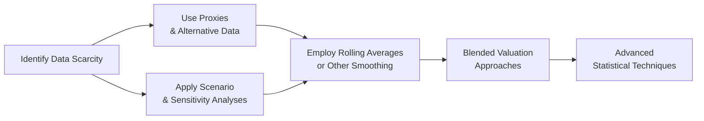

## Introduction
So, you’re trying to value a company in an emerging or frontier market, but you’re stuck with lousy or limited data. Sound familiar? In many of these markets, official economic reports can lag by months or even years, annual statements don’t meet the same stringent requirements you might see in developed markets, and your typical forecast models often just go haywire because of all that volatility. Maybe you’ve tried the usual suspects—growth models, price multiples, or discounted cash flow—and ended up scratching your head because the figures are basically all over the place.

Today, we’re diving into some practical ways to deal with data scarcity and wild market swings. We’ll talk about everything from using proxy indicators and rolling averages to advanced statistical approaches like exponential smoothing or ARIMA. Even wavelet analysis (the fancy stuff!) can show up in sophisticated circles. But honestly, the main goal here is straightforward: help you make reasoned estimates in an environment where data is patchy, inconsistent, and often very volatile. Let’s roll right in.

## Data Scarcity Challenges
You know, it’s one thing to deal with questionable data, but it’s another when data barely exists at all. In a typical frontier or emerging market, you might see:

• Limited Reporting Requirements: Some firms operate under a regulatory framework that isn’t as standardized. They might not publish quarterly financials, and sometimes they skip detailed notes in their annual reports.  
• Patchy Operating Histories: Many companies are young or have only been listed for a few years. Historical financials might only cover one or two economic cycles—if that.  
• Unreliable Macroeconomic Indicators: GDP growth figures could be revised multiple times, inflation data might be subject to political influences, and sometimes the local central bank’s stats are just incomplete.  

The bottom line? You can’t rely on the same robust datasets you might expect in, say, the U.S. or Europe. And guess what happens when you try to apply typical ratio analysis or fundamental forecasting? You get questionable results that might not stand up to real-world conditions.

## Alternative Data and Proxies
When the usual data well is dry, you’ve got to get resourceful. That often means tapping into alternative data sources or using proxies. Here are a few ideas:

### Regional or Sector Proxies
Maybe the firm you’re analyzing won’t give you updated revenue figures. However, you can sometimes approximate their performance from broader regional trends. Let’s say you’re trying to figure out growth rates for a startup microfinance institute in sub-Saharan Africa—if you can at least find good data on regional loan growth or average microfinance penetration, you might infer a ballpark figure for the company’s expansion.

• Example: Using local GDP growth or consumer spending data from a bigger region as a stand-in for a single firm’s revenue trend.  
• Caution: Always consider your proxy’s correlation to the specific firm. Some proxies may be misleading if the company’s business doesn’t align well with the regional average.

### Innovative Data Sources
We live in an age of big data, so you can often gather info from unusual places. Satellite images of parking lots (popular in retail analysis), mobile phone usage data, or even local news scrapes can paint a picture of consumer behavior. I’ve personally come across scenarios where an analyst used freight shipping data to estimate a local port operator’s performance. Sounds a bit crazy, I know, but that’s the nature of frontier markets sometimes.

• Satellite Imagery: Track store traffic, farmland usage, or building development.  
• Mobile Transactions: Estimate how many daily transactions a firm might be handling if it’s in fintech or e-payments.  
• Interviews and Industry Journals: Sure, they might be a bit subjective, but talking to the actual management team or reading specialized local journals can help refine your assumptions.

## Handling Volatility
Let’s face it: even if you scrounge up data, the numbers in emerging or frontier markets often bounce around like a hyperactive dog. Inflation can spike unexpectedly, currency exchange rates can go haywire, and political instability might cause huge capital inflows or outflows at the drop of a hat.

### Use Rolling Averages or Trailing Windows
A common technique is applying rolling averages or trailing data windows. For instance, you might compute a 3-year rolling average for earnings instead of using last year’s earnings. This helps smooth out short-term noise, especially in sectors prone to cyclical peaks and troughs.

If you want to put it into a neat formula, you could represent a rolling average of length \\( m \\) as follows:


\text{Rolling Average at time } t = \frac{\sum_{i=0}^{m-1} X_{t-i}}{m}


where \\( X_{t} \\) is the value of the variable (like earnings or cash flow) at time \\( t \\).

### Scenario and Sensitivity Analyses
All too often, I’ve seen analysts come up with just one “predictive” scenario, only to be left red-faced when actual results deviate drastically. In high-volatility markets, you really want to create multiple potential outcomes—like a best-case, worst-case, and base-case scenario. Then you can see how different assumptions (e.g., inflation at 5% vs. 15%) change the overall valuation.

• Sensitivity Analysis: Tweak one variable at a time (like discount rate or revenue growth) and see what happens.  
• Scenario Analysis: Combine multiple uncertain inputs (e.g., inflation, commodity prices, regulatory changes) to build coherent pictures of the future.

### Blended Valuation Methods
When you can’t pin down a single approach, it sometimes works best to average multiple valuation techniques. Maybe a discounted cash flow (DCF) analysis suggests \\( \$ 100 \\) per share, a comparable P/E method suggests \\( \$ 120 \\), and a price-to-book approach yields \\( \$ 90 \\). You might decide to weigh each approach differently (for example, weighting them by your confidence in the underlying data) and come up with a blended figure.

## Advanced Statistical Techniques
If you’ve got a little more time (and the inclination), there are more advanced ways to incorporate and forecast messy data. Let’s take a quick stroll through some popular choices:

### Moving Average (MA) and Exponential Smoothing
A simple moving average is basically a rolling average, but exponential smoothing adds an extra twist: it places more weight on recent data points. This makes sense in volatile environments where last month’s data might be more relevant than, say, data from two years ago.

### ARIMA Models
Autoregressive Integrated Moving Average (ARIMA) models are a class of time-series forecasting tools that can handle different forms of stationarity. They can be particularly useful when you have enough historical data, but that’s the rub in emerging markets—often you don’t have a lot to play with. Still, if there is enough data, ARIMA can help produce forecasts that factor in autocorrelation (how past data influences future values), trends, and seasonality.

### Wavelet Analysis
OK, wavelets might sound a bit out there, but they can separate time series data into various frequency components—kind of like sifting out the shorter-term noise from the big-picture trend. This might be overkill in many practical settings, but in academic or advanced research roles, wavelet analysis can provide insights into how volatility changes over different timescales.

In the mermaid diagram above, you can see a conceptual flow: first, you recognize data scarcity, then you gather proxies or alternative data. After that, you smooth volatility using rolling averages, run scenario analysis, blend your valuations, and only then consider advanced statistical models if you have enough data depth or expertise.

## Practical Applications and Vignette Emphasis
Let’s bring this to life with a brief scenario. Imagine you’re analyzing Amilli Agro, a small frontier market agricultural firm that’s only been public for three years:

• Historical Data (3 years)  
• Government Crop Yield Stats (delayed by 6 months and frequently revised)  
• International Agencies’ Country Reports (broad, not specific to this sub-district)  
• Management Interviews (optimistic, with minimal supporting detail)

You could approach this exactly as we’ve discussed:

1. Start with broad region-level data on crop output, rainfall patterns, and commodity pricing. Use these as proxies to estimate Amilli Agro’s potential acreage yield.  
2. Conduct a couple of interviews with their CFO regarding recent harvest results and market expansions. Maybe you note that management is bullish about a new irrigation system.  
3. Because of the firm’s short track record and the overall market volatility, consider applying a 3-year trailing average on net income or free cash flow to normalize results.  
4. Build out multiple scenarios. For instance, one scenario might assume normal weather patterns and moderate global grain prices, while another assumes severe drought or a significant fluctuation in commodity prices.  
5. Look at a DCF approach, a price-to-earnings approach using comparable local agribusiness firms, and maybe a price-to-book ratio if the firm’s land holdings are a big part of its asset base. Average them if the data confidence is good.  
6. If you have detailed monthly or weekly data, attempt an ARIMA-based forecasting model for revenue or net income, though be mindful that three years of data might be borderline too little for a robust ARIMA forecast.

## Best Practices and Common Pitfalls
• Over-Reliance on a Single Data Point: Don’t entirely trust the “official” government inflation figure if your own research indicates it’s understated.  
• Failure to Adjust for Political Risk: Sometimes data looks good until a sudden political event changes rules for foreign investors or seizes assets. Incorporate that risk in your discount rate or scenario analysis.  
• Excessive Complexity: It’s tempting to go nuts with advanced models. But if your data is super noisy or incomplete, simpler approaches—like rolling averages and scenario analysis—might actually produce more realistic outcomes.

## Time-Saver Tips for the CFA Exam
• Show your work. On a vignette-based item set, often you’ll have to walk through how you arrived at certain assumptions, especially if the question tries to see if you know how to handle incomplete data.  
• Expect “trick” references to data that might be out-of-date or inconsistent. The exam loves to see if you can figure out which data is actually reliable.  
• Always, always consider qualitative inputs. If you see a question about an analyst visiting the site and noticing unreported expansions, that’s a clue you might need to adjust your model or shift your scenario weighting.

## References and Further Reading
• Bodie, Z., Kane, A., & Marcus, A.J. (2017). Investments (Global Edition). Chapters on international investing.  
• CEIC Data: https://www.ceicdata.com/ – Provides emerging market macroeconomic data.  
• The Journal of Emerging Market Finance – For academic research on frontier market volatility and analysis.  
• CFA Institute Code and Standards – Always relevant for ethical and professional considerations in research.  

## Test Your Knowledge: Handling Data Scarcity and Volatility Quiz



### Which of the following best describes a key challenge in emerging and frontier markets regarding data availability?

- [ ] Overly frequent and detailed reporting that creates information overload.
- [x] Limited reporting history and lax regulatory requirements that result in incomplete data.
- [ ] Excessive transparency from government agencies leading to conflicting macroeconomic indicators.
- [ ] Widespread adoption of IFRS making all firms’ statements nearly identical.

> **Explanation:** In emerging and frontier markets, the main difficulty is not too-frequent reporting, but rather limited data due to lax regulations and short operating histories.

### When company-specific data is unavailable in frontier markets, analysts often use regional GDP growth as a proxy. What is a main risk of using this approach?

- [ ] It’s too narrow in scope and ignores global economic trends.
- [x] The correlation between regional GDP and the firm’s actual business might be low.
- [ ] Regional GDP figures have no predictive power for any firm’s performance.
- [ ] Governments never publish reliable GDP data.

> **Explanation:** When you rely on proxies like regional GDP growth, there’s a real risk that the macro-level indicator doesn’t reflect the unique characteristics of the specific firm.

### A 3-year rolling average is used in time-series data to:

- [ ] Increase volatility based on the most recent year’s performance.
- [x] Smooth out short-term fluctuations and provide a more stable trend.
- [ ] Apply a heavier weight to older data versus newer data.
- [ ] Randomly vary the weighting for each year’s data.

> **Explanation:** A rolling average—or moving average—helps reduce short-term volatility by averaging recent years, providing a smoother measure of performance over time.

### When building scenarios for a frontier market firm, which of the following is usually the best practice?

- [x] Consider multiple uncertain factors like inflation, commodity prices, and political risk together.
- [ ] Only focus on interest rates and ignore all other variables due to their unpredictability.
- [ ] Create a single-page scenario with no supporting calculations.
- [ ] Base scenarios strictly on government “official forecasts.”

> **Explanation:** A realistic scenario analysis in volatile markets incorporates all key uncertain factors rather than only one or two. Official forecasts can be a starting point but are rarely the entire story.

### A blended valuation approach is typically used when:

- [x] The analyst wants to combine multiple valuation methods to offset data quality issues.
- [ ] A firm has no operating cash flows, so a single method like price-to-sales works perfectly.
- [x] Confidence in each individual model is varied, and an average might reduce overall error.
- [ ] Technological compatibility among different models is high.

> **Explanation:** Blended valuations can help mitigate the distortions when one method relies on uncertain inputs. By combining multiple models, the final estimate may be more robust.

### Exponential smoothing compared to a simple moving average:

- [x] Puts more weight on the most recent data points.
- [ ] Ignores the most recent data to reduce volatility.
- [ ] Is a strictly qualitative method of analysis.
- [ ] Eliminates the need for scenario analysis.

> **Explanation:** Exponential smoothing assigns greater weight to the most recent data, which can be particularly useful in volatile markets where new information carries higher relevance.

### Which statement about ARIMA models in the context of frontier markets is most accurate?

- [x] They can handle autocorrelation, but they require ample historical data.
- [ ] They are strongest when the dataset is limited to only a few observations.
- [x] They do not consider past data when forecasting future values.
- [ ] ARIMA models are identical to random walk models.

> **Explanation:** ARIMA checks patterns in historical data (autocorrelation, trend, seasonality) but needs a solid quantity of observations, which can be challenging in frontier markets with short operating histories.

### Wavelet analysis in equity valuation is mainly used to:

- [x] Decompose time-series data into different frequencies to separate short-term noise from long-term trends.
- [ ] Provide a one-step solution for all data-related challenges in frontier markets.
- [ ] Replace fundamental analysis with frequency domain analysis exclusively.
- [ ] Allocate capital across multiple wavelet-based mutual funds.

> **Explanation:** Wavelet analysis breaks data into various frequency components, revealing multi-scale patterns in volatility or returns—though this is often more academic than mainstream for day-to-day valuation tasks.

### Which of the following is a common pitfall when dealing with volatile frontier market data?

- [x] Relying on a single, potentially bias-laden data source without cross-verification.
- [ ] Using multiple data sources and cross-checking for consistency.
- [ ] Incorporating scenario and sensitivity analyses into the valuation model.
- [ ] Combining official data with management disclosures and third-party estimates.

> **Explanation:** The biggest red flag is taking just one data source at face value, especially if it’s politically influenced or not updated regularly. Always cross-verify.

### Frontier market volatility can be partially mitigated by employing which of the following techniques?

- [x] True
- [ ] False

> **Explanation:** Rolling averages, scenario analyses, using blended valuations, and advanced forecasting models can all help reduce the impact of extreme volatility on an analyst’s valuation models.


