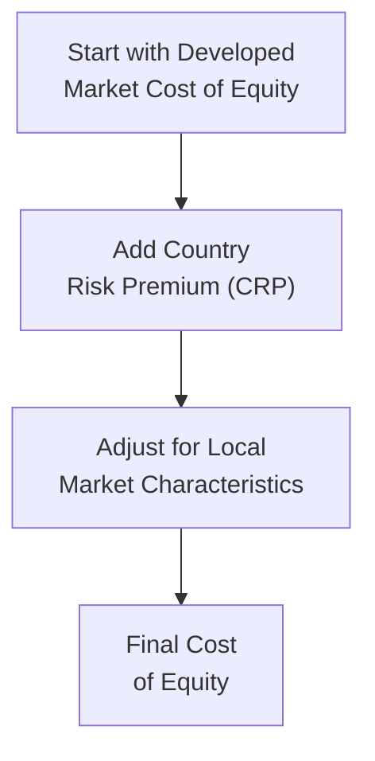
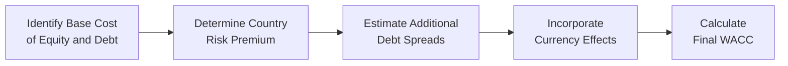

## Overview

If you’ve ever found yourself browsing through potential investments in an emerging market and thought, “Well, I know the returns might be high, but am I forgetting something about the added risk?”—you’re definitely not alone. Many analysts, including me, have had that initial burst of excitement before realizing we need to bake in the extra uncertainties arising from political shifts, currency volatility, and sometimes the general unpredictability of new or less-developed markets. This is precisely where the concept of adjusting your weighted average cost of capital (WACC) for country risk steps into the spotlight.

One of the best ways to ensure you're capturing all those extra risks is by incorporating a Country Risk Premium (CRP). This premium is commonly added to the cost of equity, but you may also need to adjust your cost of debt if local markets are thinly traded or if you’re borrowing in a different currency. Below, we’ll detail the methods you can use to estimate CRP and show how it integrates into your WACC calculations. By the end, you should feel a bit more comfortable tackling valuation questions in this space, whether they come in the form of real exam item sets or real-world pitches from your next potential client.

## Understanding Weighted Average Cost of Capital

WACC represents the overall cost of financing for a firm (or project), combining both equity and debt. Conceptually, it’s the discount rate you’d use to value future cash flows of a company (or project) if there were no additional complications—like country risk. In mathematical form:


\text{WACC} = w_d \times r_d \times (1 - t) \;+\; w_e \times r_e


• \\(w_d\\) is the proportion of debt in the capital structure.  
• \\(r_d\\) is the required return (cost) on debt.  
• \\(t\\) is the corporate tax rate.  
• \\(w_e\\) is the proportion of equity in the capital structure.  
• \\(r_e\\) is the required return (cost) on equity.

When the company or project you’re valuing is in an emerging or frontier market, that little \\(r_e\\) (cost of equity) and sometimes \\(r_d\\) (cost of debt) might need a special add-on: the country risk premium. 

## Incorporating Country-Specific Risk in WACC

A country risk premium aims to reflect the inherent risks of doing business in places where political, economic, or market instability can be significantly higher than in developed regions. This risk can manifest in many ways—think policy shifts, currency controls, civil unrest, or unexpected central bank measures. 

In the simplest approach, the cost of equity for an emerging market can be expressed as:


r_e = R_f + \beta \times \text{(Equity Risk Premium)} + \text{CRP}


• \\(R_f\\) is the risk-free rate, typically proxied by a developed market’s government bond yield (like the U.S. Treasury).  
• \\(\beta\\) measures the sensitivity of the asset’s returns relative to a broad market index.  
• \\(\text{Equity Risk Premium}\\) is the additional return over the risk-free rate required by equity investors for investing in a typical developed-market index.  
• \\(\text{CRP}\\) is the country risk premium, which provides compensation for the incremental macro and political risks of the local market.

You might have to get creative for \\(r_d\\) as well if local debt markets are illiquid or if you suspect the yield curve doesn’t fully capture inflation or default risk. In such cases, a globally recognized benchmark plus a country-specific spread might be more realistic.

## Methods to Estimate the Country Risk Premium

There’s a whole suite of methods to derive a CRP. Let’s look at the most commonly used ones:

Sovereign Yield Spread Method  
• Compare the yield on the country’s long-term government bond with that of a “safe” benchmark, typically the U.S. Treasury.  
• The difference (the spread) is taken as a proxy for the additional country risk.  
• Some analysts scale it by equity-market volatility ratios, while others simply tack it on, depending on their preferred methodology.

Credit Default Swap (CDS) Spread  
• The CDS spread for a sovereign is like an insurance premium on the country’s debt.  
• A higher CDS spread implies a higher perceived credit (default) risk.  
• Many analysts directly add the sovereign CDS spread to their developed-market-based discount rate because it’s driven by real-time market assessments.

Relative Equity Market Volatility  
• You can scale a base equity risk premium by the ratio of the local market’s volatility to a developed market’s volatility.  
• For instance, if the local market is 1.5 times more volatile than a well-known developed market index, you multiply the baseline equity risk premium by 1.5.  
• That difference between the “scaled” equity premium and the base premium can serve as your CRP.

### Visual Overview

Below is a simple Mermaid diagram illustrating a procedure for building up a cost of equity in an emerging market:

The box B is where you introduce the CRP—either based on a sovereign yield spread, CDS spread, or relative market volatility. Node C emphasizes that you should still check local nuances such as liquidity or special regulations before finalizing in D.

## Adjusting for Foreign vs. Local Currency Debt

One subtlety in frontier and emerging markets is whether a company’s debt is denominated in local currency or in a major foreign currency (e.g., USD or EUR). Here are a few considerations:

• Local currency debt:  
  – Often carries higher nominal interest rates, especially if the country has an inflationary environment.  
  – Government controls or subsidies may distort the nominal rates.  
  – Currency risk becomes more relevant to foreign investors if local currency swings are unpredictable.

• Foreign currency debt:  
  – Can be cheaper in nominal terms if denominated in a stable currency like the U.S. dollar.  
  – Exposes the borrower to currency mismatches if the firm’s cash flows are predominantly in local currency but debt service is in USD.  
  – Might tie into sovereign or corporate credit ratings from major global agencies.

Practical experience: A friend of mine once tried to finance a large infrastructure project in a developing country. Their local interest rates were double-digit, so a U.S. dollar loan looked super attractive at first glance. But the local currency was volatile, and over time it depreciated significantly, making debt service drastically more expensive in local currency terms—an unpleasant surprise if you’re receiving local-currency revenues.

## Advanced Considerations and Multi-Factor Approaches

Sometimes, a single CRP just doesn’t feel precise enough—especially for a large-scale, multi-year investment. Analysts might break down risk factors individually. For instance, you might say:

• \\(r_e = R_f + \beta_1 \times (\text{Commodity Price Risk}) + \beta_2 \times (\text{Political Stability}) + \ldots + \text{Base Equity Premium}\\)

You effectively itemize each major risk factor. If your project is heavily reliant on oil exports or certain capital flows, you can attempt to isolate that dimension rather than lump everything into a single CRP. 

Another advanced approach might be to convert all project cash flows into a stable currency (e.g., USD) via forward or futures markets, then discount at rates close to the developed market WACC. Of course, the cost and feasibility of hedging currency or inflation risk can be quite high, so be sure to reflect those hedging costs in your final model. 

### Potential Pitfalls

• Double Counting: Watch out for inadvertently adding the same risk factor twice, particularly if you use both a CRP and a significantly inflated beta.  
• Ignoring Local Inflation: Even if your real returns look good, local inflation can erode real purchasing power—and your project’s effective returns.  
• Liquidity Mismatches: Thinly traded local markets can distort yield or equity volatility measurements.  
• Single-Year vs. Multi-Stage: For multi-year projects, country conditions can evolve significantly, so a static CRP might not fully capture risk changes over time.

## Glossary

WACC (Weighted Average Cost of Capital):  
Overall cost of capital from all sources, weighted by their proportion.

Cost of Equity:  
The return required by shareholders, often calculated with models like CAPM plus a country risk adjustment.

Cost of Debt:  
The effective rate paid on borrowed funds, reflecting default risk and interest rate environment.

Sovereign Credit Rating:  
Rating agencies’ opinion on the creditworthiness of a government. It influences local interest rates and corporate borrowing costs.

CDS (Credit Default Swap) Spread:  
Cost to insure against a bond issuer’s default; used to measure perceived credit risk in real time.

Relative Market Volatility:  
Ratio of the local market’s standard deviation of returns relative to that of a developed market.

## Exam Relevance and Tips

For the CFA Level II exam (and in real life, too), you might see vignettes describing a project in an emerging market. They’ll provide details like the local risk-free rate, market volatility figures, or sovereign bond yields. Your job is to demonstrate that you know which premium to add (and why) to your cost of equity and possibly how to adjust your cost of debt. 

• Read the vignette carefully to see if the exam is nudging you toward the sovereign yield spread approach, the CDS approach, or a relative volatility approach.  
• Always confirm if you should use local or foreign currency discount rates.  
• Check for hints about hedging or currency mismatch issues.

## Real-World Example

Imagine you’re analyzing a consumer goods manufacturer in a frontier market:  
• You look up the local 10-year government bond yield and compare it to the yield on a matched-maturity U.S. Treasury bond. The difference is say 9%.  
• You realize the local market’s volatility is about 1.4 times that of the S&P 500. If the standard equity premium is 5%, your scaled-up equity premium is 7% (i.e., 5% × 1.4).  
• Depending on your preference, you might pick the yield spread (9%) or you might use the difference in volatility (2% as an “extra” add-on to your normal equity risk premium). Then you incorporate it into your cost of equity.  
• For the cost of debt, you might see local corporate bonds trading at yields 3% above local government debt, so you add that on top of the government bond yield. Alternatively, if you suspect the local benchmark is deeply flawed, you could take a global bond yield in euros or U.S. dollars and then add a spread that accounts for the currency mismatch.

## Mermaid Diagram: Integrating Country Risk into Overall WACC

## References and Further Reading

• Damodaran, A. (2012). “Estimating Risk Parameters for Frontier Markets.”  
• CFA Institute Publications on emerging market discount rates:  
  – https://www.cfainstitute.org  
• Moody’s, S&P, Fitch: For sovereign ratings and research reports.  

## Test Your Knowledge: Adjusting WACC for Country Risk in Emerging and Frontier Markets



### Which component of the WACC formula typically includes the Country Risk Premium (CRP)?

- [ ] The debt component only
- [x] The cost of equity
- [ ] Both the cost of debt and equity, equally
- [ ] The tax rate

> **Explanation:** Analysts typically add the CRP to the cost of equity. Cost of debt may also need an adjustment, but in practice the main explicit addition of a CRP is in the equity portion, where risk is most sensitive to market volatility.

### You are valuing an emerging market company. The local yield curve is not well-developed. How might you best estimate the cost of debt?

- [x] Use a global benchmark plus a spread that reflects local default risk
- [ ] Simply assume the risk-free rate of a developed market
- [ ] Use a short-term money market rate in the local currency
- [ ] Avoid using debt in the WACC at all

> **Explanation:** If local debt markets lack reliable yield curves, analysts often use reliable global benchmarks (e.g., USD or EUR-denominated bonds) and then add local default/credit spreads.

### Which method scales a base equity risk premium by comparing the volatility of the local equity market to that of a developed market?

- [ ] Sovereign yield spread method
- [ ] CDS spread method
- [x] Relative equity market volatility method
- [ ] Weighted composite approach

> **Explanation:** The relative equity market volatility method takes the standard equity risk premium for developed markets and multiplies it by the ratio of the local market’s standard deviation of returns to that of a stable benchmark.

### A company in a frontier market has revenue primarily in local currency but took on USD-denominated debt. Which risk could increase its WACC unexpectedly?

- [ ] Lower interest rate risk
- [ ] Positive inflation surprise
- [ ] Excess depreciation of the USD
- [x] Currency mismatch leading to debt service difficulties

> **Explanation:** If revenues are in local currency but the debt is USD-denominated, a depreciation of the local currency against the USD makes debt service more expensive in local currency terms, thus increasing the risk profile.

### A frontier market investment’s sovereign bonds yield 11%, whereas matched-maturity U.S. Treasuries yield 3%. What is the straightforward sovereign yield spread for this market?

- [x] 8%
- [ ] 14%
- [ ] 3%
- [ ] 4%

> **Explanation:** Subtracting 3% from 11% yields an 8% absolute difference, often the simplest measure of the sovereign yield spread.

### Which of the following statements about double counting risk is correct?

- [x] Adding a full CRP and simultaneously inflating beta for the same factor can overstate equity risk
- [ ] Double counting risk is unimportant for WACC calculations
- [ ] Cost of debt should be double the cost of equity
- [ ] Beta reflects only local market risk, so a CRP is always separate

> **Explanation:** One of the biggest pitfalls in emerging market valuations is inadvertently inflating both the baseline equity premium and the CRP for the same perceived risk.

### Why might an emerging market’s local-currency debt yield be artificially low?

- [ ] Due to free market dynamics
- [ ] An abundance of foreign investors
- [x] Government controls or subsidies
- [ ] Superior sovereign credit rating

> **Explanation:** Governments sometimes impose rate controls or subsidize certain industries, which can push local yields below what the market would otherwise require given inflation and default risk.

### Which approach uses real-time market opinions on credit risk to determine the CRP?

- [ ] Sovereign yield spread method
- [x] Credit Default Swap (CDS) spread
- [ ] Relative equity market volatility
- [ ] No recognized approach uses market opinions

> **Explanation:** A CDS spread reflects “insurance” against default and is priced by market participants, thus providing real-time insight into perceived country risk.

### Which of the following is a key advantage of a multi-factor model for country risk?

- [x] It isolates different macro risk factors instead of using a single aggregate premium
- [ ] It ensures the WACC remains constant over time
- [ ] It eliminates the need for a base equity risk premium
- [ ] It guarantees lower cost of equity

> **Explanation:** Multi-factor models let you break down risks individually (e.g., inflation, commodity prices), providing a more nuanced perspective than a single CRP figure.

### True or False: Converting all cash flows to a stable currency, such as USD, eliminates the need to consider inflation differentials in the WACC.

- [ ] True
- [x] False

> **Explanation:** While converting cash flows can help hedge some currency risks, inflation differentials and other macro factors can still affect discount rates and real return expectations. Merely switching to a stable currency does not remove all risk elements.


