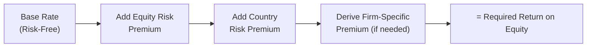

## Introduction
Frontier markets can be both fascinating and intimidating for equity analysis. On one hand, you might find explosive growth potential as frontier economies modernize and attract investments. On the other hand, these same markets often present data gaps, political uncertainty, and a notable risk of currency devaluation. As you can guess, these factors complicate valuation because you'll need to integrate extra risk considerations into your forecasts and discount rates.

In this vignette, we’re going to look at a hypothetical manufacturing firm in a frontier market. We’ll walk through partial financial statements, local economic indicators, and sticky little realities—like a recent political shake-up that’s affecting consumer demand. You’ll see how that might tweak your cost of capital estimates, sometimes in surprising ways. And we’ll tackle the not-so-small matter of currency devaluation risk in your forecasted free cash flows.

## Setting the Stage: Frontier Market Landscape
Frontier markets (see 24.1 for an overview of their unique risks) are on the lower end of market development compared to their “emerging market” siblings. The big differences? Thinner trading volumes, less robust regulatory environments, and sometimes minimal or outdated publicly available financial data. As in 24.2, data scarcity makes modeling a bit of an adventure. You’ll often see unverified or incomplete economic stats, which means your underlying assumptions might be less precise.  

But let’s be honest—investors are drawn to these markets hoping to find alpha where others fear to tread. Potential growth can be high if the country experiences a rapid economic leap (e.g., infrastructure boom, favorable demographics, or surging commodity exports). Of course, the cost of capital goes up too, given all that extra risk.  

## Hypothetical Scenario
Consider Hadi Manufacturing plc (Hadi), a mid-sized producer of household plastics located in a fictional frontier-market country called Novaria. Hadi’s leadership is excited about potential domestic demand growth for consumer goods. But they’re also navigating some political uncertainty after a recent election, possible trade restrictions, and consistent currency fluctuations.

### Partial Financial Statements  
Below is an extract of Hadi’s (unaudited) financial info. Some line items might be missing or unreliable because the company doesn’t adhere to full IFRS disclosure requirements:

• Revenue (Most Recent Year): USD 50 million (converted from Novarian dinars)  
• Cost of Goods Sold: USD 30 million  
• EBITDA: USD 10 million  
• Depreciation & Amortization: USD 2 million  
• Earnings Before Interest & Tax (EBIT): USD 8 million  
• Interest Expense: USD 1.5 million  
• Net Income: USD 5 million  

We also have your typical placeholders:  
• Cash & Cash Equivalents: USD 8 million  
• Total Liabilities: USD 40 million  
• Shareholders’ Equity: USD 20 million  

According to management, revenue growth could fluctuate between 3% and 15% annually, due to swings in the local economy and sporadic consumer confidence. They’re not certain about future capital expenditures either; some expansions were put on hold because of the unstable political environment.

### Local Economic Indicators
• Novaria’s GDP growth: ~3.5% (but historically erratic).  
• Inflation: ~6-7%, though official data is sometimes delayed.  
• Sovereign yield spread relative to a developed-market government bond: ~5%.  
• Currency risk: The Novarian dinar has lost about 10% of its value against the U.S. dollar over the last year. Analysts fear further depreciation if political uncertainty worsens.

### Recent Political Events
• Surprise Election: Incoming administration eyes trade restrictions, seeking to boost local manufacturing.  
• Consumer Sentiment: Up one month, down the next—nobody’s quite sure how sustained any spending spree might be.

## Linking to Valuation Topics
In prior sections, you learned about adjusting discount rates for country risk (24.3). That’s crucial here because standard global benchmarks might fail to capture the quirks of Novaria’s political and economic climate. Let’s highlight some key steps:

• Estimating a “risk-free rate” in the face of questionable local T-bill data.  
• Adding a typical Equity Risk Premium (ERP) for global equity.  
• Layering on a Country Risk Premium (CRP) based on the sovereign yield spread.  
• Adjusting further for firm-specific risk if needed.  

You also want to incorporate potential currency depreciation into your free cash flow model. That might mean using conservative exchange rate forecasts or hedging strategies in your cash flow assumptions.

## Valuation Steps for Hadi Manufacturing

### Step 1: Gathering Data
First, you’d gather or estimate missing items from Hadi’s statements. Perhaps we see patchy footnotes referencing capital spending or a backlog in orders. Some data is outdated, so you’ll rely on best estimates from local market reports.

Don’t forget to cross-check any available macro data with third-party sources—like the IMF or local development banks. Frontier market stats can sometimes be “optimistic,” so an external viewpoint is often worthwhile.

### Step 2: Adjusting the Discount Rate
One typical approach to building the required return on equity is:


\text{Cost of Equity} = R_f + \beta \times \text{ERP} + \text{CRP}


• \\( R_f \\): Risk-free rate (from a major developed market, possibly the 10-year U.S. Treasury, if the local bond market is not reliable).  
• \\(\beta\\): A measure of systematic risk. Requires caution in frontier markets due to limited trading data; you might have wide standard errors.  
• \\(\text{ERP}\\): The global equity risk premium.  
• \\(\text{CRP}\\): The country risk premium, often pinned to the sovereign yield spread.  

Let’s say:  
• \\( R_f \\) = 2% (using U.S. Treasury).  
• \\(\beta\\) = 1.2 (rough estimate from local/regional peer data).  
• \\(\text{ERP}\\) = 6%.  
• Sovereign yield spread suggests adding 5% for the CRP.  

So:


\text{Cost of Equity} = 2\% + 1.2 \times 6\% + 5\% = 2\% + 7.2\% + 5\% = 14.2\%


Of course, you could refine this with a second pass. For instance, if the firm has unusually high or low exposure to local political risk, you might add a company-specific premium of 1–2% or revise \\(\beta\\). Also note that with frontier markets, the cost of debt might be higher, so your after-tax cost of debt could push up the Weighted Average Cost of Capital (WACC) well above what you’d see in developed markets.

### Step 3: Multi-Stage Growth Model
Given Novaria’s shaky situation, you might use a multi-stage model that captures initial volatility, with the hope that after, say, five years, the economy might settle into a stable growth phase. Something like:

• Stage 1 (Years 1–2): High volatility. Possibly 5–10% annual revenue growth, but big swings in margins.  
• Stage 2 (Years 3–5): Growth moderates. Maybe 6% per year as the political environment stabilizes.  
• Stage 3 (Year 6 onward): Long-term stable growth at or near Novaria’s real GDP estimate plus inflation, say 4–5% in total (assuming inflation might still be high but more predictable).

You project free cash flows (FCFs) for each stage. Because local inflation and currency risk are big factors, you might forecast FCF in Novarian dinars and then convert them to USD at a forward exchange rate. Don’t forget to consider hedging strategies that the company might employ—a partial natural hedge if they import raw materials in a matching currency, or derivative hedges on the currency markets.

### Step 4: Sensitivity Analysis
Frontier markets are known for “volatility clustering,” where big shocks tend to come in bunches. So you want to stress-test your valuation. Suppose you create multiple scenarios looking at:

• Political Shock: Growth dips significantly (0–2% range) if the new government enacts harsh trade barriers or capital controls.  
• Currency Devaluation: The dinar drops 15–20% against the dollar, slicing away at the real USD value of local earnings.  
• Liquidity Dry-Up: A meltdown in local capital markets might raise WACC from 14.2% to 18–20%.  

Evaluate how each scenario affects your final value. If the friction between lower growth and higher discount rates converges, the company’s equity value might plummet. But in a best-case scenario—where the new administration fosters a stable environment and global investors rediscover frontier markets—your baseline growth might look overly conservative.

## Putting It All Together
Ultimately, you’re going to land on a valuation range rather than a single number. Try to bracket the best and worst cases. For instance, your base-case scenario might indicate an enterprise value of about USD 60 million. A severe shock scenario might slash that by 30–40%, whereas an optimistic scenario could push it up by 20%. In frontier markets, it’s often a broad range like that. Small changes in assumptions can trigger big swings.  

And—trust me—the hardest part is reconciling the intangible variables like political risk or consumer sentiment when actual data is sparse.

## Common Pitfalls
• Overreliance on Unverified Data: Always cross-check macro data with multiple sources.  
• Underestimating Currency Risk: Frontier market currencies might rapidly devalue more than “expected.”  
• Oversimplifying Growth Phases: The transition from volatility to stability might never happen, or it might happen sooner than you think.  
• Ignoring Liquidity Constraints: Frontier markets can dry up quickly, impacting both operating cash flow and financing options.

## Glossary
• **Volatility Clustering:** Tendency for large movements in returns to cluster together, making risk somewhat self-reinforcing.  
• **Stable Growth Phase:** The point in time when the firm (or country) enters a phase of constant, long-term growth—often tied to GDP.  
• **Liquidity Dry-Up:** A severe dip in trading activity or credit availability. Frontier markets can spiral into these droughts when investor sentiment sours.  
• **Hedging Strategy:** Use of financial tools (like forward contracts or options) to offset potential currency or input price fluctuations.

## References and Further Reading
• Emerging Markets Review journal for academic case studies on frontier market valuations.  
• Kuzmina, O. (2020). “Multi-Stage Growth Models in Unstable Macroeconomic Environments,” The Journal of Investing.  
• Practitioner guides on frontier market investing from research providers like MSCI and FTSE Russell.  

## Sample Item-Set Questions and Solutions
Below are a few short-answer and calculation-based questions that mirror the item-set style you might encounter. Use the data from the vignette to guide your answers.

1. (i) Calculate Hadi Manufacturing’s required return on equity using a risk-free rate of 2%, \\(\beta = 1.2\\), a 6% equity risk premium, and a 5% country risk premium.  
   (ii) How might a significant cut in the sovereign yield spread to 3% affect this rate?  

   • **Answer Guidance:**  
     (i) \\(\text{Cost of Equity} = 2\% + (1.2 \times 6\%) + 5\% = 14.2\%\\).  
     (ii) A 2% decrease in the CRP lowers the cost of equity to 12.2%, which might substantially raise the firm’s valuation.  

2. The local currency devalues by 15%. How would that impact your short-term free cash flow assumptions, and what hedging strategies might the firm consider to mitigate these effects?  

   • **Answer Guidance:**  
     A 15% devaluation reduces the dollar value of local profits. If the firm’s inputs are purchased in dinars but revenue is partially in USD, some natural hedge might exist. Alternatively, forward contracts on the currency or matching currency of revenue/expenses could help mitigate the risk.  

3. You revise your growth projections from 10% to 4% in the first two years due to a new political regime’s trade restrictions. By what mechanism would this revision likely affect the multi-stage valuation in a standard discounted cash flow (DCF) approach?  

   • **Answer Guidance:**  
     Lower near-term growth shrinks early cash flows. Because these earlier years are not discounted as heavily as distant ones, this revision can have a notable impact on present value.  

4. If the local bond market is untested, is it appropriate to use the local risk-free rate directly when estimating cost of equity?  

   • **Answer Guidance:**  
     Likely not. Frontier market bonds might not accurately reflect a robust risk-free environment, so many analysts prefer a developed-market risk-free rate and then add the CRP.  

5. In a scenario where liquidity dries up, which portion of the WACC is most likely to see an immediate spike?  

   • **Answer Guidance:**  
     The cost of equity tends to spike (due to risk-off sentiment and higher CRP), and the cost of debt rises as well. Typically, both components might increase, but equity sees a big jump from a flight to safety.  

(Additional questions in the final quiz below.)

## Frontier Market Valuation Knowledge Check



### In estimating cost of equity, which premium specifically accounts for political instability and unique macro risks in a frontier market?

- [ ] Beta
- [ ] Equity Risk Premium (ERP)
- [x] Country Risk Premium (CRP)
- [ ] Likelihood of an IMF bailout 

> **Explanation:** The CRP is added to capture incremental risk from political, liquidity, and macro instability—separate from general market risk.

### Which factor is most likely to diminish the USD value of Hadi Manufacturing’s FCF if the local currency depreciates?

- [ ] Reduced interest rates on debt
- [x] Lower exchange rates on converted earnings
- [ ] Insufficient financial statements
- [ ] Acquisition of more raw materials abroad

> **Explanation:** A weakened local currency, when translated to USD, reduces profit in dollar terms, lowering FCF in USD.

### Hadi expects to maintain 10% revenue growth for five years, then move to 5% growth indefinitely. This is an example of:

- [ ] Single-stage growth
- [ ] Gordon Growth Model
- [x] Multi-stage growth
- [ ] Residual Income approach

> **Explanation:** A period of higher growth followed by a stable phase is classic multi-stage DCF modeling.

### If the sovereign yield spread declines from 5% to 3%, what immediate effect does it have on Hadi’s discount rate?

- [x] Decreases the cost of equity
- [ ] Increases the cost of equity
- [ ] Eliminates the need for a risk-free rate
- [ ] Has no impact on WACC

> **Explanation:** A lower spread means a lower CRP, reducing the cost of equity in frontier market models.

### In frontier valuations, the term "volatility clustering" typically means:

- [x] Large market swings tend to be followed by more large swings
- [ ] Volatility is zero during stable growth
- [ ] Lower correlation among assets
- [ ] Guaranteed returns remain constant

> **Explanation:** Volatility clustering implies high market swings often follow previous high swings, reflecting persistent risk shocks.

### Which statement about frontier market liquidity is most accurate?

- [ ] It remains steady due to strong local investor bases
- [x] It can dry up quickly, making exit strategies difficult
- [ ] It is typically higher than in developed markets
- [ ] It has no impact on valuation

> **Explanation:** Frontier markets often have fewer participants, so liquidity can vanish during turmoil.

### When forecasting free cash flows for a frontier market company, an analyst might:

- [x] Convert local currency figures using conservative projections or partial hedges
- [ ] Only present data in the local currency
- [ ] Ignore any exchange rate considerations in the model
- [ ] Reset the entire cost of capital to zero

> **Explanation:** Currency conversions and hedging assumptions are critical for a realistic USD (or other major currency) FCF forecast.

### The stable growth rate in a multi-stage model often mirrors:

- [x] Long-term GDP growth plus inflation
- [ ] Negative growth rates in high-stress scenarios
- [ ] Straight-line depreciation
- [ ] Zero growth due to high risk

> **Explanation:** Typically, stable growth approximates the country’s long-term economic growth. In some frontier markets, that can be GDP + inflation.

### Under a scenario of severe currency devaluation, to maintain margins, Hadi might:

- [ ] Permanently cease domestic operations
- [x] Hedge currency exposure through derivatives
- [ ] Ignore the exchange rate changes
- [ ] Demand immediate payment in gold

> **Explanation:** Hedging with forward contracts or options is a standard approach to limiting damage from currency swings.

### True or False: Hadi Manufacturing’s exposure to local political events must be reflected when adjusting the discount rate.

- [x] True
- [ ] False

> **Explanation:** Political risk is typically captured through a country risk premium or specific risk factor. Not reflecting it could significantly understate the firm’s required return.



---

**Final Exam Tips**  
• Always re-check your data sources in frontier markets—some might be incomplete or inflated.  
• Incorporate a robust sensitivity analysis. Small changes in your discount rate assumptions or exchange rate forecasts can produce big swings in valuation.  
• Layer your growth stages to capture initial turbulence and a possible stable future—but remain open to the possibility that “stability” might not be guaranteed.  
• Practice item-set questions that emphasize these uncertainties.  

Good luck applying these techniques. Frontier markets entail a fair share of unpredictability, but with careful assumptions and thorough sensitivity checks, your valuations can still be both defensible and comprehensive.
