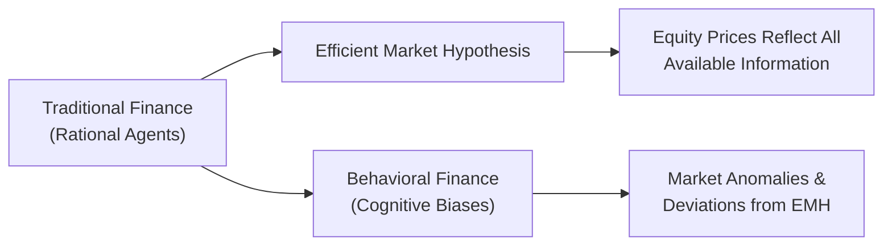

## Traditional vs. Behavioral Finance

Traditional finance—rooted in the Efficient Market Hypothesis (EMH)—long held that investors are rational agents who process all available information to arrive at fair market prices. In this view, any so-called “mispricings” are swiftly corrected by arbitrage or by acidly rational market participants. But, um, that’s not the entire story. Over the years, many of us have witnessed (and perhaps participated in) panics, bubbles, and all sorts of market mania, where prices veered dramatically from any semblance of fundamental value.

Behavioral finance steps in to fill this gap. It’s a field that looks at how real people—messy emotions, biases, and all—actually make decisions. If you’ve ever sold a stock in a flurry because it dipped a little and you “couldn’t bear another loss,” then you might recognize that feeling. Behavioral finance embraces these quirks and tries to explain how they manifest in equity markets. It’s not about throwing out the idea of efficient markets entirely; rather, it’s about recognizing the human element that can cause deviations from the idealized assumptions in traditional models.

## The Efficient Market Hypothesis and Its Forms

EMH underpins much of traditional finance. It asserts that:

• Prices reflect all available information.  
• New information is incorporated into prices almost instantly.  
• It’s essentially impossible to consistently outperform the market (on a risk-adjusted basis) through skill alone—yes, that can sting a bit if you’re dedicating countless hours to stock analysis.

But EMH comes in three flavors:

Weak-Form Efficiency  
Current stock prices reflect all historical price and volume data. Trying to outperform the market by looking at chart patterns or technical indicators is pointless since everything that’s ever happened—like a breakout or a head-and-shoulders pattern—should already be baked into the price.

Semi-Strong-Form Efficiency  
Prices incorporate all publicly available information, not just past trading data. This suggests that fundamental analysis becomes a tough endeavor to generate alpha because every publicly accessible piece of data, from financial statements to economic indicators, is already priced in.

Strong-Form Efficiency  
Prices reflect absolutely all information, both public and private. If this were true, then even insiders with material nonpublic information wouldn’t be able to gain an advantage (although, in reality, insider trading has historically proven otherwise). Strong-form efficiency is, well, the most “ideal” theory—many consider it too idealistic.

Behavioral finance places pressure on each form of EMH by highlighting that investors, in practice, suffer from biases (like overconfidence) and can cause persistent mispricings. In the short run, these biases can become self-reinforcing, leading to phenomena like asset price bubbles or momentum effects.

## Foundations of Behavioral Finance

Bounded Rationality  
Behavioral economists argue that investors are rational—but only to a point. We have limited brainpower, limited time, and limited access to perfect information. It’s like trying to solve a complicated puzzle with half the puzzle pieces missing or jumbled. Yes, we can try to approximate the puzzle’s solution, but it might not be perfect.

Prospect Theory  
Developed by Daniel Kahneman and Amos Tversky, prospect theory explains that people weigh losses more heavily than gains—this is known as loss aversion. Imagine you gain $100 versus lose $100. If you lose $100, it “hurts” you more psychologically than the joy you get from that same $100 gain. In a market context, this can lead to irrational decisions like holding on to losing stocks for too long (to avoid the pain of loss) and selling winning stocks too early (to “lock in” a gain).

Heuristics  
Heuristics are mental shortcuts we all use to make decisions more easily—like assuming a well-known brand must be a “safer” stock or believing recent trends will continue indefinitely. Such shortcuts can be helpful under normal circumstances, but they also create systemic errors when it comes to analyzing investment opportunities. Common heuristics include:

• Representativeness: Judging a new situation (e.g., new stock) based on superficial resemblance to past events (e.g., “This small-cap tech company looks like the next Amazon!”).  
• Availability: Overestimating the probability of events simply because they are more “available” in your memory—for instance, focusing on a sensational market crash covered heavily by the media.

## EMH vs. Behavioral Finance in Real Markets

In the real world, these two frameworks coexist. Many markets exhibit significant efficiency, especially in large-cap stocks with broad analyst coverage. At the same time, behavioral biases do crop up—investors overreact to earnings surprises, chase trending stocks, or panic-sell.

Here’s a common storyline: A small upstart technology company reports stellar results. Investors (driven by representativeness) assume it’ll keep growing at that blazing rate, so they drive the price up. Overconfidence pushes it further. Eventually, expectations become so inflated that the company can’t possibly deliver. Then come the disappointments, the rapid sell-offs, the “why didn’t I see that coming?” laments. That roller coaster often appears to defy the notion of “instant incorporation of information” that strong EMH prescribes.

The extent to which behavioral anomalies present investable opportunities depends on:

• Time horizon: Short-term anomalies might persist due to slow reaction or overreaction.  
• Market microstructure: Smaller markets or less liquid stocks may exhibit more persistent biases.  
• Investor composition: When big institutional players with robust data and risk controls trade shops of day traders governed by fear or greed, interesting price dynamics arise.

## Implications for Equity Valuation

It’s tempting to think that if behavioral finance shows that markets are not always efficient, we can easily exploit these inefficiencies for big gains. Sure, mispricings do exist, but doing something about them consistently and profitably is another matter. Markets have a habit of humbling the best of us.

Nevertheless, practical strategies emerge:

1. Contrarian Investing  
Identify points of overreaction, especially around earnings announcements. Sometimes the market overcorrects. You might spot depressed stocks that are fundamentally sound or overheated stocks that are trading far above their intrinsic value.

2. Sentiment Indicators  
Track investor sentiment to gauge where euphoria or panic might be overextended. Everything from social media chatter to put-call ratios can provide an “emotional temperature” of the market. In my own experience, analyzing news headlines can reveal when general investors are downright giddy or truly petrified—often a clue that the pendulum may soon swing.

3. Bias Awareness  
In your own valuation work, watch out for your personal tendencies—anchoring, confirmation bias, or fear of loss. The best analysts often have robust processes (e.g., checklists, regular peer reviews) to keep these biases in check.

4. Partial Integration of EMH and Behavioral Insights  
Yes, fundamental analysis, discounted cash flow models, and ratio analyses remain critical. But they can be augmented by an awareness of psychological factors like momentum or herding, which can sometimes overshadow fundamentals in the short run.

## Diagram: Traditional Finance and Behavioral Finance

Below is a simple flowchart illustrating how traditional finance leads to the Efficient Market Hypothesis, while behavioral finance highlights market anomalies and investor biases:

## Exam Application and Vignette Insights

For the CFA Level II exam, you’ll likely encounter item-set vignettes that require you to:

• Contrast EMH with behavioral finance: The question might present an investor who acts irrationally or a scenario showing market mispricings.  
• Recognize specific biases: Watch for clues in the text—phrases like “not wanting to realize any more losses” (loss aversion) or “I feel this company is the next big thing, just like Tesla was!” (representativeness).  
• Integrate fundamental and behavioral factors: For instance, suppose multiple data signals suggest a stock is overvalued, yet the investor keeps holding out of fear of regret.

Candidates should remember that purely believing in strong-form efficiency could lead you to pass on thorough analysis. Behavioral approaches can reveal short-lived or segment-specific opportunities. The exam might push you to connect the theoretical foundations—like bounded rationality or heuristic-driven errors—to real market moves. So, be comfortable switching between the logic of EMH and the psychological frameworks underlying actual decision-making.

## Best Practices, Common Pitfalls, and Challenges

Best Practices  
• Maintain an investment process that involves multiple checks: A second set of eyes or an automated screening can help catch emotional errors.  
• Document your rationale for each trade: Knowing why you bought (or shorted) something can help you see if you’re deviating because of personal biases.  
• Stay up to date on market sentiment indicators, but don’t rely solely on them. Combine them with rigorous fundamental analysis.

Common Pitfalls  
• Overconfidence in spotting anomalies: Just because the market is sometimes irrational doesn’t mean it’s easy to beat. Everyone else is trying, too.  
• Confirmation Bias: Only reading research that agrees with your initial thesis can lead you astray.  
• Underestimating Momentum: Behavioral biases can keep mispricings going far longer than “rational” analysis would suggest.

Challenges  
• Implementing strategies: Even if you identify a behavioral anomaly, executing on that insight involves risk and costs (transaction fees, short-selling constraints, etc.).  
• Timing: The old adage “markets can stay irrational longer than you can stay solvent” rings true.  
• Complexity of human psychology: A brand-new technology or global crisis can spark unpredictable investor responses. It’s impossible to account for every human foible.

## Further Perspectives and Real-World Takeaways

Behavioral finance does not refute the entire premise of EMH. Instead, it enriches it, reminding us that humans are behind all those trades. We are not robots calculating net present values to an infinitesimal decimal. We are emotional, time-constrained, and occasionally downright stubborn. If you keep an eye on those human factors, you may find ways to enhance your equity valuation process—just don’t be fooled into thinking it’s easy street.

## References and Further Reading

• Kahneman, D. (2011). “Thinking, Fast and Slow.” Farrar, Straus and Giroux.  
• Shleifer, A. (2000). “Inefficient Markets: An Introduction to Behavioral Finance.” Oxford University Press.  
• CFA Institute Level II Curriculum — Behavioral Finance Readings.  
• Barberis, N. & Thaler, R. (2003). A Survey of Behavioral Finance. In G. M. Constantinides, M. Harris, & R. M. Stulz (Eds.), “Handbook of the Economics of Finance.”

## Glossary of Key Terms

• Efficient Market Hypothesis (EMH): The theory that security prices fully reflect all available information.  
• Weak-Form Efficiency: Markets integrate all historical price and volume data into current prices.  
• Semi-Strong-Form Efficiency: Markets rapidly incorporate all public information in price changes.  
• Strong-Form Efficiency: Even insider (private) information is reflected in a security’s price.  
• Bounded Rationality: The notion that people try to be rational but are limited by cognitive and informational constraints.  
• Prospect Theory: A framework highlighting how investors value gains and losses differently, typically exhibiting loss aversion.  
• Heuristic: Mental shortcut or rule of thumb that can lead to systematic biases.  
• Loss Aversion: The tendency for people to prefer avoiding losses rather than acquiring equivalent gains.

## Exam Tips for CFA Level II  

• Be prepared to identify specific behavioral biases in vignettes.  
• Know the differences among weak, semi-strong, and strong forms of EMH and how they might appear in an exam question.  
• Practice writing short justifications when explaining if a market scenario aligns more closely with EMH or with behavioral explanations.  
• Keep an eye out for “red flags” of emotional or heuristic-driven decision-making in item sets.  

-------------

## Test Your Knowledge: Behavioral Finance & EMH Quiz



### Which of the following best describes the core distinction between traditional finance and behavioral finance?

- [ ] Traditional finance studies market anomalies, while behavioral finance assumes complete market efficiency.  
- [x] Traditional finance assumes rational decision-making and efficient markets, while behavioral finance incorporates psychological biases and irrational behavior.  
- [ ] Traditional finance focuses only on small-cap stocks, while behavioral finance focuses on large-cap stocks.  
- [ ] Both frameworks ignore the role of cognitive errors in investment decisions.  

> **Explanation:** Traditional finance often takes a rational, efficient market viewpoint, whereas behavioral finance highlights how biases can produce irrational decisions and market anomalies.

### A market adheres to semi-strong-form efficiency if current stock prices:

- [x] Reflect all publicly available information, making it difficult to gain abnormal returns by analyzing public data.  
- [ ] Reflect only company-specific news, not market information.  
- [ ] Consider private insider information but not publicly available information.  
- [ ] Are based exclusively on historical price and volume data.  

> **Explanation:** Semi-strong-form efficiency suggests that all publicly available information (including company announcements, financial statements, and macroeconomic data) is reflected in stock prices.

### According to behavioral finance research, which of the following heuristics might lead investors to extrapolate short-term trends into unrealistic long-term outcomes?

- [ ] Confirmation bias  
- [ ] Loss aversion  
- [x] Representativeness  
- [ ] Anchoring  

> **Explanation:** Representativeness causes people to classify new information based on how similar it seems to known categories. Investors may wrongly assume a company’s short-term performance “represents” long-term performance, ignoring fundamentals.

### Prospect theory argues that investors:

- [ ] Are indifferent between losses and gains of equal magnitude.  
- [ ] Value gains more than losses.  
- [x] Dislike losses more than they like equivalent gains.  
- [ ] Treat risk as irrelevant when making decisions.  

> **Explanation:** Prospect theory’s loss aversion suggests that the pain from a loss is felt more intensely than the pleasure from a gain of the same amount.

### When investors become overly optimistic about a particular sector (e.g., technology stocks), which behavioral tendency is most likely at play?

- [ ] Anchoring to historical company valuation ratios.  
- [x] Herding or overconfidence, where many investors pile into the same trades.  
- [ ] Mental accounting, isolating funds in separate “buckets.”  
- [ ] Framing bias, interpreting information the same way.  

> **Explanation:** Herding reflects a social tendency to follow others, while overconfidence can amplify the behavior by convincing many participants they’ve discovered a “sure thing.”

### Which form of EMH posits that no investor can achieve consistent excess returns using any information, including insider or private details?

- [ ] Weak form  
- [ ] Semi-strong form  
- [x] Strong form  
- [ ] Informational form  

> **Explanation:** Under strong-form efficiency, all information (public and private) is reflected in prices, implying no one can achieve risk-adjusted excess returns.

### Which statement most accurately describes bounded rationality?

- [ ] Investors have infinite time and data to make optimal choices.  
- [ ] All investors always act perfectly rationally under any market condition.  
- [ ] Investors are fully aware of every possible outcome, including unknown factors.  
- [x] Investors try to be rational but are limited by cognitive and informational constraints.  

> **Explanation:** Bounded rationality recognizes that people attempt to be logical but face resource limitations in processing information, leading to simplifications and heuristics.

### Which example best illustrates the availability heuristic?

- [x] An investor who recently heard about stock fraud on the news worries excessively about all stocks being fraudulent.  
- [ ] An investor sets an initial price target and refuses to revise it, despite contradictory data.  
- [ ] An investor frames each trade as an isolated event instead of considering overall portfolio risk.  
- [ ] An investor avoids selling a losing position to delay recognizing a capital loss.  

> **Explanation:** The availability heuristic refers to overestimating the probability or importance of events simply because they come easily to mind, such as a sensational news story.

### In the context of EMH, the rapid incorporation of new public information into security prices is most consistent with:

- [ ] Weak-form efficiency  
- [x] Semi-strong-form efficiency  
- [ ] Strong-form efficiency  
- [ ] No form of efficiency  

> **Explanation:** Semi-strong-form efficiency states that any publicly available information is quickly reflected in stock prices, making it difficult to earn abnormal returns by analyzing public data.

### True or False: Behavioral finance completely disproves the Efficient Market Hypothesis.

- [x] True  
- [ ] False  

> **Explanation:** Actually, this statement needs nuance. Behavioral finance challenges some assumptions of EMH and highlights biases leading to mispricings, but it does not necessarily prove that all markets are always inefficient. It shows EMH may not hold perfectly in the presence of human irrationalities. On a pure yes/no basis, “true” is the best summary for the statement as phrased, although in deeper analysis, we see that behavioral finance modifies rather than entirely refutes EMH.


