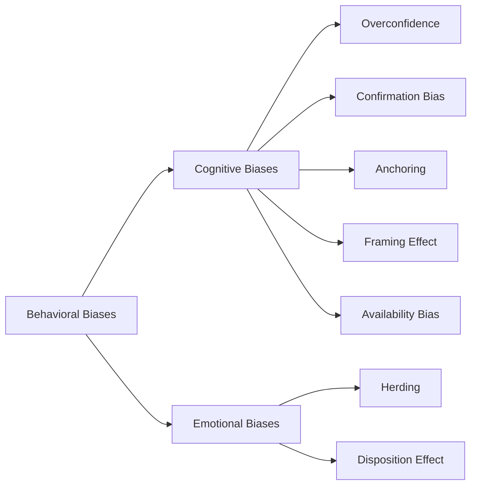

## Overview of Behavioral Biases in Equity Valuation

Behavioral finance is all about how our emotions and thought processes can lead us astray—even when we’re using the most advanced valuation models. As we dive into these biases, you might find yourself nodding in recognition, thinking, “Oh yeah, I’ve definitely done that.” Don’t worry, we’ve all been there. The important part is recognizing these tendencies and building a framework to mitigate them when estimating the fair value of a stock.

Cognitive biases are typically errors in how we process information. They might arise from incomplete data analysis, short memory spans, or overreliance on a single data point. Meanwhile, emotional biases often spring from fear, excitement, or simply the desire to confirm our feelings about an investment (like that underdog stock you can’t help but root for). Both types of biases can push equity valuations off-track, sometimes with dramatic effects on portfolio performance.

## Cognitive vs. Emotional Biases

Cognitive biases occur due to flaws in logical reasoning. You might overemphasize certain pieces of data, fail to account for the big picture, or recall past experiences incorrectly. On the other hand, emotional biases arise because of an investor’s personal feelings, such as hope or anxiety. These emotions can override often well-grounded financial models. Though the difference may seem subtle, it’s helpful to keep them separate in your mind. That way, you can tailor mitigation strategies accordingly.

### Diagram: Classification of Biases

Below is a simple Mermaid diagram showing how biases can be split into cognitive versus emotional categories:

## Key Biases Explored

### Overconfidence

Overconfidence is that subtle (or sometimes not-so-subtle) voice in our heads saying, “I’ve got this perfectly figured out.” It leads investors to overestimate both their skill at picking winning stocks and the precision of their forecasts. For instance, you might do your discounted cash flow (DCF) model and conclude that your valuation is definitely accurate to within 1%. In reality, market conditions or an unexpected product flop can change everything overnight.

A finance professor once told me a story about a student who was so certain in his forecast for a small-cap biotech firm—he’d run multiple regression analyses, built out an extensive Monte Carlo simulation, and was confident the company’s new drug would gain quick regulatory approval. Then, a single negative comment from the FDA caused the company’s shares to plummet 40%. Sometimes, the best lesson in humility is letting the market speak for itself.

#### Mitigation Techniques for Overconfidence

• Use checklists that explicitly require you to consider worst-case scenarios.  
• Rely on quantitative models that incorporate a margin of safety.  
• Encourage group decision-making with devil’s advocates who challenge assumptions.

### Confirmation Bias

Confirmation bias is the tendency to focus only on data that supports your existing hypothesis—and ignore everything else. If you’re bullish on Tech Company X, you’ll probably read every glowing analyst report and skip the critical ones. That approach naturally leads to flawed conclusions because you’re not factoring in any contradictory information.

#### Example of Confirmation Bias in Equity Analysis

Let’s say you see a news headline praising a firm’s strong quarterly results. Due to your positive stance, you spend the next 20 minutes reading about potential expansions, new product lines, and partnerships. However, you conveniently ignore the fine-print footnote disclosing a rising debt load and some large legal contingencies—because that would spoil your fun, right?

#### Mitigation Techniques for Confirmation Bias

• Have a structured process to gather negative or contrarian reports.  
• Implement scenario analysis with both upside and downside projections.  
• Ask the question: “What would make this forecast fail?”  

### Herding Behavior

Herding is basically following the crowd. Often, it emerges from a fear of missing out (FOMO) or a desire to fit in. If everyone around you is buying shares of some hot AI start-up, you might just hop on board too, even if your analysis says the fundamentals aren’t all that. Herding can cause momentum-driven price runups—or dramatic sell-offs if the herd spooks.

A classic example happened during the dot-com bubble of the late 1990s. People saw others making insane returns on internet stocks, so they all jumped in, ignoring lofty valuations. When reality hit, prices collapsed. The herd rushed for the exits, accelerating the crash.

#### Mitigation Techniques for Herding

• Rely on fundamental analysis, not rumor-chatter.  
• Maintain an investment policy statement that outlines your specific criteria for security selection.  
• Conduct your own valuation analysis to justify every trade decision.

### Anchoring and Adjustment

Anchoring happens when you latch onto a reference point—say, a stock’s current share price—and fail to adjust enough when new information arises. Suppose you anchor on the notion that a stock “should” trade at $100 because that was last quarter’s target in your model. If the company’s outlook changes drastically, you might under-adjust your model to, say, $98, even if the updated data suggests a more significant drop to $80.

#### Example Scenario

An investor sees that Stock A was trading at $50 a while ago. After a series of poor earnings, the price drifts down to $30. Despite mounting evidence that the company’s production issues might not be resolved soon, the investor continues to think that the “fair value” is around $50, ignoring the new normal.

#### Mitigation Techniques for Anchoring

• Revisit your valuation model regularly.  
• Focus on forward-looking data, such as changes in a firm’s economic moat or strategic positioning.  
• Flag any major events—like management changes or sudden debt spikes—that demand a fresh baseline.

### Framing Effect

Sometimes, how the information is presented changes how you interpret it. If a company’s press release says, “Earnings soared 15% year over year,” you might get excited. But if the next line says, “However, the base period’s earnings were abnormally low, and adjusted earnings are only up 2%,” that is a different perspective, right?

The same data can be framed in multiple ways. Be sure to look for both the headline spin and the underlying numbers. Corporate communications teams are great at positive spin, so double-check how they’re framing results.

#### Mitigation Techniques for the Framing Effect

• Always consider the opposite framing: “What if I read the news from a pessimistic angle?”  
• Adjust corporate statements using standardized metrics.  
• Ask how each piece of information might be presented differently and whether that changes your conclusion.

### Availability Bias

Ever recall a snippet from last night’s financial news more strongly than thorough research from two weeks ago? That’s availability bias in action. We naturally weigh information that’s most readily available or that made a big, recent impression on us.

If you just read about a major scandal in the automotive sector, you might become overly pessimistic about all automakers, even if it’s an isolated incident. Conversely, a well-publicized success in another industry may make you overly bullish.

#### Mitigation Techniques for Availability Bias

• Keep a research journal where you record your findings systematically.  
• Reference long-term data sets.  
• Challenge yourself to find historical examples that contradict your immediate impressions.

## Implications for Equity Valuation

So, what does all this mean for the actual numbers we put into our discount rate or terminal value calculations? Let’s talk about a few scenarios:

• **Chasing hot sectors**: When herding meets overconfidence, investors might inflate valuations in a popular sector, ignoring fundamental catalysts—or lack thereof.  
• **Holding onto losers**: The disposition effect is partly emotional (fear of realizing losses) and partly driven by confirmation bias (“The market just doesn’t see the real value here yet!”). Over time, these losing positions might sink deeper.  
• **Systematic underestimation of risk**: Overconfidence may lead to ignoring negative signals, so your required return (or discount rate) might be too low, leading to inflated intrinsic value estimates.  

Behavioral biases can generate market anomalies like value or momentum “effects.” In certain market phases, these anomalies might become more pronounced—especially when large swaths of investors succumb to the same bias at once.

## Exam Application—Advanced Focus

For your CFA exam, you should anticipate:

1. **Scenario-based prompts**: A vignette might describe an investor who selectively reads positive news about a company while ignoring negative events—this is a likely prompt for confirmation bias.  
2. **Quantifying misvaluations**: The exam might ask something like, “Given the analyst’s bias, how might their discount rate be affected?” or “Which portion of the free cash flow forecast is likely overstated?”  
3. **Behavioral explanation for momentum**: You may be required to connect herd-like behavior or the disposition effect to systematic underpricing or overpricing of equities.

Be sure you’re ready to recognize these biases and articulate how they influence equity price formation and valuation.

## Best Practices to Mitigate Behavioral Biases

Let’s wrap up these biases with best practices:

• **Structured Decision Processes**: Using a step-by-step checklist for equity valuation helps to ensure you’re not missing data or ignoring negative points.  
• **Diversify Your Sources**: Read bull, bear, and neutral reports. Seek out contrarian opinions.  
• **Objective Forecasting**: Use historical data and quantitative modeling as a starting point, then incorporate fundamental insights. Limit emotional input.  
• **Ongoing Education**: Behavioral finance is evolving. Keep reading about new studies and findings so you remain aware of emerging forms of bias.  

### Tip

A real trick for the exam: If you see a question describing an investor who is fixating on a prior price target (anchoring), it’s likely the correct answer is something about how they haven’t adjusted adequately to new information. If you see a question about “feeling good” about a stock despite contradictory evidence, that’s your classic overconfidence or confirmation bias.

## Glossary of Key Biases

• **Overconfidence Bias**: Overestimating one’s skill, leading to narrow forecasts or underestimation of risk.  
• **Confirmation Bias**: Emphasizing information that supports your thesis while discounting contrary evidence.  
• **Herding Behavior**: Following group buying or selling, often without sufficient independent analysis.  
• **Anchoring**: Relying too heavily on an initial reference point when making subsequent judgments.  
• **Framing Effect**: Letting how information is presented (rather than the information itself) influence decision-making.  
• **Availability Bias**: Relying on readily available or recent information and ignoring a broader dataset.  
• **Disposition Effect**: Selling winners too soon and holding onto losers too long, often due to reluctance to realize losses.

## Final Thoughts

We’ve all heard that we should “know ourselves” as investors. Understanding how creeping biases might distort your equity valuations is a crucial step toward becoming a more disciplined analyst or portfolio manager. Sure, the spreadsheets and discount rate formulas are important—no doubt about that. But if you’re wearing behavioral “blinders,” your valuations can easily go astray.

Always practice scanning your own thought process: Am I ignoring red flags? Am I just following others because it feels safe? Are my price targets anchored where they shouldn’t be? By applying even a handful of these mitigation strategies, you’ll be in a far stronger position to produce fair, balanced equity models.

## References and Further Reading

• Thaler, R. H. (2015). “Misbehaving: The Making of Behavioral Economics.” W. W. Norton & Company.  
• Montier, J. (2010). “Behavioural Investing: A Practitioner’s Guide to Applying Behavioural Finance.” Wiley.  
• CFA Institute: Equity Valuation and Behavioral Biases (Level II readings).  
• Statman, M. (2019). “Behavioral Finance: The Second Generation.” CFA Institute Research Foundation.  

--------------------------------------------------------------------------------

## Test Your Knowledge: Identifying Behavioral Biases and Their Effects



### In which type of bias do investors overestimate the precision of their own analyses or forecasts?  
- [x] Overconfidence bias  
- [ ] Anchoring bias  
- [ ] Availability bias  
- [ ] Framing effect  

> **Explanation:** Overconfidence bias occurs when investors overestimate their own abilities, believe their forecasts are more accurate than they actually are, and assume their valuations are pinpoint precise.

### A portfolio manager reads only positive analyst reports and glosses over negative news that conflicts with her bullish stance. Which bias is most likely at play?  
- [ ] Anchoring bias  
- [ ] Herding behavior  
- [x] Confirmation bias  
- [ ] Framing effect  

> **Explanation:** Confirmation bias is the tendency to seek and focus on information that supports a preconceived belief and ignore contrary data points.

### An investor notices everyone is pouring into Tech Stock A, so she joins, despite analyzing it as overpriced. Which bias is illustrated here?  
- [ ] Availability bias  
- [ ] Overconfidence bias  
- [ ] Framing effect  
- [x] Herding behavior  

> **Explanation:** Herding behavior is following the crowd’s investment moves without sufficient independent analysis.  

### During a valuation process, an investor sees the historical stock price was $80 five months ago, and remains convinced that’s its “real” value, even though the firm’s earnings have deteriorated significantly. Which bias most likely affects the investor?  
- [ ] Disposition effect  
- [ ] Overconfidence bias  
- [ ] Confirmation bias  
- [x] Anchoring bias  

> **Explanation:** Anchoring bias is fixating on a past reference point and failing to adequately adjust in light of new information.

### A firm’s press release states, “Profits have jumped 12% this quarter!” but fails to mention that last quarter’s profits were unusually low due to a one-time loss. The investor forms a positive outlook based purely on the 12% figure. Which bias does this scenario illustrate?  
- [x] Framing effect  
- [ ] Herding behavior  
- [ ] Availability bias  
- [ ] Overconfidence bias  

> **Explanation:** The framing effect occurs when the way information is presented—highlighting a 12% increase from an exceptionally low base—biases investors’ interpretation.

### Lately, a major scandal in the banking industry has dominated headlines. Now, an investor believes all banks are high-risk. Which bias is most likely?  
- [ ] Framing effect  
- [ ] Confirmation bias  
- [x] Availability bias  
- [ ] Overconfidence bias  

> **Explanation:** Availability bias happens when recent or dramatic information is so prominent in the investor’s mind that it overshadows broader data.

### An investor refuses to sell her losing stock because she just knows it will bounce back, even though fundamentals have worsened. The investor is demonstrating:  
- [ ] Anchoring bias  
- [x] Disposition effect  
- [ ] Framing effect  
- [ ] Availability bias  

> **Explanation:** The disposition effect involves holding onto losing positions too long, often driven by a reluctance to realize a loss.

### Which of the following steps is considered an effective mitigation technique for confirmation bias?  
- [ ] Routinely seeking news that reaffirms your position  
- [ ] Adopting a gut-feel approach for buy/sell decisions  
- [ ] Placing entire reliance on a single forecaster  
- [x] Actively seeking out negative or conflicting information  

> **Explanation:** One of the best ways to counteract confirmation bias is to actively search for data that might challenge your preconceived notions, thus ensuring a more balanced view.

### On the CFA exam, a vignette describes an analyst who sets an initial price target and, despite negative developments, adjusts the final target price downward by only a small amount. This example primarily illustrates:  
- [ ] Framing effect  
- [ ] Herding behavior  
- [x] Anchoring and insufficient adjustment  
- [ ] Overconfidence bias  

> **Explanation:** Anchoring and insufficient adjustment involve clinging too closely to the initial reference point, making only minimal changes even when new evidence calls for a more substantial revision.

### True or False: Emotional biases and cognitive biases can be mitigated using the exact same techniques and have identical impacts on equity valuation.  
- [ ] True  
- [x] False  

> **Explanation:** Emotional biases are driven by feelings like fear or excitement, whereas cognitive biases result from errors in thinking or information processing. They often require different mitigation strategies and can produce distinct effects on equity valuation.


