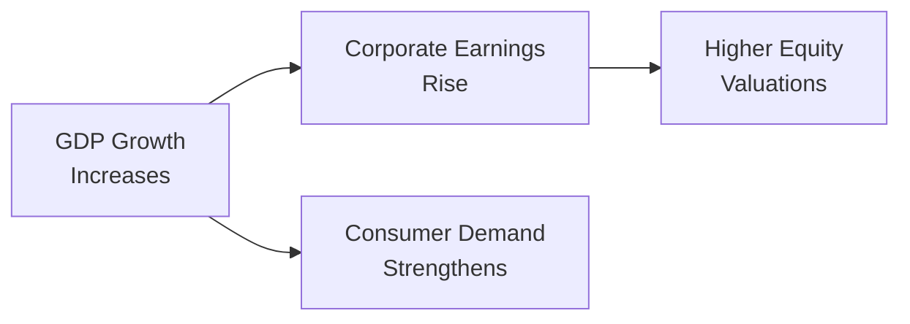

## Why Macroeconomics Matters for Equity Valuation

I remember the first time I tried to parse GDP data for an equity research project: I was flipping through a mountain of economic releases, feeling a bit overwhelmed. However, I quickly realized that understanding factors such as GDP growth, inflation, and interest rates really helps you see why certain stocks might rally while others sink. After all, when the broader economy is humming, companies see rising revenues and can access capital more cheaply—though, ironically, a overheating economy can trigger higher rates that eventually slow things down. If that sounds contradictory—well, welcome to macroeconomics! Let’s dive deeper.

## Connecting GDP to Equity Markets

### Defining GDP and Its Cycles

Gross Domestic Product (GDP) represents the total market value of all final goods and services produced within a country over a given period. Analysts typically track GDP growth on a quarterly or annual basis. A rapid GDP expansion (above long-term trend) often indicates robust demand for goods and services. Conversely, a slowdown in GDP growth can reflect economic headwinds—less consumer spending, lower corporate investment, or a cyclical downturn in key industries.

Equity valuations are partly driven by expectations of corporate earnings. And guess what? Earnings projections are strongly correlated with economic output. When GDP growth is strong, businesses typically see higher revenues and profit margins due to stronger consumer spending, bigger capital budgets, and more confident sentiment in the marketplace.

Below is a simple diagram to illustrate how GDP growth can influence earnings and, subsequently, share prices.



The arrows aren’t always straightforward (there are plenty of second- and third-order effects). But overall, a noticeable boost in GDP can take markets by surprise—potentially driving stock valuations higher.

### Above-Trend vs. Below-Trend Growth

Above-trend GDP growth, typically understood as growth surpassing an economy’s long-run potential rate, can lead to lower unemployment, rising wages, and improved corporate confidence in expansion projects. If you’re evaluating a cyclical company—say, an automotive manufacturer—robust GDP growth often means more cars sold, higher asset utilization, and potentially stronger stock performance.

However, not all positive GDP readings guarantee a bull market. If consumers and businesses are already leveraged, or if central banks fear the economy is overheating, policy responses (usually interest rate hikes) might offset some of that optimism. Therefore, a key skill for analysts is discerning whether the economy is in the early, mid, or late stage of a growth cycle.

When GDP growth starts trending below potential, you might see signals such as decreased consumer confidence, lowered capital spending, or supply-chain contractions. Remember that markets often anticipate these changes. Stock prices may fall in response, reflecting the expectation of leaner corporate profits down the road.

## Inflation: The Purchasing Power Puzzle

### What Inflation Means

Inflation is essentially the rate at which the general price level for goods and services increases over time. On a personal level, inflation means your dollar buys fewer groceries next month than it does today. In an equity context, higher inflation can push the cost of inputs (like wages and raw materials) upward, pressuring profit margins—unless companies can pass those costs on to customers.

### Impact on Valuations

Why do equity valuations care so much about inflation? Think about discount rates. When we do a discounted cash flow (DCF) valuation, we’re projecting a company’s free cash flows (in nominal terms) and then discounting them back to the present. If the inflation rate rises, investors require higher nominal yields on bonds and other assets to keep up with the erosion of purchasing power—thus raising the opportunity cost of holding stocks. Higher required return implies a higher discount rate, which mathematically reduces the present value of future cash flows.

### Monetary Policy and Inflationary Pressures

Central banks (e.g., the Federal Reserve, European Central Bank) use monetary policy levers—particularly short-term interest rates—to cool overheating economies. When inflation is high or rising quickly, the central bank typically hikes rates to slow excessive credit expansion. This can moderate inflation but also push up borrowing costs for companies, potentially dampening capital expenditures and future growth prospects.

## Interest Rates and Equity Analysis

### Nominal vs. Real Rates

Interest rates come in two flavors: nominal and real. Nominal rates are what you see quoted at the bank or in the media—like when a central bank announces its benchmark policy rate. Real interest rates (r_real) are nominal rates minus inflation (π). Formally:


r_{\text{real}} = r_{\text{nominal}} - \pi


Why does the distinction matter? Well, a nominal rate of, say, 6% might sound decent, but if inflation is running at 4%, your real return is just 2%. In terms of equity valuation, you really care about whether the real rate is positive or negative because it indicates the true cost of capital for businesses (and real purchasing power for investors).

### Relationship to Discount Rates

From the perspective of a dividend discount model (DDM) or free cash flow to equity (FCFE) model, the discount rate comprises the risk-free rate (often linked to government bond yields), plus some equity risk premium (and possibly size or liquidity premiums). If the central bank’s policy decisions push the risk-free rate upward, the entire cost of equity can climb. That’s why changes in interest rates can trigger immediate re-pricing in the equity market.

### Short-Run vs. Long-Run Interest Rates

Financial analysts differentiate between short-term rates (money market rates, key policy rates) and long-term rates (like 10-year treasury yields). Typically, the yield curve provides insights into market expectations about future interest rates and economic growth. If you see a steepening curve, it often indicates growing expectations for future inflation or economic expansion. A flattening or inverted curve, on the other hand, might signal impending slowdown or recession fears.

## The Interplay: GDP, Inflation, and Interest Rates

So how do we tie it all together? A booming economy—rising GDP growth—often sparks inflation as demand outpaces supply. Central banks may respond by raising interest rates. This, in turn, can reduce investment spending and moderate growth in subsequent periods.

Conversely, if GDP growth is languishing and inflation is low, central banks might lower interest rates to stimulate borrowing and spending. That could bolster business conditions, fueling a rebound in equity markets. The trick is that markets don’t wait for the final data. Traders and investors reprice assets based on what they anticipate the policy response will be.

### A Quick Scenario

Let’s say we have a country (call it EconLand) experiencing 4% annual GDP growth—above its long-term trend of 2.5%. At the same time, inflation moves from 2% to 3.5% in the space of a year. The central bank starts talking about “tapering” or raising rates to contain inflationary pressures.

• Equity investors, seeing higher rates on the horizon, might adjust discount rates upward.  
• Companies with significant debt could face higher interest expenses.  
• Over time, higher interest expenses eat into earnings and weigh on valuations.  

However, not all sectors respond equally. Cyclical industries sensitive to consumer demand (like travel or automotive) might initially benefit from the strong GDP but later face a double whammy if rising rates dampen discretionary spending. Defensive sectors (like utilities or consumer staples) might hold up better, as their demand remains relatively stable.

## Using IS-LM and AD-AS Frameworks

Economists employ models like IS-LM (Investment-Saving / Liquidity-Money) and AD-AS (Aggregate Demand / Aggregate Supply) to evaluate how GDP, inflation, and interest rates interrelate. While we won’t go into exhaustive detail, a quick view:

• IS-LM emphasizes how equilibrium interest rates are determined by the balance of money supply and demand (LM curve) and the balance of savings and investment (IS curve).  
• AD-AS describes how output (GDP) and the price level (inflation) adjust in response to shifts in aggregate demand (AD) and aggregate supply (AS).  

For equity analysts, using these frameworks can help forecast macro trends and identify turning points that might impact valuations. 

### Brief Python Example to Forecast GDP

Below is a very simple Python snippet illustrating how one might gather data from an online source (like FRED) and compute a rolling GDP growth rate. (Note: this is for demonstration—actual code may differ based on your data provider.)

```python
import pandas as pd
import pandas_datareader as pdr
from datetime import datetime

start = datetime(2015, 1, 1)
end = datetime(2025, 1, 1)

gdp_data = pdr.DataReader('GDPC1', 'fred', start, end)

gdp_data['pct_change_4q'] = gdp_data['GDPC1'].pct_change(periods=4) * 100

print(gdp_data.tail())
```

You can compare the recent rolling percentage changes to historical averages and see if growth is above, below, or around trend. Doing so not only keeps you up-to-date but also helps you refine any forward assumptions in your valuation models.

## Best Practices and Common Pitfalls

• Don’t Overrely on a Single Indicator: GDP, inflation, and interest rates rarely move in isolation. Look at broader indicators—labor market stats, consumer confidence, etc.  
• Beware of Lags: Monetary policy can have a delayed effect. If you expect immediate changes in corporate earnings, you might be ahead (or behind) the reality.  
• Watch for Structural Shifts: Sometimes the economy is going through structural changes—like a tech revolution or major policy overhaul—that might break “traditional” relationships.  
• Scenario Analysis Is Your Friend: Build multiple valuation scenarios reflecting different macro outcomes (e.g., “high growth/high inflation,” “low growth/low inflation,” and so forth) to see how sensitive your valuations are to changes in macro conditions.

## Exam Tips for Item Sets

In a typical Level II item set, you might be given a short vignette that references recent GDP figures, an uptick in inflation, and a central bank statement on raising short-term rates. You’ll likely be asked to:

• Assess how changes in interest rates affect discount rates for equity valuations.  
• Interpret how rising or falling inflation impacts real returns for investors.  
• Relate these macroeconomic shifts to corporate earnings, profitability, or consumer demand.  

Try to systematically link each macro factor to the valuation levers you’ve learned throughout your equity studies. Always watch out for the tricky detail that might change the entire context—like a statement indicating that inflation is cost-push rather than demand-pull, or that the central bank is adopting unconventional measures (e.g., quantitative easing).

## References for Further Exploration

- CFA Institute Level II Curriculum, “Economics” readings.  
- Mankiw, N. G. (2019). Macroeconomics. New York, NY: Worth Publishers.  
- Federal Reserve Economic Data (FRED): https://fred.stlouisfed.org  

## Test Your Knowledge: GDP, Inflation, and Interest Rate Dynamics



### GDP Growth and Equity Valuation

- [x] A surge in GDP growth can lead to higher corporate earnings and potentially higher equity valuations.
- [ ] Rising GDP growth typically decreases consumer demand.
- [ ] Higher GDP growth strictly leads to lower unemployment, but has no effect on corporate earnings.
- [ ] There is no connection between GDP growth and company profitability in cyclical industries.

> **Explanation:** An increase in GDP usually signals stronger economic activity and demand, which often boosts corporate profits and supports higher equity valuations, especially in cyclical sectors.

### Effect of Inflation on Discount Rates

- [x] Higher inflation generally increases discount rates, lowering present values.
- [ ] Higher inflation has no impact on equity discount rates.
- [ ] Higher inflation always leads to a stronger currency, thereby increasing returns.
- [ ] Lower inflation reduces nominal interest rates but has no effect on the real interest rates.

> **Explanation:** With higher inflation, investors demand more return to compensate for the loss of purchasing power. This raises nominal rates and increases the discount rate used in valuations, reducing present values.

### Nominal vs. Real Interest Rates

- [x] Real interest rates adjust nominal rates for inflation.
- [ ] Higher real rates imply lower inflation.
- [ ] Nominal rates are always lower than real rates.
- [ ] Real interest rates do not affect capital budgeting decisions.

> **Explanation:** Real interest rates are essential for understanding the true cost of borrowing or investing, as they strip out the effect of inflation from nominal rates.

### Scenario of Booming GDP and Rising Inflation

- [x] Central banks are likely to raise interest rates to control inflation in a booming economy.
- [ ] Rising inflation in a booming economy always means stock prices will continue to rise indefinitely.
- [ ] Corporate debt costs decrease rapidly when GDP is booming.
- [ ] High GDP growth and rising inflation have no correlation to equity valuations.

> **Explanation:** When GDP growth and inflation surge together, central banks often tighten monetary policy by raising rates, which can increase firms’ borrowing costs and temper equity valuations.

### Monetary Policy Influence

- [x] Central bank actions in response to inflation can change equity discount rates.
- [ ] Central banks only target GDP growth, not inflation.
- [x] Changes in policy rates can affect both short-term and long-term bonding costs.
- [ ] Monetary policy has no lag effect on the economy.

> **Explanation:** Central banks often adjust rates to influence economic activity and inflation, meaning they directly impact discount rates for equity valuations and borrowing costs for firms. These changes can take time (lag effect) to feed through the economy.

### Inverted Yield Curve

- [x] Often signals market expectations of an economic slowdown or recession.
- [ ] Indicates that long-term rates are significantly higher than short-term rates.
- [ ] Suggests rapid GDP growth will continue.
- [ ] Deters any central bank action on rates.

> **Explanation:** An inverted yield curve (where short-term yields exceed long-term yields) commonly signals that investors expect slower growth or a recession, though the actual timeline can vary.

### GDP Indicators and Company Analysis

- [x] An above-trend GDP growth rate may hint at rising corporate profits, especially in cyclical sectors.
- [ ] Below-trend GDP growth increases consumer spending.
- [x] GDP figures should be combined with micro-level data for effective analysis.
- [ ] GDP releases only matter for large corporations, not small firms or local markets.

> **Explanation:** Cyclical industries often benefit from higher GDP growth. However, macro data should be incorporated alongside company-specific details to develop a full picture of potential earnings growth.

### Interpreting Inflation Data

- [x] Rapidly rising inflation may prompt central banks to raise interest rates.
- [ ] Inflation has no effect on real wages or consumer purchasing power.
- [ ] Inflation is always beneficial for equity valuations.
- [ ] Inflation only matters for bond investors, not equity investors.

> **Explanation:** Equity investors must track inflation, as it erodes real purchasing power and can raise interest rates, thereby affecting equity discount rates and valuations.

### IS-LM Model Usage

- [x] Helps economists understand how interest rates and output might be determined simultaneously.
- [ ] Constitutes a direct formula that always predicts market movements accurately.
- [ ] Is irrelevant to equity valuation analysis.
- [ ] Strictly focuses on government spending without considering private investment.

> **Explanation:** The IS-LM model is a simplified macro framework showing how shifts in investment-savings and liquidity-money demand can influence equilibrium interest rates and GDP, which in turn can affect equity markets.

### True or False: Interest Rate Hike

- [x] True
- [ ] False

> **Explanation:** A central bank interest rate hike typically increases borrowing costs, enlarges discount rates for equity valuations, and can reduce stock prices if the market hasn’t already priced in the policy shift.


