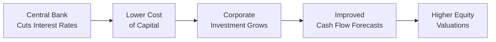

### Overview

So, let’s have a look at something I remember vividly when I was first learning about macroeconomic policy. I was interning at a small investment firm, and it felt like the entire trading floor froze the moment the central bank announced a surprise rate cut—like everyone collectively held their breath! That single unexpected move caused us to recheck our models, shift discount rates, and even take a fresh look at every earnings estimate. It was wild. And that’s just one example of how strongly monetary and fiscal decisions can shake up equity markets. 

Understanding these dynamics is crucial for equity valuation. If you’re preparing for the CFA® exam (and particularly if you’ve tackled Level I), you know that interest rates and government spending directly influence the cost of capital, corporate earnings prospects, and investor sentiment. But now we’ll go deeper, tying these concepts to top-down macroeconomic analysis and seeing how even small policy changes can, well, cause big waves in stock prices.

### The Role of Monetary Policy

Monetary policy is all about how central banks manage the economy through interest rates and the money supply. This includes:

• Open market operations (buying and selling government securities).  
• Setting reserve requirements.  
• Targeting key interest rates—like the benchmark policy rate.  

When central banks lower interest rates (expansionary or "dovish" policy), it usually reduces corporations’ cost of capital. Firms can borrow more cheaply to fund projects, potentially boosting profits. Higher valuation multiples often follow from these lower discount rates. On the flip side, if monetary policy tightens (increases rates), companies’ borrowing costs rise, which tends to pressure margins and compress valuation multiples.

#### Practical Example: Lowering Interest Rates

Imagine a tech startup that had been putting off a big R&D project because interest costs were too high. Suddenly, the central bank cuts rates aggressively. This startup’s CFO can now lock in cheaper financing, pour money into R&D, possibly accelerate growth, and maybe even expand into new markets. That improved growth narrative typically earns a higher valuation from equity analysts. Share price might rise—sometimes quickly.

#### Mermaid Diagram of Monetary Policy Flow

Below is a simplified graph that shows how an expansionary monetary policy event might filter through to equity markets:

### Signals from Central Banks

Central bank statements, such as those from the Federal Reserve’s Federal Open Market Committee (FOMC), can offer forward guidance on rate trajectories. The language they use—so-called “dovish” if it hints at continued low rates or more accommodative measures, or “hawkish” if it suggests impending rate hikes—can pivot investor sentiment practically overnight. 

• A dovish stance means more liquidity and cheaper capital, often driving up riskier assets like equities.  
• A hawkish stance signals that rates might climb to rein in inflation, which can dampen equity prices—especially in rate-sensitive sectors like utilities and real estate.  

These announcements are often baked into valuations before they’re even official, thanks to market speculation. So, if policy comes in more aggressive than predicted (a surprise hike), equities might correct downward, reflecting a higher discount rate on future cash flows.

### Fiscal Policy Considerations

Now let’s shift gears to fiscal policy: taxes, government spending, subsidies, and so on. Fiscal policy also packs a big punch in shaping companies’ bottom lines and consumers’ disposable income. In many ways, when the government invests or stimulates, the corporate sector can gain from higher demand, but if taxes rise, both consumers and companies may feel a pinch.

#### Government Spending and Sector Opportunities

Large infrastructure spending can jumpstart construction, materials, and industrial firms. If you think of a giant new highway project, it isn’t just asphalt suppliers that benefit—cement, heavy equipment manufacturers, local workforce, municipal services, and so on might see a boost. Thus, from an equity valuation perspective, analysts might upgrade entire sectors if a new fiscal bill is passed.

At the same time, keep an eye on the extent and duration of the spending. Sometimes there’s a massive appropriation one year, but it may fizzle out quickly if the political environment changes. 

#### Tax Policy in Action

Tax hikes reduce disposable income, meaning consumers buy fewer goods and services. Corporations may see margins squeeze if tax rates on profits rise. By contrast, a corporate tax cut can free up capital for stock buybacks, dividends, or expansion—often pushing up share prices.

### Immediate vs. Long-Term Effects

Monetary and fiscal policies can cause immediate stock market responses, but the real economy effect often takes time to materialize. For instance, an announced tax cut might spark a short-term equity rally based on higher expected earnings, but the genuine impact on consumer spending and corporate investment can take quarters (or years) to play out.

• Short-term: Sentiment, market psychology, and knee-jerk pricing can dominate.  
• Long-term: Watch how interest costs, government debt levels, inflation, and overall economic growth shift. Persistently large budget deficits may lead to higher long-term interest rates, offsetting the immediate positive effects of stimulus.

### Constraints and Political Factors

In real life, policies aren’t formed in a vacuum. Political grids, legislative negotiations, election cycles, or simply public opinion can slow down or shape any measure. Even if central banks are, in theory, independent, political pressures can influence their decisions (or at least how markets perceive those decisions). Analysts need to remain flexible and update valuations as new developments unfold—in short, a good top-down assessment includes reading the political tea leaves too.

### Policy Shocks and Equity Markets

Policy shocks are sudden, unexpected changes in monetary or fiscal policy—like a surprise interest rate cut or a last-minute stimulus package. These can trigger abrupt revaluations of stocks. You might see:

• Rapid repricing: Within minutes of a shock, equity indices can jump or slump.  
• Divergent sector impacts: Rate hikes usually hammer rate-sensitive sectors the hardest, while expansions in government healthcare spending might benefit pharmaceutical and biotech companies.  

#### Building Scenario Analyses

One approach is to run “what-if” scenarios in your valuation models. For example, if you suspect a policy shock might come, you can test different discount rates or changes in the growth assumptions. Suppose the central bank might slash rates from 5% to 3.5% unexpectedly—how does that alter your equity risk premium? Or if a new administration might pass a sweeping green energy bill, can you factor in a 20% revenue jump for renewable energy stocks?

By incorporating these scenarios, you demonstrate to clients, or to yourself during an exam, that you’re thinking about macro risk. 

### Exam Tip: Policy Reaction Functions

You’ll often see vignettes in the CFA exam describing a potential shift in policy (or quoting a central bank official’s latest release) and asking you to evaluate the likely effect on discount rates, the cost of capital, or sector returns. Remember:

• Don’t just memorize definitions of expansionary or contractionary policy—illustrate cause and effect.  
• Identify which industries thrive or suffer under each policy scenario.  
• Integrate both short-term sentiment shifts and long-term structural changes into your analysis.

### Practical Application on Equity Valuation

In real-life investing (and in exam item sets), keep a structured approach:

• Gather Macro Data: Collect interest rate forecasts, inflation data, and unemployment trends.  
• Track Central Bank Guidance: Look for signals that might push yields up or down.  
• Monitor Fiscal Announcements: Pay attention to new budget proposals, tax legislation changes, and infrastructure spending hints.  
• Adjust Valuation Inputs: Adapt your discount rate or cash flow forecasts when meaningful policy changes appear likely.  
• Notice Cross-Asset Clues: Suddenly higher yields on government bonds could pressure certain equities, while expansionary fiscal measures might boost cyclical stocks.

By weaving policy updates into your sector or industry rotation strategies, you can potentially stay ahead of major shifts or at least be prepared rather than blindsided.  

### Best Practices and Common Pitfalls

• Best Practice: Remain flexible and frequently revisit your top-down assumptions. It’s amazing how quickly a Fed pivot or a sudden government stimulus can blow up a prior forecast.  
• Common Pitfall: Overreacting to day-to-day political news. Yes, policy matters, but it also moves slowly through legislatures, committees, and revision processes. Avoid swinging your portfolio on every headline.  
• Best Practice: Diversify across sectors with different policy sensitivities. Some industries benefit from lower rates; others might hold up if rates climb.  
• Common Pitfall: Underestimating second-order effects such as how bigger government deficits might push up inflation expectations, or how short-run investor euphoria may not be sustained if policy fundamentals are weak.

### Conclusion and Exam Tips

On exam day, be ready to interpret a policy scenario in a vignette. If you’re told that the government just enacted a large infrastructure spending bill, interpret how that might surge demand for raw materials, create jobs, and possibly pressure interest rates over time if debt issuance swells. Or if the question highlights that the central bank is aggressively raising rates to quell inflation, anticipate how that might tighten credit conditions, lower consumer spending, and raise discount rates for equities.

Being prepared means:

• You respond not merely with “expansionary policy equals rising equity prices” but with a nuanced viewpoint—consider the context, the timeline, the sector, and the political climate.  
• You show the link from lower rates to lower discount rates to higher net present value of future cash flows (and vice versa).  
• You manage time in multi-part item sets by focusing your answer on direct cause-effect relationships.

Stay flexible, think critically, and keep an eye on the bigger macro picture. You’ll be ready to tackle those macro-related valuation questions with confidence.

---

### References and Further Reading

• CFA Institute Level II Curriculum, “Monetary and Fiscal Policy” Readings.  
• Blinder, A. S. (2013). After the Music Stopped: The Financial Crisis, the Response, and the Work Ahead. New York: Penguin.  
• IMF Working Papers on Monetary and Fiscal Policies:  
  https://www.imf.org/en/Publications/search?series=IMF+Working+Papers  

---

## Test Your Knowledge: Monetary & Fiscal Policy in Equity Valuation



### Monetary policy generally influences equity valuations primarily through which of the following channels?

- [ ] Tax policy and infrastructure spending
- [x] Short-term interest rates and the money supply
- [ ] Long-term government spending plans
- [ ] Consumer tax rebates

> **Explanation:** Monetary policy is executed through actions like adjusting short-term interest rates and the money supply, which in turn affects corporate discount rates and overall equity valuations.

### Which scenario best describes a “hawkish” stance by a central bank?

- [ ] Maintaining interest rates at current levels for a prolonged period
- [x] Signaling rate hikes to combat rising inflation
- [ ] Injecting liquidity through open market purchases
- [ ] Reducing capital requirements for commercial banks

> **Explanation:** A hawkish central bank typically leans toward increasing interest rates to curb inflation, which often pressures equity prices.

### If the government dramatically expands infrastructure spending, which sector is most likely to see an immediate boost?

- [x] Construction and building materials
- [ ] Fast-food restaurants
- [ ] Software development
- [ ] Consumer electronics

> **Explanation:** Infrastructure projects directly increase demand for construction, materials, and related industries.

### A sudden, unexpected rate cut by the central bank often leads to which immediate impact on equity valuations?

- [ ] Decrease in corporate earnings per share
- [x] Increase in equity valuations due to lower discount rates
- [ ] General slowdown in corporate investment
- [ ] Increase in capital costs

> **Explanation:** Rapid rate cuts tend to lower the cost of capital, raise the net present value of future cash flows, and boost equity valuations, at least in the short term.

### Which of the following statements accurately describes a challenge with large fiscal deficits over time?

- [ ] They always increase equity valuations
- [x] They may lead to higher long-term interest rates and inflation
- [ ] They must be supported by immediate tax surpluses
- [ ] They have no effect on monetary policy decisions

> **Explanation:** Persistent large deficits often require increased government borrowing, which can push up interest rates over time and contribute to inflationary pressures.

### When analyzing a policy shock, which approach is most appropriate for an analyst valuing a stock?

- [ ] Ignoring macro factors to focus on fundamental ratios only
- [ ] Waiting for the CEO’s public statement
- [ ] Immediately selling the position to avoid uncertainty
- [x] Building scenario analyses that adjust discount rates and growth assumptions

> **Explanation:** Scenario analyses allow analysts to test various assumptions about discount rate changes or altered growth paths, providing a more robust valuation framework.

### Which is a potential long-term impact of contractionary monetary policy?

- [x] Slower economic growth and lower corporate profit growth
- [ ] Increased inflation
- [ ] Rapid surge in equity valuations
- [ ] Expansion of consumer credit

> **Explanation:** Contractionary monetary policy aims to slow the economy to prevent overheating, which can reduce corporate profit growth over time and weigh on equity valuations.

### In a top-down equity analysis, why is it crucial to consider political factors alongside fiscal policy announcements?

- [ ] Because most equity valuations ignore fiscal measures
- [ ] Fiscal policy is determined solely by the central bank
- [ ] Politicians never change fiscal policy once proposed
- [x] Policy implementation can be delayed or altered due to legislative or political constraints

> **Explanation:** Fiscal measures often face debates, amendments, and potential gridlock, so the actual economic effect may differ from initial announcements.

### What is the key mechanism by which a tax cut can boost equity valuations?

- [ ] It forces companies to reduce prices
- [ ] It immediately decreases future stock dilution
- [x] It increases disposable income and corporate after-tax earnings
- [ ] It only affects bond markets

> **Explanation:** Tax cuts can stimulate consumer spending (leading to higher revenues) and raise corporate net income, thereby improving equity valuations.

### True or False: A dovish central bank stance typically leads to lower interest rates and often has a supportive effect on equity markets.

- [x] True
- [ ] False

> **Explanation:** A dovish stance implies lower interest rates or more accommodative policy, which can reduce discount rates on equity valuations and thus support higher stock prices.


