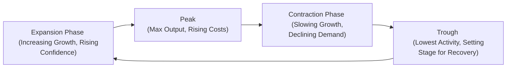

## Understanding Sector Rotations and the Business Cycle

Sector rotation is a dynamic investing strategy that involves shifting portfolio allocations across different segments of the equity market, depending on where we are in the economic cycle. In broad terms, different sectors respond uniquely to expansions, peaks, contractions, and troughs. While we can sometimes overcomplicate this approach with dozens of minor details, the overarching principle is quite simple: Identify which sectors will likely thrive or flounder as macroeconomic conditions shift, then adjust your weightings accordingly.

I recall the first time I tried sector rotation in my own portfolio (this was way back when my coffee budget was bigger than my actual portfolio!). I was convinced technology stocks would never dip. Of course, expansion gave way to a slowdown, and guess what: my tech-heavy portfolio took a bigger hit than I anticipated. That experience taught me that paying attention to the business cycle—and specifically anticipating changes—can help navigate those twists and turns.

Below, we’ll walk through the nature of each phase of the business cycle, consider the key economic indicators, and discuss how to tilt your portfolio in anticipation of (or reaction to) macroeconomic changes.

## Phases of the Business Cycle

Most economic analyses boil the business cycle down to four phases: expansion, peak, contraction, and trough. Let’s illustrate this with a Mermaid diagram to make it more visual:

• Expansion: Economic output, employment, and consumer spending all rise. Businesses see robust demand, corporate earnings grow, and new investments surge.  
• Peak: The economy reaches a high point—production, sales, and earnings are strong, sometimes so strong that inflation or supply bottlenecks can creep in.  
• Contraction: Growth slows, corporate profits can flatten or decline, and unemployment typically ticks up. Consumer confidence falls, leading to weaker spending.  
• Trough: The lowest point in the cycle. Eventually, conditions stabilize, bargains emerge, and the economy is primed for the next expansion.

### Sector Outlook by Phase

• Expansion: During expansions, cyclical stocks such as consumer discretionary, technology, and industrials often outperform. If the economy is humming, consumers dine out more, buy new cars, and upgrade gadgets—driving revenue in these more “luxury” or cyclical segments. Financials may benefit from rising lending activity.  
• Peak: As the economy nears a peak, inflationary pressures can appear. Resource-oriented or commodity-based sectors (e.g., energy) may do well if prices rise. Rate-sensitive segments or those reliant on cheap financing can start seeing pressure if interest rates creep up.  
• Contraction: Defensive or non-cyclical sectors, including utilities, consumer staples (food, household items), and healthcare, tend to hold up better. People still pay their electric bills and buy everyday essentials—regardless of an economic pullback.  
• Trough: Firms that are poised to benefit most from renewed demand—cyclical sectors—can lead the rebound. Investors who recognize signs of a mending economy often reallocate capital into riskier sectors before the data confirms the turnaround.

## Role of Leading, Coincident, and Lagging Indicators

Identifying the phase of the cycle is part art, part science. Economists and analysts look at a range of metrics that signal whether the cycle is about to turn or is firmly entrenched.

### Leading Indicators
Leading indicators are those that hint at changes before they manifest in official broad measures. Examples include:  
• New orders (e.g., manufacturing new orders, durable goods orders).  
• Building permits (housing starts often flag changes in construction activity).  
• Consumer sentiment (indexes measuring optimism about future personal finances).  
• Stock market performance (equities often move ahead of realized changes in corporate profits).  

They are valuable because they give us that early warning—like seeing dark clouds on the horizon before the rain hits.

### Coincident Indicators
Coincident indicators move in tandem with the broader economy. They help confirm the present situation. Some standard coincident indicators include:  
• GDP growth.  
• Real incomes and payroll data.  
• Industrial production.  

If these metrics are strong and continuing to rise, you know the economy is likely in an expansion or near its peak.

### Lagging Indicators
Lagging indicators appear after major economic changes have already occurred. They help validate or confirm shifts in the cycle:  
• CPI-based inflation data.  
• Outstanding loans or credit card delinquencies.  
• Business inventory levels.  

While they’re not as useful for pivoting your strategy beforehand, they can confirm that a contraction has ended or that inflation is indeed rising, helping you finalize your capital allocation decisions.

## Portfolio Allocation Strategies

A sector rotation strategy often merges macro forecasting with industry fundamentals. We can break it down into these steps:

1. **Establish an Economic Outlook**  
   Are leading indicators suggesting an acceleration or downturn? Maybe your analysis points to a consumer slowdown coming in a few months.

2. **Identify Potential Winners and Losers**  
   If you expect a continued expansion, cyclical industries (like discretionary, tech, industrials) might get the nod. If the data suggests a downturn, rotate into defensives or possibly increase your cash or bond holdings.

3. **Pick Stocks or ETFs Within Key Sectors**  
   Once you determine which sectors you want to overweight or underweight, do your usual bottom-up analyses—compare P/E ratios, growth prospects, dividend yields, balance sheet strength, etc.

4. **Reassess and Adjust**  
   Keep an eye on new economic data releases. Nothing is worse than ignoring changing conditions because you’re married to your forecast. If the data changes, assess again and consider rotating.

### Risk and Reward Considerations

• **Cyclical Sectors:** Offer potentially higher returns in expansions but usually suffer more in contractions. These equities often exhibit higher beta. Expect more volatility; be sure your time horizon and risk tolerance match that profile.  

• **Defensive Sectors:** Generally produce stable earnings and pay dividends: staples, utilities, and healthcare. They might underperform in a booming economy, but they can help preserve capital when the music stops.  

Modern portfolio theory would encourage a blend of these sectors depending on your overall risk budget. If you have a long runway and can handle some drawdowns, you might overweight cyclical sectors early in an expansion. If you’re more cautious, you might progressively shift to defensive stocks as macro data suggests an upcoming slowdown.

## Impact of Globalization

One twist in sector rotation is that the global economy rarely moves in perfect unison. Sure, the financial crisis of 2008 was quite synchronized, but in many cases, you’ll see North America heating up while parts of Europe or Asia are slowing. For multinational firms, you should consider:

• **Regional Breakdowns:** An automaker that does 80% of its sales in Asia will probably be more impacted by an Asian slowdown than a U.S. one.  
• **Currency Fluctuations:** Exchange rates, especially if one region’s central bank is raising rates while another’s is cutting. Multinational revenues can shift dramatically based on currency moves.  
• **Trade Policies and Tariffs:** Shifting import/export taxes, trade barriers, or supply chain bottlenecks can tilt the advantage toward local companies or hamper global players.

In a globally integrated world, you might use separate sector rotation strategies for different markets—overweight European consumer staples, for instance, if you see stable growth there, while underweight U.S. industrials if you suspect their cyclical upswing is losing steam.

## Exam Tip—Quick Sector Analysis

In exam item sets, you might see partial macro data (say, rising unemployment claims or a slip in building permits), pointed commentary from a company, or forward-looking statements in the vignette. Often, the question is: “Which sector would the analyst most likely overweight given the described environment?” You’ll want to train yourself to quickly connect:

• **Leading Indicator Change → Market Phase Implication → Sector Preference**  

The trick is to be sure you don’t overcomplicate. If new orders are dropping sharply and consumer sentiment is down, that typically points to an upcoming contraction. Defensive sectors become your prime candidate. If you see a surge in new consumer credit and building permits, that’s usually a sign of an early or mid expansion—cyclicals hold appeal.

## Practical Application

A quick but effective exercise is to map out each phase of the cycle and note your sector rotation approach. For instance:

| Business Cycle Phase | Sectors to Overweight                        | Sectors to Underweight                   |
|----------------------|---------------------------------------------|------------------------------------------|
| Early Expansion      | Consumer Discretionary, Financials, Industrials | Utilities, Consumer Staples             |
| Mid/Late Expansion   | Technology, Materials, Some Energy Stocks   | Defensive Sectors (unless valuations are compelling) |
| Peak                 | Commodities/Energy (if inflation is rising) | Rate-Sensitive Stocks                    |
| Contraction          | Consumer Staples, Healthcare, Utilities     | Cyclicals (Restaurants, Autos, Travel)  |
| Trough (Early Recovery) | Cyclicals again (they rebound fast)         | Overvalued Defensive Names              |

Of course, real life doesn’t always fit neatly into boxes. You’ll want to layer on company-specific fundamentals (profit margins, debt levels, competitive advantages) before finalizing allocations.

## Bringing It All Together

One final note: sector rotation isn’t about perfection. Even analysts with decades of experience can get it wrong—macroeconomic cycles can quickly pivot due to geopolitical events, policy shifts, and black swan occurrences. Stay flexible, keep an open mind, and lean on multiple data sources. Over time, you’ll refine your ability to spot signals that others might overlook, potentially giving you an edge in your portfolio returns.

## Glossary

• **Business Cycle**: Fluctuations in economic activity, including expansion, peak, contraction, and trough.  
• **Cyclical Stocks**: Equities strongly correlated with the overall economy (e.g., automotive, hospitality).  
• **Defensive Stocks**: Equities offering stable revenues and dividends, such as utilities or consumer staples.  
• **Leading Indicators**: Early signals of future economic activity (new orders, building permits).  
• **Coincident Indicators**: Measures that reflect current economic conditions (employment, real-time GDP).  
• **Lagging Indicators**: Data that confirm observed trends after the fact (inflation, loan delinquencies).  
• **Sector Rotation**: Shifting investment focus among different stock market sectors depending on economic or business cycle forecasts.  
• **Overweight/Underweight**: Allocating more or less capital to a sector relative to a benchmark.

## Exam Day Strategies and Pitfalls

• Quickly Identify the Cycle Stage: When reading a vignette, underline data points that reveal whether leading indicators are trending up or down.  
• Adjusting for Global Discrepancies: If you see mention of one region accelerating while another slows, weigh the multinational’s geographic revenue exposure.  
• Don’t Over-Look for Perfection: The exam might mix some conflicting data (like a resilient housing market but weakening consumer sentiment). Pick the strongest signals and craft the best-supported conclusion.  
• Remember Defensive vs. Cyclical: When in doubt, cyclical names shine in expansions; defensive stocks shine in contractions.  
• Watch for Monetary/Fiscal Policy Hints: Tightening or easing policy can have a huge influence on interest-rate-sensitive sectors like financials or utilities.  

Keep practicing: The more you connect real-world economic data to sector performance, the sharper your instincts will become.

## References and Further Reading

• CFA Institute Level II Curriculum, “Equity Market Analysis and Sector Rotation.”  
• Fabozzi, F. (Ed.). (2018). Handbook of Finance and Investment Management. Hoboken, NJ: Wiley.  
• U.S. Federal Reserve Beige Book (regional economic conditions): https://www.federalreserve.gov/monetarypolicy/beige-book-default.htm  

--------------------------------------------------------------------------------

## Test Your Knowledge: Sector Rotation and the Business Cycle



### Regarding the business cycle, which phase often comes after a peak and is characterized by slowing earnings growth and rising unemployment?
- [ ] Expansion
- [ ] Peak
- [x] Contraction
- [ ] Trough

> **Explanation:** A contraction follows the peak and typically involves declining business activity, lower company earnings, and increasing unemployment.

### Suppose a leading indicator shows a sudden spike in building permits. Which sector is most likely to benefit from this change in the near term?
- [x] Industrials and Consumer Discretionary
- [ ] Healthcare and Utilities
- [ ] Consumer Staples
- [ ] Precious Metals and Mining

> **Explanation:** Rising building permits often signal an upcoming expansion in the construction and housing market, boosting industrial and consumer-oriented sectors that feed off home building and renovation demand.

### An economy shifts from a trough into a strong expansionary period. Which of the following industries might investors overweight to capitalize on renewed consumer spending?
- [ ] Utilities
- [ ] Consumer Staples
- [x] Automobiles
- [ ] Tobacco

> **Explanation:** Automobiles are typically cyclical. When the economy recovers, higher discretionary income often stimulates spending on cars, making auto stocks attractive.

### A massive drop in new orders for manufactured goods likely indicates which of the following?
- [ ] That peak conditions persist
- [ ] An imminent expansion
- [x] An upcoming slowdown or contraction
- [ ] No change in the business cycle

> **Explanation:** A drop in orders is a leading indicator of a downturn, so it suggests the economy may be heading into a contraction.

### If a portfolio manager anticipates rising interest rates and slower growth are on the horizon, which portfolio adjustment is most consistent with a defensive approach?
- [ ] Overweight technology and industrials
- [x] Overweight consumer staples and utilities
- [ ] Underweight utilities and healthcare
- [ ] Overweight large commercial banks

> **Explanation:** Staples and utilities are considered more defensive. They often maintain stable revenues and dividend yields even in a weaker economic environment.

### Which of the following indicators is a lagging indicator rather than a leading one?
- [ ] Consumer sentiment
- [ ] Building permits
- [ ] New orders
- [x] CPI-based inflation rate

> **Explanation:** CPI-based inflation is considered a lagging indicator. High inflation might confirm prior increases in economic activity but doesn’t necessarily predict future trends.

### In globally oriented sector rotation, analysts should pay particular attention to:
- [x] Regional growth divergences and currency fluctuations
- [ ] Only major U.S. leading indicators
- [ ] Local consumer sentiment indexes in small economies only
- [ ] National tax codes for capital gains

> **Explanation:** Global sector rotation must incorporate differences in regional economic growth cycles, as well as currency impacts for multinational corporations.

### A portfolio overweight in cyclical stocks is most vulnerable to losses during:
- [ ] Early expansion
- [ ] Late expansion
- [ ] Trough
- [x] Contraction

> **Explanation:** Cyclical stocks generally decline the most during contractions when consumer and business spending slow significantly.

### Which macroeconomic data point is considered a coincident indicator?
- [ ] Average weekly hours in manufacturing
- [x] Real GDP growth
- [ ] Real estate building permits
- [ ] Outstanding bank loans

> **Explanation:** Real GDP is widely regarded as a coincident indicator that moves in step with overall economic performance.

### True or False: Defensive stocks like utilities typically outperform during later stages of an expansion.
- [ ] True
- [x] False

> **Explanation:** Defensive stocks tend to outperform when growth slows or when the economy moves into recession. During late expansions, cyclical or resource-oriented sectors often outperform.


