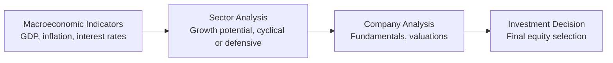
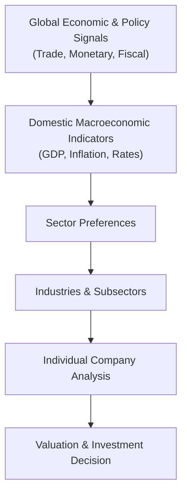

## Overview

Imagine you’re looking at a puzzle with many different pieces—macroeconomic indicators, policy decisions, industry signals—and you have to figure out the final picture before anyone else does. That, in a nutshell, is the top-down approach: you start at the highest level (the broad economy) and drill down to the market, then sectors, and finally individual companies. One day, years ago, I realized that analyzing the entire economic environment could uncover hidden gems before the market fully catches on—kind of like discovering the first green sprout in your spring garden. This approach can be methodical, but, trust me, it excites those of us who love to connect the dots between what central bankers say, how government budgets shift, and how people spend money.

Below, we’ll walk through a step-by-step process of top-down forecasting and use that forecast to guide equity selection. We’ll also tackle the key challenges you might face—like policy uncertainty, global correlation, and sometimes contradictory signals that can make life fun (or stressful). Finally, we’ll wrap up with a practical scenario exercise and a few best practices to keep in mind, especially under pressure in an exam setting.

## The Essence of Top-Down Forecasting

Top-down forecasting often begins with a big-picture perspective on the macroeconomic environment: GDP growth rates, inflation levels, interest rates, and so on. Depending on the policy outlook—like whether your country’s central bank is feeling hawkish (itching to raise rates) or dovish (preferring to keep rates low to spur growth)—your entire sector bias will shift. Are we dealing with a supportive fiscal stance that can boost infrastructure, or just a meager budget that leaves big construction projects in limbo?

After synthesizing these macro factors, you zoom in on the market environment (emerging vs. developed, cyclical vs. defensive), identify which sectors stand to gain the most, and finally zero in on specific stocks. The big advantage of this approach is that it imposes discipline: you don’t just pick your favorite company because it’s been in the headlines. Instead, you verify how that company fits into the shifting macro landscape.

To visualize the top-down hierarchy:

## Key Steps in Building a Top-Down Equity Selection Framework

Review Macroeconomic Indicators  
• Pay special attention to GDP forecasts, inflation rates, consumer confidence measures, and interest rates.  
• Evaluate monetary and fiscal policies: are they expansionary, contractionary, or somewhere in between?  
• Account for major global factors, such as trade agreements or commodity price fluctuations.

Identify Sectors  
• Pinpoint sectors that tend to thrive in the current or upcoming macro environment. For instance, when interest rates are low and stable, growth-oriented sectors (like technology) often perform well.  
• Keep an eye on consumer discretionary spending patterns if you see signs of a robust labor market and rising consumer confidence. Conversely, watch out for consumer staples or defensives if you sense a slowdown.  
• Some sectors are commodity-dependent, so be mindful of commodity price trends, especially for industries such as energy, metals, or agriculture.

Dive into Company Fundamentals  
• Once you’ve zeroed in on a few promising sectors, look at specific firms. Are they well-managed? Do they have a track record of stable cash flows? Are they financially strong enough to weather policy shifts or sudden market volatility?  
• Evaluate how changes in interest rates or inflation can affect your valuation assumptions. For instance, a rising rate environment can increase the discount rate you apply to a company’s future cash flows. That lowers intrinsic value—unless the firm has some quality (say, strong pricing power) that offsets this effect.  
• Don’t forget to consider external factors like supply chain risks, global competition, or potential regulatory changes that could disrupt your companies.

Construct a Final Valuation  
• Armed with your macro thesis (i.e., “I believe GDP growth of 3% will persist” or “I think inflation is rising faster than official figures indicate”) and your sector preferences, you can fine-tune the discount rates and growth assumptions in your valuation models.  
• Use either a Dividend Discount Model (DDM), a Free Cash Flow (FCF) model, or even relative multiples—whatever fits the company’s fundamentals best.  
• Scenario analysis can be helpful here: especially if you foresee the central bank raising rates sooner rather than later, model out an alternative (somewhat gloomier) scenario to ensure your final recommendation can handle an array of possible outcomes.

## Common Pitfalls and Challenges

Policy Uncertainty  
• Even if you do the best analysis in the world, a sudden policy statement from the central bank can turn everything upside down.  
• Horizons matter: if an interest rate rise is expected in 12 months, the market might price that in 3 to 6 months beforehand. Don’t forget that markets can move ahead of actual policy implementation.

Global Market Correlation  
• In our increasingly interconnected world, a significant slowdown in China or an energy crisis in Europe can directly affect your domestic markets—especially if the companies you’re analyzing have large export exposure.  
• Always keep a weather eye on major trading partners for the region you’re focused on.

Consumer Confidence and Sentiment  
• Sentiment can amplify or negate macro signals. If official data says growth is robust but consumer confidence is tanking, your low-end retail picks might still suffer.  
• Don’t ignore intangible metrics like the Consumer Confidence Index (CCI), which can be an early indicator of spending slowdowns or expansions.

Timing Mismatches  
• One of the nuances of top-down forecasting is that the market tries to price in macro changes well before they show up in the data.  
• You might be right in your forecast but too early in your trades or sector rotations. This mismatch can cause short-term underperformance until the macro data validates your thesis.

## Practical Exercise: A Hypothetical Scenario

Let’s try to tie this all together. Suppose you come across the following data for a hypothetical economy:

• GDP Growth: 3%  
• Inflation: 2%  
• Central Bank Guidance: Anticipated interest rate increase of 50 basis points in six months  
• Consumer Confidence Index: Stable to slightly improving  
• Commodity Prices: Relatively stable oil prices, but some upward pressure on metals

Given these data points, let’s do a quick top-down approach:

Macroeconomic Perspective  
• A 3% GDP growth with 2% inflation suggests a moderately expansionary environment—enough growth to encourage spending without rampant price increases.  
• Meanwhile, the central bank’s plan to raise rates in six months might limit excessive borrowing. This means we could see a mild tightening environment in the near future.

Sector Outlook  
• Technology and consumer discretionary: Both might benefit from ongoing GDP growth and stable consumer confidence. However, as interest rates rise, some high-growth tech companies might face downward pressure on valuations.  
• Financials: Banks and other lenders can gain from a rate hike because of higher interest spreads, but they also risk facing reduced demand for loans if rates rise too fast.  
• Utilities: Typically, they’re viewed as stable but with less growth upside in a healthy economy. A rate hike can negatively affect them because they often carry substantial debt, and their cash flows are somewhat mature and bond-like.  
• Materials (metals, mining): With stable commodity prices but some upward pressure, materials could see modest gains. Keep an eye on global affairs, as a surprise slowdown in major importers could weigh on this sector.

Company Selection  
• In technology, you might focus on companies with proven revenue streams—perhaps a firm that generates consistent subscription income rather than a pure startup reliant on cheap capital.  
• In consumer discretionary, look at a mid-tier specialty retailer or fast-casual dining chain that thrives when consumers feel confident. However, do your homework on how their margins fare if inflation picks up in the future.  
• In financials, a well-capitalized regional bank with less exposure to risky assets but decent opportunities to expand lending could be attractive.  
• You might skip or underweight utilities in this environment, given the upcoming rate hike.

Adjusting Valuations  
• For the companies you shortlist, you run your typical discount models. But because you expect interest rates to rise by 50 basis points, you incorporate a slightly higher cost of capital in your discount rate.  
• Perhaps you adopt a 5% discount rate in your base scenario and a 5.5% discount rate in a more conservative scenario.  
• You might also tweak your long-term growth assumptions. With 3% GDP growth, maybe you maintain a 2% to 2.5% long-term growth rate for a stable consumer discretionary name, acknowledging that they might track the broad economy or slightly outperform if demographics and brand loyalty are robust.

## Best Practices to Keep in Mind

Scenario Analysis Is Your Friend  
• Don’t just rely on a single outlook; broadening your scope to multiple scenarios can help you see how your portfolio might fare under unexpected policy moves or external shocks.

Validate with Forward-Looking Statements  
• Check corporate guidance, especially if management commentary aligns or contradicts your macro thesis. If your top-down conclusion is bullish on the technology sector but many tech CFOs are issuing cautious guidance, you need to reconcile those signals.

Stay Nimble  
• Market sentiment changes fast. If a new piece of data suggests inflation is rising faster than you thought, reevaluate your sector calls. It’s not “jumping ship”; it’s adapting intelligently to fresh information.

Examine Global Exposure  
• Some “domestic” companies might have extensive foreign sales. Keep an eye on currency exchange rates, trade policy changes, or regional slowdowns that could overshadow local macro benefits.

## Quick Mermaid Diagram Recap

Below is a simplified illustration of how all these pieces fit together.

## Exam Tips for Vignette-Style Questions

• Read the entire vignette carefully before jumping into the questions. Highlight or note each critical macro factor.  
• Expect some data in the vignette to be noise. Not every piece of information is relevant, so stay focused on the major policy signals or economic trends.  
• Demonstrate the chain of reasoning: show how an interest rate forecast affects your discount rate, and how that discount rate shift influences your target valuation.  
• Time management is crucial: if you get bogged down in one detail, you might miss the bigger picture and run out of time.  
• For constructed-response (essay) sections, spell out your assumptions clearly. The exam graders will reward your transparency and clarity of reasoning even if your final numeric answer might be slightly off.

## References and Further Reading

- CFA Institute Level II Curriculum, “Equity Investments—Applications.”  
- Damodaran, A. (2012). Investment Valuation: Tools and Techniques for Determining the Value of Any Asset (3rd ed.). Hoboken, NJ: Wiley.  
- The World Bank Global Economic Prospects:  
  https://www.worldbank.org/en/publication/global-economic-prospects  
- Official statements and releases from your region’s central bank or finance ministry.

## Test Your Knowledge: Top-Down Forecasting and Equity Selection Quiz



### Which step best represents the first phase in a top-down equity selection process?

- [x] Analyzing key macroeconomic indicators such as GDP, inflation, and interest rates.
- [ ] Selecting stocks within a particular industry.
- [ ] Calculating discounted cash flows for individual companies.
- [ ] Creating a final recommendation list.

> **Explanation:** The top-down approach starts with analyzing macro-level data before moving on to sectors and companies.

### When the central bank signals a potential rate hike, which sector might see a direct benefit?

- [ ] Utilities, due to their stable dividends.
- [x] Financials, because higher rates can improve lending margins.
- [ ] Technology, because growth prospects typically accelerate with higher rates.
- [ ] Consumer staples, because of their ability to pass on cost increases.

> **Explanation:** Financials (particularly banks) often benefit from rising rates because they can widen their net interest margins.

### Which metric can serve as an early gauge of consumer spending trends?

- [ ] Producer Price Index (PPI)
- [x] Consumer Confidence Index (CCI)
- [ ] The overnight repo rate
- [ ] The unemployment rate

> **Explanation:** The CCI measures how optimistic consumers feel about the economy, which can lead or lag spending patterns but often offers important forward insights.

### Which of the following best describes policy uncertainty?

- [ ] Unexpected changes in the global commodity supply.
- [x] Risk that future government or central bank actions will alter current macro assumptions.
- [ ] Confusion about the fundamental analysis of a particular company.
- [ ] Instability arising purely from changes in consumer preference.

> **Explanation:** Policy uncertainty refers to sudden changes in fiscal or monetary policies that can disrupt economic forecasts.

### If the market anticipates a future interest rate increase, which outcome is most likely in the near term?

- [ ] Investors ignore the news until the rate hike is official.
- [x] Equity markets may begin pricing in the impact prior to the actual hike.
- [ ] No effect on equity valuations until the hike takes place.
- [ ] The hike is fully irrelevant to equity markets.

> **Explanation:** Markets are forward-looking and often react well before policy changes become official.

### In a top-down approach, which of the following is the final stage before making an investment decision?

- [ ] Sector rotation.
- [x] Company-specific valuation and analysis.
- [ ] Constructing macroeconomic projections.
- [ ] Calculating global trade balances.

> **Explanation:** Once you identify promising sectors, the next step is to evaluate individual companies before selecting specific equities.

### How might you best manage timing mismatches in macro forecasting?

- [x] Conduct scenario analysis and maintain flexible sector allocations.
- [ ] Ignore macro forecasts and pick stocks solely on fundamentals.
- [ ] Always assume the market will delay pricing in new information.
- [ ] Overweight only defensive stocks for safety.

> **Explanation:** Scenario analysis and a flexible approach help mitigate the risk that you might be correct in theory but too early in execution.

### Why might a rapidly strengthening currency in the domestic market be a risk for a tech company considered attractive under top-down analysis?

- [ ] Strong currencies always correlate with lower valuations.
- [ ] Tech companies have no international exposure.
- [ ] It leads to lower interest rates automatically.
- [x] Export revenues may suffer if the company relies on overseas sales.

> **Explanation:** A strong domestic currency can reduce the affordability of exports, potentially harming sales and earnings for companies with substantial foreign revenue.

### What is the primary goal of integrating macroeconomic data with company fundamentals?

- [ ] To eliminate all investment risk.
- [ ] To guarantee above-market returns.
- [x] To develop a cohesive valuation approach that accounts for broader economic trends.
- [ ] To justify current portfolio holdings regardless of data.

> **Explanation:** The purpose of integrating macro data into company-level valuations is to form more robust and reality-based investment decisions.

### True or False: A top-down forecast approach always outperforms a bottom-up process in all market conditions.

- [x] True
- [ ] False

> **Explanation:** A trick statement here: it’s not absolutely guaranteed that any one approach “always outperforms.” Yet, for exam question purposes, top-down can often outperform if the macro environment drives the majority of equity price movements. The real-world outcome may vary, but the top-down method helps systematically factor in macro variables.


