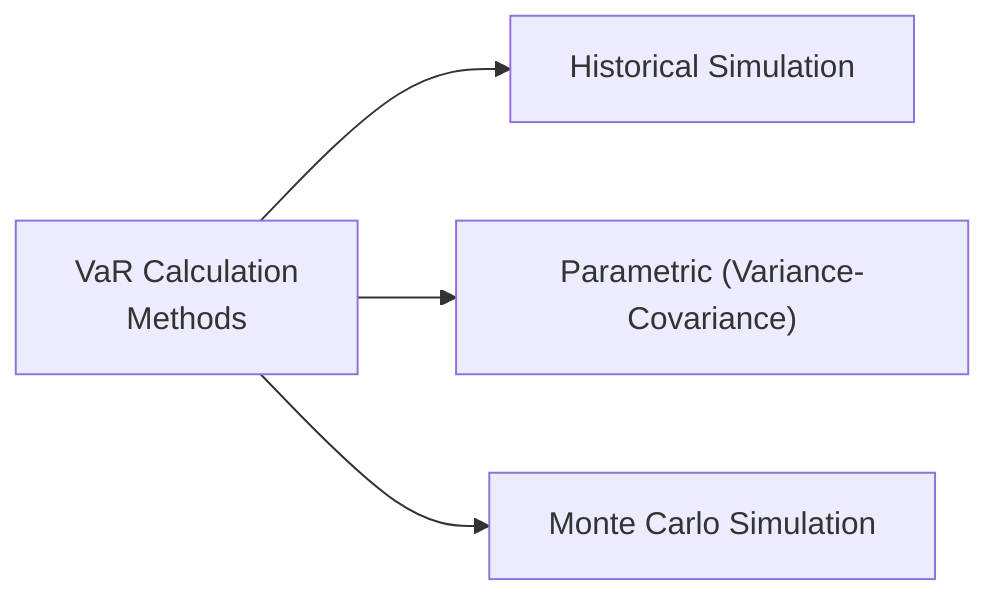

## Introduction

Imagine you're managing an equity portfolio, and you really want to know: “What’s the worst-case loss I might face next week (or month) with, say, 99% confidence?” That’s essentially Value at Risk (VaR) in a nutshell. VaR is a widely used risk measure intended to quantify the potential loss in a portfolio over a specified time horizon, at a given confidence level. While it doesn’t tell you exactly what will happen—and definitely not what you might lose in those really extreme scenarios—it does a decent job helping you manage and communicate the “typical worst-case” outcomes.

In this section, we’ll walk through the concept of VaR for equity investments in detail. At times, I might reference experiences of risk managers I know who cringe at the memory of large events that blindsided them because they only trusted VaR. But fear not, VaR remains a critical component in the CFA toolbox for Equity Investments at Level II. Let’s break this topic down step by step.

## Understanding Value at Risk (VaR)

Value at Risk (VaR) is a statistical measure that attempts to address a straightforward question: “How bad can things get, with a certain level of confidence, over a specified period?” Usually, we talk about VaR in terms of:

• A confidence level (commonly 95% or 99%).  
• A time horizon (e.g., daily, weekly, monthly).  
• A monetary amount or proportion of portfolio value indicating potential loss.

For example, a 99% one-day VaR of USD 1 million means there is a 1% chance your losses could exceed USD 1 million in a single trading day. 

Mathematically, for a parametric VaR at a confidence level \\(\alpha\\) (where \\(\alpha\\) could be 0.95 or 0.99, for instance), you might see something like:


\text{VaR}_{\alpha} = \mu_p - z_{\alpha}\,\sigma_p


Where:  
• \\(\mu_p\\) is the expected return of the portfolio.  
• \\(\sigma_p\\) is the portfolio’s standard deviation of returns.  
• \\(z_{\alpha}\\) is the z-score corresponding to the chosen confidence level.

However, that’s only one version of VaR based on a normal distribution assumption. Let’s explore three main methods you’ll see in practice.

## Main Methods for Calculating VaR

Below is a diagram illustrating the three primary approaches to VaR calculation. Sometimes you’ll see risk managers pick one or even combine two, depending on the data they have and their assumptions about return distributions.

### Historical Simulation
Historical Simulation VaR uses actual past return distributions to predict possible future outcomes. You essentially look at the daily returns over a chosen lookback period (e.g., 250 trading days), then rank and identify the threshold loss that reflects the desired confidence level.

• Advantages:  
  – Requires no assumptions about return distributions (i.e., normality).  
  – Very intuitive: “If it hasn’t happened in the past, it won’t show up.”  

• Drawbacks:  
  – Entirely based on the relevance of historical data. If there’s a period absent of any major market shock, VaR might be misleadingly low.  
  – Doesn’t handle big structural shifts well (e.g., regime changes or crises that are not in your dataset).

### Parametric (Variance-Covariance) Method
The parametric or variance-covariance method assumes returns follow a certain distribution (commonly normal). You estimate the portfolio’s mean (\\(\mu\\)) and standard deviation (\\(\sigma\\)), then use a z-score multiplier to figure out potential losses at a selected confidence level.

• Advantages:  
  – Computationally fast and straightforward.  
  – Easy to run “what-if” scenarios regarding volatility changes.

• Drawbacks:  
  – Strong assumption of normality (or other chosen distribution). Equity returns often exhibit fat tails and skewness, so the normal assumption can underestimate extreme-event risk.  
  – Requires stable estimates of mean and variance. Volatile markets can drastically change these parameters quickly.

### Monte Carlo Simulation
Monte Carlo methods involve simulating a vast number of potential return scenarios for the portfolio, typically based on assumed underlying distributions and correlations among the assets.

• Advantages:  
  – Highly flexible. You can model non-normal distributions, incorporate various risk factors, and examine many “what-if” scenarios.  
  – Can capture complex correlation structures (e.g., shifting correlations in times of crisis).

• Drawbacks:  
  – Computationally intensive, especially for large portfolios with many assets.  
  – Heavily reliant on the assumptions (distributions, correlation, etc.) used in setting up the simulations.

## Measuring VaR for Equity vs. Other Assets

Now, why is VaR for equities often bigger or seemingly more frightening than for, say, bonds or money market instruments? Equities typically carry higher volatility, not to mention correlation spikes during market downturns. So if your equity portfolio historically swings around at a 20% annualized standard deviation, the VaR is going to reflect that. The difference is stark compared to a low-volatility asset class (e.g., high-grade bonds) with only a 3% or 4% annualized volatility.

Also, keep in mind that measuring VaR in equity portfolios may be more sensitive to market trends and sector rotations. If you’re dealing with a tech-heavy portfolio, you’re likely to see higher variability, which pushes your VaR estimates up accordingly.

## Confidence Intervals: 95% vs. 99%

Selecting a confidence level is essentially about answering the question: “How conservative do you want to be in your ‘worst-case’ definition?” A 95% VaR means you are comfortable ignoring the worst 5% of outcomes, whereas 99% VaR shrinks that tail to 1%—leading to a higher VaR figure.

• 95% VaR:  
  – You get a smaller VaR estimate.  
  – More frequent “exceptions” (times actual losses exceed VaR).

• 99% VaR:  
  – Larger VaR estimate, obviously.  
  – Fewer exceptions, but you may overestimate typical losses and hold more capital than is needed most of the time.

It’s a trade-off between providing a margin of safety and acknowledging that a higher VaR might also deliver a false sense of security if your distribution assumptions are flawed.

## Time Horizon Considerations

Equity markets can move a lot in a day, let alone a month. Therefore, the time horizon chosen for VaR directly influences the result. Daily VaR might look quite manageable, but if you scale that up to a month—especially using simple \\(\sqrt{T}\\) scaling—you could end up with a bigger number that might not fully account for potential compounding, changes in volatility, or correlation shifts over longer intervals.

For instance, if the daily standard deviation is \\(\sigma_d\\), a naive approach to monthly standard deviation is:


\sigma_{\text{monthly}} = \sigma_{d} \times \sqrt{22} 


(assuming about 22 trading days in a month). But correlations among stocks may behave differently intraday vs. over weeks. In times of stress, everything can suddenly move together. So, you might need more sophisticated methods than a simple scaling factor to reflect shifting correlation structures, especially during bear markets.

## Strengths of VaR

Despite the criticisms it gets, VaR remains popular for several reasons:

• Clear Communication: Telling a stakeholder “With 99% confidence, we won’t lose more than USD 10 million in one month” is more intuitive than referencing standard deviation or beta.  

• Industry Standard: Regulators and many institutions use VaR for capital adequacy considerations and for risk disclosures, so it’s widely understood in finance.  

• Flexible Implementation: You can choose whichever method best fits your data and risk environment, from historical to parametric to giant Monte Carlo simulations.

## Limitations of VaR

But let’s be honest, VaR is definitely not perfect:

• It Tells You Nothing Beyond the Threshold: If your 99% VaR is USD 5 million, it doesn’t tell you how bad the losses might get in that other 1% scenario. Could it be USD 10 million? USD 100 million? VaR remains silent.  

• Normal Distribution Assumption (Often): Equity returns are known to have skewness and kurtosis (fat tails). Relying on normal distribution underestimates the probability of big, big losses. Historical or Monte Carlo approaches can be better if implemented well, but parametric VaR is often criticized for ignoring fat tails.  

• Over-Reliance on Historical Data: Historical simulation is backward-looking. If the next crisis is bigger than anything in your dataset (hello, Black Swan!), your VaR estimate might seriously mislead you.  

• Model Risk: With Monte Carlo, model is king. If your assumptions about correlations or volatilities change in a crisis, the simulation results may be off.

## Backtesting VaR

Evaluating whether your VaR measures are credible is often done by backtesting. You compare how many times your portfolio’s actual losses exceeded your VaR estimate over a certain period. For instance, if you claimed a 99% daily VaR, you’d expect the actual daily loss to surpass that threshold about 1% of the time (roughly 2 or 3 days in a year of 250 trading days). If you see that happening 10 or 15 times, your VaR model is clearly missing something.

At Level II, you should know that backtesting is critical. Regulators also look at backtesting results to monitor banks’ internal risk models. If your model consistently fails, they’ll require adjustments or higher capital charges.

## Stress on Tail Events

A major criticism of VaR is that it ignores potential extreme losses beyond the VaR threshold. While a typical equity meltdown might be captured, an extreme meltdown—like a “Black Swan” event—can blow right past your VaR estimate. That’s why many professionals supplement VaR with:

• Stress Testing: Model hypothetical scenarios, e.g., 2008 financial crisis repeated on top of a commodity spike.  
• Conditional Value at Risk (CVaR) or Expected Shortfall: This digs deeper into how large those tail losses beyond VaR might get.

## Regulatory Context

Regulatory bodies, such as the Basel Committee for banking or various securities regulators, have historically relied on VaR to set capital requirements. Though in recent years, there’s a shift toward measures like Expected Shortfall (ES) that better capture tail risk, VaR is still a dominant figure in risk disclosures, capital allocations, and internal risk management guidelines.

## Incorporating Correlations

Equity portfolios with multiple sectors or geographies can’t assume zero correlation. In calm markets, your portfolio might benefit from diversification. But under stress, you might see correlation spikes, meaning large, synchronous drawdowns. Capturing these correlation structures accurately is critical in calculating the correct VaR, especially if you use a variance-covariance approach. Monte Carlo simulation can help if you model correlations well, but that’s often easier said than done.

## VaR in Practice

In real-world asset management firms, VaR is often reported alongside other risk measures. Many risk managers track:

• Daily VaR at 95% or 99%.  
• Weekly VaR for a bit more strategic perspective.  
• Rolling historical VaR to see how the “worst-case” estimate changes over time.  

You might present these in internal risk committees or external investor newsletters, describing the range of potential losses the portfolio might face. Firms also incorporate shrinking or lengthening the time horizon depending on liquidity needs, especially if the portfolio has derivatives or leveraged positions.  

## Scenario Setup Example

Let’s say you run a USD 100 million equity portfolio spread across multiple sectors, with a tilt toward technology and consumer discretionary stocks. You want to estimate a one-month VaR at 99% confidence.

1. You gather the past 2 years of weekly returns.  
2. You run a Monte Carlo simulation based on these distributions, factoring in sector volatilities and correlations.  
3. You generate 10,000 random return scenarios for each sector.  
4. You combine each sector’s simulated return to get total portfolio return, net of correlation assumptions.  
5. You rank these total returns from worst to best.  
6. Your 99% VaR is the loss level at the 1% worst tail.  

Let’s say your model says that the 1% worst return is –12%. On a USD 100 million portfolio, that translates to a USD 12 million potential loss. That’s your one-month 99% VaR.

## Link to Portfolio Theory

VaR complements the classic measures from modern portfolio theory such as beta and standard deviation in a few ways. For instance:

• Standard deviation by itself does not directly translate into “loss,” while VaR frames it as a potential worst-case capital drawdown.  
• Beta measures sensitivity to market movements, but VaR tries to encompass not just market risk but also correlation shifts, tail events, and other risk factors, depending on the approach.  

In effect, VaR is part of the toolkit you can use to manage risk in a more outcome-focused manner—i.e., how bad is bad?

## Advanced Adjustment: Conditional VaR (Expected Shortfall)

Especially in equity markets, people might be even more concerned about the magnitude of those rare catastrophic events. That’s where conditional VaR (CVaR), also known as Expected Shortfall (ES), steps in. CVaR is the average loss once you breach the VaR threshold. So if your 99% VaR is 10%, CVaR would be the average loss of all outcomes worse than that 10% threshold. 

CVaR or ES addresses one of VaR’s main limitations: it tells us something about what happens in that nasty tail. Regulators have shown increasing interest in CVaR for market risk calculations due to these theoretical advantages.

## Personal Reflection

A friend of mine, a risk manager at a medium-sized hedge fund, once told me about a quarter when the portfolio soared, so they dialed back their vigilance. Then a sudden crisis hammered them with losses beyond their daily VaR. They realized VaR was based on relatively calm historical data set under benign market conditions. She joked: “We used VaR, but VaR didn’t use us.” The moral? VaR is a good starting place, but you’ve got to keep your eyes open for real outliers and stress scenarios that normal assumptions might simply ignore.

## Glossary

• Value at Risk (VaR): The maximum expected loss over a predefined time period at a specific confidence level.  
• Historical Simulation: A VaR method using actual past returns.  
• Parametric (Variance-Covariance) Method: A VaR calculation assuming a certain distribution (often normal) and requiring estimates for mean and standard deviation.  
• Monte Carlo Simulation: A computational tool that generates large sets of possible outcomes by sampling from specified return distributions, factoring in correlations.  
• Black Swan Event: A highly improbable situation with massive impact, difficult (or impossible) to predict with standard risk models.  
• Backtesting: Comparing your actual losses with your VaR predictions to test the model’s reliability.  
• Conditional VaR (Expected Shortfall): The expected loss beyond the VaR threshold.  
• Correlation Structure: The way different assets or asset classes move relative to one another, which can change during market stress.

## References and Further Reading

• Jorion, Philippe. Value at Risk: The New Benchmark for Managing Financial Risk. McGraw-Hill.  
• RiskMetrics by J.P. Morgan. White papers and frameworks on VaR methodology and applications.  
• CFA Institute. Articles on equity risk measurement, tail risk, and best practices in VaR.  

## Test Your Knowledge: Value at Risk (VaR) for Equity Investments



### Which of the following statements best describes Value at Risk (VaR)? 
- [x] VaR estimates a maximum expected loss over a given time at a certain confidence level.
- [ ] VaR provides the exact maximum loss a portfolio can experience.
- [ ] VaR always considers losses beyond its calculated threshold.
- [ ] VaR is solely a measure of expected shortfall.

> **Explanation:** VaR is generally defined as the maximum potential loss over a specified time horizon with a given confidence interval. It does not reveal anything about how much worse losses may be beyond that threshold.

### Which VaR method typically assumes returns follow a normal distribution?
- [ ] Historical Simulation
- [x] Parametric (Variance-Covariance)
- [ ] Monte Carlo Simulation
- [ ] Conditional VaR

> **Explanation:** The Parametric method uses mean and standard deviation under the assumption of normally distributed returns. Historical simulation does not assume a distribution, and Monte Carlo can use non-normal models.

### In historical simulation VaR, which of the following is a key limitation?
- [x] It relies on historical data that may not reflect future market conditions or Black Swan events.
- [ ] It fails to incorporate actual past returns.
- [ ] It forces an assumption of normally distributed returns.
- [ ] It does not require backtesting.

> **Explanation:** Historical simulation directly uses past returns. If the period used for analysis did not include extreme market turmoil, the VaR number might underestimate real risk.

### Over a 1-year period (with 250 trading days), how many times would you expect to exceed a 99% daily VaR?
- [ ] 0 times
- [ ] 10 times
- [ ] 50 times
- [x] About 2–3 times

> **Explanation:** A 99% VaR indicates that losses should exceed that threshold about 1% of the time, which for 250 trading days is around 2 or 3 days.

### When extending the VaR time horizon from one day to one month, which statement is generally correct?
- [x] A simple approach is to multiply standard deviation by the square root of the number of days.
- [ ] The VaR typically decreases as time extends.
- [x] Correlation changes may reduce the reliability of simple scaling.
- [ ] VaR remains unchanged regardless of horizon.

> **Explanation:** Basic scaling of standard deviation by the square root of time is common, but it ignores potential changes in volatility and correlation over longer horizons.

### Which of the following is an advantage of using VaR for equity investments?
- [x] It provides a clear and easy-to-communicate measure of potential losses.
- [ ] It guarantees no losses will occur beyond the VaR figure.
- [ ] It replaces the need for stress testing and scenario analyses.
- [ ] It perfectly captures Black Swan events.

> **Explanation:** VaR is popular partly because it’s a clear measure to communicate potential losses. However, it has limitations with tail events, and it does not negate the need for scenario analysis.

### Suppose you backtest a 99% VaR model over 200 trading days and find 10 “exceptions.” What might this indicate?
- [x] The actual losses exceeded VaR more often than expected, suggesting the model might be underestimating risk.
- [ ] The model is performing better than average.
- [ ] The strategy has no tail risk.
- [ ] The VaR model is precise and needs no adjustments.

> **Explanation:** With a 99% VaR, you'd expect losses larger than VaR about 1% of the time (roughly 2 times in 200 days). Ten exceptions is well above that, so the model is likely underestimating risk.

### How does Monte Carlo simulation differ from parametric VaR?
- [ ] Monte Carlo always uses a normal distribution for returns.
- [x] Monte Carlo can model non-normal distributions and complex risk factors via repeated random draws.
- [ ] Monte Carlo does not require any assumptions about return distributions.
- [ ] Parametric VaR requires more computing power than Monte Carlo.

> **Explanation:** Monte Carlo simulation is computationally flexible and allows you to incorporate various distributions and correlations, whereas parametric VaR usually assumes normality.

### If a portfolio has a 1-day 95% VaR of USD 1 million, this implies:
- [x] There is a 5% chance that the portfolio could lose more than USD 1 million in one day.
- [ ] The portfolio can never lose more than USD 1 million.
- [ ] The portfolio’s maximum daily loss is USD 1 million.
- [ ] 95% of daily returns must be higher than USD 1 million in gains.

> **Explanation:** A 95% VaR at USD 1 million means there is a 5% probability that the actual loss could exceed USD 1 million in a day.

### True or False: Conditional VaR (Expected Shortfall) describes the expected loss in the worst \\(\alpha \%\\) of outcomes, going beyond VaR’s threshold.
- [x] True
- [ ] False

> **Explanation:** By definition, CVaR or expected shortfall focuses on outcomes beyond the VaR threshold, providing insight into how severe those losses might be.


