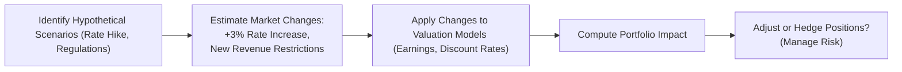

Sometimes I’ll catch myself chatting with a friend who invests heavily in equities—maybe they’ve got a tech-heavy portfolio—and I’ll find myself saying, “You know, a big interest rate spike could send your valuations into a tailspin. Have you ever thought about that?” More often than not, they’ll give me wide eyes and say they’ve heard the term “stress test” but never really tried running one. Then I’ll go on a small rant about how it’s basically the ultimate “what if” for your portfolio—except in a more formal, numbers-driven way.

Stress testing and scenario analysis are core components of effective risk management in equity portfolios, especially when you’re facing the possibility of severe market disruptions or trying to assess what the next crisis could look like. And let’s be real: crises happen. That’s why regulators keep pushing banks, insurers, and big institutions to do these analyses on a routine basis. For a CFA Level II candidate aiming to tackle equity investments from a professional standpoint, being able to design, interpret, and critique stress tests is a vital skill. Let’s walk through the essentials.

## Definition of Stress Testing
Stress testing is the process of evaluating how a portfolio might perform under extreme market conditions. Think of it like taking your car to a desert track in 120°F weather and loading it with extra weight to see if it still runs smoothly. Sure, your day-to-day driving might be in comfortable weather, but you want to know how your car tolerates brutal extremes, right?

In equity portfolios, stress testing is about identifying how your positions—stocks, options, maybe even a few sector-based bets—would react if the market saw an extraordinary shock. Perhaps you remember the 2008 Global Financial Crisis, or in 2020, the pandemic-induced meltdown in a matter of weeks. A formal stress test tries to replicate or approximate those environments to gauge how your portfolio might fare if it had to endure another wave of volatility and panic selling.

A key difference between typical day-to-day risk measurements (like standard deviation or value at risk) and a stress test is the “tail risk” perspective. Stress tests specifically zoom in on large, unusual swings that lie beyond the everyday volatility you measure with normal distributions. They often capture nonlinearities—meaning the portfolio might react in a non-proportional or amplified way once certain thresholds are crossed.

## Scenario Analysis vs. Stress Testing
It’s common to see these two concepts lumped together, but scenario analysis can be broader. While a stress test often focuses on extreme tail events—like a 50% equity market drop or a spike in interest rates by 500 basis points—scenario analysis might explore mild to moderate changes too. Maybe you’re just looking at a scenario where interest rates rise by 1% and inflation creeps up a bit. That might not be as dramatic as a meltdown scenario, but it’s still relevant if you want a complete picture of possible outcomes.

Generally speaking:
• Stress Testing → Usually focuses on severe, “worst-case” market moves.  
• Scenario Analysis → Encompasses a range of potential economic and market developments, from the benign to the catastrophic.

Practitioners often do both. You want to be aware of possible incremental shifts in the economy, but you also must have the ability to test how the portfolio handles big, disruptive events.

## Types of Stress Scenarios
There are two main approaches to building stress scenarios—historical and hypothetical.

### Historical Scenarios
You might say, “Let’s go back in time and pretend we’re living through 2008 again. Or the dot-com bust of 2000. Or the 1987 crash.” In a historical scenario, you recreate the market conditions from a crisis or period of large drawdowns: you look at equity index drops, volatility spikes, credit spreads widening, maybe commodity price shocks. Then you map those changes to each position in your portfolio to see how it would have been affected.  

Historical scenarios are valuable because everyone can remember how gnarly those conditions felt in real time. There’s often concrete market data to feed your models: actual interest rate movements or currency swings that occurred.

### Hypothetical Scenarios
With hypothetical stress testing, you get to conjure up brand-new storms. Imagine a rapid interest rate hike combined with a trade war somewhere. Or a major geopolitical shock that leads to an energy crisis. These might be events that haven’t actually happened—not in the exact combination or magnitude you’re envisioning—but are nonetheless plausible. 

Hypothetical scenarios allow you to stretch the imagination. You can account for newly emerging risks or new structural dynamics in markets that were absent in previous crises. For instance, perhaps now you’re worried about a major data breach or cyberattack crippling a major financial institution, triggering a contagion. Historical data might not capture that risk neatly, so you create a brand-new scenario that simulates it.

## Advantages Over VaR
Value at Risk (VaR) is a popular risk measure that tries to answer, “What is the maximum loss you might face over a given time horizon, at a given confidence level, under normal conditions?” But VaR can sometimes lull you into complacency because it’s typically modeled with assumptions of normality or stable correlations. Extreme tail events can blow these assumptions out of the water.

Stress testing, on the other hand, explicitly focuses on these extreme but plausible events. It brings to light potential exposures that VaR, with its emphasis on typical volatility, might underestimate. Stress testing can reveal “weak spots” in the portfolio that only show up when markets become highly nonlinear—like certain derivative structures that automatically amplify losses once the underlying price moves beyond a set threshold.

## Macro-Level and Micro-Level Stressors
In real life, macro shifts like GDP, inflation, or exchange rates can trickle down to the micro-level performance of individual stocks or sectors. If inflation shoots up, cost structures could change drastically, especially for businesses that rely on commodities. If GDP growth tanks, cyclical sectors might get pounded, while defensive sectors like utilities could hold up better.

For your equity portfolio, you want to consider:
• Industry exposures that could be hit hardest by a particular macro shock.  
• Geographical exposures in case the scenario is region-specific (emerging markets vs. developed).  
• All interplay with interest rates, credit spreads, and currency moves if you have multinational companies or global supply chains.

Sometimes a single macro shock—like a severe recession—can be enough to damage the entire portfolio. Other times, a micro shock, such as an unexpected regulatory crackdown on big tech, might compress valuations in just one sector.

## Single-Factor vs. Multi-Factor Stresses
If you want to keep it simple, you can test just one factor at a time. For example:
• “What if the equity market index falls 20%?”  
• “What if the discount rate for all stocks rises by 100 basis points?”  
• “What if volatility goes up by 50%?”

But let’s be honest—real crises seldom revolve around just one factor. Often, you’ll see a downturn in the equity market, a spike in credit spreads, maybe a slump in GDP growth, and so on. That’s why multi-factor stress testing is essential. You combine two or more adverse movements to see how they compound each other. For instance, if you’re holding cyclical stocks, they might get double-whammied by both an economic slowdown and a surge in interest rates.

## Methodologies for Implementation
Today’s risk managers have a variety of data-driven methods to implement stress tests and scenario analyses:

• Scenario-Based Modeling: Here, you outline your scenario (or multiple scenarios) and apply the estimated changes in macro variables, yield curves, equity indices, etc., to re-price your portfolio.  

• Risk Factor Modeling: You identify the key risk factors that drive your equity valuations—like interest rates, commodity prices, exchange rates, etc.—and systematically shift them in line with your scenario.  

• Advanced Simulation Platforms: Monte Carlo-based engines or other specialized software can generate thousands of simulated paths that incorporate your stress scenario assumptions. With advanced analytics, you can tease out how likely or impactful these stress events might be.

## Sensitivity Analysis
Sensitivity analysis is a bit of a sibling to scenario analysis. Instead of painting a whole picture of the world in meltdown mode, you switch one or two variables at a time and observe the changes in, say, a stock’s price or your portfolio’s net asset value. For instance, you might tweak the discount rate from 8% to 9% to 10% to see how that affects an equity valuation. Or you adjust the growth rate in your DCF model. The exercise reveals how your positions respond to modest changes in key assumptions.

While not as dramatic as a full-blown stress test, sensitivity analysis can highlight which assumptions your valuation is most reliant on. A portfolio might be particularly sensitive to discount rates but not so sensitive to mild growth assumption changes. It’s a good complement to scenario analysis when you want to see precisely how each factor matters.

## Reverse Stress Testing
This might be my favorite approach because it feels a bit like detective work. In a standard stress test, you say, “Here’s a crisis scenario—how badly does my portfolio get hit?” In reverse stress testing, you flip the question to “What scenario would cause me to lose, say, 25% of my portfolio’s value?” Then you backtrack to figure out which risk factor movements could produce that severe outcome.

Reverse stress testing helps you see how vulnerable your portfolio might be and what simultaneous shocks or factor movements would be needed to push it over your personal risk threshold. It’s a crucial exercise for ensuring you haven’t overlooked improbable but destructive risk combinations.

## Data Requirements
Proper stress testing demands robust data:
• Historical price data, especially around crisis periods, to calibrate changes in equity prices, volatility, and correlations.  
• Macroeconomic indicators—GDP, inflation, interest rates, exchange rates, etc.  
• Company fundamentals, particularly if you do bottom-up scenario modeling (e.g., analyzing how a shock impacts corporate earnings).  
• Correlation or covariance estimates, which become crucial if you’re testing multi-asset or multi-factor scenarios.  

Data quality is a huge deal. If you rely on incomplete or outdated info—or you assume correlations that might not hold in a crisis—your stress test results won’t be very useful.

## Communication of Results
It’s all very well to run these fancy models, but how do you communicate the results to other decision-makers, be they senior management or external stakeholders?

Risk managers often summarize stress test results in a short, digestible format: worst-case losses, how likely or plausible the scenario is, and suggested action steps (like portfolio rebalancing, derivatives hedges, or capital cushions).  

One technique is to present a “risk dashboard” that includes a range of stress scenarios—both historical and hypothetical—plus the portfolio’s estimated decline in each scenario. People often appreciate a scatterplot or bar chart that quickly conveys the magnitude of numerical losses.

## Best Practices
• Keep your scenarios updated. A scenario that was relevant five years ago might not be the best representation of today’s markets.  
• Don’t ignore correlation breakdowns. Correlations can spike in a crisis, slamming your portfolio from all sides at once.  
• Combine quantitative and qualitative judgments. Numbers alone might not capture black swan events—sometimes it takes an imagination exercise (the “what if” approach) to foresee systemic shocks.  
• Tie results to actionable steps. A good stress test leads to changes in your hedging strategy, portfolio weighting, or at least a conversation about risk appetite.

## Regulatory Perspective
Big financial institutions are subject to regulatory stress testing, often mandated by local or global oversight bodies. Banks are typically required to hold extra capital in case of severe downturns. While you might be focusing on an equity portfolio in an asset management context, understanding the regulatory environment is still relevant. Regulators appreciate consistent, data-driven stress tests that demonstrate how well an institution or fund is equipped to handle crises.

## Link to Active Portfolio Management
Scenario-based insights can guide portfolio managers in deciding whether to rotate into or out of certain sectors. For instance, if your scenario analysis for the next year suggests a strong dollar environment—maybe triggered by global economic slowdown or a hawkish central bank—then your multinational holdings that rely on overseas profits might be at higher risk. Or perhaps your scenario analysis shows that rising inflation combined with rising real interest rates will erode the discount factor for growth stocks, so you might shift to value stocks.

Active managers who can anticipate and prepare for these possible outcomes might position themselves for strong outperformance—or at least avoid serious losses—if and when the scenario plays out in real life.

## Vignette Example
Let’s imagine a global tech-heavy equity fund. You run two hypothetical scenarios:

• Rapid Interest Rate Hike: Central banks across major economies are forced to fight inflation, pushing interest rates up by 3% within a year. Tech valuations that rely heavily on growth assumptions are discounted more heavily, and your fund experiences a double-digit drawdown. Some of your growth darlings fall 30%–40% in market price.

• Sudden Regulatory Crackdown: Multiple governments in major markets coordinate to introduce stricter privacy laws and limit certain advertising technologies. Several mega-cap tech firms face new revenue restrictions, driving a slump in their stock prices, further amplifying the decline in your portfolio.

In developing these scenarios, you’d estimate changes in interest rates, discount rates for each stock, changes in projected earnings from regulatory impacts, and the correlation among major tech holdings. After that, you quantify the potential loss. You might find that your portfolio would lose 25% in the interest rate scenario but as much as 35% in the regulatory crackdown scenario—leading you to hedge or rebalance accordingly.

Here, the adjacent diagram shows a simplified approach: define your hypothetical scenario, figure out how each risk factor (interest rates, new regulations) changes, re-price your stocks in the new environment, and then see if you need to hedge or reposition. This sort of step-by-step approach can keep you focused on how each factor leads to the final impact on your portfolio.

## Glossary
• Stress Testing: Process of evaluating portfolio resilience by modeling extreme but plausible adverse conditions.  
• Scenario Analysis: Broader technique examining a range of outcomes, not solely extreme ones.  
• Sensitivity Analysis: Isolates and tests the impact of changing one variable at a time.  
• Reverse Stress Testing: Identifies scenarios or conditions that cause severe portfolio losses, effectively reversing the usual approach.  
• Regulatory Capital Requirements: Mandated capital levels to ensure financial institutions can meet obligations even in severe stress.  
• Nonlinearity in Returns: When portfolio reactions to market changes are not proportional (often seen with options or structural factors).  
• Hedging Strategy: Approaches (options, futures, etc.) used to neutralize or reduce risk identified in scenario analyses.  
• Tail Risk: The chance of encountering substantial losses from rare events, often bigger than normal distribution assumptions would suggest.

## References and Further Reading
• IMF and World Bank Financial Sector Assessment Programs (FSAP) – excellent resource for structured approaches to stress testing.  
• Basel Committee on Banking Supervision – provides regulatory guidelines used globally, covering comprehensive stress test frameworks for financial institutions.  
• The Journal of Risk Model Validation – for advanced scenario modeling and validation techniques.  

Finally, stress testing and scenario analysis might seem like an academic exercise until you witness real market turmoil—at which point you really wish you’d run these analyses beforehand. The mind loves to assume “business as usual,” but the markets thrive on unexpected shocks. Armed with these tools, you’re better prepared to catch the waves of volatility and protect your equity portfolio from the worst.

## Test Your Knowledge: Stress Testing and Scenario Analysis Quiz



### Which of the following best describes the primary focus of stress testing within an equity portfolio?
- [ ] To gauge daily fluctuations in asset prices to facilitate high-frequency trading decisions
- [ ] To measure standard volatility under normal market conditions  
- [x] To evaluate how the portfolio might perform under extreme or crisis conditions  
- [ ] To identify equilibrium prices for arbitrage-based trading  

> **Explanation:** Stress testing concentrates on the extreme tail risk and crisis scenarios, beyond the typical day-to-day or “normal” volatility analysis.

### Which statement most accurately differentiates scenario analysis from stress testing?
- [ ] Scenario analysis is always historical, whereas stress testing is always forward-looking
- [ ] Scenario analysis exclusively models moderate changes in variables  
- [x] Scenario analysis can include moderate to extreme market changes, while stress testing focuses on severe crises  
- [ ] Scenario analysis is less quantitative than stress testing  

> **Explanation:** Stress tests specifically focus on severe market disruptions, whereas scenario analysis can explore a broader range of mild to severe conditions.

### What is a key advantage of stress testing over Value at Risk (VaR) measurements?
- [ ] VaR incorporates all possible extreme outcomes better than stress tests
- [ ] Stress tests are always more precise at estimating daily expected returns
- [ ] VaR is a more flexible tool to capture nonlinear effects
- [x] Stress tests can illuminate tail-risk exposures that VaR may not capture  

> **Explanation:** VaR often underestimates risks during extreme market moves, while stress tests are specifically designed to analyze worst-case conditions and nonlinearities.

### In which situation would a multi-factor stress test be most appropriate?
- [ ] When analyzing an individual stock’s reaction to a small increase in interest rates
- [ ] When focusing solely on foreign exchange rate movements
- [ ] When studying a portfolio containing only one equity sector
- [x] When identifying the combined impact of multiple adverse changes (e.g., equity downturn plus interest rate spike)  

> **Explanation:** Multi-factor stress tests are ideal for understanding how multiple risk factors can interact and compound the potential losses in a diversified portfolio.

### When would reverse stress testing be particularly useful?
- [ ] When the analyst wants to find minor daily market fluctuations  
- [ ] When the analyst wants to create an optimistic growth scenario  
- [x] When the analyst wants to identify combinations of factors that push the portfolio to a critical loss threshold  
- [ ] When the analyst is only interested in the next day’s price movements  

> **Explanation:** Reverse stress testing focuses on working backward from a severe loss outcome to the sets of conditions that cause it.

### Which of the following is typically a macro-level stressor?
- [x] A severe global recession leading to widespread fall in consumer demand  
- [ ] A single company’s internal data breach
- [ ] An unexpected product recall for one brand
- [ ] A manager’s personal financial constraints  

> **Explanation:** Macro-level stressors affect the broader economy or multiple industries, while micro-level stressors are more localized to a single firm or small group of firms.

### What is an advantage of hypothetical scenario analysis over historical scenario analysis?
- [ ] Historical scenarios are more flexible and can reflect future emerging risks
- [x] Hypothetical scenarios can incorporate new structural or geopolitical risks that have not yet occurred  
- [ ] Hypothetical scenarios rely entirely on verifiable data from past crises  
- [ ] Historical scenarios tend to be more creative and forward-looking  

> **Explanation:** Hypothetical scenarios let you imagine risks yet to be realized—such as brand-new regulatory regimes or technologies—where historical data might not exist.

### How might you best communicate stress test results to senior stakeholders?
- [ ] Present raw data tables without context  
- [ ] Deliver only the worst-case scenario without showing moderate cases  
- [ ] Provide minimal commentary but extensive charts  
- [x] Summarize worst-case potential losses in concise visuals and offer actionable recommendations  

> **Explanation:** Senior stakeholders benefit from clear, succinct graphics (e.g., dashboards or bar charts) coupled with strategic next steps.

### Which step is most critical in ensuring stress test accuracy for an equity portfolio?
- [ ] Excluding correlation estimates from the model so as not to overcomplicate the results  
- [ ] Applying 30-year-old data that might not align with modern markets  
- [ ] Guessing the potential magnitude of market moves based solely on anecdotal evidence  
- [x] Using robust, up-to-date data on market prices, macro indicators, and correlations  

> **Explanation:** Reliable, current data is crucial. Without accurate inputs for prices, macro factors, and correlations, the stress test will not reflect realistic market behavior.

### True or False: Active portfolio managers can use insights from stress testing to rebalance or hedge their equity holdings.
- [x] True
- [ ] False

> **Explanation:** Stress test outcomes can reveal vulnerabilities, prompting managers to adjust portfolio weights, deploy hedges, or reorient their strategy to mitigate potential losses.


