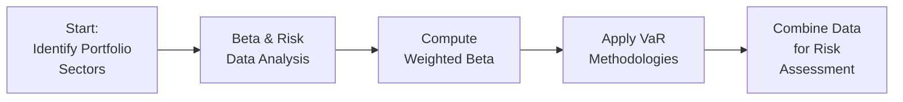

## Understanding the Portfolio Vignette

Imagine you’re meeting with a client who hands you a portfolio stuffed with three distinct equity holdings: a high-growth Technology stock, a sturdy Financials firm, and a steady Consumer Staples play. They’re all curious about simple things—like, “Hey, am I taking on too much risk here? What kind of return can I expect?” But you also see they want a bit of advanced detail. Perhaps they’ve heard about Value at Risk (VaR) and alpha but aren’t really sure how they interact with each other. Well, that’s exactly what we’re diving into.

To keep it interesting, let’s assume the portfolio is actively managed with an objective of outperforming a broad market index (like the S&P 500). The manager’s skill in selecting these three stocks—combined with their individual sector exposures—drives the risk profile. We’ll walk step by step through how to evaluate and measure these elements in a way that ties neatly into typical CFA exam vignettes.

## Identifying Key Risk Exposures

When analyzing an equity portfolio, you want to focus on different levels of risk. Market risk is typically captured by beta, but stresses from the economy and individual stock factors can also play a huge role. Let’s outline some of the big points:

• Beta Exposures: Each stock’s volatility relative to the overall market.  
• Value at Risk (VaR) Estimates: The maximum expected loss at a given confidence level.  
• Historical Stress Scenarios: Contextualizing past shocks—such as financial crises—to predict the severity of future downturns.

Let’s say for our portfolio:

• TechCo (Technology sector): High beta (around 1.30). Growth-oriented, but sensitive to macroeconomic swings and interest rates.  
• FinCo (Financials sector): Medium beta (about 1.0). Exposed to interest rate risk, credit risk, and regulatory pressures.  
• StapleCo (Consumer Staples): Lower beta (roughly 0.70). More stable demand patterns, considered defensive.  

One quick anecdote: Many years ago, I personally held a big chunk of consumer staples stock during a market downturn, and it helped me sleep better at night—less price fluctuation, less anxiety. It’s not flashy, but it’s there to anchor returns in a tough environment.

## Analyzing Returns and Calculating Alpha

Let’s say over the last quarter, the portfolio delivered a total return of 5.0%. The broad market index (our benchmark) returned 3.5% during the same period. On the surface, that outperformance is 1.5 percentage points. But we want to isolate the portion of the return that exceeds market expectations based on the portfolio’s systematic risk.

In the Classical CAPM framework:

• Expected return (ER) of the portfolio = Risk-free rate + (Portfolio Beta × Equity Risk Premium).  

If your portfolio Beta is 1.05, you might have expected something like:

$$
\text{ER}_{\text{portfolio}} = 2\% + (1.05 \times 5\%) = 2\% + 5.25\% = 7.25\%.
$$

But that’s annualized, while your 5.0% is a single-quarter figure, so there’s some nuance in comparing short-term performance. Still, we use a simplified approach: you might discover that (after adjusting for time periods and data consistency) there’s a 1.0% alpha for the quarter, or 4.0% annualized. That alpha is the manager’s “value-add” beyond the risk-based expectation—irrespective of potential differences in compounding. On the CFA exam, be mindful of clarifying which periods you’re measuring.

## Beta Decomposition: Weighted Averages

We keep talking about Beta. But how is our overall portfolio Beta derived? It’s just the weighted average of each component’s Beta:

$$
\text{Portfolio Beta} = \sum_{i=1}^{n} w_i \times \beta_i,
$$

where \\(w_i\\) is the weight of Stock \\(i\\) in the portfolio and \\(\beta_i\\) is that stock’s Beta.

• Suppose TechCo is 40% of the portfolio with \\(\beta = 1.30\\).  
• FinCo is 30% with \\(\beta = 1.0\\).  
• StapleCo is 30% with \\(\beta = 0.70\\).  

Then:

$$
\text{Portfolio Beta} 
= (0.40 \times 1.30) + (0.30 \times 1.0) + (0.30 \times 0.70) 
= 0.52 + 0.30 + 0.21 
= 1.03.
$$

So the portfolio is slightly riskier than the market overall (Beta is slightly above 1.0). This is a simple but super-important measure of how your portfolio might move relative to the benchmark.

## Parametric VaR Calculation

VaR (Value at Risk) is a numerical estimate of how much you could lose on “bad days.” Parametric VaR uses assumptions about normal distribution of returns. At a 99% confidence level, if you know your portfolio’s expected return (\\(\mu_p\\)) and standard deviation (\\(\sigma_p\\)), you can approximate:

$$
\text{VaR}_{99\%} = \mu_p - z_{0.99} \times \sigma_p,
$$

where \\(z_{0.99}\\) is typically around 2.33 for a one-tailed 99% confidence interval under normality (be cautious—some use 2.33, some 2.326, etc.).

Let’s toss out an example: Suppose our portfolio’s annualized expected return is 8%, with a standard deviation of 15%. Parametric VaR at 99% might be:

$$
\text{VaR}_{99\%} = 8\% - (2.33 \times 15\%) = 8\% - 34.95\% = -26.95\%.
$$

This theoretically implies there is only a 1% chance that your annual returns would be worse than –26.95% (under strict normal assumptions). In reality, equity returns may exhibit fat tails or skew, so parametric VaR simplifies quite a bit. The historical simulation approach might produce a different figure, especially if we’ve experienced tail events not well captured by a normal distribution.

## Stress Testing in a Recession

Let’s say a major recession’s on the horizon with rising unemployment. Picture a scenario reminiscent of 2008, or the early days of the COVID-19 market meltdown. How will each holding perform?

• Technology: Historically cyclical. Lower consumer spending and corporate budgets might dampen demand for new tech infrastructure. This holding could be hammered if credit tightens and business expansions stall.  
• Financials: Profit margins often get squeezed, with higher loan losses and subdued lending activity. Non-performing loans increase, and investor sentiment can be brutal.  
• Consumer Staples: Typically more resistant. Consumers still need household essentials. This cushion can help offset losses from the other sectors.

Under a stress test, you might say, “Well, TechCo’s price might drop 25%, FinCo’s 20%, but StapleCo declines by only 8%.” That’s a scenario-based estimate. Stress testing is not about probabilities; it’s about plausible, severe outcomes.

## Scenario Analysis vs. Single-Factor Sensitivity

Scenario analysis lumps multiple factors together—economic growth, interest rates, inflation, consumer sentiment, and so forth—into a single cohesive story. Single-factor sensitivity analysis might isolate just a single variable, say a 1% increase in interest rates, ignoring concurrent macro changes. Both have merit:

• Scenario Analysis: Holistic. Useful for big directional shocks (like a broad recession).  
• Single-Factor: Narrow, but helps isolate what specifically drives the biggest hits or gains in your portfolio.

On the exam, remember that scenario analyses offer a broader “what if the entire market changes in these five specific ways” vantage point, while single-factor sensitivity is more surgical and can highlight which factor (e.g., interest rate shift) truly matters most.

## Evaluating Alpha and Enhancing Risk-Adjusted Returns

You’ve found that the portfolio’s alpha is decent but not stellar. Perhaps you suspect TechCo’s outperformance is overshadowed by a weaker performance in FinCo. So you might consider rebalancing or introducing a hedge. For instance:

• Rebalancing from TechCo to StapleCo might reduce your Beta and overall risk.  
• Using options or futures to hedge a portion of TechCo’s exposure could help if you anticipate a near-term tech selloff.

But keep in mind: Each hedge or reallocation can affect your potential alpha. If you reduce risk, you might also reduce the chance of an outsized gain when markets surge.

## Risk Attribution in Action

We break total portfolio risk into:

• Market (Beta) Risk: Systematic, can’t be diversified away.  
• Sector (Industry) Risk: Tied to the performance of a given industry.  
• Specific (Idiosyncratic) Risk: Stock selection within a sector.  

A professional approach might start with a factor model or multi-factor model that attributes how much of your portfolio variance stems from macro factors (market risk, interest rate, inflation, etc.), sector tilts (tech, financial, consumer), and security-specific variance. If you notice that 80% of your portfolio’s volatility is from the technology factor alone, that’s a big red flag for concentration risk.

## Tracking Error and the Information Ratio

Because this is an actively managed portfolio, you want to see how much you deviate from the benchmark’s returns:

• Tracking Error: The standard deviation of the difference (portfolio return – benchmark return). A higher tracking error means you’re deviating more from the index.  
• Information Ratio: The ratio of your portfolio’s active return (over- or underperformance vs. benchmark) to the tracking error.  

If your portfolio outperforms by 2% annually but has a tracking error of 4%, your Information Ratio is 0.50 (2% / 4%). Some managers prefer a stable, lower tracking error, while others embrace larger bets.

## When and Why to Rebalance

Your portfolio can drift when certain holdings outperform or underperform. That shift can jack up your Beta beyond your comfort zone or tilt you more aggressively into one sector. Maybe you started with 40% in TechCo, but after a strong rally, it swells to 50%. If that’s beyond your target risk, you might lock in gains by rebalancing—selling some TechCo shares and topping up the others.

Regular (monthly or quarterly) rebalancing can keep your risk exposures in line. Opportunistic rebalancing, triggered when sector weights exceed certain thresholds, is also common.

## Liquidity Considerations in Execution

During calmer markets, adjusting positions feels straightforward. But in a meltdown, liquidity can vanish. You may face wide bid-ask spreads, and trying to sell a big chunk of stock could cause huge price moves. The manager must ask, “Is it truly feasible to move in or out of these positions quickly?” Exam item sets may test how you respond if forced to exit a large stake in a short window.

## Performance Implications of Risk Controls

It’s tempting to hedge everything, minimize Beta, and run a super-safe approach. But that might hamper returns. You’ll often see an inverse relationship between risk controls and potential alpha. The perfect (and probably impossible) scenario is a tension between risk minimization and alpha extraction. For the exam, weigh the trade-offs carefully. Overhedging or overdiversifying might water down the potential for outperformance.

## Making Sense of the Results

After piecing it all together—Beta decomposition, VaR estimates, stress tests, alpha measurement, and sector analysis—you have a more complete “big picture” of what is happening in this portfolio. You might conclude:

• Beta is slightly above 1.0—there is moderate systematic risk.  
• A 99% parametric VaR might be frighteningly large, reflecting equity tail risk.  
• Stress tests show TechCo is the biggest vulnerability if a recession hits.  
• The portfolio’s alpha is positive, but rebalancing might enhance risk-adjusted returns and tighten tracking error to maintain confidence with the client.  
• Finally, if liquidity conditions deteriorate, you’ll need a measured approach to any big reallocation.

In a real CFA exam scenario, you’d see multiple-choice or short-answer prompts about these points, maybe referencing real data tables and requiring quick calculations. Be sure to read carefully, pick the relevant formulas, do your arithmetic cleanly, and interpret the results in context.

## Visual Breakdown: A Quick Flow

Below is a quick schematic of how you might systematically approach evaluating this portfolio’s risk and return profile:

Think of this as a cyclical or iterative process. You typically revisit each step whenever the portfolio changes or market conditions shift drastically.

## References and Further Reading

• Mock exams from the CFA Institute: These often showcase examples of item sets focusing on risk management, with emphasis on VaR, beta, stress testing, and alpha calculations.  
• “Active Portfolio Management” by Grinold and Kahn: A deep dive into advanced active management techniques, alpha generation, and risk control.  
• Financial Analysts Journal resources on stress testing methodologies and scenario analysis.  
• Lessons in risk attribution from past high-volatility episodes (e.g., 2008 crisis) to see how actual correlations shifted and how VaR can underestimate tail risks.

## Evaluate Portfolio Risk and Returns: 10 Exam-Style Questions



### A portfolio’s Beta measure primarily reflects:
- [ ] Idiosyncratic risk only.
- [ ] Credit risk factors within an economy.
- [x] Sensitivity to overall market movements.
- [ ] Diversification benefits relative to peers.

> **Explanation:** Beta measures the degree to which a portfolio or stock moves relative to the broader market.  

### When computing a portfolio’s overall Beta, the correct approach is:
- [ ] Adding the Betas of individual securities.
- [x] Calculating a weighted average of individual Betas based on portfolio weights.
- [ ] Using only the stock with the highest market cap.
- [ ] Choosing the average Beta of the market index constituents.

> **Explanation:** Portfolio Beta is a weighted average of each holding’s Beta, with weights reflecting each holding’s proportion of total portfolio value.  

### Which statement about the 99% parametric VaR is accurate?
- [x] It uses assumptions of normal distributions to estimate potential losses.
- [ ] It guarantees actual losses will never exceed the VaR value.
- [ ] It is always more accurate than a historical simulation approach.
- [ ] It is unaffected by the portfolio’s standard deviation of returns.

> **Explanation:** Parametric VaR uses mean and standard deviation estimates under an assumption of normality, which is often imperfect in capturing extreme tail risks.  

### Stress testing is best characterized by:
- [ ] Calculating the standard deviation of portfolio returns.
- [ ] Exploring how interest rate shifts alone affect prices.
- [x] Assessing portfolio performance under severe but plausible market conditions.
- [ ] Computing correlation adjustments for each pair of stocks.

> **Explanation:** Stress testing involves applying severe scenarios (e.g., major recessions) to gauge how the portfolio might behave under adverse market conditions.  

### In scenario analysis, the main difference from single-factor sensitivity analysis is:
- [ ] Scenario analysis is always performed after large losses occur.
- [x] Scenario analysis changes multiple variables simultaneously.
- [ ] Single-factor sensitivity is more comprehensive than scenario analysis.
- [ ] Scenario analysis never considers interest rate movements.

> **Explanation:** Scenario analyses incorporate the shifts of multiple market factors at once, while single-factor sensitivity focuses on only one variable at a time.  

### A positive alpha implies that:
- [x] The portfolio outperforms relative to its risk-based expected return.
- [ ] The portfolio is less risky than the market.
- [ ] The portfolio’s Beta is exactly 1.0.
- [ ] The portfolio’s returns are identical to the benchmark’s returns.

> **Explanation:** Positive alpha indicates the portfolio’s actual return exceeded the expected return derived from systematic risk (often estimated via CAPM).  

### Excess return over a chosen benchmark, divided by the standard deviation of that excess return, defines:
- [ ] VaR.
- [x] The Information Ratio.
- [ ] Beta.
- [x] Tracking Error.

> **Explanation:** The Information Ratio is the ratio of active return to the variability of that active return. Tracking Error is the standard deviation of active returns; it’s also part of that ratio’s calculation.  

### Tracking error is:
- [x] The standard deviation of the portfolio’s excess returns versus the benchmark.
- [ ] The same as parametric VaR at a 99% confidence interval.
- [ ] Strictly the difference between the highest and lowest returns over a period.
- [ ] Calculated only for small-cap equity portfolios.

> **Explanation:** Tracking error measures how consistently (or inconsistently) a portfolio’s performance deviates from that of its benchmark.  

### A key reason for periodic rebalancing is:
- [x] Maintaining the desired asset allocation and risk profile.
- [ ] Maximizing short-term returns by timing the market.
- [ ] Eliminating liquidity risk entirely.
- [ ] Ensuring Beta always remains below 1.0.

> **Explanation:** Rebalancing is done to keep the portfolio in line with target weights so that overall risk aligns with the investor’s objectives.  

### True or False: Hedging strategies can reduce both downside risk and the potential for alpha.
- [x] True
- [ ] False

> **Explanation:** By limiting downside exposure, hedges also often limit upside potential. This typically reduces the chance of earning substantial excess returns, although it can provide stability.




