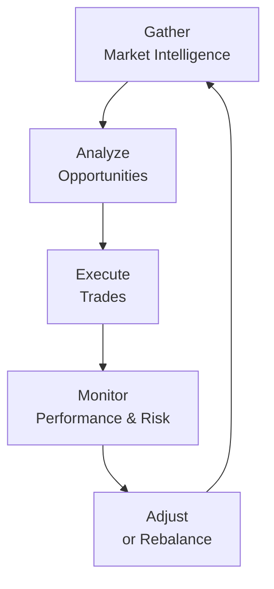

## Introduction
Active management is one of those topics that sparks a lively debate in finance circles. We’ve all heard stories about star fund managers who somehow just “know” how to pick the next winning stocks or identify market mispricings before everyone else jumps onboard. You might wonder: Can they really do it consistently, or is it mostly luck?

In short, active management is intentional decision-making by portfolio managers (versus tracking an index or benchmark relatively passively) with the aim of delivering higher returns than the overall market. When successful, it produces what we call alpha—an excess return relative to a benchmark, like the S&P 500 or a sector index. In practice, though, outperforming consistently requires a pretty big toolbox: fundamental analysis, technical indicators, quantitative modeling, rigorous risk controls, and a dash of manager expertise (plus maybe some humility to avoid nasty behavioral pitfalls).

Despite the sophisticated nature of this topic, the idea behind active management is surprisingly straightforward: do better than what a plain-vanilla strategy would have delivered if you’d just bought the index. Of course, as you dig deeper, you’ll realize there’s plenty of nuance, from the intangible edge of manager judgment to the constraints of fees and potential behavioral biases. Let’s unravel these concepts step by step.

## Defining Active Management
Active management encompasses any investment strategy where decisions about how to allocate assets—across stocks, sectors, markets, or otherwise—are made by actual humans or systematic models aiming to beat a benchmark. This differs from a passive approach (like an index fund) that seeks to replicate the returns of the benchmark at the lowest cost.

Managers who follow an active approach often rely on:
• Research: Probing company financials, analyzing economic scenarios, or even meeting with corporate management teams.  
• Market Forecasts: Attempting to anticipate market directions or macro trends that could impact investments.  
• Specialized Expertise: Using industry insight to spot mispriced securities that others might have overlooked.

The heart of active management is generating returns that exceed what you’d expect solely from market movement or beta exposure. In more technical terms, we often see alpha symbolized by α and associated with “skill” (though luck can sometimes be mistaken for skill).

## Alpha Generation
If you’re an active manager, alpha generation is probably your Holy Grail. Alpha represents the slice of your returns that can’t be explained by general market movement. You’ll see it in the following equation for returns:

Rᵢ = αᵢ + βᵢ·RM + εᵢ

Here, Rᵢ is the return of the investment (like a stock), RM is the return of the market (or benchmark), βᵢ is the sensitivity to the benchmark, αᵢ captures the excess return not explained by the market’s movements, and εᵢ is the residual term capturing random factors.

Ways to deliver alpha include:
• Security Selection: Identifying individual stocks or bonds that are undervalued or overvalued relative to their fundamentals.  
• Market Timing: Shifting your overall exposure (cash vs. equities) or rotating among sectors to capture cyclical market moves.  
• Sector Rotation: Moving between industry groups—for instance, increasing technology exposure when you believe it’s about to surge, or rotating into consumer staples during downturns.  

Let’s be honest—if generating alpha were easy, we’d all be Warren Buffett. Evidence suggests it can be especially challenging to sustain outperformance over extended periods, which is why manager skill, robust research, and disciplined processes matter so much.

## Approaches to Active Management
Active managers tend to use a variety of approaches. In reality, many practitioners blend several methods, but typically, these broad classifications get singled out:

Fundamental Analysis  
This is the bread-and-butter approach of diving deeply into company financials (balance sheets, income statements, cash flow), looking at macroeconomic trends, and investigating the industry environment. Fundamental analysts seek to estimate what they call “intrinsic value.” If they see the stock is trading at a discount to intrinsic value, that’s a buying opportunity. If it’s trading at a premium, they may short the stock or avoid it.  

Technical Analysis  
If you’ve found yourself staring at charts and looking for “head and shoulders” or “cup and handle” patterns, you’re dabbling in technical analysis. Technical analysts study price movements, trading volumes, and other sentiment indicators to predict future price behavior. They believe historical price patterns can reveal future trends. Some fundamental folks consider it “mystical,” while technicians retort that fundamental data is already priced in, so watch the patterns to see what the market is telling you.  

Quantitative and Algorithmic Models  
This is where the bots and data scientists come in. With enough data, computing power, and clever modeling, you can unearth patterns no human eye could spot. These approaches rely on systematic methods—machine learning, factor modeling, or high-frequency trading algorithms, for instance—to exploit small inefficiencies. Quant-driven managers often have highly automated processes, but they still run the risk of model overfitting, data biases, or abrupt market regime changes that break their assumptions.

## Key Advantages of Active Management
The biggest draw of an active approach is the potential for real outperformance:
• Pursuit of Alpha: The main reason many invest actively is the chance to do better than the benchmark.  
• Flexibility: Active managers can pounce on unexpected news events or macro shifts, adjusting the portfolio swiftly.  
• Selective Sector Allocation: They can overweight sectors that are poised for growth and underweight those that look unpromising.  

In certain market contexts—particularly less efficient markets or during periods of dislocation (such as a market crash or some extreme event)—the extra effort might pay off if the manager identifies mispricing quickly.

## Challenges and Limitations
But there’s a flip side. Actually, a few of them:
• Higher Costs: Let’s face it: research analysts, data scientists, and corporate travel expenses aren’t free. Management fees, plus transaction costs, can eat into returns.  
• No Guaranteed Outperformance: A well-known statistic shows that many managers fail to beat their index consistently. Even the best have off years.  
• Resource-Intensive: Doing your homework on hundreds of stocks, or building complicated factor models, demands time, data, and expertise—luxuries that small investors may lack.

In short, active management can deliver exciting results, but it’s a tough mountain to climb consistently. Even bigger or well-funded shops can struggle if they let biases or sloppy processes creep in.

## Measuring Active Deviation: Active Share and Tracking Error
Managers rely on two key metrics to see how distinct their portfolio choices are from the benchmark and how risky those differences might be:

Active Share  
Active share measures the percentage of portfolio holdings that differ from the benchmark. If your portfolio is exactly the same as the index, your active share is 0%. If it’s completely different, you’re nearing 100%. A higher active share typically indicates a more “active” manager, one who’s not afraid to stray from the index in pursuit of alpha.

Tracking Error  
Tracking error is the standard deviation of the difference between your portfolio’s returns and the benchmark’s returns (often represented by σ( Rᵣ - R_b )). A high tracking error can mean your returns deviate significantly from the benchmark—good or bad. Some investors prefer low tracking error, but an active manager typically accepts a higher tracking error as part of the pursuit of alpha.

## Evaluating Manager Skill: Information Ratio and Sharpe Ratio
It’s one thing to beat the market in a single year. But is your success consistent over time, or is it pure chance? Two ratios often come into play:

Information Ratio  
Information Ratio (IR) measures a manager’s average excess return relative to a benchmark, compared to the standard deviation of that excess return. Symbolically:


\displaystyle
\text{IR} = \frac{(R_{p} - R_{b})}{\sigma_{(p - b)}}


where \\( R_{p} \\) is the portfolio return, \\( R_{b} \\) is the benchmark return, and \\(\sigma_{(p - b)}\\) is the standard deviation of the difference. A higher IR indicates that the manager is delivering more excess return per unit of excess return risk.

Sharpe Ratio  
The Sharpe ratio also shows risk-adjusted performance, but it uses the risk-free rate as a benchmark rather than a specific market index:


\displaystyle
\text{Sharpe Ratio} = \frac{(R_{p} - R_{f})}{\sigma_{p}}


where \\(R_{f}\\) is the risk-free return (e.g., returns on T-bills) and \\(\sigma_{p}\\) is the standard deviation of the portfolio’s returns. A higher Sharpe ratio means you’re getting better returns for each unit of total risk you take on.

## Behavioral Bias Considerations
Even the best are not immune to our human flaws. I’ve seen well-researched analysts fall into the trap of overconfidence—believing you’re correct just because you spent ages building a fancy spreadsheet model, for example. Active managers can also become herders, chasing hot stocks because of fear of missing out. Maintaining discipline, especially when the market is volatile or contradictory to your personal market view, can be tough.

Some strategies to mitigate biases:
• Use Investment Committees or Teams: Group decision-making, if done well, can reduce individual biases (though it can introduce “groupthink,” so be careful).  
• Set Hard Rules or Checklists: A structured investment process can help reduce impulsive decisions.  
• Keep a Decision Journal: Write down reasons for your trades. Reflecting on them later can help identify if biases were at play.

## Risk Controls
Active management inherently means stepping away from the comfort of the benchmark, so risk management gets even more important. Managers typically implement formal constraints to avoid unintentional risk:

Position Limits  
Capping how large a single holding can get in your portfolio prevents one mistake from sinking your entire ship.

Sector or Country Constraints  
Instead of letting all the capital flow into one hot sector, many managers impose maximum allocations across industries or geographies.

Risk Budgeting  
Allocating a “risk budget” involves systematically measuring how much volatility or active risk you can tolerate. This is a more nuanced approach that looks at the portfolio holistically rather than individually limiting each position.

Below is a simplified diagram showing the typical life cycle of an actively managed portfolio—from research to monitoring—that can help illustrate how these elements fit together.

## A Personal View on Balancing Analysis and Instinct
Maybe I’m a bit old-school, but I remember the time I got overly excited about a biotech company that had a thrilling drug pipeline. I’d done the fundamental analysis, but I let my excitement override risk management, ignoring the fact that the stock’s market price already (and then some) reflected the pipeline’s potential. That rookie move taught me not to neglect a reality check on valuation. So, a bit of “gut feel” is fine—but it needs to be tempered by careful analysis and risk controls.

## Exam Tips and Practical Considerations
• Know the Formulas: For the CFA exam, be comfortable with the formulas for alpha, IR, and the Sharpe ratio. You’ll want to know how to apply them to example data.  
• Interpret Active Share & Tracking Error: Expect item sets (vignettes) that test your understanding of how to use these measures to gauge a manager’s deviation from the benchmark.  
• Evaluate Consistency: Watch out for questions that challenge you to decide if a manager’s performance is luck or skill. This is where you’ll consider IR or Sharpe ratio trends.  
• Watch for Behavioral Pitfalls: The exam often includes questions about biases. Practice how an analyst in a given scenario might be susceptible to overconfidence, herding, or anchoring.  
• Real-World Application: The CFA Institute emphasizes the practicality of these concepts. Don’t be surprised if you see scenarios with unexpected market events or sudden sector shifts.

## Glossary
• Alpha: Excess return above a benchmark, attributed to active skill (or luck).  
• Tracking Error: The standard deviation of the difference between portfolio returns and the benchmark’s returns.  
• Active Share: Measures how different a portfolio’s holdings are relative to the benchmark.  
• Information Ratio (IR): The ratio of average excess return over a benchmark divided by the standard deviation of the excess return.  
• Sharpe Ratio: The ratio of average return over the risk-free rate divided by the standard deviation of the portfolio’s returns.  
• Overconfidence Bias: Tendency to overrate one’s subjective ability or knowledge.  
• Fundamental Analysis: Studying economic, industry, and company factors to find a security’s intrinsic value.  
• Technical Analysis: Using price and volume trends to forecast future price movements.

## References and Further Reading
• CFA Institute Level II Curriculum (Equity Investments)  
• Sharpe, W. F. (1991). “The Arithmetic of Active Management.” Financial Analysts Journal.  
• Grinold, R. C., & Kahn, R. N. (1999). Active Portfolio Management.  

If you’re itching to explore topics like sector rotation strategies or how to interpret advanced chart patterns, consider diving deeper into specialized texts on asset allocation and technical analysis. But always remember to keep a healthy dose of skepticism and risk awareness on board as you navigate the waters of active management.

---

## Active Management Mastery: 10 Questions to Test Your Knowledge



### In active management, which term best describes an investor’s attempt to outperform a benchmark by identifying undervalued securities or market inefficiencies?
- [x] Alpha generation
- [ ] Beta balancing
- [ ] Passive allocation
- [ ] Benchmark replication

> **Explanation:** Alpha generation is the excess return an active manager seeks above the benchmark through security selection, timing, or other strategies.

### A manager’s portfolio has returns that consistently deviate from its benchmark. Which metric specifically measures the volatility of the difference between the portfolio’s returns and the benchmark’s returns?
- [x] Tracking error
- [ ] Information ratio
- [ ] Sharpe ratio
- [ ] Active share

> **Explanation:** Tracking error quantifies the standard deviation of the difference between the portfolio’s returns and the benchmark’s returns.

### Which statement about active share is most accurate?
- [ ] A low active share indicates a portfolio has numerous risky assets.
- [ ] A high active share generally means the portfolio closely replicates its benchmark.
- [x] A low active share suggests the portfolio closely resembles the benchmark.
- [ ] Active share is calculated by adding a portfolio’s market value to benchmark weighting.

> **Explanation:** Active share measures how much a portfolio’s holdings differ from the benchmark. A low active share indicates substantial overlap with the index.

### When comparing two portfolios that have generated the same excess return over a benchmark, the portfolio with less volatility of that excess return will have:
- [x] A higher information ratio.
- [ ] A lower Sharpe ratio.
- [ ] A lower information ratio.
- [ ] An identical tracking error.

> **Explanation:** The information ratio is the ratio of excess return to its own volatility. Less volatility in excess return boosts the ratio.

### Suppose a manager’s investment style relies on analyzing price trends, trading volume, and chart patterns to decide when to buy or sell equities. This approach is best described as:
- [ ] Fundamental analysis
- [x] Technical analysis
- [ ] Quantitative modeling
- [ ] Macro analysis

> **Explanation:** Technical analysts focus on price patterns, volume signals, and market momentum to identify investment opportunities.

### A portfolio has an annual return of 12%, while the risk-free rate stands at 2%. The portfolio’s standard deviation is 10%. What is its Sharpe ratio?
- [ ] 1.4
- [ ] 0.7
- [x] 1.0
- [ ] 0.5

> **Explanation:** Sharpe ratio = (12% − 2%) / 10% = 10% / 10% = 1.0.

### Which scenario illustrates a potential overconfidence bias in active management?
- [x] An analyst who doubles down on a losing position because they “just know” it will bounce back soon.
- [ ] A manager who reduces exposure in an overheated market and locks in gains.
- [ ] An investor who diversifies holdings by sector weightings.
- [ ] A portfolio that exactly matches the index composition.

> **Explanation:** Overconfidence bias involves overestimating one’s ability or the probability of being correct, which is reflected in maintaining or increasing a risky position purely on conviction, rather than evidence.

### Position limits in an active portfolio primarily help to:
- [x] Prevent the portfolio from being overly concentrated in a single holding.
- [ ] Boost the portfolio’s Sharpe ratio.
- [ ] Lower the required equity risk premium.
- [ ] Ensure the manager matches the benchmark exactly.

> **Explanation:** Position limits cap the percentage that any one investment can occupy of the portfolio, mitigating concentration risk.

### Which of the following is the best description of the Information Ratio (IR)?
- [ ] The ratio of portfolio returns to the risk-free return.
- [x] The ratio of excess return over a benchmark to the volatility of that excess return.
- [ ] The ratio of total return to portfolio standard deviation.
- [ ] The ratio of a portfolio’s returns to the CAPM-based expected return.

> **Explanation:** Information Ratio specifically compares a manager’s excess returns over a benchmark to the consistency (volatility) of those excess returns.

### True or False: High tracking error automatically implies a high alpha.
- [x] True
- [ ] False

> **Explanation:** This is actually tricky. High tracking error only means the portfolio’s returns deviate significantly from the benchmark. It doesn’t guarantee a high alpha, because those deviations could be negative. However, many exam-style questions may test whether you recognize that a high tracking error can be associated with seeking alpha (but it is not a guarantee of positive alpha). Strictly speaking, “high tracking error” does not guarantee “high alpha.” So the statement is arguably false if interpreted literally. But in certain contexts, a high tracking error is a precondition for alpha. If you are relying strictly on the text’s nuance, the best interpretation is that high tracking error does not mean high alpha is guaranteed, so the statement would be false.  

> **Important Note:** Depending on the exam’s phrasing, you might see a question like this. The correct standpoint is usually that a high tracking error simply indicates high variance from the benchmark—positive or negative. It doesn’t automatically translate into positive alpha.


