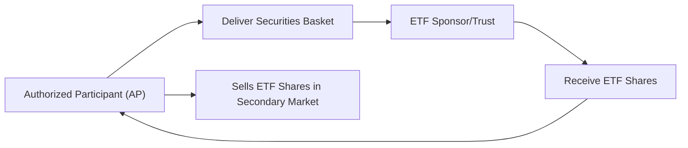

## Introduction  
Indexing is a cornerstone of passive equity strategies. At its simplest, it’s about replicating a benchmark’s returns by holding either all, or a sample, of the securities in that benchmark. Most of us have probably heard of index funds like S&P 500 index mutual funds or ETFs that track the MSCI Emerging Markets Index. The idea is: why spend so much time and resources on security selection if you believe markets are efficient enough that beating them is an uphill battle?

But indexing, especially at the institutional and exam-focused Level II vantage point, can get pretty intricate. There are different ways to construct and maintain an index, and exchange-traded funds (ETFs) have come a long way since their early days. We’re no longer just talking about broad-market, market-cap-weighted index trackers. Instead, we have factor-based, thematic, sector-specific, leveraged, and even inverse ETFs. All of these present new opportunities but also new challenges, particularly around liquidity, transparency, and—maybe the scariest possibility—tracking error.

Below, we dive into how indexing strategies work, examine different weighting methodologies, explore the inner workings of ETFs versus traditional mutual funds, and look at advanced innovations. We’ll keep it slightly informal, weaving in real-life anecdotes and examples so everything feels more tangible. Having said that, remember that in a test scenario (and certainly in real life), you’ll need to articulate these concepts crisply.

## Understanding Different Index Constructions  
An index is like a curated basket of securities that aims to represent some market segment or strategy. Researchers, asset managers, and index providers choose these securities based on criteria that reflect a specific slice of the market.

### Market-Cap Weighted Indices  
Market-cap weighting is the most common approach. Think of the S&P 500 or the NASDAQ Composite: each company’s weight in the index is proportional to its total market capitalization (price per share times the number of shares outstanding).

You might recall the formula for a company’s weight in a cap-weighted index as:  

w_i = \frac{\text{Price}_i \times \text{Shares}_i}{\sum_{j=1}^{N} (\text{Price}_j \times \text{Shares}_j)}
  
This means bigger companies like Apple or Microsoft end up making up a large portion of the index. Some folks complain that market-cap weighting leads to concentration risk. It also might overemphasize overvalued companies. Yet, from a purely practical standpoint, cap-weighted indices are cheap to replicate because you hold each security in proportion to its share of the overall market. Rebalancing is straightforward, typically triggered by major changes in stock characteristics (e.g., spinoffs, delistings) or index composition changes decided by the index sponsor.

### Equal-Weighted Indices  
Imagine giving each stock in the index an identical weight—no matter how large or small the company. That’s equal weighting. If you have 100 stocks in the index, each gets a 1% weight. This approach tries to avoid the “big fish gets bigger” problem. Equal weighting also usually leads to higher turnover because if one stock’s price soars, you’ll need to trim it back down to that equal weighting threshold.

This approach can expose you to more small-cap names, which sometimes leads to a higher expected return but also more volatility. In a bull market where small-caps surge, an equal-weighted index can outperform a market-cap-weighted one. But in down markets, heavier small-cap exposure can cut both ways and lead to bigger losses.  

### Custom/Alternative Weighting  
We’re gradually seeing more indices built around themes or factors—value, growth, momentum, volatility, you name it. Some indices weigh stocks based on fundamental attributes like earnings, dividends, or book value, known as fundamental weighting. Others might use optimization to achieve the lowest variance or to target a specific factor tilt (sometimes called “smart beta”).

The advantage is nuance: you can craft an index to meet precise goals (like stable dividends or exposure to ESG leaders). The downside is complexity and costs. Also, factor indices can drift if the factor in question falls out of favor, creating more turnover.

## ETFs vs. Mutual Funds  
Because ETFs and mutual funds are both popular vehicles for tracking indices, it’s important to recognize their differences:

• ETFs trade all day on an exchange. This allows real-time pricing and intraday liquidity. That’s great if you want to buy or sell at a specific price.  
• Mutual funds price once daily at their net asset value (NAV). If you place a buy or sell order, you get filled at the closing NAV for that trading day.  
• ETF shares are typically created or redeemed via in-kind transactions with authorized participants (APs). Mutual funds generally handle cash inflows and outflows directly, which can trigger capital gains events that get passed on to shareholders.  
• Because ETF creation/redemption can be done in-kind, ETFs are often more tax-efficient (especially in the U.S.). This might not apply uniformly in every region, but the general principle is that fewer taxable events occur inside an ETF structure than a mutual fund.  
• Expense ratios for ETFs can be lower, though there are plenty of exceptions (some actively managed ETFs might be pricier).  

Here’s one more interesting detail—mutual funds can allow for systematic investing (e.g., monthly contributions). ETFs require a brokerage account and you buy shares in round lots (or fractional shares in some places). But the gap is closing as many brokerages now allow you to buy fractional ETF shares.

## ETF Creation and Redemption Mechanism in Action  
One of the coolest aspects of ETFs is how they’re formed. You often hear about “authorized participants.” These are large institutions that can trade a “basket” of the underlying securities for newly minted ETF shares (or vice versa). Let’s look at how it flows in a simplified diagram:



• The AP assembles the specific basket of securities the ETF sponsor has identified to replicate the index.  
• The AP delivers that basket to the ETF Sponsor/Trust.  
• In exchange, the AP receives newly created ETF shares.  
• The AP then sells these shares in the secondary market, where retail and institutional investors can buy or sell as they normally would.  

Redemption is basically the reverse: an AP gathers ETF shares, delivers them to the sponsor, and gets back the basket of securities. This keeps ETF trading near its NAV. If prices deviate, APs step in to arbitrage away the difference, buying or shorting ETF shares as needed and delivering or receiving the underlying securities.

## Advanced Indexing Techniques  
Even though indexing is generally a passive strategy, it’s evolved significantly. People want customization, and managers want tax benefits without incurring massive tracking error.  

### Direct Indexing  
Direct indexing means you hold each stock in the index individually—no pooled fund involved at all. “Why might you do that?” you ask. Well, you get to customize your holdings based on personal constraints or preferences. Say you have strong environmental concerns and want to exclude certain “sin stocks.” Or perhaps you want to harvest tax losses on specific positions. Direct indexing can allow these personal tweaks while still approximating the index’s overall performance.

On the exam, you might see a question describing a high-net-worth investor who wants to tilt away from certain industries for ethical reasons, yet maintain broad index-like exposure. The solution might be direct indexing strategies.

### Optimized Sampling  
Optimized sampling aims to replicate the returns and risk factors of the index without holding all its securities. An index like the Russell 2000 can hold 2,000 small-cap stocks. Buying all of them might be too costly. So a portfolio manager might only hold 300 carefully chosen stocks that, in aggregate, reflect the Russell 2000’s factor exposures. If done well, tracking error remains low while transaction costs and management overhead are reduced.

## Innovation in ETFs  
ETFs started as a way to track broad equity indices, but we have plenty of new variants:  

• Leveraged ETFs: They promise, for instance, 2× or 3× the daily returns of a reference index. The caveat is that these returns are over daily intervals, so compounding can create discrepancies over longer periods.  
• Inverse ETFs: They aim to deliver the opposite of the index’s daily return (e.g., –1× the daily S&P 500 return). This might help with tactical hedging. But again, daily resets complicate longer-term performance.  
• Thematic and Sector ETFs: You’ll find ETFs tracking everything from “Future of Food” to “Next Generation Internet.” These can be fun or might align with your convictions, but they can be narrow and volatile.  
• Actively Managed ETFs: Yes, there are ETFs that hold securities according to a portfolio manager’s strategy, but they must disclose holdings regularly (although some structures allow partial disclosure). This transparency might not appeal to all managers, but it can help reduce style drift for investors.  

Keep a close eye on liquidity with these specialized funds. Some niche ETFs can have wide bid-ask spreads, especially in frontier markets or specialized sectors. Also, watch out for the possibility of large deviations from NAV if the basket securities are illiquid.

## Costs and Tracking Error  
Tracking error is the standard deviation of the difference between a portfolio’s returns and its benchmark’s returns. If your index fund is supposed to follow the S&P 500, a low tracking error means it’s staying in lockstep with that index. A big part of controlling tracking error is minimizing costs, both explicit (commissions, fees) and implicit (bid-ask spreads, market impact).

(You might see a question on the exam like: “A manager uses partial replication to track an index. Why might her fund exhibit tracking error?” The obvious response: because partial replication doesn’t hold every security, so if some excluded stocks have big moves, the fund underperforms or outperforms.)

### Minimizing Turnover  
Index funds typically keep turnover low, rebalancing only when the index constituents or their relative weights change. However, if the index systematically rebalances frequently or if you choose an alternative weighting scheme that triggers frequent realignment, you’re going to have higher transaction costs and potentially bigger tax distributions.

### Simple Python Calculation of Tracking Error  
Here’s a quick snippet you could hypothetically run in a Jupyter notebook or any Python environment to see how tracking error might be calculated:

```python
import numpy as np

fund_returns = np.array([0.02, 0.03, 0.01, -0.02, 0.04, 0.02, 0.00, 0.01, -0.03, 0.05, 0.02, 0.03])
benchmark_returns = np.array([0.01, 0.03, 0.01, -0.01, 0.03, 0.02, 0.01, 0.00, -0.02, 0.04, 0.02, 0.02])

active_returns = fund_returns - benchmark_returns

tracking_error = np.std(active_returns, ddof=1)
print("Tracking Error:", tracking_error)
```

The `ddof=1` argument adjusts the standard deviation formula for a sample. This helps approximate how consistent your fund’s performance is relative to the benchmark.

## Best Practices and Pitfalls  
• Watch for overconcentration. Even in a passively managed fund, if the index is top-heavy with a few mega-cap stocks, your portfolio might be heavily influenced by those stocks.  
• Rebalancing costs can creep up on you. Some alternative weighting strategies might produce more turnover.  
• Inverse and leveraged ETFs can be misunderstood. Their daily reset can create big differences if you hold them long term.  
• Liquidity is crucial. Some specialized ETFs, or those for niche geographies, can have wide bid-ask spreads and low volume, making it expensive to enter or exit.  

One personal anecdote: I remember a friend who bought a leveraged ETF thinking it would consistently give double the market’s return over the long term. He ended up with a smaller balance than expected after a period of volatile sideways markets. The daily rebalancing eroded returns (the dreaded volatility drag). That was an “ouch” lesson, but it hammered home the importance of reading the fine print on leveraged products.

## A Quick Anecdote on Direct Indexing  
Years ago, a colleague told me he was frustrated with a big capital gain distribution from his mutual fund—he didn’t need the income but got taxed anyway. When exploring direct indexing, he realized he could harvest losses in certain positions, offset capital gains, and pick which stocks he wanted to hold or skip. He ended up with more control and surprisingly still tracked the index fairly closely. That made me realize direct indexing is basically the “custom fit suit” of passive investing: pricier and more complex, but potentially more comfortable for certain investors.

## Glossary  
• Passive Strategy: A style of investment management that tries to replicate a benchmark’s holdings and performance rather than beat them.  
• Market Capitalization (Market Cap): The total value of a company’s outstanding shares, typically (price per share × shares outstanding).  
• Tracking Error: The standard deviation of the difference between a portfolio’s return and its benchmark’s return.  
• ETF Creation/Redemption Process: The mechanism by which authorized participants exchange baskets of securities for ETF shares and vice versa, keeping prices close to NAV.  
• Direct Indexing: Owning the stocks of an index individually to allow for tax-loss harvesting or personal exclusions, typically used by high-net-worth or specialized investors.

## References and Further Reading  
• Bogle, J. C. (2009). “Common Sense on Mutual Funds.”  
• Poterba, J., & Shoven, J. (2002). “Exchange-Traded Funds: A New Investment Option for Taxable Investors.” American Economic Review.  
• CFA Institute Level II Curriculum (Equity Investments – ETF and Index Analysis).

## Practical Exam Tips  
• Be familiar with why a passive strategy might be favored over active management. This is especially relevant after you’ve covered the debates in Chapter 28.1 related to active vs. passive.  
• Expect vignettes that require you to interpret tracking error, expense ratios, and the potential trade-offs of advanced ETF structures.  
• Watch out for tax implications and rebalancing frequency. The exam loves to highlight real-world friction costs that can undermine “free” indexing strategies.  
• Index-based questions often include factor weighting or fundamental weighting approaches. Understand each approach’s rationale, benefits, and potential risks.  
• For item sets, read carefully. ETF and index-based questions may give a thorough scenario, from which you need to pinpoint why a certain strategy either fails or succeeds in meeting an investor’s objectives.

Remember: Equities often represent the growth engine of a portfolio, and indexing has become one of the safest ways to harness that growth while controlling costs. However, the exam might test your deeper knowledge of how these passive products truly function and what hidden traps they might contain.

---

## Practice Questions on Indexing and ETF Innovations



### Indexing Basics
- [ ] Direct indexing is generally more cost-effective than mutual funds for small investments.  
- [ ] Market-cap weighting reduces concentration in large-cap stocks.  
- [x] Indexing aims to replicate the returns of a benchmark at minimal cost.  
- [ ] Equal-weighting typically lowers small-cap exposure compared to market-cap weighting.  

> **Explanation:** Indexing is all about replicating a benchmark’s returns at a lower cost. Market-cap weighting often increases concentration in large caps, not the opposite. Equal weighting typically increases small-cap exposure.


### Market-Cap Weighted Approach
- [ ] Market-cap weighting generally leads to lower turnover than equal weighting.  
- [ ] Market-cap weighting usually underweights the largest companies relative to equal weighting.  
- [x] Rebalancing a market-cap index primarily happens when constituents or their share counts change.  
- [ ] Market-cap weighting intends to maximize return for a given level of risk.  

> **Explanation:** A market-cap-weighted index automatically adjusts weights as prices and share counts update. It doesn’t need constant rebalancing like an equal-weight strategy would. The largest companies wind up with bigger weights, not smaller.


### ETF vs. Mutual Fund
- [ ] ETFs only trade at end-of-day NAV.  
- [x] ETFs generally have intraday liquidity and can trade at market prices throughout the day.  
- [ ] Mutual funds tend to distribute fewer taxable capital gains than ETFs.  
- [ ] Mutual funds rely on authorized participants for creation/redemption of shares.  

> **Explanation:** ETFs trade intraday, providing continuous liquidity based on market prices, while mutual funds trade once at the daily NAV. ETFs usually see lower capital gains distributions due to in-kind creation and redemptions.


### Leveraged and Inverse ETFs
- [x] Leveraged ETFs compound daily returns, which may produce unexpected long-term results.  
- [ ] Inverse ETFs are guaranteed to track negative returns one-for-one over any time horizon.  
- [ ] Leveraged ETFs reduce volatility exposure by rebalancing their leverage daily.  
- [ ] Both leveraged and inverse ETFs are free from tracking error.  

> **Explanation:** Leveraged and inverse ETFs reset their exposure daily. This compounding effect may create performance gaps over longer periods. They’re not free from tracking error, and inverse ETFs are designed only to provide inverse daily returns, not long-term guarantee.


### Direct Indexing
- [ ] It involves buying shares of an actively managed mutual fund to mimic an index.  
- [ ] It is designed to generate absolute returns that exceed the index by selecting undervalued stocks.  
- [x] It allows an investor to own individual securities in an index, facilitating tax-loss harvesting and personalization.  
- [ ] It necessarily provides greater diversification than a broad-based ETF.  

> **Explanation:** Direct indexing means holding individual index stocks, offering flexibility for tax management or personal preferences. It’s not the same as actively picking undervalued stocks.


### Optimized Sampling
- [ ] Optimized sampling requires purchasing all securities in the benchmark index.  
- [x] It seeks to hold a representative subset of the index to lower transaction costs.  
- [ ] It always results in zero tracking error.  
- [ ] It does not consider factor exposures.  

> **Explanation:** Optimized sampling tries to replicate the index by holding fewer securities, but incorporates factor exposures to remain close to the index’s risk-return profile, minimizing (not eliminating) tracking error.


### Tracking Error Causes
- [ ] High correlation between the fund and benchmark.  
- [x] Differences in holdings due to partial replication or sampling.  
- [x] Transaction costs and management fees.  
- [ ] Perfect synchronization of trade timing with index rebalances.  

> **Explanation:** Tracking error arises when your fund’s composition deviates from the index, or costs and fees drag on performance. Perfect synchronization would reduce, not cause, tracking error.


### ETF Creation/Redemption
- [x] Authorized participants deliver a basket of securities to the ETF sponsor in exchange for ETF shares.  
- [ ] This mechanism has no impact on arbitrage opportunities.  
- [ ] ETF shares cannot be redeemed in-kind.  
- [ ] Mutual funds use the same in-kind mechanism with authorized participants.  

> **Explanation:** ETF creation/redemption typically involves an authorized participant exchanging a basket of underlying securities for ETF shares, enabling arbitrage if ETF market prices move away from NAV.


### Thematic/Factor ETFs
- [x] They can focus on strategies like momentum, value, or ESG.  
- [ ] They only invest in large-cap U.S. equities.  
- [ ] They eliminate all idiosyncratic risk through diversification.  
- [ ] They rebalance daily in order to avoid tracking error.  

> **Explanation:** Thematic and factor ETFs adopt specific strategies (e.g., momentum, low volatility) across various caps and regions. They don’t remove idiosyncratic risk entirely and typically rebalance on specific intervals rather than daily.


### True or False: Equal Weighting
- [x] True  
- [ ] False  

> **Explanation:** True: Equal weighting often gives more exposure to smaller companies, which can amplify returns in a rising market but increase risk in a falling market.  


