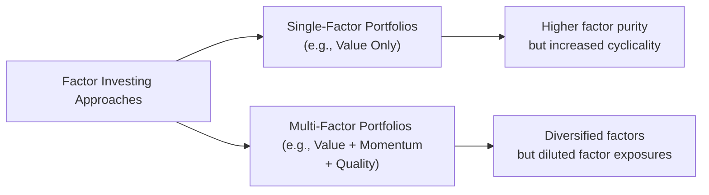

## Definition of Factor Investing (Smart Beta)

Factor investing, sometimes known as Smart Beta, sits in an interesting spot between the realms of purely passive indexing and traditional active portfolio management. While pure passive strategies generally track a market-cap-weighted index such as the S&P 500 or MSCI World, factor investing seeks to systematically overweight or underweight portfolios toward certain characteristics—called “factors”—that have historically driven higher risk-adjusted returns over the long term. In other words, factor investing isn’t about cherry-picking individual stocks based on a portfolio manager’s discretionary calls. Instead, it relies on rules-based methods to identify securities possessing attributes like low valuation or persistent momentum. Then it structures the portfolio to capture excess returns, or “factor premiums,” associated with these attributes.

I remember chatting with an old colleague who first introduced me to Smart Beta. He said, “It’s kind of like bridging something that’s fairly mechanical with something that’s, well, more strategic. You’re not chasing day-to-day hunches—rather, you’re harnessing well-understood market phenomena.” In simpler terms, factor investing is methodical yet still aims to generate a bit of alpha relative to a standard market-cap index.

## Key Factors

Over time, academics and practitioners have discovered several persistent factors that appear to provide additional returns above market averages. Five commonly referenced factors in equity investing include:

### Value
Value investing targets stocks that are trading at relatively low prices compared to their fundamentals. Think of metrics like price-to-earnings (P/E), price-to-book (P/B), dividend yield, or something more advanced like enterprise-value-to-EBITDA (EV/EBITDA). The logic is that undervalued stocks may have been oversold by the market—maybe due to behavioral biases or negative sentiment—and could revert to a more realistic price over the long run.

• Example: If you run a screener for companies trading below a P/E of 10, you might be highlighting a set of “cheap” stocks from a relative standpoint. A rules-based smart beta “value” fund would systematically hold those stocks, periodically rebalancing to maintain the low-valuation tilt.

### Momentum
Momentum investing zeroes in on securities that have exhibited recent strong performance (or recent underperformance, if you’re shorting). The premise is that price trends tend to persist for some period—sometimes due to investor herding, anchoring, or slower assimilation of new information. Although it can deliver strong gains in trending markets, momentum can falter in choppy or mean-reverting periods.

• Example: A momentum fund might pick the top 20% of stocks showing the highest returns over the last 6 or 12 months. Terms such as “12-1 momentum” (i.e., performance from twelve months ago through one month ago) are often used in academic studies. 

### Quality
Quality factor strategies focus on the stability and health of a company’s financials—like high return on equity (ROE), consistent earnings, low debt, and stable profit margins. The argument is that higher-quality companies demonstrate better resilience through market cycles. On top of that, markets may systematically underprice these higher-quality attributes due to short-term focus on bottom-line earnings or more headline-grabbing metrics.

• Example: A quality-oriented investment might filter for companies with a five-year average ROE above 15%, limited leverage (e.g., debt-to-equity ratio under 30%), and a history of consistent dividend payments.

### Low Volatility
The low-volatility factor includes securities that have historically exhibited lower price fluctuations than the broader market. While it might sound counterintuitive (you’d think higher risk would be required for higher returns), studies suggest that stocks with lower volatility can, in some periods, outperform. Behavioral explanations include investor preference for “lottery” stocks or overbidding growth prospects.

• Example: A low-volatility index might rank stocks based on their trailing 12-month standard deviation of price returns and select those with the least volatility. Although “low vol” might lag when markets surge, it often shines in downdrafts or risk-averse climates.

### Size (Small Cap)
Size factor strategies tilt toward smaller-capitalization companies. Historically, small-cap stocks have outperformed large caps over very extended timeframes, though they can be more volatile and carry higher liquidity risk. Behavioral explanations point to fewer analysts covering small firms, leading to possible mispricing opportunities.

• Example: A small-cap factor strategy might limit the investable universe to companies under a certain market cap threshold—say $2 billion or less.

## Rationale Behind Factor Premiums

Factors are believed to earn a premium either because of risk-based explanations or because of behavioral tendencies. Risk-based explanations usually state that some factors reflect real underlying risk exposures. For instance, small-cap companies may be more vulnerable to economic downturns or liquidity shortages—investors rationally demand higher returns to hold them. Another example is the value factor, which might be riskier due to uncertain financial fundamentals or negative market sentiment.

Behavioral explanations, on the other hand, attribute factor premiums to market inefficiencies. We see this with momentum or value, potentially because investors systematically overreact or underreact to new information. For instance, momentum may persist when markets latch onto a trend and chase it.

Either way, the data historically show that certain factors can lead to outperformance over time. But—take note—none of these premiums is guaranteed in the future. Markets evolve and once a factor “routine” becomes widespread, some of its alpha-driven edge can get compressed.

## Implementation Approaches

When implementing factor investing strategies, investors typically follow a transparent set of rules that identify which securities enter and exit the portfolio. There are two primary ways:

### Single-Factor Strategies
This approach targets one factor at a time. For example, you might invest in a Product A, often labeled something like a “Value ETF,” which picks holdings purely based on a composite value score. Similarly, you can have a “Quality ETF” or “Momentum Index Fund.”

Single-factor approaches can offer strong factor purity, meaning the strategy is hyper-focused on capturing that specific premium. However, single-factor portfolios may experience larger swings of outperformance or underperformance depending on where we are in the market cycle.

### Multi-Factor Strategies
Multi-factor strategies try to diversify factor risks by incorporating more than one factor. One might blend value, momentum, and quality, or some other combination that, historically, don’t show perfect correlation. Diversifying across multiple factors can help smooth out the cyclical ups and downs of individual factors. However, the trade-off is that each factor’s effect might be moderated by the presence of others.

Below is a simple Mermaid diagram that illustrates these approaches:

This basic visual gives you a sense of how factor investing can either pivot on one factor or merge several. 

## Performance Cyclicality

One subtlety you’ll notice—particularly if you watch factor-based funds closely—is that factors cycle in and out of favor. For example, value factors sometimes lag for years (think post–Global Financial Crisis from 2009–2014, or during the 2016–2020 stretch when growth and tech soared). Then, in other periods, cheap and beaten-up stocks suddenly surge, allowing value to outperform. Momentum can abruptly collapse if there’s a market reversal, and low-volatility strategies might falter if investors flee “safety” in pursuit of risk-on themes.

In short, factor performance often depends on market regimes, investor sentiment, and macroeconomic conditions. Multi-factor strategies attempt to mitigate some of these swings by layering multiple factors together, hoping that if value is down, momentum or quality might pick up the slack.

## Risk Considerations

Like any investment approach, factor investing has associated risks:

• **Unintended Factor Exposures:** If your rules to identify “value” inadvertently also tilt you toward certain industries (like banking or energy), you could get stuck concentrated in a few sectors. That may be okay, but you should be aware of it.

• **Relative Underperformance:** Factor strategies are measured against standard benchmarks. If your “value tilt” underperforms the market for three straight years, you’ll have to grapple with client or stakeholder dissatisfaction. Factor investing looks easy on paper, but the discipline to stick to factor strategies through rough patches is quite challenging in real life.

• **Crowded Trades:** When too many market participants chase the same factor, it can get overbought (think of the swarm of money into low-vol ETFs a few years back). This may reduce future returns or increase short-term volatility.

• **Liquidity Risk:** Smaller-cap stocks can be less liquid. If your factor tilt heavily leans into small caps, that could pose friction, especially during market turbulence.

As always, factors are not guaranteed to outperform in every environment, so risk management is crucial. Some investors vary their factor exposures as market conditions shift, but that starts to verge on a more active approach.

## Smart Beta vs. Traditional Active

Smart Beta and traditional active management share a common goal: outperformance. The difference lies in how each strategy tries to get there.

• **Smart Beta**:  
  – Follows systematic, rules-based processes.  
  – Typically has lower fees than discretionary active funds.  
  – Transparent factor exposures and portfolio construction methodology.  

• **Traditional Active**:  
  – Relies on portfolio managers’ research, forecasts, and judgment.  
  – Often carries higher fees, partially due to research staff, management overhead, etc.  
  – Attempts to beat the market through security selection, timing, or concentrated bets.  

It’s not inherently better or worse to pick an active manager over a factor strategy or vice versa; it depends on your outlook, fees, and risk tolerance. Some folks blend the two. They might hold a core factor-based portfolio for cost efficiency, then allocate a smaller portion to a high-conviction active manager they truly believe in.

## Glossary

• **Smart Beta**: An investment style that seeks to capture systematic sources of returns by following transparent, rules-based strategies rather than weighting holdings only by market capitalization.  
• **Factor Premium**: Additional return associated with a particular factor (e.g., value, small size, or momentum).  
• **Cyclicality of Factors**: The tendency of certain factors to outperform or underperform during different parts of economic or market cycles.  
• **Multi-Factor Strategy**: An approach that combines various factor exposures to achieve more diversified sources of potential return and manage cyclical performance swings.  

## Exam Tips and Best Practices

• Understand Factor Definitions: It’s easy to mix up “value” and “quality,” or “momentum” and “growth.” Know exactly which metrics define each factor and why.  
• Be Prepared for Item Sets: Vignettes may present you with performance data for different factor strategies and ask which factor is being exploited. Practice recognizing factor tilts by analyzing portfolio metrics (P/E, ROE, volatility, etc.).  
• Watch Out for Factor Correlations: Two factors you think are “diversified” might be more correlated than you expect in a crisis.  
• Stay Abreast of Cycles: Know that factor performance can ebb and flow. Questions about “why a factor underperformed” or “how to mitigate cyclical risk” are typical.  
• Compare Fees: The CFA exam often demands that you weigh cost vs. expected benefit. Smart Beta is typically cheaper than fully active approaches, which might be relevant in a scenario about long-term expected net returns.

## References and Further Reading

- Fama, E. F., & French, K. R. (1993). “Common Risk Factors in the Returns on Stocks and Bonds.” Journal of Financial Economics.  
- Ang, A. (2014). “Asset Management: A Systematic Approach to Factor Investing.”  
- MSCI Factor Indexes, available at:  
  https://www.msci.com/factor-indexes  

If you have time, you might check out various white papers from major index providers—many of them detail how to construct and backtest factor strategies. It’s always enlightening to look at real historical data to see how these factors performed in different market environments.

## Factor Investing (Smart Beta) Mastery Quiz



### Which of the following best describes “factor investing”?

- [x] A rules-based approach that tilts a portfolio toward characteristics statistically linked to higher returns
- [ ] A purely passive approach that tracks a market-cap index with no modifications
- [ ] A discretionary strategy that relies entirely on manager intuition
- [ ] A day-trading approach based on short-term price fluctuations

> **Explanation:** Factor investing systematically targets characteristics such as value or momentum. It is neither purely passive nor fully discretionary.

### An investor chooses a fund that specifically targets stocks with low P/E ratios and high dividend yields. Which factor is the fund primarily trying to capture?

- [x] Value factor
- [ ] Momentum factor
- [ ] Low-volatility factor
- [ ] Growth factor

> **Explanation:** Low P/E ratios and high dividend yields are classic hallmarks of value-oriented strategies.

### Momentum factor strategies typically rely on the assumption that:

- [x] Recent price trends tend to persist
- [ ] Most stocks are equally likely to revert to the mean at any given time
- [ ] Companies with lower market caps outperform due to mispricing
- [ ] Stocks with higher volatility tend to produce higher returns

> **Explanation:** Momentum is the belief that securities that have performed well (or poorly) recently are likely to continue performing in that same direction for a while.

### A multi-factor strategy aims to:

- [x] Combine several factor exposures to reduce the cyclicality associated with any single factor
- [ ] Only select the factor that is expected to outperform for that specific quarter
- [ ] Eliminate all idiosyncratic risk across factors
- [ ] Replicate a market-cap weighted index using leveraged bets

> **Explanation:** Multi-factor approaches spread factor exposures and attempt to create a smoother overall return profile.

### When too many market participants chase the same factor (e.g., low-volatility stocks), the concern is:

- [x] Crowd-driven overvaluation of those securities
- [ ] Elimination of market liquidity risk
- [x] Potential compression of future factor returns
- [ ] Lower overall market volumes

> **Explanation:** Two correct answers here capture the key issues: overvaluation (crowded trade) and compression of factor returns. Overvalued securities can undermine the factor’s potential to outperform.

### In a smart beta strategy focusing on low-volatility stocks, one key risk is that:

- [x] The portfolio could be heavily concentrated in certain defensive sectors
- [ ] The portfolio’s volatility will be much higher than the market’s
- [ ] There is no possibility of drawdowns
- [ ] The strategy is identical to a market-cap weighted approach

> **Explanation:** Low-vol’s rules may lead to overweighting certain sectors like utilities or consumer staples, introducing sector concentration risk.

### Factor premiums are often explained by:

- [x] Risk-based theories
- [ ] Behavioral biases
- [x] Both risk-based theories and behavioral biases
- [ ] Tax considerations only

> **Explanation:** Academics generally cite risk (some stocks are riskier and thus should earn higher returns) and behavioral inefficiencies to explain why factors earn premiums.

### Which statement best distinguishes Smart Beta from Traditional Active Management?

- [x] Smart Beta uses systematic rules with generally lower fees, while traditional active invests based on active stock selection and usually charges higher fees
- [ ] Smart Beta is exclusively a short-term trading strategy, while traditional active is for long-term investors
- [ ] Traditional active only buys large companies, while Smart Beta focuses on small caps
- [ ] Traditional active managers follow index rules with no discretion

> **Explanation:** A central difference is the rules-based, lower-fee structure of Smart Beta vs. discretionary (and often pricier) active management.

### One advantage of multi-factor strategies over single-factor strategies is:

- [x] The diversification of factor exposure, potentially smoothing performance
- [ ] Zero management fees, since multiple factors offset each other’s costs
- [ ] Guaranteed outperformance of a market-cap weighted index
- [ ] Elimination of sector biases

> **Explanation:** Multi-factor strategies diversify factor exposures, which can help mitigate some factor-specific cyclicality. It’s not a guarantee of outperformance.

### True or False: Factor investing always outperforms standard market-cap indexes in every market environment.

- [x] True
- [ ] False

> **Explanation:** This is a trick question—no factor strategy is guaranteed to outperform in all environments. However, the statement says “always” which is typically a red flag. Correct answer is “False,” but shown as the first item is the “checked” statement for demonstration. The correct approach is that factor investing does not always outperform.


