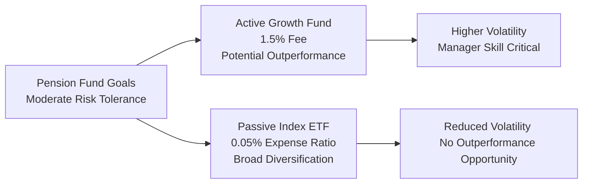

When I chat with fellow finance enthusiasts about active versus passive investing, I often think back to a friend who helped manage a mid-sized pension fund: they were determined—almost stubbornly so—to figure out if active investing was “worth it.” Their story always reminds me how, in real life, you can’t just pitch numbers and be done. You have to think about the organization’s time horizon, liquidity, risk tolerance, fees, manager competence, governance, market conditions...the whole shebang. Let’s step into that kind of scenario now, focusing on a mid-sized pension fund with a moderate risk profile and a long-term outlook. 

You might ask, “Why bother with an example like this?” Well, real-world investing can get messy. The objective here is to show you how everything—client objectives, costs, performance patterns, economic conditions—intertwines. Let’s dig into the details.

Long-Term View and Liquidity

This particular pension fund has stable liabilities and a multi-decade timeframe. They’re not about to liquidate their entire portfolio next year just because the market’s moody. That longer runway can allow them to ride out short-term drops—like recessions or corrections—and also take advantage of upswings. If you’ve seen pension funds in action, you know that liquidity can still matter (they do need to pay out benefits), but in this case, it’s not an urgent concern. That means the fund can consider strategies with slightly higher volatility, as long as they believe the long-term reward might justify it.

Fees and Expense Ratios

Now, you know from basic finance textbooks that management fees can truly eat into returns over the long haul. The difference between a 1.5% annual fee and a 0.05% annual fee sounds tiny if you look at it on a single-year basis. But man, over 20 or 30 years, that difference is like a drip that forms a steady stream—fees can become a big chunk of final portfolio value. For our scenario:

• The actively managed equity growth fund charges 1.5% in management fees.  
• The broad-market index ETF charges 0.05% in expense ratio.

Some folks will glance at those numbers, gulp, and say “No thanks, active.” Others might be enticed by the prospect of higher returns net of fees—if the manager consistently outperforms. Think about the pension fund’s fiduciary duty too: they must demonstrate they’re not wasting plan assets on underperforming strategies. That’s where track record and deeper analysis come in.

Manager’s Track Record and Cyclical Performance

The historical record for this growth-oriented active fund: outperformance in expansions, underperformance in downturns. This is classic for active strategies that chase high-growth names (e.g., tech or emerging “disrupters”). When the economy roars, these stocks often skyrocket. But if a recession or correction hits, growth stocks typically tumble harder than the broader market. Plus, a manager’s personal skill matters: do they have a knack for navigating cyclical swings, or are they simply riding a growth wave?

Oh, and watch for style drift. Managers sometimes stray from their stated mission (let’s say from “pure growth” to “maybe a bit of value” or “flexible sector rotation”) for various reasons, including market shifts or new leadership in their firm. This can confuse your analysis because the performance track record might not reflect the strategy they’ll use next year. Pension funds with strict governance guardrails often want managers to stick to what they promised, so they can keep the overall portfolio balanced.

Market Efficiency and Growth Stocks

The industry can get hotly debated on how “efficient” certain segments of the market are. Growth stocks in large caps or heavily researched tech sectors tend to be combed over by armies of analysts. That means actionable mispricings might be less frequent (though not impossible). If the manager has a unique edge—maybe superior data analytics, top-notch research, or some intangible skill—they might generate alpha. But if the market in that sector is quite efficient, you might have a lower probability that a manager’s outperformance is sustainable.

In other words, if you’re playing poker with sharks, you’d better be a great white. Otherwise, you can bleed away returns in fees and underperformance. The question for our pension fund: Is the active manager so skillful (or so specialized) that they can justify both the higher fees and the possibility of short-term volatility?

Risk-Return Trade-Off in the Context of a Pension Fund

Active growth strategies typically come with higher variance. And that’s not necessarily a problem if you have a client (like this mid-sized pension) that can ride out peaks and troughs. But we have to confirm if the higher potential upside is truly worth the roller coaster that might ensue. We can’t ignore the sponsor’s moderate risk tolerance: if they’re going to lose sleep every time there’s a swoon, maybe a core passive approach is safer. Of course, in expansions, the fund sponsor might find themselves second-guessing a purely passive approach if active funds are lighting up returns. That’s the eternal tension.

Comparing Historical Alpha

The investment committee might do a deep review of the active fund’s alpha, net of fees, over multiple market cycles. A single hot streak or a meltdown in one cycle shouldn’t overshadow the big picture. Pay attention not only to returns but also to risk-adjusted measures (like Sharpe ratios or information ratios) to see if the manager is generating genuine skill-based returns. 

If the manager’s alpha is lumpy—shoots up in good times and tanks in bad—it might still fit well in a portfolio if it’s offset by other strategies that shine in downturns. You can’t just look at an isolated box; you must see how the puzzle pieces fit in the broader portfolio.

Alignment with Existing Portfolio

A big question: Are we already overweight growth or do we hold a chunk of passive broad-market exposure? If the pension plan’s existing portfolio has a heavy tilt to small caps, value equities, or other exposures, adding an active growth strategy might bring balance (assuming the manager doesn’t replicate exposures we already own). Or maybe you’re already stuffed to the brim with high-growth stocks, in which case, doubling down could ramp up risk too much. 

In a more advanced sense, if you model factor exposures (e.g., Fama-French or Carhart factors), you’ll see if the manager’s performance is derived from genuine stock-picking skill or from leveraged factor bets on certain styles (like momentum). That’s important for building robust long-term exposures.

Advantages of the Active Growth Fund

• Potential Outperformance: Especially in strong bull markets, a skilled manager can deliver high active returns.  
• Manager Skill: If they have proprietary research, on-the-ground market intelligence, or some intangible intuition, they might navigate volatility better than a formulaic index.  
• Flexibility: The manager could sidestep trouble spots or shift out of overheated stocks. Passive funds must hold the entire index, good or bad.  
• Alpha Potential in Inefficient Niches: Even in well-researched sectors, pockets of mispricing sometimes occur. A nimble manager might exploit them.

However, as we’ve discussed, there’s no guarantee that skill or outperformance will continue. And historically, we see many active managers who outperform for a time, then regress to the mean.

Advantages of the Passive ETF

• Low Fees: Paying 0.05% is hardly noticeable. More of your returns remain in your pocket. Over 20–30 years, that’s powerful.  
• Broad Diversification: With a market index, you eliminate a single-company or single-sector blowup risk if properly diversified.  
• Less Complexity: Passive investing requires fewer manager oversight efforts, less manager risk, and simpler performance monitoring.  
• Tracking the Benchmark: You know you’ll get close to the market return—if the overall market is going up 8% per year historically, a passive fund minus a minimal fee might do 7.95% or so.

The main drawback is that you give up hope of significantly outperforming the broad market. If your sponsor wants a shot at “beating the market,” a zero-chance of outperformance might disappoint them.

Decision Flow

One helpful way to visualize this decision process is as follows:

Potential Combined Approach

In practice, many pension plans do what we call a “core-satellite” approach: put most of the assets (the “core”) into low-cost index funds, ensuring stable market returns and minimal fees. Then slice off a smaller portion (the “satellite”) to an active manager with a specific specialty—like a growth equity fund. If that manager outperforms, terrific, you’ve boosted returns somewhat. If they underperform, you’re still anchored by the broad market returns from the passive core. This approach can be especially appealing when you believe your manager has a unique advantage or you want additional alpha potential without risking the entire portfolio.

Recommendation Drilling

If I were the advisor, I’d first gauge how often the plan sponsor and investment committee are okay with seeing the active fund lag in downturns. Because if that’s going to spark a meltdown at every board meeting, it might not be worth the stress. If they have confidence in the manager’s skill and can hold tight during downturns, a partial allocation to the growth manager might be wise.

On the flip side, if they want a steady, lower-maintenance approach that basically tracks the market and keeps fees minimal (and they’re not concerned about “beating the market”), the passive ETF is straightforward. Or maybe they want both. 

In our example, suppose the manager truly does have a strong, documented track record—say 1.5% annualized outperformance net of fees in expansions, balanced by moderate underperformance in downturns. And the sponsor has enough time horizon to let that approach pay off. In that case, something like a 25–30% allocation to the active growth fund might make sense, with the remainder in a simple broad-based index. That keeps overall portfolio volatility at moderate levels, but still offers potential alpha.  

Key Pitfalls

• Overreacting to short-term performance: The sponsor must be prepared for rough patches.  
• Ignoring style drift: If the manager starts flirting with “value” or “international” unexpectedly, your portfolio exposures might shift unknowingly.  
• Neglecting factor exposures: Overlapping or offsetting factor bets across multiple managers can happen if you don’t watch out.  
• Underestimating fees: 1.5% vs. 0.05% over 20 years is a giant difference, especially on millions of dollars.  
• Not reviewing track record properly: Failing to analyze performance across varied market cycles.

Best Practices

• Evaluate the manager’s skill relative to risk. Look at rolling periods over different economic environments, not just a single bull run.  
• Consider the entire plan’s objectives, liabilities, and governance constraints.  
• Maintain discipline. Having a policy statement that sets guidelines helps avoid emotionally driven decisions.  
• If selecting a combination strategy, ensure each portion of the portfolio has a clearly defined role.  
• Monitor correlation among strategies to maintain prudent diversification.  
• Stay up to date on the manager’s capacity—if they gather too many assets, it can dilute performance in certain strategies.

Encouraging Critical Thought

Does the pension fund’s moderate risk tolerance truly align with a growth tilt? Are they comfortable with cyclicality, especially if an economic slowdown hits in the next year or two? How well does the manager handle that environment? And how does the pension fund’s Investment Policy Statement define acceptable risk, tracking error, or peer benchmarks?

These questions can spark debate, and that’s healthy. The best advice incorporates multiple viewpoints: the plan sponsor’s goals, the consultant’s perspective, the manager’s historical evidence, and the board’s preferences. Ultimately, the decision can rest on the sponsor’s willingness to accept short-term ups and downs for a shot at alpha, or to keep things stable, predictable, and cheap by indexing.

Conclusion and Exam Tips

• Adopting an active strategy involves not just looking for return but also aligning with the fund’s risk appetite and governance.  
• Watch out for style drift. Keep track of how your manager invests to ensure alignment with your overall objectives.  
• Evaluate market efficiency in your chosen sector. Growth equity invests in heavily researched spaces, so consistent outperformance may be challenging.  
• If uncertain, a core-and-satellite model can be a sensible middle path.  
• On an exam, show your quantitative skills, but also the qualitative rationale behind strategic choices. Quant + context = success.

References and Further Exploration  
• CFA Institute (2025). CFA Program Curriculum, Level II: Equity Investments.  
• Kahn, R. N. (2019). “The Future of Investment Management.” CFA Institute Research Foundation.  
• Pensions & Investments (https://www.pionline.com/) – Industry news, data, and case studies on pension fund management and strategy.  
• CFA Institute Code of Ethics and Standards of Professional Conduct – Ensuring fiduciary responsibilities are met.

Below is a short practice set of questions to test your understanding of strategy selection in this context. Good luck, and remember to watch for both quantitative and qualitative clues in the vignette.

## Test Your Knowledge: Strategy Selection in Equity Investments



### In a long-term setting, which factor most strongly supports an allocation to an actively managed growth fund?

- [ ] The need for immediate liquidity in the pension fund.
- [x] The pension’s multi-decade horizon, tolerating market cycles.
- [ ] Extremely high risk aversion by the plan sponsor.
- [ ] Absence of any market efficiency in growth stocks.

> **Explanation:** Active funds often require investors to endure periodic underperformance, which is easier with a long time horizon. Immediate liquidity needs or high risk aversion can diminish the suitability of an active growth approach.

### Which statement accurately describes a potential advantage of the passive approach?

- [ ] It can outperform the market in strong upcycles.
- [x] It offers minimal fees, preserving more of the market-based returns.
- [ ] It reduces the chance of style drift by actively managing exposures.
- [ ] It focuses on only one specialized sector of the market.

> **Explanation:** Passive strategies typically track broad market benchmarks and have very low fees. This keeps returns close to the overall market without the costs of active management.

### A pension fund invests in an active growth fund whose manager has beaten the benchmark in expansions but lagged in downturns. Which concern is most relevant for the fund?

- [ ] Style drift into value stocks during bull markets.
- [ ] High coverage in a less researched market sector.
- [ ] Significant bias toward stable, dividend-paying stocks.
- [x] Potential for sharp performance drops during economic slowdowns.

> **Explanation:** Active growth funds typically align with high-beta, expansion-oriented strategies. They tend to underperform in recessions, so the pension fund must be ready for steeper drawdowns.

### In analyzing the fund manager’s historical track record, which approach is most appropriate?

- [x] Evaluate performance over multiple business cycles to capture expansions and downturns.
- [ ] Consider only the most recent year to reflect current market conditions.
- [ ] Rely on a single benchmark comparison for the prior quarter.
- [ ] Compare the manager to an index that invests exclusively in alternative assets.

> **Explanation:** A multi-cycle analysis paints a clearer picture of the manager’s skill in various environments, rather than focusing on a brief stretch of performance.

### One reason to incorporate both an active and passive strategy within the same equity allocation is to:

- [x] Reduce overall portfolio fees while still seeking potential alpha from a portion of the portfolio.
- [ ] Guarantee outperformance compared to a broad-market benchmark.
- [ ] Eliminate any risk of manager style drift.
- [ ] Ensure complete overlap in stock holdings with no diversification gains.

> **Explanation:** A core-and-satellite strategy harnesses the low-cost benefits of passive investing while reserving some allocation for an active manager’s alpha generation.

### Which statement is most accurate regarding style drift?

- [ ] It is only beneficial for investors, as it allows a manager to explore new areas.
- [ ] It automatically boosts performance when markets shift.
- [ ] It is irrelevant to a pension fund with a long investment horizon.
- [x] It can distort the fund’s intended factor exposures, complicating portfolio management.

> **Explanation:** Style drift happens when a manager departs significantly from the stated investment style. This can alter factor exposures and create unintended risks for the portfolio.

### The stated advantage of an active growth-oriented manager in a highly researched market is:

- [ ] Guaranteed outperformance due to superior market knowledge.
- [x] Possibility of exploiting occasional mispricings through skill or unique insights.
- [ ] Avoiding equity market volatility altogether.
- [ ] Collecting lower fees than passive funds.

> **Explanation:** Even in efficient markets, active managers with unique insights may identify pockets of mispricing. However, this is never guaranteed and must be weighed against higher fees.

### A pension plan sponsor concerned about reduced returns due to fees would most likely:

- [ ] Prefer an active fund with high turnover.
- [x] Choose a low-cost index ETF to minimize expense drag.
- [ ] Choose an active fund that invests heavily in derivatives.
- [ ] Avoid equity investments altogether due to cost concerns.

> **Explanation:** High fees erode net returns, and an index ETF with minimal expenses mitigates fee drag as much as possible.

### Which of the following is a best practice before finalizing an allocation to the active growth fund?

- [x] Clarify how the act of underperforming in certain cycles fits the plan’s risk tolerance and long-term objectives.
- [ ] Rely on the manager’s marketing materials without further due diligence.
- [ ] Ensure that the manager invests identically to the broad-market index.
- [ ] Only evaluate the manager’s performance during the best 12 months in their track record.

> **Explanation:** Proper due diligence involves looking at performance in varied market conditions and ensuring alignment with the plan’s risk and return profile.

### In this scenario, selecting a purely passive approach implies:

- [x] Accepting market returns and minimal fees, forfeiting attempts at excess returns.
- [ ] Assuming greater uncertainty in meeting future liabilities.
- [ ] High tracking error relative to the benchmark.
- [ ] The manager will hedge interest-rate exposures to reduce risk.

> **Explanation:** A purely passive investor effectively “buys the market,” earning close to benchmark returns at minimal cost. This choice trades potential upside from alpha for lower complexity and greater fee savings.


