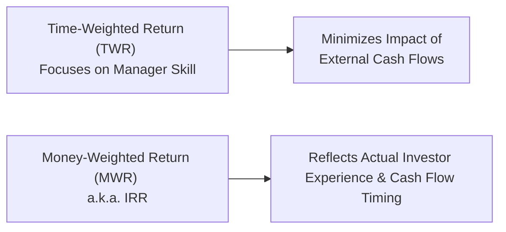

## Introduction and Overview

Portfolio return calculations and benchmark comparisons are cornerstones of performance evaluation. Whether you’re a portfolio manager gauging your investment strategy or an investor checking how well your advisor has done, consistent methods are essential. These methods ensure that all parties assess results the same way. But which measure is most appropriate depends on several factors, like the presence of periodic cash inflows/outflows and the portfolio’s underlying investment style.

That can sound pretty intimidating at first, right? I remember the first time I sat with a big spreadsheet trying to figure out the difference between Time-Weighted Return (TWR) and Money-Weighted Return (MWR). I ended up confusing myself with all the internal flow dates. Eventually, I realized each method tells a distinct story: TWR focuses on the manager’s pure performance, while MWR (IRR) reflects how cash flows and the manager’s timing decisions impact the overall result.

Below, we’ll dive into these return measures—their definitions, calculations, and how you can use them properly. Then we’ll look at various benchmarks, including how to pick or build one that fits your portfolio’s investment mandate. We’ll wrap up by exploring tracking error and how it indicates a manager’s deviation from that benchmark.

## Time-Weighted Return (TWR) vs. Money-Weighted Return (MWR)

### Time-Weighted Return (TWR)

Time-Weighted Return (TWR) is often described as the gold standard for evaluating a manager’s skill because it strips away the effects of external cash flows. If an investor adds cash right before a market rally, the portfolio’s return might shoot up. But that may not reflect skill—it might be pure serendipity. TWR addresses this by evaluating returns on a period-by-period basis, compounding them over time with equal weighting.

Here’s a quick formula that expresses a multi-period TWR:


\text{TWR} = \left(\prod_{t=1}^{n} (1 + r_t)\right)^{\frac{1}{n}} - 1


where \\(r_t\\) is the sub-period (e.g., monthly, quarterly) return.

• Each sub-period’s return is calculated ignoring external cash flows within that period (think “beginning-of-period to end-of-period”).  
• The sub-period returns are then multiplied (compounded) to get a growth factor for the entire period.  
• Finally, you take the nth root—if there are n sub-periods—to annualize or standardize it, subtracting 1 to convert it back to a rate.

Simple enough? Let’s do a tiny example:

– You have a portfolio worth $100 at the start of the first period.  
– End of period 1, it’s $110. However, you or your client withdraw $10 at that time.  
– Start of period 2, the portfolio is effectively $100 again, which then grows by 5% to $105 at the end of period 2.

• Period 1 return: \\((110 - 100)/100 = 10\%.\\)  
• Period 2 return: \\((105 - 100)/100 = 5\%.\\)  

TWR across the two periods (assuming equal-length periods) is:


\displaystyle \left((1+0.10)\times(1+0.05)\right)^{\tfrac{1}{2}} - 1 
= (1.10\times 1.05)^{0.5} - 1 
\approx 7.47\%.


So the TWR is about 7.47% across these two periods.

### Money-Weighted Return (MWR)

Money-Weighted Return (MWR) is also called the Internal Rate of Return (IRR). It incorporates the actual size and timing of cash flows, making it especially relevant if you—like many real-world investors—add or withdraw capital at different times.

The equation sums up to:


\sum_{t=0}^{n} CF_t \times (1 + \text{MWR})^{-t} = 0 


where \\(CF_t\\) is the net cash flow (including reinvested dividends or interest) at time \\(t\\). A positive \\(CF_t\\) might be a contribution into the portfolio, and a negative \\(CF_t\\) is a withdrawal or the final portfolio value.

• The MWR tries to find the discount rate (\\(\text{MWR}\\)) that sets the present value of inflows and outflows to zero.  
• It’s straightforward conceptually but can be more cumbersome in real life—especially if you have numerous or irregular flows. You’ll likely use an IRR function on a financial calculator or spreadsheet.

Let’s say:

– You invest $100 in a fund.  
– A few months later, you add another $100 while the fund is sitting at $95.  
– Eventually, you sell your entire position for $220.

When you resolve for MWR, you figure out the one rate that explains how $200 total contributed turned into $220 after factoring in the intermediate dip in value. This return reflects the actual experience of the investor—if you sold early or missed a period of growth, MWR will show the effect of that timing.

### Practical Differences

• TWR measures the performance of the manager’s strategy without giving extra weight to large or poorly timed cash flows.  
• MWR demonstrates how well the investor did, factoring in precisely when and how much was invested or withdrawn.  

#### Quick Visual

## Geometric vs. Arithmetic Mean Returns

You might also see these terms pop up when evaluating performance: geometric vs. arithmetic mean returns. Let’s break it down.

• **Geometric Mean:** Accounts for compounding over multiple periods. If your returns were +10%, then +5%, the geometric mean is:

\left((1 + 0.10)\times(1 + 0.05)\right)^{\tfrac{1}{2}} - 1 

which is about 7.47%. This matches our earlier TWR example.

• **Arithmetic Mean:** Simply the average of those individual returns:

\frac{10\% + 5\%}{2} = 7.5\%.

For short-run analysis or forward-looking estimates that rely on expected returns in each period, arithmetic averages can be convenient. But for historical performance measurement, geometric means are typically more accurate—especially when evaluating the growth of an investment.

## Benchmark Types and Selection Criteria

Choosing a proper benchmark is like picking the right marathon course to test a runner’s speed. If a manager invests primarily in small-cap technology companies, comparing them to a large-cap value index may provide misleading conclusions.

### Market Index Benchmark

• Common examples: S&P 500, MSCI World, FTSE 100.  
• These represent a broad market or style segment and serve as an accessible yardstick for large portions of global equity.  
• For accuracy, the market index has to align with the manager’s universe. If the manager invests in North American mid-cap growth stocks, an S&P 500 benchmark might not be perfectly representative.

### Custom or Blended Benchmark

• Sometimes no single index approximates a unique strategy. In that case, you create a composite that includes multiple indices with weights mirroring the portfolio’s strategic allocation.  
• For example, a 60% US equity (S&P 500) and 40% global equity (MSCI World ex-US) blend.  
• This approach can be more relevant and fair since it captures the portfolio’s actual style.

### Peer Group or Manager Universe Benchmark

• Compares a manager’s performance against a group of peers classified similarly (e.g., “global equity growth managers”).  
• While it’s intuitive—people like to see how their manager is doing relative to other professionals—it may have issues: survivorship bias, inconsistent classification, or different levels of risk.  
• Still, this can help in certain contexts, like evaluating a hedge fund vs. a universe of hedge funds.

### Absolute Return Targets

• Sometimes used where the manager aims for “T-bills plus 300 bps” or “5% absolute annual returns.”  
• Particularly relevant for alternative or absolute-return strategies that aren’t easily compared against a broad equity index.  
• In pure equity portfolios, absolute targets are less common as a benchmarking tool, but it still occurs (especially if the manager promises a minimum return hurdle).

## Benchmark Requirements (SAMURAI)

In the CFA Program, you’ll often hear about the attributes of a valid benchmark, memorized by acronyms like SAMURAI or SMART. One typical version is SAMURAI:

1. **Specified in Advance:** The benchmark must be declared prior to the start of the measurement period.  
2. **Appropriate:** It matches the manager’s investment style or targeted universe.  
3. **Measurable:** You can clearly calculate its return on a consistent basis.  
4. **Unambiguous:** No confusion about which securities or constituents make up the benchmark.  
5. **Reflective of Manager’s Current Investment Opinions:** Ideally, the benchmark aligns with what the manager is actually investing in or expects to invest in.  
6. **Accountable/Owned:** The manager should accept the validity and accountability of that chosen benchmark.  
7. **Investable:** It is possible to replicate the benchmark or at least invest in a product that mirrors it closely.

If the chosen benchmark fails any of these, it might be “apples vs. oranges.”

## Tracking Error: Measuring Deviations from the Benchmark

Tracking error is the standard deviation of the difference between the portfolio’s returns and the benchmark’s returns. In formula form:


\text{Tracking Error} = \sqrt{\frac{1}{n - 1}\sum_{t=1}^{n} (R_{p,t} - R_{b,t} - \overline{\text{Diff}})^2}


where \\(R_{p,t}\\) is the portfolio return at time \\(t\\), and \\(R_{b,t}\\) is the benchmark return at time \\(t\\). \\(\overline{\text{Diff}}\\) is the mean of these return differences.

• A low tracking error indicates the portfolio is hewing closely to its benchmark. With passive strategies—like pure indexing—a near-zero tracking error might be the aim.  
• A high tracking error might reflect active management that deviates significantly from the benchmark in search of alpha. Or, it could mean the chosen benchmark simply isn’t appropriate.

## Putting It All Together: Practical Application

In exam scenarios, you might be handed a vignette describing a portfolio’s returns over several months with multiple contributions and withdrawals. Understand that if the question highlights cash-flow timing from the investor’s perspective, MWR could be what they’re asking you to calculate. If the question emphasizes evaluating the manager’s skill, TWR is usually the measure they want.

When it comes to the benchmark, pay close attention to the manager’s stated investment universe or style. If the portfolio is globally diversified while the benchmark is purely domestic, you should question the choice. Also, watch for how the exam might incorporate the SAMURAI criteria to test your ability to identify a valid or invalid benchmark. They could mention, for instance, that the benchmark was chosen after the investment period ended—a direct violation of “Specified in Advance.”

Finally, consider tracking error whenever you see references to a “target active risk” or the volatility of differences in returns. Evaluate whether the manager has stayed within an expected range or is straying too far from the mandated style.

## Common Pitfalls and Best Practices

• **Mixing TWR and MWR**: Don’t inadvertently compare TWR to MWR to conclude something about manager skill. They’re telling different stories.  
• **Ignoring Cash Flows**: If you’re computing IRR but forgot to include a mid-period significant deposit or withdrawal, your result might be off by a mile.  
• **Selecting the Wrong Benchmark**: Trying to measure a small-cap portfolio’s performance against a large-cap benchmark can lead to incorrect or misleading interpretations.  
• **Overlooking Reinvestment Assumptions**: Make sure you clarify assumptions about reinvested dividends or dispensations—these details can drastically change return calculations.  
• **Failing the SAMURAI Criteria**: Even if the benchmark looks “close enough,” if it’s not truly investable or it’s ambiguous in composition, it can lead to major discrepancies.

## Sample Table: TWR vs. MWR Comparison

| Aspect                  | Time-Weighted Return (TWR)           | Money-Weighted Return (MWR) / IRR     |
|-------------------------|--------------------------------------|---------------------------------------|
| Cash Flow Influence     | Minimizes impact on final result     | Heavily influenced by size & timing   |
| Manager vs. Investor    | Focuses on manager’s skill           | Reflects actual investor experience   |
| Calculation Complexity  | Break returns into sub-periods       | Solve IRR via iteration or calculator |
| Common Usage            | Performance attribution at manager    | Client performance or private equity  |

## Glossary

• **Time-Weighted Return (TWR):** A method that measures portfolio returns by focusing on manager performance.  
• **Money-Weighted Return (MWR/IRR):** A return that factors in the size and timing of cash flows, reflecting the actual investor experience.  
• **Geometric Mean Return:** The nth root of the product of (1 + periodic return), minus 1, capturing compounding over multiple periods.  
• **Arithmetic Mean Return:** The simple average of periodic returns, useful for quick or short-run assessment.  
• **Tracking Error:** The standard deviation of the difference between portfolio returns and the benchmark.  
• **Benchmark:** A reference index or standard against which a portfolio’s performance is compared.  
• **SAMURAI:** A mnemonic for key attributes of a valid benchmark (Specified in advance, Appropriate, Measurable, Unambiguous, Reflective, Accountable, Investable).

## References and Further Reading

• CFA Institute Level II Curriculum, Performance Evaluation Readings.  
• Maginn, Tuttle, Pinto & McLeavey, “Managing Investment Portfolios: A Dynamic Process.”  
• Bacon, Carl, “Practical Portfolio Performance Measurement & Attribution.”  
• Global Investment Performance Standards (GIPS) documentation, https://www.cfainstitute.org.

## Exam Tips

• Familiarize yourself with both TWR and MWR calculations. In item sets, be especially attentive to the timing of cash flows or partial period returns.  
• Make sure you know how to perform at least a basic IRR calculation on your financial calculator. The exam might not require complex IRR problems, but you’ll need the conceptual approach.  
• Identify whether the question is testing your knowledge of reporting manager skill or investor experience—this is the fundamental TWR vs. MWR fork.  
• Memorizing SAMURAI (or its equivalent) will help you quickly spot any weaknesses in the benchmark selection or creation.  
• Double-check your definitions, especially distinguishing arithmetic from geometric returns. In multi-period performance, geometric is typically used for actual investment growth.  
• Expect possible tracking error questions, especially if the exam mentions “active risk” or attempts to show how far the manager has diverged from the benchmark.

---

## Mastering Portfolio Returns and Benchmarking: 10 Practice Questions



### 1. Which of the following statements best describes the Time-Weighted Return (TWR)?

- [ ] It accounts for the size and timing of all cash inflows and outflows.
- [ ] It is always higher than the Money-Weighted Return (MWR).
- [x] It neutralizes the impact of external cash flows on performance results.
- [ ] It multiplies all returns by the ending market value.

> **Explanation:** TWR focuses on performance in each sub-period, net of external cash flows. It is designed to isolate the manager’s investment skill.

### 2. Which of the following is the main advantage of the Money-Weighted Return (MWR) over the Time-Weighted Return (TWR)?

- [ ] It always produces a higher return when there are large contributions.
- [x] It captures the actual investor experience by incorporating the size and timing of cash flows.
- [ ] It compounds equal sub-period returns for consistency.
- [ ] It disregards all interim cash flows.

> **Explanation:** MWR (or IRR) measures performance from the investor’s point of view, factoring in all timing and magnitude of cash inflows/outflows.

### 3. Suppose a manager’s portfolio has two sub-period returns: +6% for the first half-year and +4% for the second half-year. Which return type calculates the overall performance as [(1+0.06)(1+0.04)]^(1/2) – 1?

- [ ] Arithmetic mean return
- [x] Geometric mean return
- [ ] Real return
- [ ] Money-weighted return

> **Explanation:** This is the standard approach to compound sub-period returns, yielding the geometric mean.

### 4. A manager invests primarily in small-cap growth stocks, but you compare their performance to a broad large-cap index. Which SAMURAI principle is most likely violated?

- [x] Appropriate
- [ ] Measurable
- [ ] Specified in advance
- [ ] Investable

> **Explanation:** If the chosen benchmark doesn’t match the manager’s style or market segment, the “Appropriate” criterion is not met.

### 5. Which of the following is NOT one of the benchmark selection criteria under the SAMURAI acronym?

- [ ] Specified in advance
- [x] Resilient to market declines
- [ ] Measurable
- [ ] Unambiguous

> **Explanation:** “Resilient to market declines” is not part of the classic SAMURAI acronym. The others—Specified in advance, Measurable, and Unambiguous—are included.

### 6. Tracking error is best defined as:

- [ ] The ratio of the portfolio’s return to the benchmark’s return.
- [x] The standard deviation of the difference between the portfolio and the benchmark returns.
- [ ] The difference between the money-weighted and time-weighted returns.
- [ ] The standard deviation of the portfolio’s returns.

> **Explanation:** Tracking error quantifies how much the portfolio’s returns deviate from the benchmark’s returns over time.

### 7. A portfolio had returns of +10%, +2%, and +8% over three consecutive years. The arithmetic mean return over this period is:

- [x] 6.67%
- [ ] 6.53%
- [ ] 6.40%
- [ ] 7.00%

> **Explanation:** Arithmetic mean = (10% + 2% + 8%) / 3 = 20% / 3 = 6.67%.

### 8. If a portfolio’s benchmark is poorly constructed, which of the following consequences is most likely?

- [ ] The portfolio’s TWR and MWR converge.
- [x] Performance comparison may be misleading or irrelevant.
- [ ] The benchmark automatically violates GIPS guidelines.
- [ ] The manager’s returns become purely a function of arithmetic means.

> **Explanation:** A poor benchmark leads to an irrelevant comparison. It doesn’t violate rules automatically, but it undermines performance evaluation.

### 9. Which of the following would typically lead to a high tracking error?

- [x] A portfolio significantly deviating from benchmark holdings.
- [ ] The portfolio invests only in index duplication strategies.
- [ ] The manager invests in exactly the same securities as the benchmark.
- [ ] The portfolio holds stable assets with zero standard deviation of returns.

> **Explanation:** High tracking error arises from large deviations in holdings or style relative to the benchmark, reflecting active management or mismatch.

### 10. True or False: Geometric returns generally offer a more accurate depiction of long-term performance than arithmetic returns.

- [x] True
- [ ] False

> **Explanation:** Geometric returns incorporate compounding effects, making them more accurate for multi-period performance measurement.


