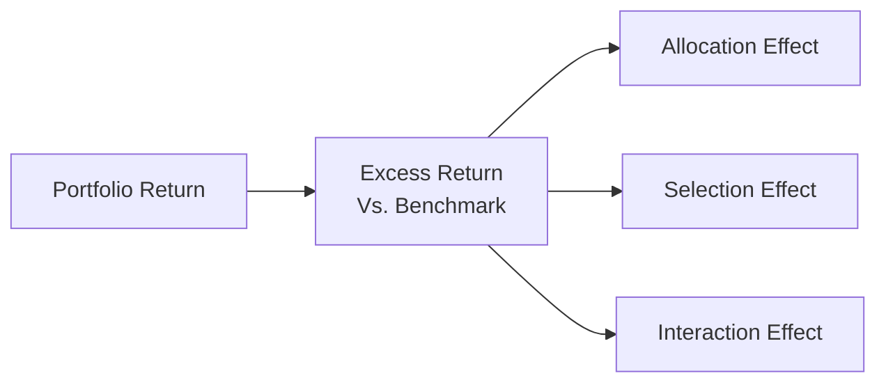

## A Friendly Take on Performance Attribution

I still remember the first time I saw the Brinson model. I was this newly minted junior analyst, controlling a handful of spreadsheets and feeling pretty good about it. Then my boss asked me to “unpack the performance drivers” of a client’s portfolio. Um, yeah, I had to figure out how to slice and dice returns into meaningful bits—like which part was due to picking the right stocks in each sector, which part was due to overweighting those sectors, and so on. That’s when I first realized how crucial performance attribution can be in telling the story behind the numbers.

In this section, we’re going to dig into the details of attribution analysis, focusing on three big ideas: sector (or allocation) effects, style effects, and security selection effects. You’ll often see terms like “allocation effect,” “selection effect,” and “interaction effect” thrown around, and we’ll handle each one step by step. We’ll also see how style-based and factor-based approaches add extra depth, especially when analyzing more sophisticated equity portfolios.

## Why Attribution Analysis Matters

Attribution analysis helps you understand where your portfolio’s performance is coming from and why it differs from what a comparable benchmark delivers. If your portfolio’s up 12% and your benchmark’s up 10%, you’ve generated 2% of “excess return” or “alpha.” But was that because you overweighted a hot sector, picked better-than-average stocks within each sector, or ran some cunning factor tilt like “value” or “momentum”? Once you can answer those questions, you can replicate successes and fix flaws.

Beyond that, attribution analysis fosters accountability: if a manager claims a “value tilt,” we can see whether results actually align with typical “value” factors. If you’re prepping for the CFA exam, you’ll almost certainly run into item sets asking you to break out which part of performance was due to sector weighting vs. security picking. Let’s see how it works.

## Dissecting the Brinson Model

Most introductory performance attribution frameworks are based on the Brinson model (sometimes called the Brinson-Fachler or Brinson-Hood-Beebower model). Yes, these are old-school references, but trust me, they’re classics in the investment performance world. This top-down approach divides active return—your portfolio’s return relative to its benchmark—into three parts:

• Allocation effect  
• Selection effect  
• Interaction effect  

Below is a simple diagram to capture the overall flow. You’ll see how your total excess return flows into each effect:

### Allocation Effect

Also known as the “sector allocation effect” (or sometimes “between-sector effect”), it shows the part of your active return that’s driven by deviating from the benchmark weights in each sector (or industry group, region, etc.). Essentially, did you overweight the winner sectors and underweight the losers?

Mathematically, for each sector i:


\text{Allocation Effect}_i = (w_{p,i} - w_{b,i}) \times (r_{b,i} - r_b),


where:  
• \\(w_{p,i}\\): your portfolio weight in sector i.  
• \\(w_{b,i}\\): benchmark weight in sector i.  
• \\(r_{b,i}\\): benchmark return for sector i.  
• \\(r_b\\): total benchmark return.  

Interpretation: If you put more money than the benchmark in a sector that performed better than the overall benchmark, you’ll get a positive allocation effect. If you bet big on a sector that underperformed the broader benchmark, you’ll see a negative effect.

### Selection Effect

This indicates how well you picked securities within each sector. If your chosen stocks in a sector beat (or trailed) the sector’s own benchmark return, you see that in the selection effect. It is typically measured as:


\text{Selection Effect}_i = w_{b,i} \times (r_{p,i} - r_{b,i}),


where:  
• \\(r_{p,i}\\): your actual return in sector i (i.e., the weighted-average return of stocks you own in that sector).  
• \\(r_{b,i}\\): benchmark sector return.  

Interpretation: If your stock picks in sector i returned 15% while the sector index returned only 10%, you’d have a positive selection effect. If you underperform the sector average, you’ll see a negative selection effect.

### Interaction Effect

Sometimes called the “allocation/selection” interaction, this portion captures the synergy (or friction) between weighting decisions and security selection. It ensures that the sum of your allocation and selection effects matches your total active return. The formula:


\text{Interaction Effect}_i = (w_{p,i} - w_{b,i}) \times (r_{p,i} - r_{b,i}).


Interpretation: If you overweight a sector ( relative to the benchmark ) and those active picks in that sector outperform, you get an extra boost. If you overweight something that underperforms, well, that can hurt you both ways.

### Summing Up

The total active performance in your portfolio is the sum of your sector-level allocation, selection, and interaction effects across all sectors:


\text{Total Active Return} = \sum_i \left[
\text{Allocation Effect}_i + \text{Selection Effect}_i + \text{Interaction Effect}_i
\right].


## Style Attribution

While the Brinson approach focuses on sector weighting and security selection within each sector, style attribution digs deeper into specific “styles” or “factors.” You might have heard about “value vs. growth,” “large-cap vs. small-cap,” “quality vs. junk,” and so on. In practice, managers often define their style using well-known indices or factor groupings. For example, a manager might track their performance relative to the Russell 1000 Growth index if they claim a “growth” style.

• Value vs. Growth: Decomposes returns based on valuations (e.g., P/E, P/B) or growth characteristics (e.g., revenue growth, earnings momentum).  
• Market-Cap Tilt: Large-cap vs. mid-cap vs. small-cap.  
• Momentum Weighting: Overweighting stocks showing recent strong performance.  
• Quality: Focusing on stocks that have stable earnings, low debt, or other “quality” measures.

If your portfolio systematically tilts toward small-cap growth stocks and the market is favoring them, you’re likely to see positive style-attribution effects. On the flip side, if your style tilt goes out of favor, it might weigh on overall performance, even if your sector selection was correct.

## Security Selection

Security selection can be viewed in two ways:

1. Within-Sector Security Selection (Brinson Approach): We just talked about that—comparing your stocks to the sector’s average or index return.  
2. Individual Stock Layers: A more granular approach that breaks out the contribution of each stock independently (potentially used in factor-based models or more advanced analytics).

It’s one thing to identify that, say, your technology stocks outperformed the tech sector in aggregate. But to really understand which picks did the heavy lifting (and why), you need to look at each position and see where alpha was generated. This helps even more when you’re doing risk management or adjusting your portfolio’s future exposures.

## Factor-Based Attribution

Factor-based approaches expand on style attribution. Instead of just labeling a stock as “growth” or “value,” we can incorporate more precise measures:

• Macro factors: Interest rates, inflation, credit spreads.  
• Fundamental factors: Earnings yield, book-to-market ratio, profitability, etc.  
• Statistical factors: Often derived from principal component analysis or similar techniques.

Factor-based frameworks attempt to explain portfolio returns through the lens of these underlying drivers. For instance, your portfolio might have a strong tilt toward “high momentum” and “low volatility” factors. By decomposing performance along those lines, you see exactly how each factor contributed, separate from your pure security-selection prowess.

## Quick Numerical Example

Let’s walk through a simplified scenario to illustrate the Brinson model. Suppose your portfolio invests in two main sectors: Technology and Consumer Staples. The table below shows the relevant data:

| Sector            | Portfolio Weight (w_p,i) | Portfolio Return (r_p,i) | Benchmark Weight (w_b,i) | Benchmark Return (r_b,i) |
|-------------------|--------------------------|--------------------------|--------------------------|--------------------------|
| Technology        | 0.40                    | 12%                      | 0.30                    | 10%                      |
| Consumer Staples  | 0.60                    | 8%                       | 0.70                    | 9%                       |

Assume the benchmark’s overall return \\( r_b \\) is 9.3%. Let’s compute the effects.

1. **Allocation Effect**  
   • Tech: \\((0.40 - 0.30) * (10\% - 9.3\%) = 0.10 * 0.7\% = 0.07\%\\)  
   • Staples: \\((0.60 - 0.70) * (9\% - 9.3\%) = -0.10 * (-0.3\%) = +0.03\%\\)  
   • Total Allocation Effect = 0.07\% + 0.03\% = +0.10\%.

2. **Selection Effect**  
   • Tech: \\(0.30 * (12\% - 10\%) = 0.30 * 2\% = 0.60\%\\)  
   • Staples: \\(0.70 * (8\% - 9\%) = 0.70 * (-1\%) = -0.70\%\\)  
   • Total Selection Effect = 0.60\% - 0.70\% = -0.10\%.

3. **Interaction Effect**  
   • Tech: \\((0.40 - 0.30) * (12\% - 10\%) = 0.10 * 2\% = 0.20\%\\)  
   • Staples: \\((0.60 - 0.70) * (8\% - 9\%) = -0.10 * (-1\%) = +0.10\%\\)  
   • Total Interaction Effect = 0.20\% + 0.10\% = +0.30\%.

4. **Active Return**  
   Summing these:  
   
   \text{Active Return} = 0.10\% + (-0.10\%) + 0.30\% = 0.30\%.
     
   So, your portfolio outperforms the benchmark by 0.30%. It’s not earth-shattering but still a positive alpha, influenced heavily by that interaction effect (overweighting a winning sector while also selecting strong tech stocks).

## Common Pitfalls and Best Practices

• Overcomplicating the Model: The core Brinson methodology has proven robust for decades. No need to reinvent the wheel with too many mini-breakouts unless you’re truly advanced or your exam question calls for it.  
• Ignoring Fees and Transaction Costs: In the real world, your net performance might differ from your gross calculations. Of course, in the exam’s theoretical world, you’ll typically ignore them unless stated otherwise.  
• Style Drift: Managers who claim to be “value only” might quietly drift toward growth if they sense a style shift. Performance attribution reveals if they’re walking the talk.  
• Misalignment of Benchmarks: You must compare each sector (or style) to its relevant benchmark. Otherwise, you’re attributing performance to the wrong baseline.  
• Data Inconsistency: If your weighting data, price returns, or sector definitions aren’t consistent over time, your attribution results can be misleading. Make sure you define your measurement period clearly and use consistent data sources.

## Bringing It All Together

Attribution analysis is like peeling apart the layers of an onion—lots of tears if you do it poorly, but when done right, it provides a crystal-clear look at how well your portfolio is managed. If a portfolio outperforms, you can see if that outperformance came from bright ideas about which sectors to emphasize, brilliant security selection within each sector, or just pure luck that some factor tilt went your way.

As you practice for the CFA exam, be sure you can:  
• Calculate each effect numerically.  
• Interpret the results conceptually (i.e., which categories contributed or detracted the most?).  
• Relate these findings to real-world portfolio manager strategies (did they truly outperform by picking winners, or just overweight a surging sector?).  

## Exam Tips

• Watch for partial data: Vignettes like to test your ability to infer missing pieces or re-check weighting for errors (like when sector weights don’t sum to 1).  
• Keep the formulas straight: Don’t confuse the sign of the difference in weights \\((w_{p,i} - w_{b,i})\\) or returns \\((r_{p,i} - r_{b,i})\\).  
• Factor-based attribution: You might get a question that lumps “value,” “size,” or “momentum” as factors in addition to basic sector data. As soon as you see factor labels, that’s your signal to interpret returns from a factor perspective.  
• Time management: Calculation-based item sets can be time-consuming. Practice short-cuts like grouping the calculations in a table.  
• Round carefully but consistently: If you’re asked for a final answer in basis points, keep your intermediate steps precise enough.

## References and Further Exploration

• CFA Institute Level II Curriculum, “Performance Evaluation Readings & Practice Problems”  
• Gary P. Brinson, L. Randy Hood, and Gilbert L. Beebower, “Determinants of Portfolio Performance,” Financial Analysts Journal  
• CFA Institute’s “Investment Performance Measurement” resources  
• Maginn, Tuttle, Pinto, and McLeavey, “Managing Investment Portfolios: A Dynamic Process”  
• Online Tools: GIPS (Global Investment Performance Standards) website for updated performance measurement standards  

---

## Test Your Knowledge: Advanced Equity Attribution Analysis



### Which component of the Brinson-based performance attribution model measures the effect of deviating from benchmark sector weighting?

- [ ] Selection effect
- [x] Allocation effect
- [ ] Interaction effect
- [ ] Factor effect

> **Explanation:** The allocation effect captures the impact of overweighting or underweighting certain sectors relative to the benchmark.

### In the Brinson model, which formula correctly represents the selection effect for each sector?

- [ ] (w_p,i – w_b,i) × (r_p,i – r_b)
- [ ] w_p,i × (r_p,i – r_b,i)
- [x] w_b,i × (r_p,i – r_b,i)
- [ ] (w_p,i – w_b,i) × (r_b,i – r_b)

> **Explanation:** Selection effect in each sector is w_b,i × (r_p,i – r_b,i). It isolates the contribution from picking better (or worse) stocks within that sector’s benchmark weight.

### What is the most likely cause of a large positive interaction effect?

- [x] Overweighting a sector that also has strong stock selection
- [ ] Overweighting a sector that underperforms overall
- [ ] Underweighting a sector with strong relative returns
- [ ] Selecting securities similar to the benchmark

> **Explanation:** Interaction effect is high and positive when you overweight a certain sector and your security picks within that sector outperform the sector’s benchmark.

### When performing style attribution, which of the following is least likely to be classified as a style factor?

- [ ] Value vs. Growth
- [ ] Market Capitalization
- [ ] Momentum
- [x] Foreign-exchange hedging policies

> **Explanation:** FX hedging policies usually fall under currency management decisions rather than typical equity style dimensions like value/growth, momentum, or market cap bias.

### A portfolio has a noticeable tilt toward “quality” stocks, yet the manager claims to be a “deep value” investor. Which principle does style attribution best illustrate?

- [ ] Interaction effect
- [ ] Infrastructure investing
- [ ] Macro factor tilting
- [x] Manager style drift

> **Explanation:** Style attribution would reveal that the portfolio is not purely value-driven, indicating style drift if the manager claims to be “deep value” but invests in high-quality, non-value stocks.

### To calculate the allocation effect of a sector in the Brinson model, you multiply:

- [ ] (Portfolio weight – Benchmark weight) × (Portfolio sector return – Portfolio return)
- [ ] (Benchmark weight – Portfolio weight) × (Benchmark return – Portfolio return)
- [ ] Portfolio weight × (Portfolio sector return – Benchmark return)
- [x] (Portfolio weight – Benchmark weight) × (Benchmark sector return – Benchmark return)

> **Explanation:** By definition, the allocation effect is (w_p,i – w_b,i) × (r_b,i – r_b). This measures how your choice to overweight or underweight that sector contributed to active return, based on that sector’s relative performance vs. the total benchmark.

### If a portfolio’s active return is consistently explained by changes in interest rates and credit spreads, which type of attribution approach is most relevant?

- [ ] Traditional sector-based
- [ ] Extended Brinson model
- [ ] Pure style classification
- [x] Factor-based attribution

> **Explanation:** Factor-based attribution breaks down returns by macro factors (like interest rates and credit spreads) or fundamental factors, showing how each factor contributes to overall performance.

### In a scenario where sector weights in a manager’s portfolio exactly match the benchmark, which effect would be zero?

- [ ] Selection
- [x] Allocation
- [ ] Factor
- [ ] Overall active return

> **Explanation:** If sector weights mirror the benchmark’s exactly, the allocation effect is zero because there is no deviation in weighting from the benchmark.

### A manager invests in only two sectors. She underweights Sector A, which outperforms the benchmark, but her individual stock picks in Sector A significantly beat the sector’s index. Which statement is most accurate?

- [ ] Selection effect is negative, allocation effect is positive.
- [x] Selection effect is positive, allocation effect is negative.
- [ ] Both selection and allocation effects are positive.
- [ ] Both selection and allocation effects are negative.

> **Explanation:** Underweighting a winning sector leads to a negative allocation effect, but picking exceptional securities in that sector leads to a positive selection effect.

### True or False: The sum of allocation, selection, and interaction effects must equal the total active return of the portfolio.

- [x] True
- [ ] False

> **Explanation:** By design, these three components collectively decompose the entire active return (portfolio return – benchmark return).


