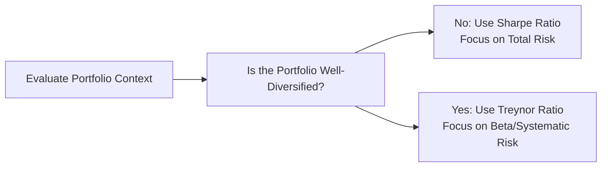

## Rationale for Risk Adjustment
So, here’s the thing: you can look at two portfolios that both earned, say, a 10% return last year. At first glance, they look the same, right? But what if one portfolio took enormous risks to achieve that performance, while the other tiptoed around the market’s volatility like an acrobat on a wire? The second portfolio, in theory, delivered more efficient results: it garnered hefty returns for relatively less risk. That’s the essence of risk-adjusted performance metrics.

From a CFA perspective (especially at Level II), we get introduced to a variety of methods that measure returns against some notion of risk. After all, we’re not just tracking raw performance; we’re also asking, “How much risk did we take to get this return?” These measures illuminate the subtle differences in performance that raw return data alone might mask.

## Common Risk-Adjusted Metrics

### Sharpe Ratio
This is a classic that compares a portfolio’s excess return over the risk-free rate to its total risk.

In formula form (using KaTeX):


\text{Sharpe Ratio} = \frac{R_p - R_f}{\sigma_p}


Where:
• \\(R_p\\) is the portfolio return.  
• \\(R_f\\) is the risk-free rate.  
• \\(\sigma_p\\) is the standard deviation of the portfolio’s returns.

The standard deviation captures total risk (i.e., both systematic and unsystematic). The Sharpe Ratio can be especially useful if your portfolio is your entire investment (not a sub-portion of a bigger diversified mix). A higher Sharpe means you’re getting more return per unit of total volatility. If you’re working with only one portfolio or strategy and you’re not diversifying across multiple strategies, the Sharpe Ratio is typically the go-to measure.

### Treynor Ratio
Now, imagine you hold a diversified portfolio. In that situation, unsystematic risk mostly washes out, and systematic risk (beta) is what truly matters. The Treynor Ratio is tailor-made for that context:


\text{Treynor Ratio} = \frac{R_p - R_f}{\beta_p}


Where:
• \\(R_p\\) is the portfolio return.  
• \\(R_f\\) is the risk-free rate.  
• \\(\beta_p\\) is the portfolio’s beta relative to the market (systematic risk).

A common analogy is to think of the Treynor Ratio like “miles per gallon” for systematic risk alone. If you run a well-diversified equity fund, you might be primarily interested in how effectively you’re rewarded for exposure to the market rather than for random, idiosyncratic fluctuations.

### Jensen’s Alpha (α)
Jensen’s Alpha measures the excess return of a portfolio over the return predicted by the Capital Asset Pricing Model (CAPM). If we denote the CAPM-expected return by \\( E(R_p) \\), then:


\alpha = R_p - E(R_p)


E(R_p) = R_f + \beta_p \bigl(R_m - R_f\bigr)


Where:
• \\(R_m\\) is the market return.  
• \\(R_f\\) is the risk-free rate.  
• \\(\beta_p\\) is the portfolio’s beta with respect to the market.

If α is positive, the portfolio has outperformed its CAPM expectation. A negative alpha suggests underperformance. In practice, some managers ride on systematic risk (beta) alone to generate returns. Jensen’s Alpha attempts to filter that out, highlighting any “pure skill” in delivering returns beyond what the portfolio’s market risk would suggest.

### Information Ratio (IR)
When you compare a portfolio’s returns to a relevant benchmark, you’re interested in how consistently that portfolio beats (or falls short of) the benchmark. The Information Ratio focuses on the active return (portfolio minus benchmark) per unit of active risk (tracking error):


\text{Information Ratio} = \frac{R_p - R_b}{\text{Tracking Error}}


Where:
• \\(R_p\\) is the portfolio’s return.  
• \\(R_b\\) is the benchmark return.  
• Tracking Error is the standard deviation of \\((R_p - R_b)\\).

If you’re a portfolio manager constrained to a benchmark’s sector weights, style exposures, or region constraints, the IR is huge. It tells you how effectively you’re using your “active risk budget” to generate alpha. The higher the IR, the more consistently you beat the benchmark after adjusting for how different your portfolio is from that benchmark.

### M2 (Modigliani-Modigliani) Measure
M2 takes the Sharpe Ratio and expresses it in a more intuitive “percent return” format. Here, we scale a portfolio’s standard deviation to match the standard deviation of a benchmark (say, the market). By standardizing that difference, M2 essentially answers: “What return would this portfolio have made if it had the same volatility as the market?” 

The formula for M2 is:


\text{M2} = R_f + \Bigl(\frac{\sigma_M}{\sigma_p}\Bigr) (R_p - R_f)


Where:
• \\(\sigma_M\\) is the market’s (benchmark’s) standard deviation.  
• \\(\sigma_p\\) is the portfolio’s standard deviation.

M2 is more direct for folks who like to see performance in “plain return” terms rather than a ratio. For example, if your M2 is 13%, you can interpret that as “the portfolio would have made 13% if it carried the same risk as the market.”

## Visual Overview

Below is a simple mermaid flowchart showing how an investor might think about choosing between Sharpe (total risk) and Treynor (systematic risk) when measuring performance:

It’s (obviously) a simplistic view in a box-and-arrow diagram, but hopefully it helps you recall the key difference: Sharpe works best for total risk, Treynor for systematic risk.

## Choosing the Right Metric
• If you’re evaluating a standalone portfolio that includes all an investor’s money, Sharpe Ratio or M2 is often a good fit because total volatility is the big concern.  
• If your portfolio is part of a larger, diversified structure, the Treynor Ratio and Jensen’s Alpha are often favored because they zero in on beta as the key risk driver.  
• If your performance is constantly compared to a benchmark and that’s how you’re measured by your boss or stakeholders, the Information Ratio can reveal how well (and how consistently) you outperform that benchmark.  
• The M2 measure can be a better communication tool for clients unfamiliar with the concept of “return per unit of risk,” because it translates risk-adjusted returns into a percentage figure that compares directly to the market.

## Interpretation Pitfalls
Before you dash off to plug in numbers, let’s talk about some watchouts:

• Short-term Volatility: In a year with extreme market swings, your Sharpe or Information Ratio might look amazing (or horrific). It could be random, so consider a longer horizon.  
• Reliance on Historical Data: These metrics assume that the past is a decent proxy for the future. In unpredictable markets, that assumption can be shaky.  
• Timeframe Consistency: Make sure the risk measure (standard deviation, beta, or tracking error) matches the same period as your return figures. Mismatched windows can distort results.  
• Benchmark Definition: For Jensen’s Alpha and the Information Ratio, your choice of benchmark heavily influences results. No benchmark is perfect; alignment with investment objectives is key.

## Practical Application in Vignettes
In CFA Level II vignettes, you might see a scenario presenting:
- A mutual fund’s average return of 12% with a standard deviation of 15%.  
- A market benchmark with a return of 10% and a standard deviation of 12%.  
- A risk-free rate of 3%.  
- The portfolio’s beta of 1.1 (for Treynor or Jensen’s Alpha calculations).  
- A tracking error of 2% (for the Information Ratio).  

The question might ask, “Which risk-adjusted metric is most appropriate for the fund’s situation?” or “Calculate the Sharpe Ratio and interpret its meaning.” You’d sift through the data, pick the relevant formula, and carefully compute. Then you’d interpret by referencing whether the fund is a standalone or a component of a large portfolio, or whether the examiner specifically wants to see active risk usage.

Here’s a quick numeric example:

• Sharpe Ratio = (12% – 3%) / 15% ≈ 0.60  
• Treynor Ratio = (12% – 3%) / 1.1 ≈ 8.18%  
• Jensen’s Alpha = 12% – [3% + 1.1 × (10% – 3%)] = 12% – [3% + 1.1 × 7%] = 12% – (3% + 7.7%) = 12% – 10.7% = 1.3%  
• Information Ratio = (12% – 10%) / 2% = 1.0  
• M2 = 3% + (12% / 15%) × (12% – 3%) = 3% + 0.8 × 9% = 3% + 7.2% = 10.2% (assuming we scale by the benchmark’s volatility of 12% but ignoring that step, for brevity here).

Each measure highlights a different dimension of performance. A test question might ask you to interpret them in the context of how diversified the portfolio is, or how they might differ from one another.

## A (Slightly) Personal Anecdote
I remember a time I was analyzing two equity funds for my friend who’s a newbie investor—he saw both funds claimed “10% annual returns.” He was about to blindly invest in the one with the “shinier ad.” A quick Sharpe Ratio calculation showed the first fund (the “shiny” one) was leveraged to the hilt, so it was swinging wildly every quarter. The second fund was far more stable and had a higher Sharpe Ratio. This made a difference when my friend realized that “10% return” can mean very different things in terms of volatility. That’s when it clicked for him that risk-adjusted metrics really matter.

## Best Practices and Pitfalls
• Always align the risk measure with the nature of the portfolio.  
• Consider multiple metrics; a single ratio might not capture everything.  
• Check consistency of timeframes for returns and risk.  
• Recognize that a high or low ratio can be influenced by unique events (e.g., government bailouts, black swans, or pandemics).  
• Watch for data-snooping or overfitting: sometimes historically high Sharpe or Information Ratios are flukes.

## Summary and Exam Tips
1. If the portfolio stands alone, or you have no other investments, the Sharpe Ratio or M2 measure typically gets center stage.  
2. If you’re part of a well-diversified portfolio or analyzing systematic risk, Treynor Ratio and Jensen’s Alpha are more relevant.  
3. If the benchmark is your performance yardstick, the Information Ratio is the star.  
4. Know your formulas cold. You can practically bet the exam will test your ability to compute or interpret them.  
5. Be ready to articulate the rationale behind each metric in short-answer or item set questions.  
6. Double-check time horizons and definitions of risk-free rates, betas, or standard deviations—vignettes sometimes trip you up on details.  

At the end of the day, or the end of the exam, you want to demonstrate not just that you can calculate each ratio but also that you can explain which measure is most appropriate in different investment contexts and why.

## References and Further Reading
• CFA Institute Level II Curriculum on “Quantitative Methods” and “Portfolio Management.”  
• Grinold, Richard C. and Ronald N. Kahn, “Active Portfolio Management: A Quantitative Approach for Providing Superior Returns and Controlling Risk.”  
• Morningstar Methodology Papers on Risk and Return Evaluation.  
• Modigliani, F., & Modigliani, L. (1997), “Risk-Adjusted Performance,” The Journal of Portfolio Management, 23(2).

## Test Your Knowledge: Risk-Adjusted Performance Metrics Quiz



### Which ratio focuses on total risk (i.e., standard deviation) rather than just systematic risk (i.e., beta)?

- [ ] Treynor Ratio
- [x] Sharpe Ratio
- [ ] Jensen’s Alpha
- [ ] Information Ratio

> **Explanation:** The Sharpe Ratio factors total volatility into the denominator. Treynor Ratio, by contrast, uses beta (systematic risk).

### Suppose a portfolio’s excess return over the risk-free rate is 5%, and the portfolio’s beta is 1.2. What is the Treynor Ratio?

- [ ] 0.06
- [x] 4.17%
- [ ] 6.00%
- [ ] 1.20%

> **Explanation:** Treynor Ratio = 5% / 1.2 = 4.17%.

### If a manager wants to gauge how consistently they outperform a benchmark, which ratio should they prioritize?

- [ ] Sharpe Ratio
- [ ] Treynor Ratio
- [ ] M2 Measure
- [x] Information Ratio

> **Explanation:** The Information Ratio is used to assess performance relative to a benchmark, adjusted by the variability of active returns (tracking error).

### A manager computed Jensen’s Alpha for her fund and got a negative value. What does this typically suggest?

- [x] The fund underperformed relative to its CAPM-predicted return.
- [ ] The manager’s security selection skill is high.
- [ ] The fund is highly leveraged.
- [ ] The fund’s standard deviation is relatively large compared to its return.

> **Explanation:** A negative alpha indicates that the fund produced returns below the level expected for its market risk as per CAPM.

### Which of the following best describes the M2 (Modigliani-Modigliani) measure?

- [ ] It uses tracking error to measure risk-adjusted returns.
- [ ] It scales portfolio return using the portfolio beta.
- [x] It expresses the Sharpe Ratio in percentage-return terms by scaling portfolio returns to the benchmark’s volatility.
- [ ] It quantifies how a portfolio’s alpha compares purely to the portfolio’s systematic risk.

> **Explanation:** M2 transforms the Sharpe Ratio into a “percent return” form, normalizing portfolio risk to that of the benchmark.

### Which metric is generally most appropriate for a single-fund investor worried about overall fluctuations in the value of their investment?

- [x] Sharpe Ratio
- [ ] Treynor Ratio
- [ ] Information Ratio
- [ ] Jensen’s Alpha

> **Explanation:** When the fund constitutes the entire portfolio, total volatility is the primary concern, addressed by the Sharpe Ratio.

### A fund has an annual return of 14% with a standard deviation of 10%, while the market’s annual return is 10% with a standard deviation of 8%. The risk-free rate is 3%. What is the Sharpe Ratio for this fund?

- [x] 1.1
- [ ] 0.9
- [ ] 1.4
- [ ] 1.3

> **Explanation:** Sharpe = (14% – 3%) / 10% = 11% / 10% = 1.1.

### When calculating the Information Ratio, the denominator (tracking error) is defined as:

- [ ] The market’s standard deviation.
- [ ] The standard deviation of the fund’s total returns.
- [x] The standard deviation of the active return (portfolio return minus benchmark return).
- [ ] The difference between the portfolio’s and benchmark’s betas.

> **Explanation:** Tracking error is the standard deviation of the portfolio’s active returns over the benchmark.

### If the M2 measure for a portfolio is 12.5%, while the benchmark’s return is 10%, which of the following interpretations is correct?

- [ ] The portfolio’s Sharpe Ratio must be 1.25.
- [ ] The benchmark is outperforming on a risk-adjusted basis.
- [ ] The portfolio has experienced negative alpha.
- [x] The portfolio would have earned 12.5% if it had the same standard deviation as the benchmark.

> **Explanation:** M2 interprets the portfolio performance as if it had the same risk level as the market (or benchmark). Here, it implies an effectively higher risk-adjusted return than the benchmark’s 10%.

### A positive Treynor Ratio guarantees that a portfolio has outperformed the market on a risk-adjusted basis.

- [ ] True
- [x] False

> **Explanation:** A positive Treynor Ratio indicates positive excess return relative to the risk-free rate when adjusted by beta. However, it does not necessarily compare directly to the market’s Treynor Ratio. Comparing only absolute values can be misleading without a reference benchmark ratio.


