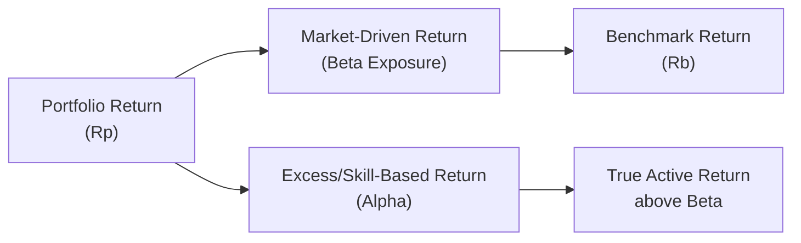

## Introduction

So, you’ve come a long way in equity investments and performance evaluation, and now you’re asking, “Where exactly does alpha come from?” or maybe, “What portion of a manager’s stellar (or not-so-stellar) performance really reflects skill?” If you find yourself in that boat, you’re not alone. This section aims to help you spot those skill-based returns—known as alpha—and distinguish them from the broader market movements (beta). Along the way, we’ll look at a step-by-step approach you can use in a vignette (item set) scenario, explore risk-adjusted metrics, and zero in on the difference between luck and genuine skill.

## Understanding Alpha and Beta

Alpha is often described as the return generated by a portfolio above (or below) what we would expect, given the inherent risk and overall market movements. In formal terms, if we let Rp be the portfolio return, Rf the risk-free rate, Rm the market return, and β the portfolio’s systematic risk exposure to the market, then:

(1)  
α = Rp − [Rf + β(Rm − Rf)]

Alpha (α) here is a measure of skill if the return is above what we’d get simply by being exposed to the market. Beta, on the other hand, is simply how much the portfolio moves relative to the market. If β = 1, the portfolio tends to move one-for-one with the market. If β > 1, you’ll see magnified gains and losses relative to the market.

Anyway, the CFA Program emphasizes that alpha should be understood in the context of a relevant benchmark. In practice, if you’re analyzing a large-cap equity manager who invests predominantly in U.S. stocks, you’d typically compare performance to something like the S&P 500 or a similar broad-based index. However, if the manager invests in small-cap growth stocks, you’d want a more tailored benchmark (e.g., a small-cap growth index). Otherwise, you might be incorrectly attributing performance to skill when it’s really just a mismatch between the manager’s style and the benchmark.

## The Step-by-Step Approach in Item Sets

Being able to identify alpha in an exam vignette depends on carefully dissecting the data:

1. Analyze Benchmark and Portfolio Returns  
   Take a look at core figures: the overall portfolio return, the benchmark return, and any difference (the active return). Also note any risk-free rates if they’re relevant, so you can see the difference between portfolio excess return and benchmark excess return.

2. Identify Sector Weights vs. Benchmark  
   In many item sets, you’ll see the manager’s sector allocations differ from the benchmark. Watch carefully for variations in sector weighting—like a manager who’s overweight tech and underweight utilities—to determine whether outperformance is from correct sector calls (allocation effect) or from picking securities that beat their sector averages (selection effect).

3. Look for Risk Factor Exposures  
   Sometimes, it’s not just sector-based but factor-based—for example, a tilt toward momentum, value vs. growth, or small vs. large cap. The portfolio’s performance might just be riding a style wave rather than reflecting manager skill. If the manager’s overweight high-momentum stocks and that style soared during the evaluation period, you want to know how much of the outperformance was purely style, and how much was actual security selection skill.

4. Apply Risk-Adjusted Metrics  
   You’ve probably heard of the Sharpe ratio (which uses total risk), the Treynor ratio (which uses beta), and the Information Ratio (IR).  
   • Sharpe: (Rp − Rf)/σp  
   • Treynor: (Rp − Rf)/βp  
   • Information Ratio: (Rp − Rb)/Tracking Error  

   Where Rb is the benchmark return and Tracking Error is the standard deviation of (Rp − Rb). Item sets commonly ask which metric best isolates skill or which ratio is best in certain consistent market exposures.

5. Determine “True Alpha”  
   True alpha shows itself when the returns exceed what you’d expect from the systematic risk factors. In simple terms: if you can replicate most of the exposures that the manager took (sector bets, style tilts, etc.) using cheaper or passive approaches, any remaining unexplained outperformance is more likely skill-based alpha. However, if all of the return is explained by factor exposures and the manager has no unique insight, that alpha may be nonexistent (or negative).

## Decomposing Sources of Alpha

Let’s see how alpha typically gets broken down. Sometimes you’ll see an “attribution table” in a vignette. Those tables can be a bit overwhelming at first glance, but once you know what you’re looking for, it’s fairly straightforward. Typically, sources of return above the benchmark are captured as:

• Asset Allocation (Allocation Effect):  
  If the manager assigns bigger weights to winning sectors or geographic regions than the benchmark, you might find a positive allocation effect (until it goes against them, of course).

• Security Selection:  
  This refers to picking individual securities that outperform peers within the same sector. If your manager identifies top performers in the technology sector while the rest of the sector lags, that’s selection alpha.

• Interaction Effect:  
  Sometimes called the “allocation–selection interaction,” it’s the effect of combining an overweight or underweight sector with a strong or weak selection in that same sector. Exam item sets might break out an interaction line item or combine it with selection effect.

In the real world, managers can also glean alpha from timing (e.g., shifting from defensive sectors to cyclical sectors at the right moment), from taking on currency exposures, or from ignoring conventional benchmarks altogether and focusing on alternative data insights. Make sure to read the item set: if you see repeated short-term trades timed around major events, timing-based alpha might be relevant.

## A Simple Visual: Portfolio Return Breakdown

Below is a simple Mermaid chart to show a rough breakdown of portfolio returns into beta-driven components and alpha-driven (skill-based) components.



## Key Risk Measures: Sharpe, Treynor, and Information Ratio

Managers can “beat” the benchmark by simply loading up on risk. If a bull run is strong, a high-beta strategy can look great on a raw return basis. That’s precisely why we adjust for risk using these ratios.

• Sharpe Ratio: Incorporates total risk (standard deviation). Great if you assume the portfolio is not fully diversified (or if you’re analyzing it as a standalone investment).  
• Treynor Ratio: Considers beta only (systematic risk). More relevant if the portfolio is part of a well-diversified total portfolio.  
• Information Ratio (IR): Focuses on how well the manager does relative to a benchmark (active return) per unit of active risk (tracking error). If you’re dealing with a manager whose job is purely to beat a specific benchmark, IR is often a direct measure of alpha-generation skill.

## Distinguishing Skill from Luck

To figure out if the manager’s results are truly skill-based, you might look for consistency across different market environments. If the manager has produced positive alpha through bull markets, bear markets, sideways markets, you name it—that’s a sign of skill. If returns are sporadic or tied to a single style factor that had a brief moment in the spotlight, that leans more toward luck.

I recall once working on an analysis of a manager who claimed to have achieved an annualized alpha of 4% over three years. Turned out, that manager had a big overweight to small-cap value stocks at a time when small-cap value soared. Sure, the raw outperformance looked fantastic, but once we controlled for the style tilt, the alpha basically disappeared.

## Potential Pitfalls

• Benchmark Mismatch: Always ensure the right benchmark is being used. A misaligned benchmark might artificially inflate (or deflate) alpha.  
• Survivorship Bias: If the data omits managers who performed poorly and closed shop, it can skew alpha estimates.  
• Short Evaluation Periods: A manager might get lucky in the short run. Long-term track records are more reliable for identifying true alpha.  
• Overfitting and Data Mining: The manager might rely on patterns that no longer exist in the real world. Check if the manager’s strategy is robust across different periods and market conditions.

## Python Snippet: Quick Alpha Decomposition

In a whimsical scenario, you might have daily returns for a portfolio, a benchmark, and a risk-free rate. Below is a short code snippet that calculates alpha using a regression approach:

```python
import pandas as pd
import statsmodels.api as sm

df['excess_pf'] = df['portfolio'] - df['rf']
df['excess_m'] = df['benchmark'] - df['rf']

X = sm.add_constant(df['excess_m'])
y = df['excess_pf']
model = sm.OLS(y, X).fit()

alpha_annualized = model.params['const'] * 252  # if daily data
beta = model.params['excess_m']

print("Estimated Alpha (annualized):", alpha_annualized)
print("Beta:", beta)
print(model.summary())
```

This snippet runs a simple regression of portfolio excess returns against benchmark excess returns and retrieves the intercept, which is your alpha estimate. But watch for the disclaimers: regression-based approaches assume a stable relationship over time, might not capture non-linear exposures, and so on.

## Practical Exam Hints

• Read the Vignette Carefully: Identify the benchmark used, the manager’s style, sector exposures, and factor tilts.  
• Check Risk Measures: Sharpe might be relevant if the question revolves around total risk, but if it’s purely benchmark outperformance for an actively managed fund, you might use IR.  
• Parse the Attribution Table: Look for lines labeled “allocation effect,” “selection effect,” “interaction,” and “residual”—that last one might be your alpha.  
• Don’t Overlook Risk-Free Rates: The item set might have a column for risk-free returns. Use them if you must.  
• Consider Consistency: If the question states the manager has outperformed each year for five consecutive years, that’s arguably a sign of skill.

## References for Further Study

• CFA Institute “Equity Investments” and “Portfolio Management” official readings.  
• Ibbotson, Roger, et al. Research on the risk premium puzzle and alpha persistence.  
• Financial Analysts Journal, Journal of Portfolio Management—numerous articles on performance attribution and alpha decomposition.  
• Chapter 27 (Risk Management in Equity Portfolios) in this book for a deeper dive into beta exposures and systematic vs. idiosyncratic risk.

## Test Your Knowledge: Identifying Sources of Alpha Quiz



### In item set analyses, which initial step is recommended to determine performance attribution?

- [x] Compare the portfolio returns to an appropriate benchmark and identify the difference.
- [ ] Calculate the portfolio's standard deviation and assume any difference is alpha.
- [ ] Evaluate only the tracking error, ignoring the portfolio returns used.
- [ ] Consolidate historical performance without using a peer-group analysis.

> **Explanation:** The correct initial step is to compare portfolio returns to an appropriate benchmark and see how they differ. This sets the stage for further exploration into sector weights, factor exposures, and selection contributions.

### A portfolio manager has beaten the S&P 500 Index for three consecutive years, but most of the outperformance appears to be from overweighting technology stocks in a tech boom. What does this suggest?

- [ ] The resultant returns are likely pure alpha.
- [x] The outperformance may be due to a sector bet rather than manager skill.
- [ ] The portfolio manager’s risk profile is automatically lower than the benchmark.
- [ ] The manager is delivering high information ratio, so the risk is minimal.

> **Explanation:** Overweighting tech in a tech boom is more related to a sector bet (beta) rather than the manager’s pure security-selection skill.

### Which factor is most critical when distinguishing luck from skill in identifying alpha?

- [ ] The manager’s backtesting process.
- [ ] The standard deviation of returns.
- [x] The consistency of outperformance over multiple periods or market conditions.
- [ ] The ratio of systematic to unsystematic risk in the portfolio.

> **Explanation:** Continual outperformance over varied conditions suggests that results may be due to skill rather than mere luck or a single factor tailwind.

### When using a regression-based approach to estimate alpha, the intercept in the regression represents:

- [ ] The manager’s portfolio volatility relative to the market.
- [ ] The average difference between portfolio return and benchmark return without control for risk.
- [x] The risk-adjusted return that is unexplained by the market factor.
- [ ] The ratio of allocation effect to selection effect.

> **Explanation:** In regression of excess portfolio returns on excess market returns, the intercept is the portion of return unexplained by market movements (i.e., alpha).

### A manager invests only in large-cap growth stocks but uses a broad-based equity index as the benchmark. Why might this lead analysts to overestimate alpha?

- [x] The benchmark mismatch can artificially enlarge apparent outperformance.
- [ ] Large-cap growth is an inherently more diversified approach.
- [ ] The manager is assumed to have zero sector exposure.
- [ ] The broad-based index tracks only small-cap stocks, which is more volatile.

> **Explanation:** Using an all-market benchmark vs. a focused large-cap growth strategy can inflate apparent outperformance because the manager’s style bet is not reflected in the broad index.

### How does the Information Ratio help identify alpha?

- [x] By comparing active return (portfolio minus benchmark) per unit of active risk.
- [ ] By dividing the portfolio’s beta by the market’s standard deviation.
- [ ] By summing the allocation and selection effects.
- [ ] By comparing the Sharpe ratio to a peer group’s Sharpe ratio.

> **Explanation:** The Information Ratio isolates the manager’s value added (active return) for each unit of tracking error (active risk), helping to reveal skill-based performance.

### In a performance attribution table, the “interaction effect” typically captures:

- [x] The simultaneous impact of being overweight or underweight in a sector and having a strong or weak stock selection in that sector.
- [ ] Wide swings in exchange rates that affect portfolio returns.
- [x] Sector rotation within an industry classification system.
- [ ] Risk-free rate changes that influence all equity valuations equally.

> **Explanation:** Interaction effect examines the effect of combining an allocation decision (e.g., overweight or underweight) with the stock selection results in that specific sector. (Note: Both the first and third are correct in some interpretations—however, on the CFA exam, the standard definition is the simultaneous impact related to sector weight and selection. The mention of “sector rotation within an industry classification system” might also appear under the umbrella of the manager’s strategy, so depending on question framing, that can be relevant too if it’s specifically the effect of overweight/underweight plus selection. The main emphasis is on the allocation–selection interplay.)

### Which of the following is NOT a common caveat when attributing alpha to a portfolio manager?

- [ ] Survivorship bias in historical data.
- [ ] Overfitting or data mining of historical performance trends.
- [ ] Concentrated positions leading to increased idiosyncratic risk.
- [x] Tracking the manager’s performance over many market cycles.

> **Explanation:** Tracking performance over many market cycles is a good practice (not a negative caveat). The other three are typical concerns when analyzing alpha.

### If a manager’s portfolio consistently shows high Treynor ratio but low Sharpe ratio, what might this imply?

- [x] The portfolio’s systematic risk is well-compensated, but unsystematic risk is relatively high.
- [ ] The portfolio’s total volatility is extremely low.
- [ ] The manager’s alpha is entirely due to security selection.
- [ ] The manager invests heavily in risk-free securities.

> **Explanation:** A high Treynor ratio indicates strong returns per unit of systematic risk, but a lower Sharpe ratio can reveal that total volatility (including unsystematic risk) may be high. This suggests the manager’s style is performing well relative to the broad market but might not be well-diversified.

### A common sign of skill-based alpha in an exam vignette is:

- [x] Persistent outperformance across different market conditions, supported by risk-adjusted metrics.
- [ ] A single-year return that beats the benchmark by more than 15%.
- [ ] A portfolio with a negative Information Ratio.
- [ ] A Sharpe ratio that's negative but a Treynor ratio that's high.

> **Explanation:** True skill-based alpha is indicated by consistent and risk-adjusted outperformance, not just a one-time good year or negative risk-adjusted measures.  



<br/>

Hope that helps clear up how to identify alpha, whether it’s purely from skill or just riding the latest investment wave. The focus in the CFA exam context, and in real-world performance evaluation, is on dissecting the return sources carefully and consistently. Good luck on your journey, and may your portfolio analysis always reveal alpha when it’s genuinely there!
