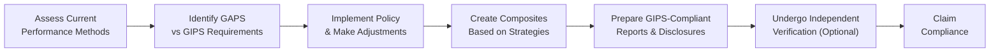

## Introduction
Sometimes I look back on my early days in performance reporting and chuckle at how confidently I prepared performance tables without a clue about what GIPS compliance really required. Maybe you’ve felt that pit-in-your-stomach moment too—when you realize that standards like GIPS (Global Investment Performance Standards) aren’t just optional guidelines but a set of rules that can dramatically shape how firms measure and present their investment performance. Well, I certainly learned fast that GIPS is the gold standard for ensuring transparency and consistency in performance presentations around the globe.

In the context of equity investments at Level II of the CFA® Program, you might not always see GIPS hammered into your exam questions the same way it is at CIPM or Level III. Still, it’s absolutely crucial to recognize how performance measurement and fair representation contribute to ethical practice in investment management. After all, when we examine managers’ equity returns, what good are the numbers if we’re not fully confident they’re compiled consistently and with integrity?

In this section, we’ll explore the core principles of GIPS, see why it matters for evaluating equity performance, and reveal how standardized performance reporting fosters trust and fair competition. To keep things relatable, we’ll weave in practical examples, a little personal commentary, and, hopefully, a few “Ah, got it!” moments along the way.

## Why GIPS Matter
Let’s say you’re trying to evaluate two equity managers—Manager A in New York and Manager B in Tokyo. Both claim strong track records, but they might be calculating returns differently, or maybe they’re excluding certain struggling portfolios from their results (cough, cherry-picking, cough). That’s where GIPS steps in. It sets out a global standard so potential clients can trust that Manager A’s performance is comparable to Manager B’s performance, no matter the region or the firm’s internal quirks.

Below are a few reasons why GIPS is so important:

• Consistency: GIPS provides uniform calculations and disclosures, making it easier to compare performance across firms.  
• Transparency: There’s full disclosure of fees, changes in methodology, or any adjustments in strategy. You’ll know what’s behind those flashy equity returns.  
• Accountability: By adhering to GIPS, a firm effectively says, “We follow a recognized, independent standard, and our numbers are audited or verified.”  

The confidence that GIPS compliance can instill in investors is invaluable. Even though GIPS covers all asset classes, the reason it hits home with equities is that stock returns can be notoriously sensitive to changes in how we measure them. For example, with or without certain fees or during selected time periods—these details matter. GIPS says, “No picking and choosing.”

## Core Principles
Before we dive deeper into how GIPS affects equity portfolios, let’s outline the fundamental pillars of the standard. Even if you won’t manually compute time-weighted returns in an exam item set, you might see references to performance reporting that implicitly require an understanding of these principles.

### Fair Representation of Performance
Under GIPS, firms group all discretionary portfolios under the same strategy into “composites.” This ensures nobody can hide a poor-return portfolio or selectively highlight just the “winners.” If your firm runs a small-cap growth strategy, every portfolio following that strategy is included in the small-cap growth composite. This gives prospective clients a faithful representation of how that strategy actually performed overall.

### Full Disclosure
Transparency is the key word here. Firms must clearly state things like:
• The presence of any performance-based fees.  
• Changes in the benchmark or the investment strategy.  
• The steps they took in constructing composites or dealing with portfolio changes.  

If the firm doesn’t reveal these details, how are you supposed to evaluate the reliability of reported returns? GIPS addresses this by insisting that clients don’t have to play detective to unearth these disclaimers.

### Consistency in Calculations
We’ve all heard of time-weighted returns, money-weighted returns, net of fees, gross of fees, you name it. GIPS standardizes the rules for which return types to present and how to present them. For instance, when calculating time-weighted returns, a firm is required to revalue the portfolio in certain situations (e.g., large cash flows) so that returns reflect the manager’s actual investment decisions, not the timing of investor contributions or withdrawals. Over short intervals, these differences might look tiny, but aggregated over months or years, they can significantly sway a performance track record.

Below is a tiny Python snippet that shows how you might do geometric linking for monthly returns—just a small taste of the practicality behind consistent calculations:

```python
import math

monthly_returns = [0.02, -0.01, 0.03]
cumulative_return = 1.0

for r in monthly_returns:
    cumulative_return *= (1.0 + r)

time_weighted_return = cumulative_return - 1.0
print(f"Time-Weighted Return over period: {time_weighted_return:.2%}")
```

Of course, the GIPS guidelines cover much more detail—like how often you have to do the linking, how to handle mid-month cash flows, and so on. But you can see how standardized approaches avoid the “Oh, we decided not to account for that large inflow last month” type of mistakes.

## Implications for Equity Performance Evaluation
So, how does this matter specifically for the equity side of the spectrum? Let’s break it down:

• Comparable Returns: Ever want to compare a small-cap equity manager in Hong Kong to a mid-cap growth manager in London? GIPS compliance ensures you’re holding both managers to the same yardstick.  
• Ethical Sanctity: If a firm claims compliance, it’s also claiming a certain moral high ground—transparency, honesty, reliability. For an equity manager who might produce outsized performance, GIPS compliance can show that there’s no marketing sleight-of-hand.  
• Reduction in Data Ambiguity: Whether you’re dealing with total returns, dividends reinvested, or partial-year performance, GIPS sets up the framework for how each scenario is reported. This clarity helps analysts or potential clients zero in on what’s driving that performance (was it with reinvested dividends or not, for instance).

One big advantage for equity managers is that prospective and current investors can quickly verify that reported alpha or outperformance is real—and not just a product of creative calculations.

## Practical Application
You might be wondering, “Alright, that’s nice, but how does GIPS pop up in actual equity analysis?” While you’re not likely to see a question purely on GIPS computations at Level II, references to fair reporting standards often assume a GIPS-compliant environment. Here’s how it might appear:

• In an item set discussing an investment manager’s track record, they might mention “Compliant with Global Investment Performance Standards.” Then the question could probe you on the implications for evaluating that manager.  
• A scenario might show a manager who excludes certain losing portfolios from her reported historical performance. You might be asked to discuss the ethical or professional ramifications—at which point you recall that GIPS would never allow that sort of selective reporting.  
• You might see references to the use of a single benchmark over time or consistent revaluation for large external cash flows. Recognizing which process aligns with GIPS can guide you to the correct answers about performance measurement best practices.

## GIPS Glossary
To ensure we’re clear on the terms:

• Global Investment Performance Standards (GIPS): A voluntary set of standards published by the CFA Institute, designed to create a universally trusted way for investment firms to measure and present performance.  
• Composite: A group of individual portfolios managed to a specific strategy or style. If you’re an equity-only manager, you might have separate composites for large-cap, mid-cap, small-cap, or even regional strategies.  
• Verification: A process in which an independent third party validates that a firm’s policies and procedures are indeed in line with GIPS. Verification is optional but highly recommended; it adds another layer of credibility to a firm’s claim of compliance.

## Example: GIPS in Action
Let’s say you manage a global equity composite that includes 50 portfolios. You had an excellent year—many of your stocks soared, except for three portfolios with some unlucky picks. If you decide to exclude those three from your composite performance, your annual return might jump from 10% to closer to 12%. Under GIPS, that’s not allowed if those three accounts are legitimately managed under the same strategy. You have to include every relevant portfolio so that the composite shows the true “average” performance across all your clients that year. That might not make your marketing sizzle, but it ensures potential investors see you for what you are, good or bad. And, ironically, that honesty tends to build more trust in the long run.

## Visualizing the GIPS Compliance Process

Below is a simplified Mermaid diagram that outlines a firm’s journey to GIPS compliance:



1. Assess how you currently measure, calculate, and present performance.  
2. Identify missing elements or shortfalls compared with GIPS.  
3. Implement necessary changes—maybe you need to adjust how you handle cash flows or define composites.  
4. Once you’re all set, you group portfolios into composites according to strict guidelines.  
5. Then, you prepare performance presentations with the required disclosures.  
6. You bring in an independent verifier to add that extra layer of confidence.  
7. Finally, you claim compliance publicly.

## Best Practices and Common Pitfalls
Even with standards in place, there are a few areas where managers can make accidental missteps—or downright break the rules:

• Mixing Strategies in One Composite: If a firm lumps all equity portfolios together, ignoring that some are small-cap and some are large-cap, the results can be misleading.  
• Changing Benchmarks Midstream: If your reference index for a growth composite was the S&P 500 for half the year and the MSCI Growth Index for the other half, you need to disclose that shift. Otherwise, your track record might look artificially better or worse.  
• Poor Documentation: GIPS can require a bit of paperwork. If a firm doesn’t thoroughly document how returns are calculated or which portfolios go into which composite, verifying compliance later can be next to impossible.

On the bright side, following GIPS is a pretty straightforward process once the policies and procedures are in place. Consistency is key, and most reputable managers consider it a must-have because it fosters trust and fosters a sense of best-practice discipline within the firm.

## Conclusion
You’re unlikely to be tested on the nitty-gritty details of GIPS verification at CFA Level II (that delight typically awaits in more advanced settings!), yet you should certainly remember what GIPS stands for and why we care. When analyzing performance in equity markets—where claims of outperformance are abundant—knowing that a firm is GIPS-compliant can provide you a sense of comfort that you’re looking at apples-to-apples comparisons. It’s an ethical, standardized approach that aims to keep managers honest and investors informed.

Whether you’re evaluating a manager’s small-cap performance record or dissecting the risk-adjusted returns of a global equity strategy, let GIPS be in the back of your mind as a hallmark of consistency, clarity, and fairness.

## References
• CFA Institute GIPS Standards:  
  https://www.cfainstitute.org/ethics-standards/gips-standards  
• CIPM Program Curriculum (for deeper dives into performance measurement).  
• CFA Institute Level III Curriculum (Performance Evaluation sections).  
• Additional Insights on GIPS Implementation from the CFA Institute Blog:  
  https://blogs.cfainstitute.org/

## Test Your Knowledge: GIPS Overview in Equity Performance



### Which statement best describes why GIPS is important in performance reporting?

- [ ] GIPS replaces all regulatory requirements for performance reporting.
- [x] GIPS provides a global framework for consistent calculation and presentation of investment performance.
- [ ] GIPS ensures firms can avoid disclosure of critical performance details.
- [ ] GIPS allows firms to verify each other’s performance on an informal basis.

> **Explanation:** GIPS ensures consistency and transparency in how investment performance is calculated and presented around the globe. It does not replace regulatory requirements but complements them.

### In a GIPS-compliant presentation, what is the function of a “composite”?

- [ ] A composite groups portfolios together on a geographical basis only.
- [ ] A composite includes only the manager’s top five portfolios each quarter.
- [x] A composite consists of portfolios managed under the same strategy or investment mandate.
- [ ] A composite is a standardized portfolio used for calculating beta.

> **Explanation:** Under GIPS, a composite is a group of portfolios managed according to a similar strategy or mandate. This ensures fair and representative performance reporting.

### Which of the following is a key principle of GIPS?

- [ ] Hidden disclosures for any underperforming period.
- [ ] Unique calculations for each client to maintain privacy.
- [x] Fair representation and full disclosure of investment performance.
- [ ] Indefinite use of hypothetical returns.

> **Explanation:** GIPS is built on fairness and transparency in performance reporting, requiring full disclosure and representation. The other options contradict GIPS’ principles.

### When might a firm be accused of “cherry-picking” its track record in violation of GIPS?

- [ ] When the firm highlights good returns in marketing but can substantiate them with verifiable data.
- [ ] When the firm excludes fees and expenses in calculating performance but discloses this fact.
- [ ] If the firm includes only the largest portfolios in a composite.
- [x] When the firm omits poorly performing accounts from a composite that should include them by strategy.

> **Explanation:** Cherry-picking occurs when a firm omits underperforming portfolios from its published performance. GIPS forbids selective exclusion based on performance unless the portfolios are truly outside the composite’s defined strategy.

### According to GIPS guidance on returns, which method is typically recommended for measuring ongoing performance?

- [ ] Arithmetic mean of monthly returns without any adjustments.
- [ ] Simple average of net gains over the year.
- [ ] Starting and ending portfolio values only, ignoring cash flows.
- [x] Time-weighted rate of return that accounts for external cash flows properly.

> **Explanation:** GIPS typically advocates for time-weighted returns because they neutralize the timing and size of external cash flows, ensuring performance reflects the manager’s skill.

### Which of the following is an implication of GIPS for analyzing an equity manager’s performance?

- [ ] The manager can combine unrelated equity strategies into one composite.
- [x] The manager must consistently include all relevant portfolios and disclose fees and benchmark changes.
- [ ] The equity manager is not allowed to disclose any negative returns.
- [ ] The equity manager can claim compliance without a single disclosure note.

> **Explanation:** GIPS mandates consistency in composite construction, requires disclosure of fee structures and benchmark changes, and does not allow managers to hide negative returns.

### What is the primary benefit of undergoing independent verification under GIPS?

- [ ] It allows firms to claim compliance without meeting GIPS standards.
- [x] It provides additional credibility that the firm’s policies and procedures align with GIPS.
- [ ] It replaces internal compliance checks.
- [ ] It guarantees absolute accuracy in all performance reports.

> **Explanation:** Independent verification adds credibility and reassurance that the firm’s processes truly follow GIPS. It cannot guarantee absolute accuracy, but it remains a valuable endorsement.

### Why are disclosures about benchmark changes crucial under GIPS?

- [ ] Benchmarks are usually irrelevant in performance presentation.
- [x] Changing benchmarks without disclosure can misrepresent relative performance.
- [ ] Benchmarks do not affect the interpretation of returns.
- [ ] Standard GIPS guidelines forbid using any benchmark.

> **Explanation:** If a firm switches benchmarks midstream without clarity, it can distort how performance appears relative to the benchmark. Disclosure ensures transparency.

### Which composite assignment approach aligns best with GIPS when a portfolio’s mandate changes from bonds to equities?

- [ ] Keep the portfolio in the bond composite to avoid confusion.
- [ ] Exclude the portfolio altogether until the performance improves.
- [x] Move the portfolio to an equity composite from the point of mandate change onward.
- [ ] Split the difference and show partial performance in both composites simultaneously.

> **Explanation:** If a portfolio’s mandate changes, GIPS requires it to be transferred to the appropriate composite from the point of change forward. Splitting or excluding performance can lead to misrepresentation.

### Under GIPS, is a firm required to claim compliance if it meets all standards?

- [x] True
- [ ] False

> **Explanation:** If a firm meets the GIPS standards, it may publicly claim compliance (and is encouraged to do so), but it must also adhere to all requirements for definitions, composites, and disclosures.


