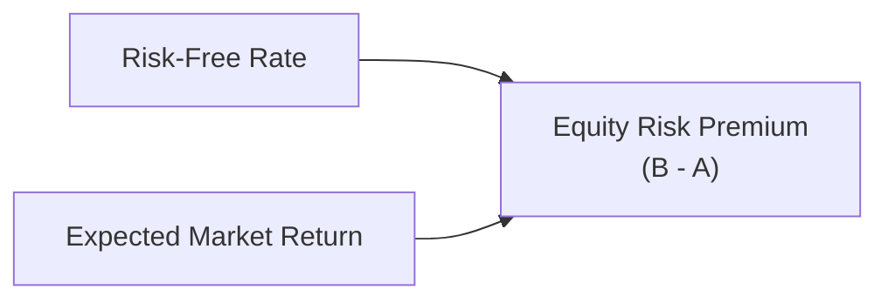

## Understanding the Equity Risk Premium

Sometimes I still remember how perplexed I felt when I first heard the phrase “equity risk premium” (ERP). It sounded so official, yet mysterious! Then I realized it’s basically the extra return people expect to earn by investing in stocks rather than stashing their cash in something safer, like government T-bills. That “extra” slice of return is central to a lot of valuation models, because it’s the big reason many of us choose to hold equities at all. After all, why take the rollercoaster ride if you don’t get rewarded?

The ERP represents one of the most critical assumptions in equity valuation. Think of it as the difference between the expected market return (often measured by a broad equity index) and the risk-free rate (commonly approximated by yields on stable government bonds). In practice, though, calculating that difference can get complicated—especially when we consider old (historical) data versus forward-looking market signals. Let’s walk through the logic behind each approach, highlighting why it matters and how it often shows up on exams.

## Conceptualizing the ERP

Before we dive into the methods, let’s do a quick conceptual check. In capital market theory, we often talk about the required rate of return on equity as:


r_e = r_f + \beta \times (ERP)


Here, \\(r_f\\) is the risk-free rate, \\(\beta\\) is how sensitive a particular stock (or portfolio) is to overall market movements, and \\(ERP\\) is that magic number representing how much extra return the market should deliver above \\(r_f\\). If the ERP is miscalculated, the required return for an entire valuation can be off, causing analysts to misprice securities. That’s big.

Below is a simple diagram that illustrates the building blocks of an equity risk premium approach:

The fundamental concept is straightforward (B minus A). The puzzle lies in how to measure B (the expected market return) correctly.

## Historical Estimation Methods

One common approach is to look into the past—decades of equity returns compared to “risk-free” bond returns—and use that history to guide our forecast. Analysts typically collect total returns (price appreciation plus dividends) on a well-established equity index (e.g., S&P 500 in the United States), then subtract returns on government bonds or T-bills.

### Arithmetic vs. Geometric Means

• Arithmetic Mean:  
  The simple average (sum of yearly excess returns divided by the number of years). This is generally seen as suitable for a single-period expectation—like “What’s my expected equity premium for next year?”  

• Geometric Mean:  
  The geometric mean accounts for compounding, typically used for multi-year analyses. It’s found by multiplying (1 + return) for each period, taking the nth root, and subtracting 1. Some argue that geometric means give a truer picture of the “average” return over long horizons, especially when returns fluctuate a lot.

### Example of a Hypothetical Historical Calculation

Imagine you have 30 years of data. The average annual stock market return is 10%, and the average “risk-free” bond return is 4%. The difference (10% – 4%) yields a 6% historical ERP. You might refine that further by deciding whether to use T-bills or longer-term Treasury notes as the risk-free measure. Each choice nudges your result up or down, so clarity on the chosen reference is critical.

Historical methods are popular for their simplicity, but watchers of the market know that past performance doesn’t always predict future performance—something exam questions love to point out. That’s where forward-looking approaches come in.

## Forward-Looking Methods

Here is where it gets exciting. Instead of rummaging through ancient return data, you can try to gauge tomorrow’s ERP by analyzing expected future dividends, growth rates, and current market conditions. These methods typically fall into four broad categories: Supply-Side (Ibbotson–Chen), Survey Methods, Implied Methods, and various country risk adjusments for emerging markets.

### Supply-Side Model (Ibbotson–Chen)

The supply-side, or “building-block,” approach decomposes equity returns into several components:  
• Expected Inflation.  
• Real growth in earnings.  
• Changes in P/E ratios (if we anticipate multiple expansions or contractions).  
• Dividend yield or share buyback yield.  

The idea here is that equities generate returns from both their real economic growth and from distributing cash to shareholders via dividends (or buybacks). For instance:


\text{Equity Return} \approx (1 + \text{inflation}) \times (1 + \text{real earnings growth}) - 1 + \text{income component} \pm \text{adjustment for changes in valuation multiples}


Then we subtract the chosen risk-free rate to get an ERP estimate. I recall the first time I ran these numbers manually—there was a mini “aha” moment realizing that each little piece can be measured by directly observable macro or market data. On exam day, watch for item sets that feed you bits of inflation, growth, or expected P/E moves. This building-block approach can pop up anywhere you see “Ibbotson–Chen model” or “supply-side estimates.”

### Survey Methods

Survey methods are fairly straightforward: ask a bunch of market professionals (portfolio managers, analysts, economists) what they expect the ERP to be. Combine these opinions and—boom—you’ve got a consensus estimate. The advantage is that surveys can capture fresh sentiment, but the downside is that they can be heavily influenced by market moods (optimism vs. pessimism). Also, there is often wide dispersion among respondents’ answers.

### Implied Equity Risk Premium

In the implied approach, we say:  
• We know the current market price (stock index level).  
• We forecast future dividends or cash flows for that market.  
• We solve for the discount rate that equates the present value of these forecasted cash flows to the market’s current price.  
• The difference between that discount rate and the risk-free rate = implied ERP.

In more formulaic terms, if \\(P_0\\) equals the present market value, we set:


P_0 = \sum_{t=1}^{\infty} \frac{\text{Expected Dividends}_t}{(1 + r_e)^t}


Solving for \\(r_e\\) yields the market’s implied cost of equity. Subtract the risk-free rate from that, and you’re left with an implied ERP. On an exam, you might see a question that asks you to iterate or approximate the discount rate for an index’s dividends. The implied method is very forward-looking and can quickly reflect new macro or market news.

## Country-Specific and Global Considerations

Even though global finance can sometimes feel like the same game, emerging markets and frontier markets often come with hefty additional risks: political instability, currency risk, liquidity constraints, and so on. Adding a “country risk premium” is a standard approach. For instance, you might take a base developed-market ERP (like 5%) and tack on an extra 200 basis points if you’re analyzing a super-volatile emerging economy with a track record of sudden monetary policy changes.

## Selecting the Appropriate Risk-Free Rate

The ERP is always measured relative to some risk-free instrument. In the U.S., 10-year Treasury bonds are a common reference because they’re considered relatively default-free and they match a moderately longer investment horizon. Other analysts might use T-bills because of their near-zero default risk and pure short-term nature. Just note that using a lower yield (like T-bills) can make your ERP look higher, and using a higher yield (like long-term bonds) can shrink it. Consistency is key: whichever you pick, keep it consistent with your timeframe and your discounting approach in valuations.

## Common Pitfalls and Sensitivity Analysis

• Overreliance on Past Data: Extrapolating from a period of unusually high equity returns can produce an inflated ERP.  
• Guessing Future Growth: Overly rosy assumptions about GDP or corporate earnings expansions can overstate forward-looking premiums.  
• Mismatching Time Horizons: Using a short-term risk-free rate for a multi-decade equity projection might introduce a mismatch in your discount rates and growth assumptions.  
• Ignoring Country Risk: If you’re valuing a company operating mostly in an emerging market, ignoring country risk can lead to an underestimate of the true cost of equity.  

It’s always wise to test how a 1% change in ERP might affect your valuation. If a small shift in ERP changes your fair value by 20%, that’s a sign you should approach that estimate with caution or add disclaimers whenever presenting final results to clients or colleagues.

## Practical Guidance for the Exam

You’ll likely see item sets that provide:  
• A historical dataset and a question about arithmetic vs. geometric means.  
• Macroeconomic forecasts so you can “build up” an ERP estimate.  
• An implied approach scenario using a forecast of index dividends or earnings and a range of growth expectations.  
• Potential data for a country risk premium if it’s an emerging market equity.  

Be sure to read carefully: Are they hinting you should add a 2% premium for political risk? Are they specifically telling you to use the 3-month T-bill as the risk-free asset? Stay consistent, and watch the details. These subtle points are exactly where exam questions will try to “trip you up.”  

Also, keep an ear out for typical ERP ranges in developed markets. Historically, it’s hovered somewhere between 3% and 6% a year (though some argue slight expansions or contractions based on economic cycles). If you see a number that’s wildly off from that range, question whether there’s some special circumstance—like hyperinflation or extraordinary risk factors.

## References and Further Reading

• CFA Institute Official Curriculum (2025 Edition), Equity Investments Volume.  
• Damodaran, A. (2012). “Investment Valuation: Tools and Techniques for Determining the Value of Any Asset.” Wiley.  
• Ibbotson, R. and Chen, P. (2003). “Long-Run Stock Returns: Participating in the Real Economy,” Financial Analysts Journal, vol. 59, no. 1.  

These resources can shed more light on the deeper nuances, including advanced calculations and region-specific considerations.

-----

## Test Your Knowledge: Equity Risk Premium



### Which best describes the equity risk premium (ERP)?  
- [ ] The guaranteed coupon on government bonds  
- [ ] The future inflation rate  
- [x] The excess return investors require over the risk-free rate to invest in equities  
- [ ] The difference between realized and expected earnings growth  

> **Explanation:** The ERP is, by definition, the excess (or additional) return that investors demand for holding equities over some risk-free asset.  

### In historical ERP calculations, which statement is generally true regarding arithmetic vs. geometric means?  
- [ ] Geometric means are always larger than arithmetic means when returns vary  
- [x] Arithmetic means tend to be higher because they do not account for compound growth  
- [ ] They always produce the same result if the dataset is long enough  
- [ ] There is no meaningful difference between them for equity valuation  

> **Explanation:** Over multiple periods with variability in returns, the arithmetic mean is usually higher than the geometric mean because the geometric mean fully considers compounding effects that reduce the average return.  

### Under the supply-side (Ibbotson–Chen) approach, which component is NOT typically included?  
- [x] Long-term corporate tax rate changes  
- [ ] Expected inflation  
- [ ] Real earnings growth  
- [ ] Dividend yield or buyback yield  

> **Explanation:** The supply-side model generally includes inflation, real earnings growth, income yields, and valuation multiple changes. Corporate tax rates might indirectly influence earnings but are not typically isolated as a separate building block in a basic supply-side model.  

### If the implied ERP is computed by estimating the market’s future dividends and solving for the discount rate, which statement accurately describes that ERP?  
- [x] It is the difference between the solved discount rate and the risk-free rate  
- [ ] It is the difference between actual dividends and expected dividends  
- [ ] It must be identical to the historical ERP  
- [ ] It is always lower than any survey-based ERP  

> **Explanation:** In implied ERP calculations, you back out the discount rate from projected cash flows. The difference between that implied discount rate and the risk-free rate is precisely your implied ERP.  

### What is the primary reason analysts incorporate a country risk premium when valuing equities in emerging markets?  
- [ ] They want to reduce the total required return to account for favorable currency exchange rates  
- [ ] To align their valuations with developed market estimates  
- [x] Emerging markets often face heightened political, economic, and liquidity risks, requiring a higher premium  
- [ ] They must follow a universal 3% increment for all developing countries  

> **Explanation:** Emerging or frontier markets typically carry additional risk factors (political instability, liquidity constraints, policy uncertainty, etc.), which demand a higher premium beyond the base ERP.  

### Which risk-free rate is typically used for multi-year valuation exercises in the U.S.?  
- [x] 10-year Treasury bond yield  
- [ ] 3-month Treasury bill  
- [ ] 30-day Libor rate  
- [ ] 5-year corporate bond yield  

> **Explanation:** Many analysts choose the 10-year Treasury yield for multi-year valuation horizons as it offers a medium-term, relatively stable, and (traditionally) default-free reference.  

### In constructing a forward-looking ERP estimate, which factor will most likely increase the ERP if projected higher than historical averages?  
- [ ] The risk-free rate  
- [ ] The discount rate used in CAPM  
- [x] Expected growth in corporate earnings  
- [ ] A lower equity market index today  

> **Explanation:** If you foresee higher real growth in corporate earnings, the market’s total return potential increases, which can raise the estimated ERP (assuming a constant risk-free rate).  

### If an analyst uses short-term T-bills rather than 10-year T-bonds as the risk-free rate for an ERP calculation, how will this typically affect the resulting ERP value?  
- [x] It generally increases the calculated ERP  
- [ ] It will not affect the ERP  
- [ ] It reduces the ERP  
- [ ] It creates a negative ERP  

> **Explanation:** T-bill yields are generally lower than longer-duration bond yields in normal market conditions. Subtracting a lower risk-free rate from the market return produces a higher ERP.  

### An ERP of 10% is significantly higher than the historical average of 3–6% for a developed market. Which scenario might justify such a high ERP assumption?  
- [ ] The stock market is at an all-time high with no recession fears  
- [x] There is extreme uncertainty or crisis-level risk in the market  
- [ ] The inflation rate has declined to historical lows  
- [ ] The supply of stocks is limited  

> **Explanation:** A very high ERP indicates investors are demanding a substantial premium. This could be due to extreme risk aversion or uncertainty (e.g., a severe financial crisis or major geopolitical event).  

### True or False: Survey-based ERP estimates are always the most accurate method because they reflect market participants’ real-time expectations.  
- [ ] True  
- [x] False  

> **Explanation:** Survey results can be influenced by sentiment, location, and participant expertise. They offer current insights but aren’t necessarily more accurate than historical, supply-side, or implied estimates.  


