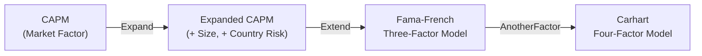

## Introduction

Sometimes, when I'm reminiscing about my early days in finance, I recall the first time I encountered the Capital Asset Pricing Model (CAPM). I was sitting in a small investment analytics department, basically rummaging through piles of corporate data. My boss asked me to figure out a company's "required rate of return," and I, with a curious look, dutifully nodded, trying not to seem clueless. Fast-forward a few hours and, well, the CAPM formula became my new best friend. You’ll probably have your own “aha” moment with CAPM, too—so let's walk through it to make sure that moment comes sooner rather than later.

## The Classic CAPM

At its core, the Capital Asset Pricing Model links a security’s expected return to its systematic risk. Put differently, CAPM says that investors should earn more for taking on more non-diversifiable (market) risk. The formula (in its widely used form) is:


R_e = R_f + \beta \times (ERP)


where:
• \\( R_e \\) is the required (or expected) return on equity (or a stock).  
• \\( R_f \\) is the risk-free rate, typically measured as the yield on a short-term government treasury instrument.  
• \\( \beta \\) is the stock’s sensitivity to the overall market’s movements.  
• \\( ERP \\) (Equity Risk Premium) is the additional return investors demand over \\( R_f \\) for investing in the market portfolio rather than a risk-free asset.

### Why CAPM Matters

The brilliance of CAPM is that it directly links return to market risk in a single factor. For instance, if we take a scenario where \\( R_f = 3\% \\), the Equity Risk Premium is, say, 6%, and the beta (\\(\beta\\)) of the stock is 1.2, then:


R_e = 3\% + 1.2 \times 6\% = 3\% + 7.2\% = 10.2\%


This 10.2% is a straightforward yardstick to gauge whether an investment is “appropriately priced,” given its market risk.

## The Nature of Beta

### Defining Beta

Beta (\\(\beta\\)) measures the sensitivity of a security’s returns to changes in the overall market. A beta of 1 means the security moves roughly in line with the market—if the market goes up 10%, you’d expect the stock to go up about 10%. A beta of:

• 1.2 implies it’s 20% more volatile than the market  
• 0.8 implies it’s 20% less volatile than the market  
• Negative beta implies the security tends to move opposite the market

### Beta in Practice

In real life, we estimate beta by regressing a stock’s (or portfolio’s) returns on the market’s returns (e.g., the S&P 500). Let’s say you run a regression, and your slope coefficient is 1.2. Then your stock’s beta is 1.2. But be aware, betas can shift over time. If a firm changes its capital structure, merges with another company, or shifts its business strategy, the historical beta may not be a perfect predictor of future behavior.

## Key Assumptions of CAPM

The CAPM rests on several assumptions—some might say leaps of faith:

- We can borrow or lend unlimited amounts at the risk-free rate.  
- Markets are frictionless (no transaction costs or taxes).  
- Everyone holds a combination of the risk-free asset and a single “market portfolio” of all investable assets.  
- Investors are rational and want to maximize return for a given level of risk.  
- All investors have the same expectations about volatilities, correlations, and expected returns.

In the real world, well, it’s not that neat. There are taxes, transaction costs, limited borrowing capacity, and big differences in how investors view risk. This mismatch leads us to either refine CAPM or use alternative models.

## Limitations of CAPM

Have you ever looked at a small biotech start-up and thought, “Ok, its beta is 0.9, so it’s less risky than the broad market”? You might question that conclusion because start-ups can be much riskier than the big companies that dominate the indices. CAPM, in its classic form, often overlooks company-specific details, like liquidity risk, the possibility of negative earnings, or macro shocks to smaller industries. That’s why practitioners often incorporate “add-ons” or alternative risk factors. 

## The Expanded CAPM

### Rationale for Expanding CAPM

To address some of CAPM’s shortcomings, analysts sometimes add premiums for size, liquidity, or country risk. The expanded CAPM might look something like this:


R_e = R_f + \beta \times ERP + \text{Size Premium} + \text{Country Premium} + ...


These additional terms reflect unique risks that might not be fully captured by the market factor alone.

- **Size Premium:** Historically, small-cap stocks often produce higher returns than large caps. Analysts typically add a few percentage points to the required return for smaller firms to compensate for this extra perceived risk.  
- **Country Risk Premium:** If you’re analyzing a company in a country with significant political or economic instability, it may require a higher discount rate than a stable developed market.  
- **Sector or Industry Premium:** Some sectors (say, biotech or mining) may require an added premium for their specialized risks.

### Estimating Risk Premiums

You might ask: “So how do we pick a ‘size premium’ or ‘country risk premium’?” Generally, valuation practitioners turn to data providers who track historical returns. For instance, research from sources like Ibbotson or Duff & Phelps can guide how big the size premium typically is. For country risk premiums, analysts often consult emerging market bond spreads or the yield differential between a foreign country’s sovereign debt and U.S. Treasuries (or another safe benchmark).

## Other Multifactor Models

### Fama–French Three-Factor Model

In the early '90s, Eugene Fama and Kenneth French introduced a three-factor model to improve upon CAPM by adding:

1) **Size Factor (SMB, Small Minus Big):** The differential return between small-cap and large-cap stocks  
2) **Value Factor (HML, High Minus Low):** The differential return between high book-to-market (value) and low book-to-market (growth) stocks  
3) **Market Factor:** Essentially the CAPM market factor

The result is:


R_e = R_f + \beta_{Mkt}(Mkt - R_f) + \beta_{SMB}(SMB) + \beta_{HML}(HML)


where \\(\beta_{Mkt}, \beta_{SMB}, \beta_{HML}\\) measure exposure to the overall market, size premium, and value premium, respectively. This model recognizes that small-cap and value stocks have often outperformed large-cap and growth stocks over long periods, though that advantage can vary year to year.

### Carhart Four-Factor Model

Mark Carhart then added the momentum factor to the Fama–French framework, creating a four-factor model. Momentum is the tendency for stocks that have performed well recently to continue performing well (and vice versa) in the short term. In practice:


R_e = R_f + \beta_{Mkt}(Mkt - R_f) + \beta_{SMB}(SMB) + \beta_{HML}(HML) + \beta_{MOM}(MOM)


**Momentum Factor (MOM):** The differential return of stocks ranked by recent performance (winners minus losers).

### Comparing Multifactor Models to CAPM

CAPM is neat and easy, but it doesn’t capture everything. Multifactor models can help explain more of the variation in stock returns by acknowledging other systematic sources of risk. If you’re working at a hedge fund or progressive asset management firm, you’ll see these multifactor approaches used heavily for portfolio construction and performance attribution. 

Still, the trade-off is complexity and data-intensiveness. CAPM is simpler when you just need a ballpark cost of equity.

## Practical Considerations and WACC

### Using CAPM-Based Cost of Equity in WACC

In a corporate finance or valuation role, you’ll see Weighted Average Cost of Capital (WACC) used often. WACC combines the firm’s cost of debt and cost of equity (weighted by their proportions in the capital structure). The standard formula:


\text{WACC} = \left(\frac{E}{E + D}\right) R_e + \left(\frac{D}{E + D}\right) R_d (1 - t)


- \\( E \\) = Market value of equity  
- \\( D \\) = Market value of debt  
- \\( R_e \\) = Cost of equity (often from CAPM or an expanded model)  
- \\( R_d \\) = Cost of debt (yield on the firm’s debt, etc.)  
- \\( t \\) = Marginal corporate tax rate  

When a firm calculates WACC for project evaluation, the CAPM-based cost of equity is often the go-to. If you feel CAPM alone doesn’t cut it—maybe the company is micro-cap or in an emerging market—you plug in an expanded or multifactor-based \\( R_e \\) into the WACC formula.

## Emerging Markets and Additional Adjustments

### Why Emerging Markets Need Tweaks

If you’ve ever tried to analyze a frontier market telecommunication firm (maybe in sub-Saharan Africa or a war-torn region), the straightforward CAPM might produce suspiciously low discount rates. That’s where a country risk premium (CRP) or a political risk premium can be critical. But there’s no universal formula to get it perfect:

- **Sovereign Spread Approach:** Start with a U.S. or developed market risk-free rate, then add the yield spread of the country’s government bonds over U.S. Treasuries.  
- **Relative Equity Market Approach:** Multiply the bond spread by the volatility ratio of the equity market vs. the bond market.  

Add that country risk premium to your base CAPM calculation, and you can get a more realistic cost of equity for an emerging-market stock.

### Small-Cap, Illiquid Stocks

Beyond geographic considerations, smaller or less liquid stocks might see big price swings that go beyond their “beta to the market.” That’s why a size premium or a liquidity premium is often included in the discount rate. If the stock is rarely traded, you might require additional return to compensate for the difficulty of exiting your position quickly.

## Visual Overview: CAPM to Multifactor Models

Below is a Mermaid diagram illustrating the logical progression from the basic CAPM to its expanded forms, including additional factors like size, value, and momentum.

In practice, you pick the model that best suits your market, data availability, and complexity appetite.

## Common Pitfalls and Best Practices

- **Overreliance on Historical Data:** Beta estimates or factor premiums can drift over time, so you might overshoot or undershoot your required return.  
- **Ignoring Firm-Specific Issues:** CAPM and multifactor models capture systematic risk, not idiosyncratic risk specific to a single company. Perform fundamental analysis to identify operational issues.  
- **Incorrect Risk-Free Rate Benchmark:** Always ensure the risk-free rate matches your currency or the relevant yield curve.  
- **Factor overkill:** Adding too many factors can lead to overfitting. Keep it practical.  

## Conclusion

So, to sum it up—CAPM gives us a tidy framework that prices risk relative to the overall market. But because the real world is messy, we enhance or replace it with expanded CAPM or multifactor models when a single market factor doesn’t capture everything. If you’re pressed for time or data, CAPM might be enough, especially for developed market large-cap stocks. For smaller companies or those in volatile locales, an expanded approach offers a more nuanced picture of required returns.

Anyway, the more you work with these models, the more familiar and comfortable you’ll get. And trust me, the next time someone on your team says, “Uh, how did you arrive at that discount rate?” you’ll feel prepared to explain your premium add-ons and factor exposures. Good luck applying these models on your journey to mastering equity valuation.

---

## References and Further Reading

- Fama, E. & French, K. (1993). “Common Risk Factors in the Returns on Stocks and Bonds.” Journal of Financial Economics.  
- Carhart, M. (1997). “On Persistence in Mutual Fund Performance.” The Journal of Finance.  
- Pratt, S. & Grabowski, R. (2014). “Cost of Capital: Applications and Examples.” Wiley.  
- CFA Institute Level II Curriculum (latest edition) for in-depth coverage of CAPM, multifactor models, and WACC.  

---

## Test Your Knowledge: CAPM, Expanded CAPM, and Multifactor Models



### According to the basic CAPM formula, which of the following factors directly determines the required return on an equity investment?

- [ ] The default spread of corporate bonds
- [ ] The variance of the security’s returns
- [x] The risk-free rate, the stock’s beta, and the equity risk premium
- [ ] The stock's total volatility

> **Explanation:** CAPM states: Required Return = Risk-Free Rate + β × (Equity Risk Premium). Variance and corporate bond default spreads are not direct inputs in the CAPM formula.

### A stock has a beta of 1.3, the risk-free rate is 2%, and the equity risk premium is 6%. What is the required return based on CAPM?

- [x] 9.8%
- [ ] 8.2%
- [ ] 6.3%
- [ ] 10.0%

> **Explanation:** Required Return = 2% + 1.3 × 6% = 2% + 7.8% = 9.8%.

### Which premium is often added in an Expanded CAPM model to capture the additional uncertainty of investing in smaller companies?

- [ ] Country risk premium
- [ ] Inflation premium
- [x] Size premium
- [ ] Commodity premium

> **Explanation:** Expanded CAPM models frequently include a separate size premium to reflect the extra risk of investing in small-cap stocks.

### In the Fama–French Three-Factor Model, besides the market factor, which two risk factors are included?

- [ ] Volatility factor and inflation factor
- [x] Size factor (SMB) and value factor (HML)
- [ ] Momentum factor and quality factor
- [ ] Leverage factor and profitability factor

> **Explanation:** The Fama–French model includes the size (SMB) and value (HML) factors, in addition to the market risk factor.

### Carhart’s Four-Factor Model adds which factor to Fama–French?

- [ ] Low volatility
- [x] Momentum
- [ ] Profitability
- [ ] Investment intensity

> **Explanation:** Carhart’s Four-Factor Model extends Fama–French by incorporating a momentum factor.

### When estimating a country risk premium for an emerging market using bond yield differentials, which of the following is most appropriate to use as the baseline risk-free rate?

- [ ] The emerging market’s own government bond if no default has occurred in the past decade
- [x] A highly rated developed market government bond, such as U.S. Treasuries
- [ ] The global inflation rate
- [ ] The local currency deposit rate

> **Explanation:** A common approach is to start with a developed market benchmark, such as U.S. Treasuries, and add the additional yield (sovereign spread) of the emerging market bond over that benchmark.

### If a company is in an emerging market with significant political risk, which additional premium is likely to be included in the cost of equity?

- [ ] Venture premium
- [ ] Concentration premium
- [ ] Diversification premium
- [x] Country risk premium

> **Explanation:** It’s common practice to add a country risk premium (CRP) to account for political and economic uncertainties in emerging markets.

### An investor observes that a certain stock tends to move in the opposite direction to the market. What would the stock’s beta be?

- [x] Negative
- [ ] Exactly zero
- [ ] Undefined
- [ ] Between 0 and 1

> **Explanation:** A negative beta indicates the asset moves in the opposite direction to the market.

### Which of the following is the main advantage of using the single-factor CAPM versus multifactor models for valuation?

- [x] Simplicity in data requirements
- [ ] Greater accuracy in all situations
- [ ] Higher explanatory power for stock returns
- [ ] It accounts for company-specific risk explicitly

> **Explanation:** The main advantage of CAPM is its simplicity and relatively small data requirement. Multifactor models often have higher explanatory power but demand more data.

### True or False: A higher beta always indicates that the stock is riskier in every respect.

- [x] True
- [ ] False

> **Explanation:** By definition, a higher beta means the stock is more sensitive to market movements. From a systematic risk perspective (non-diversifiable), it’s “riskier.” However, be aware that beta doesn’t capture idiosyncratic (company-specific) risks. In general CAPM parlance, though, higher beta means higher systematic risk.


