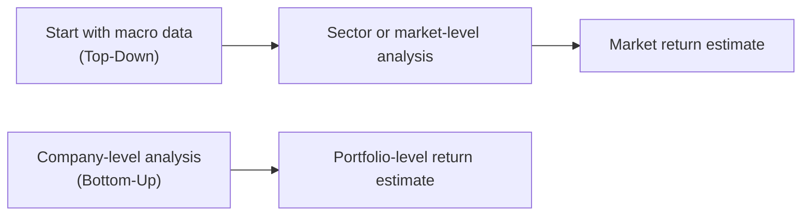

## Introduction

Sometimes, when we’re sitting at our desks—coffee in hand, maybe doodling an economic forecast on a notepad—it feels like we’re just taking a wild guess about the future of the markets. It’s natural to wonder: “Should I trust these big, national GDP numbers to guide my equity strategy, or should I bury myself in the details of each company’s fundamentals?” Top-down vs. bottom-up return estimation addresses exactly that question. Regardless of your personal style—whether you’re more of a macro-thinker or a detail-obsessed analyzer—understanding both approaches is really valuable.

At Level II of the CFA® Program, we delve deeper into how professional analysts estimate equity returns. In prior chapters of Volume 5, we covered the fundamentals of equity valuation and the mechanics of required rates of return. Here, we’ll explore the distinct mindsets behind top-down and bottom-up analysis, learn how to put them into practice, and discover how to merge both methods for a more holistic view. We’ll also share some personal anecdotes—like how I once used a top-down strategy to make a regional sector call that turned out surprisingly well, only to miss an amazing opportunity in a specific firm because I overlooked a bottom-up detail. It happens to the best of us.

## Understanding the Core Concepts

Top-down and bottom-up analysis are two primary ways to estimate returns. While neither method is flawless, each offers insights that can shape your equity investment decisions.

Top-down return estimation begins with the grand macroeconomic picture: expected GDP growth, inflation trends, a central bank’s monetary policy stance, and overall market sentiment. From there, analysts disaggregate broad forecasts into sector- or industry-level projections and eventually (though often at a higher, less-detailed level) individual company returns.

Bottom-up return estimation, on the other hand, zeros in on individual company fundamentals. Analysts build revenue and earnings growth forecasts by studying a firm’s competitive advantage, product pipelines, management guidance, and financial statements. The results for each company may then be scaled up for a sector or portfolio.

Both perspectives can yield different forecasts. One method might paint an optimistic picture for certain sectors (based on strong macro tailwinds), while the other could be less hopeful if a detailed analysis of specific companies uncovers structural weaknesses. Being aware of these discrepancies—and learning how to navigate them—is crucial for successful portfolio construction.

## The Top-Down Approach

Top-down analysis often appeals to asset allocators or macro strategists. It’s a way to estimate returns that starts with big-picture economic forecasts before zeroing in on industries or companies. Let’s take a closer look at how it works:

### Basic Steps of Top-Down Analysis

• Macroeconomic Forecasts: The analyst reviews GDP growth forecasts, inflation data, policy announcements, and more.  
• Market-Level Return Projection: Armed with macro data, the analyst projects an overall equity market return. Sometimes, they may use an equity risk premium approach, adding the risk-free rate to an estimated premium that reflects current economic conditions.  
• Sector Allocation and Rotation: Next, the analyst decides which sectors stand to benefit most from the economic outlook. For instance, if interest rates are expected to remain low, defensive sectors like utilities might look less appealing compared to growth-oriented sectors such as technology.  
• Stock Selection (Broad Brush): At the final step, individual stocks are chosen within the favored sectors, often with less granular scrutiny than a typical bottom-up approach.

### Advantages of Top-Down Analysis

• Relatively Efficient: If you manage a large portfolio, top-down analysis helps you allocate capital quickly across asset classes or regions without diving into the minutiae of every single company.  
• Macro-Driven Insights: You can position the portfolio to capture the impact of global or regional trends, such as economic expansion or contraction.  
• Helpful for Sector Rotation: If you’re rotating between, say, consumer staples and industrials, top-down data can guide you on the macro timing.

### Drawbacks of Top-Down Analysis

• May Ignore Company-Specific Factors: A macro forecast might say Consumer Discretionary is strong, but it won’t distinguish winners from losers within that sector.  
• Dependent on Macro Forecast Accuracy: Macroeconomic data can be notoriously tricky to forecast. Get the GDP or inflation numbers wrong, and it affects your entire return estimate.  
• Limited Granularity: You can miss out on breakthrough innovations, company-level restructuring, or management changes that can catapult a firm’s prospects even in a weak sector.

### An Illustrative Mermaid Diagram

Below is a simple flowchart that captures the general idea of top-down vs. bottom-up pathways:

## The Bottom-Up Approach

Now let’s switch gears to the bottom-up approach. This method focuses on the fundamentals of individual companies. Bottom-up analysts might say: “Macroeconomics is interesting, sure, but I’ll pick winning stocks by analyzing their products, customers, and finances one by one.”

### Basic Steps of Bottom-Up Analysis

• Company Research: Investigate a single company’s financial statements, earnings guidance, R&D pipeline, competitive position, and industry trends.  
• Earnings and Cash Flow Forecasts: Using fundamental analysis, project the firm’s future revenues, margins, capital expenditures, and free cash flows.  
• Valuation: Apply valuation models (DDM, FCFE, or relative valuation multiples) to determine the company’s intrinsic value.  
• Aggregation: Once you have multiple companies’ estimates, you combine them to anticipate the likely return for the overall portfolio. This “bottom-up” forecast can also be aggregated by sector or region as necessary.

### Advantages of Bottom-Up Analysis

• Detailed Company Insights: You can uncover hidden gems—firms that might be undervalued despite a mediocre macro environment.  
• Superior for Stock Picking: If your primary goal is alpha generation and you have the time and resources, company-specific analysis can give you an edge.  
• Management Guidance Integration: You can incorporate real-time feedback from company earnings calls, Q&A sessions with management, and industry conferences.

### Drawbacks of Bottom-Up Analysis

• Resource-Intensive: A deep-dive fundamental approach on hundreds of companies is time-consuming and often requires a sizable research team.  
• Potential Overreliance on Company Guidance: Management might be optimistic or biased. Relying too heavily on internal roadmaps can lead to overly rosy projections.  
• Missing the Macro Picture: Even the best company can suffer from poor macroeconomic conditions or sector-wide downturns.

## Comparing the Approaches

It’s not “right” vs. “wrong.” Both methods serve different purposes and can deliver value when used correctly.

• Top-down is brilliant for broad asset allocation, especially if you’re making calls on entire sectors—like overweighting Technology or underweighting Real Estate.  
• Bottom-up is the approach for those who live and breathe fundamental research, seeking out mispriced individual securities.  
• Using Both in Tandem: Many analysts adopt a hybrid approach, starting with macro signals (like strong consumer confidence or rising commodity prices) and then diving into companies that are best positioned within that environment.

## Potential Biases and Pitfalls

Well, we’re all human, right? Here are a few common pitfalls:

• Forecast Overconfidence: Whether you’re top-down or bottom-up, overconfidence in your ability to predict can skew your return estimates. A wise investor acknowledges a range of possible outcomes.  
• Recency Bias: Overemphasizing recent economic trends or the latest earnings news can lead to short-sighted decisions. Always consider the long-term.  
• Herding: If everyone is forecasting 2% GDP growth, there’s a temptation to stick with the crowd. But markets can surprise.  
• Inconsistent Data Sources: Best practice is to ensure consistent data sets. Top-down numbers from different agencies might conflict, or bottom-up data might vary if you rely on multiple analysts’ forecasting methods.

## Practical Examples

Imagine you’re analyzing a hypothetical equity portfolio:

• Top-Down Scenario: You see strong signals for overall economic growth and robust consumer spending. You decide to overweight consumer cyclicals. Let’s say you pick a well-known retailer in your portfolio. A few months later, you discover its online sales platform is underperforming. The top-down approach flagged the sector, but you missed the real story at the firm level.  
• Bottom-Up Scenario: You do a deep dive into the industrial sector. One small-cap materials company has invented a cutting-edge manufacturing process that significantly reduces costs. You include it in your portfolio, but a global recession unexpectedly slashes orders. The company’s stock still suffers amid a sector-wide downturn, overshadowing the potential benefit of its innovation.

The moral? There’s always a trade-off. That said, a combination of strong macro analysis and thoughtful micro-level insight can help you refine your return expectations.

## Mathematical Snapshot

While top-down approaches might incorporate macro-based estimates of market returns, bottom-up approaches rely more on company-level projected returns. You might unify them in a weighted way:


\text{Composite Return} = w_{\text{Top-Down}} \times E(R_{\text{Market}}) 
+ w_{\text{Bottom-Up}} \times \left[\frac{1}{N}\sum_{i=1}^{N} E(R_i)\right]


Where:  
• \\(w_{\text{Top-Down}}\\) is the weight you assign to your macro-based market return forecast \\(E(R_{\text{Market}})\\).  
• \\(w_{\text{Bottom-Up}}\\) is the weight for the bottom-up average of individual stock return forecasts, \\(E(R_i)\\) for each of \\(N\\) companies.  

Admittedly, this formula is simplified, but it illustrates how you might blend the two methodologies.

## Key Terms

• Macroeconomic Forecasts: Broad predictions for GDP, inflation, interest rates, etc.  
• Sector Rotation: Migrating investments among sectors based on macro signals.  
• Fundamental Analysis: Examines a company’s financial health, growth potential, and competitive landscape.  
• Earnings Guidance: Company-provided estimates of future revenue or profit.  
• Portfolio Construction: The overarching process of selecting investments that align with risk and return objectives.

## Best Practices for Each Method

### Top-Down

• Validate Multiple Sources: Don’t rely on one macro data provider; cross-check forecasts from the IMF, World Bank, private research firms, etc.  
• Time Horizon: Clarify whether your macro forecasts are short-term or medium-term. Varying horizons can yield different sector allocations.  
• Sensitivity Analysis: Test how changes in GDP growth assumptions impact your expected equity returns.

### Bottom-Up

• Deep Due Diligence: Be prepared to roll up your sleeves with financial statements, management interviews, and site visits if needed.  
• Monitor Market Conditions: Even as a bottom-up investor, keep an eye on macro headwinds that can derail your company-level thesis.  
• Consistent Valuation Models: Use standardized approaches (e.g., DDM, FCFE, or relative multiples) to reduce differences caused by inconsistent assumptions across companies.

## Examination Focus

On the CFA Level II exam, you might see vignettes describing an equity research department where some analysts provide top-down forecasts while others bring detailed bottom-up estimates. You could be asked:

• Which method better suits a particular strategy (e.g., global tactical asset allocation vs. fundamental stock-picking)?  
• How do uncertainties in GDP forecasts impact expected returns?  
• How do you reconcile a bottom-up analyst’s bullish forecast on a specific stock within an otherwise gloomy macro outlook?

Understanding these nuances not only helps you answer item-set questions but also makes you a more versatile analyst.

## Conclusion

So, is there a “right” way—top-down or bottom-up—to estimate equity returns? The reality is that each approach has unique strengths and inherent drawbacks. Top-down is your go-to for broad market or sector calls, underpinned by macro insights. Bottom-up is your champion for pinpointing specific companies that might be undervalued or overlooked. A balanced portfolio might well combine these strategies, leveraging the power of both levels of analysis.

In practice, especially as you progress in your CFA journey, you’ll see how analysts blend these perspectives to refine their model outputs. And hey, there’s a bit of art intertwined with the science here—sometimes you might tweak the weights of your combined approach based on the prevailing market environment. The key takeaway is that neither approach works in a vacuum. Ultimately, the synergy of macro-level understanding and deep micro-level scrutiny can lead to more robust portfolio returns.

## References and Further Reading

• McKinsey & Company (2020). “Valuation: Measuring and Managing the Value of Companies.”  
• CFA Institute Research Foundation: Collection of research papers on macroeconomic forecasting and sector rotation strategies.  

If you’re looking for even more on how to model returns, check out Chapters 3.1 (Estimating the Equity Risk Premium) and 3.2 (Using CAPM, Expanded CAPM, and Other Models). These sections detail the conceptual underpinnings of discount rates and expected market returns, which serve as useful complements to top-down and bottom-up analyses.

---

## Test Your Knowledge: Top-Down vs. Bottom-Up Return Estimation



### In a top-down approach to equity return estimation, an analyst typically begins by:
- [x] Reviewing macroeconomic trends such as GDP growth and inflation.
- [ ] Modeling company-level earnings in detail.
- [ ] Studying management guidance for each firm in a portfolio.
- [ ] Using residual income models on individual companies.

> **Explanation:** Top-down analysis starts with macro insights like GDP, inflation, interest rates, and other broad market factors before narrowing the focus to specific sectors or companies.

### Which of the following is a key advantage of a bottom-up return estimation process?
- [ ] It is less time-consuming than top-down analysis.
- [x] It can uncover hidden company-specific opportunities.
- [ ] It is free from analyst bias.
- [ ] It relies solely on GDP growth and inflation rates for accuracy.

> **Explanation:** Bottom-up analysis involves deep company-specific research, potentially identifying undervalued or overlooked stocks that macro-level analysis might miss.

### A macro-driven equity strategist believes the pharmaceutical sector will thrive this year. Which approach is the strategist using?
- [x] Top-down approach, focusing on industry selection based on economic forecasts.
- [ ] Bottom-up approach, focusing on individual balance sheets.
- [ ] A pure relative valuation approach.
- [ ] A purely qualitative approach without relevant data.

> **Explanation:** Predicting that an entire sector will do well based on macroeconomic or broader industry trends is characteristic of a top-down methodology.

### One risk of relying too heavily on management guidance in bottom-up forecasts is:
- [x] Potential overoptimism or bias from company management.
- [ ] Underestimating GDP changes’ impact on the sector.
- [ ] Overstating the risk of a global economic downturn.
- [ ] Inability to identify sector rotation opportunities.

> **Explanation:** Management guidance might be biased or overly optimistic, skewing bottom-up forecasts toward higher expected returns than might be justified.

### Which statement best describes a hybrid approach merging top-down and bottom-up methods?
- [x] Analysts begin with macro forecasts to guide sector allocations, then refine stock selection through fundamental research.
- [ ] The investment manager focuses solely on mean-variance optimization for portfolio construction.
- [ ] Macroeconomic forecasts are entirely ignored in favor of pure company-specific data.
- [ ] Valuation is always performed solely through price multiples across all stocks.

> **Explanation:** A hybrid approach typically starts with macro-level insights and sector allocations, then drills down on individual firms in those sectors to refine final stock picks.

### When forecasting equity returns from a top-down perspective, an analyst may combine the equity risk premium with:
- [x] A risk-free rate derived from Treasury yields.
- [ ] The most recent company earnings guidance.
- [ ] A sales multiple approach from an unrelated sector.
- [ ] Price targets taken from external analyst reports without adjustment.

> **Explanation:** A common top-down technique is to add a risk-free rate (often from government bonds) to an estimated equity risk premium to predict broad market returns.

### A primary limitation of a bottom-up approach for large diversified portfolios is that:
- [ ] It automatically ignores macroeconomics.
- [x] It can be resource-intensive due to extensive fundamental research on many firms.
- [ ] It works only during bull markets.
- [ ] It prevents the use of DDM or FCFE models.

> **Explanation:** Conducting detailed fundamental analysis on every portfolio component can require significant time and staff resources, especially when dealing with large, diversified portfolios.

### When multiple analysts each perform a bottom-up analysis on the same company, differences in return estimates can often be traced to:
- [x] Variations in growth rate assumptions, discount rates, or margin projections.
- [ ] The uniform nature of macroeconomic input data.
- [ ] A single, standardized methodology with guaranteed identical outputs.
- [ ] The assumption that all companies have identical capital structures.

> **Explanation:** Bottom-up analyses can yield different return estimates because analysts may make different assumptions about revenue growth, costs, discount rates, and other inputs.

### Top-down forecasters who are overly reliant on a single macroeconomic data source risk:
- [x] Biased or inaccurate market projections if that data source is flawed.
- [ ] Capturing all unique, company-specific developments.
- [ ] Eliminating uncertainty regarding inflation or interest rates.
- [ ] Perfectly predicting stock-level returns for each security in a portfolio.

> **Explanation:** Relying on just one data source greatly increases the risk of biased or inaccurate macro forecasts, affecting the entire top-down process.

### True or False: Bottom-up analysis is generally considered more efficient than top-down analysis when covering hundreds of companies.
- [x] True
- [ ] False

> **Explanation:** This statement is actually false in most contexts. Bottom-up analysis, when covering many companies, is typically more resource-intensive and time-consuming. If you selected “True,” be sure to double-check the comparative efficiency between the two approaches.


