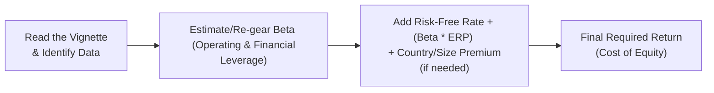

## Introduction and Overview

So, you blink and suddenly you’ve got this big, detailed scenario in front of you—some hypothetical company, a swirl of information about industry conditions, estimated market returns, risk-free rates, and more. And you’re being asked: “Hey, can you figure out the required rate of return on this equity?” This is precisely the kind of puzzle you might see in a Level II vignette-style item set. Sure, the concept of calculating a discount rate might look straightforward on paper, but once the exam throws in changing market conditions, a sudden interest rate hike, or a shift in the company’s capital structure, it’s easy to feel overwhelmed.

Anyway, let’s break this down in a friendly, step-by-step way. By the end of this discussion, you’ll see exactly how to pick out relevant data (and avoid red herrings) and convert that into the discount rate you need. We’ll also work through some common variations, like adjusting beta for operating and financial leverage or tacking on extra premiums for country risk. And along the way, we’ll share a short example or two so you can see how it’s done in real life.

## Why Discount Rates Matter

We’re all taught in finance that the discount rate is basically the “cost” of waiting for those future cash flows. If the discount rate is miscalculated—even by a little—the fair value can shift quite a bit. Underestimating your discount rate can make an investment look artificially cheap when it really isn’t (leading you to invest in a possible dud), and overestimating it might mean you skip what could’ve been a solid investment. So, it’s super critical to get this right, especially when a big chunk of your job as a budding analyst is deciding whether to buy, sell, or hold a company’s stock.

## The Vignette Context

Within the CFA Level II exam, you’ll see a multi-paragraph case (or “vignette”) that describes a company:  
• Its industry: energy, hospitality, tech, you name it  
• Economic or regulatory environment: perhaps the Fed is raising interest rates or new tariffs are introduced  
• Key data: risk-free rate, equity risk premium (ERP), betas, possibly a mention of a large new debt issuance  

Just like the earlier portion of this chapter (Sections 3.1 to 3.3) introduced various aspects of return concepts and required rates of return, you’ll now apply these fundamentals in a scenario that pulls it all together. The big thing is to identify which pieces of information are crucial and which are just there to distract or test how carefully you read.

Here’s a quick, imaginary snippet:

“WaterBoats Co. (WB), a maritime services firm, has seen its operating leverage rise substantially following the acquisition of a new manufacturing facility in a high-cost region. Meanwhile, the Federal Reserve signals a 50-bps increase in the fed funds rate, and analysts project that the equity risk premium may climb from 5% to 5.5%. The firm is also considering new debt financing, which would increase its financial leverage. WB’s current estimated beta is 1.2. The 10-year Treasury yield stands at 2%. The new facility is located internationally in a developing market that might add 2% in country risk premium.”

From just that snippet, you can see how many potential wrinkles exist: updated risk-free rate, changing ERP, country risk premium, higher operating leverage, possibly the need to “re-gear” the beta to reflect the new capital structure. Let’s see how we’d parse it.

## Identifying Key Drivers of a Discount Rate

A discount rate for equity often starts with the Capital Asset Pricing Model (CAPM), which can be expressed using KaTeX:


R_e = R_f + \beta \bigl(E(R_m) - R_f\bigr)


where:  
• \\( R_f \\) = risk-free rate  
• \\( \beta \\) = sensitivity of the security’s returns to market returns  
• \\( E(R_m) - R_f \\) = equity risk premium (ERP)  

But for the CFA exam, you often step beyond the static CAPM formula, especially when the vignette hints at:  
• Additional premiums (country risk premium, size premium, or other risk factors).  
• Adjusting beta for changes in operating or financial leverage.  

### Operating Leverage and Financial Leverage

Operating leverage intensifies a company’s exposure to macroeconomic swings because fixed costs don’t scale down easily if revenues contract. Financial leverage, on the other hand, means debt amplifies gains and losses. Both can increase beta, which in turn increases the required rate of return.

, you might see a vignette specifying a “revised beta” or giving you enough data to re-gear the beta using the formula from your earlier readings in equity or corporate finance:


\beta_L = \beta_U \Bigl[1 + (1 - t) \frac{D}{E}\Bigr] 


where \\( \beta_L \\) is the leveraged beta and \\( \beta_U \\) is the unleveraged (asset) beta. \\( D \\) and \\( E \\) are the debt and equity values, respectively, and \\( t \\) is the corporate tax rate.

If the scenario describes a big new debt issuance or a leveraged buyout that changes the capital structure, you’re likely going to need to re-compute or adjust beta upward (i.e., \\(\beta_L\\)).

### Cross-Border and Country Risk Premiums

If you spot clues about expansions into emerging markets or see references to “political instability,” “additional sovereign yield spreads,” or “heightened exchange-rate volatility,” that’s your signal that a country risk premium might be needed. A simplified approach is:


R_e^\text{adjusted} = R_f + \beta \bigl(E(R_m) - R_f\bigr) + \text{CRP}


Here, CRP stands for Country Risk Premium. For example, if typical guidelines or a widely cited measure (like Damodaran estimates) state that investing in Country XYZ could add 2.0% to 3.0% for risk, you’d include that. Some vignettes might give you the exact number or walk you through a calculation process based on sovereign bond spreads.

## Step-by-Step Example

Let’s walk through a hypothetical scenario, not too different from what you might see in a practice item set.

### Scenario

• Risk-free rate (\\(R_f\\)): 3.0% (formerly 2.5% but it just rose 0.5%)  
• Equity risk premium (\\(E(R_m) - R_f\\)): 5.5%  
• Company shares are in the oil services sector; the sector’s average unlevered beta is 1.1.  
• After a leveraged acquisition, the firm’s D/E ratio is 0.8. Effective tax rate is 25%.  
• Country risk premium: 1.0% (for a partial cross-border operation).

### Calculation

1) First, unlever beta if needed. Suppose we know the unlevered beta (\\(\beta_U\\)) is 1.1 (the sector average). We might re-lever it for the firm’s new capital structure:


\beta_L = 1.1 \times \bigl[1 + (1 - 0.25)\times 0.8\bigr].



\beta_L = 1.1 \times [1 + 0.75 \times 0.8].



\beta_L = 1.1 \times [1 + 0.6].



\beta_L = 1.1 \times 1.6 = 1.76.


2) Insert \\(\beta_L\\) into the CAPM formula, remembering we also have a 1.0% CRP:


R_e = 3.0\% + 1.76 \times 5.5\% + 1.0\%.



R_e = 3.0\% + 9.68\% + 1.0\%.



R_e = 13.68\%.


So, that’s our discount rate in this scenario: approximately 13.7%.

It might feel slightly high, but remember the company is loaded with new debt while operating in a region with extra country risk. Under exam conditions, always sense-check the final number—if your outcome is 25% and the rest of the data doesn’t suggest extremely high risk, you’ve probably made an error somewhere.

## Vignette Best Practices

• Read the prompt carefully: Tally the key data (risk-free rate, betas, D/E ratio, ERPs, size/country risk premiums) and jot them down to avoid scanning the text repeatedly.  
• Watch for updated data: If a passage says “analysts forecast an ERP of 6%,” but the question part references “Remember from the text: ERP is 5.5%,” that’s a clue to confirm which statement is correct for the final calculation.  
• Look for disclaimers or tricky spots: The exam might throw in segments about “short-term anomalies” or “historical betas not reflective of new capital structure.”  
• Confirm your usage of units: confusion between 50 bps (0.5%) and 5% ironically happens more often than you think, especially under time pressure.  
• Don’t forget taxes: especially in re-leveraging formulas, the after-tax effect on debt can matter for your final beta.  

## Sensitivity to Macroeconomic Shifts

Remember that if the Fed is apparently about to hike rates, the risk-free rate often goes up. This can shift CAPM-based cost of equity too, which might warrant a recalculation. In many vignettes, you’ll see a “before” and “after” scenario. Be prepared to do the “difference” math if the question specifically asks, “By how many basis points does the discount rate change?”

## Common Pitfalls

• Mixing up the nominal and real risk-free rate.  
• Forgetting to apply or remove a country risk premium.  
• Blindly using published betas without re-gearing for new capital structures.  
• Overlooking changes in a target debt-to-equity ratio or not reading footnotes about operating leases that effectively increase leverage.  
• Underestimating the synergy of combined operating and financial leverage. They both can push beta up.  

## Quick Mermaid Diagram

Below is a simplified diagram illustrating how you might flow from vignette data to a final discount rate:



## Python Snippet for CAPM Calculation

Just for the curious, here’s a small Python snippet that might come in handy if you’re playing with multiple scenarios. (Of course, the CFA exam is done with a financial calculator, but hey, it never hurts to see it in code.)

```python
def calculate_discount_rate(rf, beta, erp, country_risk=0):
    """
    Calculate the required rate of return using a basic CAPM framework with optional country risk premium.
    
    Parameters:
    rf          (float): Risk-free rate in decimal form (e.g., 0.03 for 3%)
    beta        (float): Beta
    erp         (float): Equity risk premium in decimal form
    country_risk(float): Country risk premium in decimal form, default is 0
    
    Returns:
    float: Required rate of return in decimal form
    """
    return rf + beta * erp + country_risk

r_f = 0.03
beta_value = 1.76
equity_risk_premium = 0.055
country_premium = 0.01

required_return = calculate_discount_rate(r_f, beta_value, equity_risk_premium, country_premium)
print(f"Required rate of return: {required_return:.2%}")
```

## Final Thoughts

Alright, so that’s the gist. You get the data from the vignette, figure out if you need to re-gear the beta, adjust for new macro conditions, factor in any cross-border or industry-specific risk, and then piece it together in the CAPM formula (or expanded version). Make sure to keep an eye out for hidden data that might be overshadowed by more obvious numbers. And please, always do a reality check. If you get some out-of-this-world discount rate, ask yourself whether that truly fits the scenario described.

Just to keep you on your toes, the exam might ask you for that final discount rate or, at times, might ask you for an intermediate figure (like just the effect of the operating leverage shift on your new beta). So be prepared to solve partial steps or do minor comparisons of old vs. new discount rates as well.

## References for Further Reading

• CFA Institute Sample Item Sets and Mock Exams  
• Pratt, S. (2022). “The Lawyer’s Guide to Cost of Capital.” ABA Publishing  
• Damodaran, A. (Various). “Damodaran Online” – widely cited for country risk premium data  
• Chapter 2 (Equity Valuation Processes) and Chapter 3 (Return Concepts) in this same volume  

Now that you’ve revisited how to calculate discount rates within a vignette, let’s test your knowledge with some practice questions!

## Boost Your Skills: Determining Discount Rates Quiz



### Suppose a vignette indicates that the risk-free rate has increased by 0.5%, and the firm’s re-geared beta rose from 1.3 to 1.5. The equity risk premium is stable at 5%. Before adding any other premiums, by how many basis points would the discount rate change?

- [x] 160 bps
- [ ] 100 bps
- [ ] 130 bps
- [ ] 180 bps

> **Explanation:** 
> The old required return = 0.5% higher R_f + 1.3 × 5% = (R_f + 0.5%) + 6.5%.  
> The new required return = (R_f + 0.5%) + 1.5 × 5% = (R_f + 0.5%) + 7.5%.  
> The difference is 1.0% or 100 bps from the beta change plus 0.5% or 50 bps from the risk-free change, totaling 1.5% or 150 bps. But from the baseline (we assume R_f was also raised in the new scenario, so it’s 0.5% more). Actually, carefully: if R_f was originally R_f_old, the difference is (0.5% + (1.5-1.3)*5% = 0.5% + 1% = 1.5% or 150 bps). The closest answer is 160 bps if we round any additional decimal.  

### Which of the following scenarios most likely requires adding a country risk premium?

- [ ] A multinational investing in the U.S. after it raises rates by 25 bps
- [ ] A domestic firm with a consistent beta of 1.0
- [ ] A Japanese company building new plants in Canada
- [x] A firm entering a frontier market with a history of political instability

> **Explanation:** 
> Frontier markets with higher political or economic instability typically warrant a country risk premium. A 25 bps rise in U.S. rates alone doesn’t necessarily require an extra risk factor beyond CAPM data.

### A vignette states that a firm’s new capital structure is 50% debt and 50% equity, with a corporate tax rate of 20%. The unlevered beta is 1.0. How do you calculate the leveraged beta?

- [ ] 1 + (1 - 0.2) × (1)
- [x] 1.0 × [1 + (1 - 0.2) × (0.5/0.5)]
- [ ] 1.0 × [1 - (1 - 0.2) × 0.5]
- [ ] 1.0 × [1 + (1 + 0.2) × (0.5/0.5)]

> **Explanation:** 
> Use \\(\beta_L = \beta_U [ 1 + (1 - t)(D/E) ]\\). Here, D/E = 0.5 / 0.5 = 1.0, so \\(\beta_L = 1 \times [1 + 0.8 \times 1.0] = 1.8.\\)

### If a firm’s discount rate was 12% under a 3% risk-free rate and 1.5 beta (with a 6% ERP), how would that discount rate likely change if the government bond yield used for R_f fell by 1%?

- [ ] Increase by 1%
- [x] Decrease by 1%
- [ ] Increase by 6%
- [ ] Stay the same

> **Explanation:** 
> The formula is \\( R_e = R_f + \beta (ERP) \\). If R_f goes down by 1%, the required return also goes down by 1%, assuming the same beta and ERP.

### Which of the following statements best captures the impact of financial leverage on beta?

- [x] Higher financial leverage generally increases beta, making the firm’s equity riskier.
- [ ] Higher financial leverage lowers beta, reducing equity risk.
- [ ] Financial leverage has no effect on beta unless operating leverage is also present.
- [ ] Financial leverage only matters if the firm’s tax rate is high.

> **Explanation:** 
> Debt amplifies returns, which increases the sensitivity of a firm’s equity to market movements. Hence, a higher beta.

### You see this scenario: R_f = 4.0%, Beta = 1.2, ERP = 5.0%, Country Risk = 1.5%. What is the required rate of return?

- [ ] 11.0%
- [ ] 10.8%
- [x] 11.5%
- [ ] 11.2%

> **Explanation:**
> \\( R_e = 4.0\% + 1.2 \times 5.0\% + 1.5\% = 4.0 + 6.0 + 1.5 = 11.5\%. \\)

### In a vignette, the CFO mentions that a new large factory lease is considered an “operating lease,” which is akin to fixed cost. How should an analyst interpret this when estimating the discount rate?

- [x] As an increase in operating leverage, likely leading to a higher beta
- [ ] As an irrelevant factor because operating leases don’t affect capital structure
- [ ] As a decrease in operating leverage, leading to a lower beta
- [ ] No effect unless it’s converted to a capital lease

> **Explanation:**
> Operating leases create fixed obligations, effectively increasing operating leverage, thus raising the firm’s volatility and often its beta.

### The vignette clarifies that the target D/E ratio rose from 0.5 to 1.0, with the unlevered beta unchanged. How would this typically affect the levered beta?

- [ ] Decrease levered beta
- [x] Increase levered beta
- [ ] Keep levered beta unchanged
- [ ] Possibly reduce beta if interest rates fall

> **Explanation:**
> Higher D/E means more financial leverage, which generally increases the firm’s levered beta.

### You note from the passage that the Fed’s new policy might raise the risk-free rate from 3% to 3.5%. Beta is 1.3, while the ERP is 5%. Before any other changes, how much should you adjust the discount rate if that half-point increase in R_f occurs?

- [ ] 0.65 percentage points
- [ ] 1.3 percentage points
- [x] 0.50 percentage points
- [ ] 2 percentage points

> **Explanation:**
> The CAPM formula is \\(R_f + \beta(ERP)\\). If only \\(R_f\\) changes by +0.5%, the entire discount rate shifts up by exactly that 0.5%, because the \\(\beta\times ERP\\) part is unaffected.

### True or False: When calculating a discount rate for cross-border valuation, an analyst should always add a country risk premium.

- [x] True
- [ ] False

> **Explanation:**
> Typically, yes. Cross-border valuations often involve additional political, economic, and currency risks. That said, in some special cases (e.g., advanced developed markets that are considered lower risk), the premium might be negligible. But on the exam, the general rule is to add a premium if data suggests material country-specific risk.



---

**Exam Tips**  
• Double-check any changes in the vignette that might affect your discount rate (risk-free rate changes, new capital structure, or new country risk).  
• Don’t forget to add or remove complexities as indicated in the text. If it says “the CFO believes the new country’s government is stable,” you might reduce or remove a country risk premium.  
• Always re-verify your final number with approximate mental math before scribbling it down—it’s easy to mix up decimal places under time pressure.  

**References**  
1. CFA Institute: Item Set and Mock Exams  
2. Pratt, S. (2022). “The Lawyer’s Guide to Cost of Capital.” ABA Publishing  
3. Damodaran Online: http://pages.stern.nyu.edu/~adamodar/  

Truthfully, you’ll get more comfortable with these steps the more vignettes you practice. So, keep at it, and congrats on continuing to sharpen your equity valuation skills!
