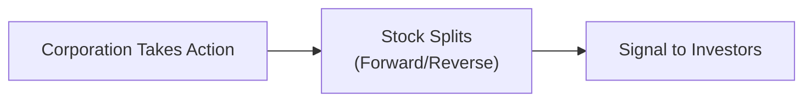

## Introduction

Corporate actions can be some of the most interesting—and occasionally bewildering—events that affect a company’s stock. Many of my finance friends get super excited whenever a big-name firm announces a stock split, dividend increase, or a buyback program. But, you know, not everyone fully understands the details. How do these actions actually impact a firm’s valuation, investor perception, and the daily share price? That’s exactly what we’re here to unpack.

In this section, we’ll take a practical look at the core corporate actions of stock splits (both forward and reverse), dividends (cash and otherwise), and share repurchases (buybacks). We’ll explore their mechanics, rationale, and the holistic impact on valuation metrics—for example, EPS (earnings per share) or P/E ratios. By the end, you should feel comfortable with how these actions affect equity prices and how to interpret them in advanced investment analysis. So, let’s dive in.

## Definition and Impact of Corporate Actions

We often say that corporate actions are like strategic announcements designed to alter a company’s share structure or distribute resources. These decisions can simultaneously signal how management feels about the firm’s stock, alter per-share metrics that analysts love, and even shift investor psychology.

• From a purely theoretical standpoint, if no new information is provided, the total value of the firm might remain the same.  
• In practice, though, market perception and behavioral drivers (e.g., “the stock is cheaper now!”) can play a significant role in how prices move soon after the announcement or effective date.

## Stock Splits: Forward and Reverse

### Rationale and Mechanics of Forward Stock Splits

A forward stock split is when a company increases the number of shares outstanding but proportionally reduces each share’s price. The most common forms look like 2-for-1 or 3-for-1 splits, though I once saw a 50-for-1 split from a tech startup trying to increase liquidity. The main point: the total market capitalization theoretically remains unchanged. 

• If a firm trading at $300 per share executes a 3-for-1 split, each shareholder ends up with three times as many shares at a post-split price of roughly $100.  
• Liquidity often improves—investors may feel more at ease buying a $100 stock instead of a $300 stock, even though, rationally, the total value in their portfolio should be the same.  
• Some market participants (especially retail investors) perceive the post-split price as more “affordable,” possibly boosting demand in the short term.

### Reverse Stock Splits

Reverse stock splits consolidate outstanding shares into fewer shares at a higher per-share price, often done to:  
• Maintain minimum exchange listing requirements (for instance, if the share price dips below $1).  
• Present a more respectable share price, hinting at stability.  

For example, with a 1-for-5 reverse split, a shareholder who held 10,000 shares at $1.00 would now own 2,000 shares at $5.00. Managers sometimes hope that a higher going price can help the firm avoid the stigma of “penny stock” status. But be aware: if there’s no underlying improvement in the business, the reverse split alone doesn’t magically fix fundamentals.

### Visualizing Stock Splits in Mermaid

Below is a simple diagram illustrating how a corporation’s split action ultimately leads to changes in share count and perceived valuation:

## Dividends: Cash and Distribution Policy

A dividend is a bit like the company handing shareholders a slice of its profits. It’s a direct way to compensate investors for holding shares. Typically, stable or mature companies are more likely to pay consistent dividends, signaling consistent cash flow and lower reinvestment needs.

### Cash Dividends

Cash dividends are the most common type—paid on a regular schedule (quarterly in many places) but can be annual, semi-annual, or irregular. The key takeaway is:

• On the ex-dividend date, the share price generally drops by about the dividend amount. Mathematically, it’s often approximated as:


P_{ex-div} = P_{cum-div} - D


where:
– \\( P_{cum-div} \\) = share price before the stock goes ex-dividend  
– \\( D \\) = dividend per share  

Of course, there can be other market forces at work, but typically you’ll see the opening trade on the ex-div date reflect a price drop.

### Dividend Policy and Special Dividends

Dividend policy can convey management’s confidence in future earnings. A firm with steady growth prospects and robust cash flow might choose a predictable, rising dividend policy. On the other hand, some cyclical companies might keep a conservative base dividend but announce a one-time “special dividend” in years when profits exceed expectations.

• Special (or extraordinary) dividends are usually larger, lump-sum payouts triggered by a one-off event—like the sale of a subsidiary or an unusually large profit spike.  
• Scrip (or stock) dividends: where the firm issues more shares instead of cash. The total ownership percentages remain more or less the same if everyone receives a proportional number of shares, but be mindful that earnings will be spread over more shares, impacting metrics like EPS.

## Share Repurchases (Buybacks)

Share repurchases occur when a company buys back its own shares from the market or directly from shareholders. This reduces the total number of shares outstanding and can lead to:

• Higher EPS (assuming earnings remain constant, the denominator of outstanding shares is reduced).  
• Potentially higher share price, since each share now has a larger claim on future earnings.  
• A signal that management believes the stock is undervalued. 

### Repurchase Methods

1. Open-Market Repurchases: The company buys shares in the open market over time. This method is flexible but also less transparent regarding the exact timing of purchases.  
2. Tender Offers: The company offers to repurchase a certain number of shares at a specified price (usually at a premium to the current market price). Shareholders can decide if they want to tender their shares.  
3. Private/Targeted Buybacks: The firm negotiates directly with a large shareholder (like an activist investor) to purchase that party’s shares.

In advanced equity analysis, we care how buybacks alter capital structure, the firm’s ability to finance future projects, and the effect on share-based compensation. For instance, companies might offset the dilution from employee stock option plans by repurchasing shares.

## Impact on Valuation and Ratios

### Effects on EPS, Book Value per Share, and P/E Ratios

1. Stock Splits: Splits don’t typically alter net income or enterprise value, so fundamental ratios (like net income divided by the new share count) stay aligned. But the denominators in per-share metrics do change, so analysts must be consistent historically.  
2. Cash Dividends: They reduce a company’s retained earnings (and thus net assets) without directly impacting EPS in that same quarter. However, they can hint at lower future growth if the cash might otherwise have funded CAPEX or expansions.  
3. Share Repurchases: Buybacks reduce shares outstanding and can make EPS look stronger. If the company borrows to fund a large repurchase, watch for changes in the capital structure that might introduce higher financial risk.

### Share Price Movements and Investor Psychology

Investors often interpret these actions as “signals” from company leadership about where they believe the stock—and the overall business—is headed. Sometimes, a well-timed dividend hike or buyback announcement can nudge the market to reprice the stock upward. Conversely, a dividend cut can spark panic selling. Behavioral factors like anchoring (e.g., “I like it at $35, not $70”) and framing (“buybacks show management’s confidence!”) can amplify price swings.

## Market Perception and Signaling

### Positive Signals

• A higher dividend might suggest management expects solid, stable future cash flow.  
• Announced share repurchases can be read as “the stock is cheap, and we have the cash to buy it.”  
• A forward stock split might broaden the investor base, especially retail.

### Negative Signals

• A dividend cut can indicate difficulties meeting obligations or a shift in funneling capital to business investments (not always negative, but can appear so if unexpected).  
• Reverse splits sometimes raise eyebrows among analysts—“why is the share price that low in the first place?”

Being aware of these nuanced interpretations will help you navigate exam vignettes that revolve around corporate actions. CFA Level II item sets often present scenarios describing a firm’s decisions on dividends or buybacks and expect you to analyze the impact on share price, EPS, and other metrics.

## Practical Considerations and Case Studies

• Tech Giants and Buybacks: Many leading tech firms, flush with cash, have implemented large repurchase programs. Apple, for instance, has executed significant buybacks over the years, boosting its EPS and often reassuring the market.  
• Dividend Increases in Consumer Staples: Some consumer-staples companies proudly tout decades of consecutive annual dividend increases. This strategy can attract a dedicated investor base seeking stable income.  
• Reverse Stock Splits in Troubled Companies: A small biotech firm engaged in a 1-for-10 reverse split to maintain Nasdaq listing requirements. Even though the nominal price jumped from $0.80 to $8.00, the fundamentals remained unchanged, and the new price eventually trickled downward once the market recognized there was no real improvement in the firm’s pipeline.

## Common Pitfalls

• Forgetting to adjust historical share prices and EPS data after a stock split. This can lead to erroneous growth rate calculations.  
• Overlooking the exact ex-dividend date when analyzing price changes, causing confusion over daily price movements.  
• Confusing tender offers with open-market repurchases—these can have very different short-term price impacts. Tender offers often involve a premium, whereas open-market repurchases may not.

## Conclusion and Exam Tips

For the CFA Level II exam, corporate actions will likely appear in item set (vignette) questions that demand both quantitative adjustments (e.g., re-calculating EPS after a share repurchase) and qualitative reasoning (e.g., interpreting a dividend cut). 

• Always identify the ex-dividend date and how it affects share price in the immediate term.  
• Pay attention to the change in total shares outstanding from splits or buybacks and how that variation influences key ratios.  
• Evaluate the “signaling effect” in the context of the firm’s broader financial situation. If the firm is highly leveraged, a buyback might be a questionable use of cash.

Remember, though, that while corporate actions don’t inherently add or destroy total firm value in a perfect market, the real world seldom acts so predictably. Behavior, sentiment, and capital structure changes can all have a real impact on stock price performance and your valuation models. Understanding these nuances will help you excel not just in the CFA exam but also in your professional analysis.

## References and Further Reading

• Damodaran, A. (2012). Investment Valuation. (Chapters on payout policy and corporate actions.)  
• CFA Institute. (2025). CFA® Program Curriculum for Level II, Equity Investments.  
• Jensen, M. C. (1986). “Agency Costs of Free Cash Flow, Corporate Finance, and Takeovers,” American Economic Review.  

---

## Test Your Knowledge: Stock Splits, Dividends, and Share Repurchases



### 1. A company announces a 2-for-1 stock split. If you owned 100 shares at $50 per share, what is your total investment value immediately after the split, assuming nothing else changes? 

- [ ] $2,500  
- [ ] $6,000  
- [x] $5,000  
- [ ] $50,000  

> **Explanation:** After a 2-for-1 split, you will own 200 shares, each priced at approximately $25. Your total investment value remains $5,000 (200 × $25 = $5,000) if all else stays constant.

### 2. Which corporate action is most commonly done to maintain a company’s minimum listing requirements on an exchange?

- [ ] Special dividend  
- [x] Reverse stock split  
- [ ] Open-market share repurchase  
- [ ] Tender offer  

> **Explanation:** Reverse stock splits are frequently pursued by companies whose share price has fallen below an exchange’s required threshold, helping them avoid delisting.

### 3. When a stock goes ex-dividend, the share price typically decreases by the dividend amount. This drop occurs primarily because:

- [x] New buyers are no longer entitled to receive the declared dividend.  
- [ ] The corporation announces deteriorating fundamentals.  
- [ ] The market readjusts earnings estimates.  
- [ ] Short interest dramatically increases.  

> **Explanation:** On the ex-dividend date, new shareholders will not receive the upcoming dividend, so the price reflects that lost entitlement.

### 4. A firm uses a tender offer at a premium to buy back shares. Short-term, this strategy often:

- [ ] Decreases the EPS of the remaining shares.  
- [ ] Has no impact on capital structure.  
- [ ] Increases the overall share count.  
- [x] Offers shareholders an incentive to sell their shares.  

> **Explanation:** Tender offers propose a premium price to incentivize existing shareholders to tender or sell their shares back to the company.

### 5. Which statement best describes a special (extraordinary) dividend?

- [x] A one-time distribution often triggered by excess cash or unusual profits.  
- [ ] An automatically recurring distribution every quarter.  
- [ ] The standard payout of all publicly held companies.  
- [ ] A mandatory payout required by the exchange.  

> **Explanation:** Special (extraordinary) dividends occur outside the normal routine, typically resulting from exceptional business events.

### 6. Under a scrip (stock) dividend scenario, which of the following is a direct result for shareholders?

- [ ] The firm’s total market capitalization doubles.  
- [ ] EPS immediately increases.  
- [x] The number of shares held by each investor rises.  
- [ ] The nominal share price significantly increases.  

> **Explanation:** A scrip dividend allocates additional shares instead of cash. This increases each shareholder’s number of shares but does not necessarily change total market cap or raise EPS.

### 7. What is a primary motivation behind share repurchases?

- [x] To reduce the total share count, potentially increasing EPS.  
- [x] To signal that management believes the shares are undervalued.  
- [ ] To permanently reduce the company’s earnings.  
- [ ] To force out minority shareholders involuntarily.  

> **Explanation:** Buybacks commonly shrink shares outstanding, which may boost per-share metrics, and they can serve as a market signal of management confidence in firm value.

### 8. A reverse split is typically associated with:

- [ ] Expansion of the total shares outstanding.  
- [ ] More liquidity of shares.  
- [ ] A less stable share price.  
- [x] A consolidation of shares into fewer, higher-priced shares.  

> **Explanation:** Reverse splits reduce the number of shares outstanding and aggregate them into fewer shares at a higher price per share.

### 9. If a firm’s share price rises following a forward stock split announcement, a potential explanation could be:

- [x] Investors perceive the shares to be more affordable and buy more.  
- [ ] New regulatory changes mandated a higher price.  
- [ ] Management has decreased the firm’s intrinsic value.  
- [ ] The number of available shares in the market has effectively shrunk.  

> **Explanation:** Even though the intrinsic value might remain unchanged, some investors may see the post-split shares as more accessible, increasing demand and boosting price in the short run.

### 10. True or False: If a company borrows significant funds to buy back shares, this has no effect on the company’s risk profile. 

- [ ] True  
- [x] False  

> **Explanation:** Borrowing large amounts to fund a share repurchase can increase the company’s leverage (debt). This elevates financial risk and might affect its credit profile.


