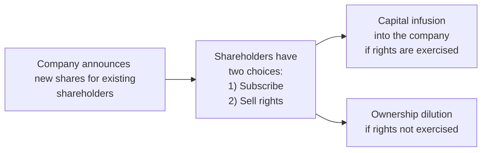

## Understanding the Concept of Rights Issues
Rights issues are basically invitations from a company to its existing shareholders to buy additional shares before they’re offered to the broader public—often at a price below the current market. Think of it as being in an exclusive club where you get privileged “first dibs” on the new stock offering. The main goal is to raise fresh capital. Companies might need the funds to expand into emerging markets, refinance debt, or invest in new product lines.

I remember hearing a friend say, “Wait, so I get to buy more shares on the cheap? Sign me up!” But there’s a catch: if these rights aren’t exercised, the existing shareholder’s ownership percentage can be diluted when the new shares hit the market.

## Why Companies Undertake Rights Issues
It’s natural to wonder, “Why not just tap the bond market or take out a loan?” In short, an equity raise via a rights issue can strengthen the company’s balance sheet (less debt is always a plus when it comes to interest payments), provide financing for new projects, or help fund acquisitions. From a CFO’s perspective, raising equity might be essential when the debt levels are already high or when the cost of debt is unattractive.

Let’s remember: the market’s reaction to the rationale behind a rights issue is key. If the announced use of funds is for something forward-looking and strategic (like an R&D push), investors may applaud the move. But if it looks more like a last-ditch attempt to cover operational losses, the share price can take a quick tumble.

## Subscription Price, Terms, and Underwriting
Companies typically offer new shares at a subscription price that’s below the prevailing market. That sweet discount incentivizes shareholders to exercise their rights. For example, if the stock trades at $20, the rights issue price might be $16. Current shareholders can snap up the new shares at $16, a seeming bargain.

• Underwriting: Many rights issues are “fully underwritten,” meaning an investment bank (or syndicate) commits to buy any unsubscribed shares. This ensures the company raises the full targeted amount. However, that guarantee comes at a cost: underwriters charge a fee and may end up with a large chunk of shares if a good portion of shareholders choose not to take part.

• Terms: The rights might say that for every 5 shares you currently own, you can purchase 1 new share at the discounted price. If you skip out, well, your ownership slice will shrink relative to those who do buy the new shares.

## Dilution Mechanisms and Calculations
In a rights issue, the biggest fear for existing shareholders is dilution. Dilution occurs when the total number of shares outstanding increases, thereby reducing the percentage ownership of each existing share.

One straightforward way to assess the impact is by calculating the Theoretical Ex-Rights Price (TERP). This is an estimate of the share price immediately after the new shares start trading. In KaTeX format, TERP can be written as:


\text{TERP} = \frac{(P_{\text{old}} \times N_{\text{old}}) + (P_{\text{subscription}} \times N_{\text{new}})}{N_{\text{old}} + N_{\text{new}}}


Where:  
• \\(P_{\text{old}}\\) is the current (pre-rights) share price.  
• \\(N_{\text{old}}\\) is the number of existing shares outstanding.  
• \\(P_{\text{subscription}}\\) is the discounted subscription price of the new shares.  
• \\(N_{\text{new}}\\) is the number of new shares issued under the rights offering.

If you don’t exercise your rights, your ownership stake can shrink, and the total value of your holdings might drop unless you sell the rights themselves in the market (assuming they are tradable).

## Market Reaction and Behavioral Aspects
Markets can be finicky. Investors might panic if they interpret a rights issue as a distress signal: “Uh-oh, they must be in trouble if they’re asking current shareholders for cash.” That fear may drive the stock price down. On the other hand, if a company with strong fundamentals announces a rights issue for a well-received strategic expansion, the share price might hold up relatively well—or even rise—because shareholders trust management’s plan.

Behaviorally, some investors are quick to sell new rights because they don’t want to commit more capital, whereas others pounce on the discount. Big institutional players might even short the underlying shares, hoping to create hedged positions if they plan to fully subscribe to the rights.

## Impact on Financial Statements
Raising fresh equity capital boosts the company’s cash balance and total shareholders’ equity. This, in turn, can reduce the leverage ratio (e.g., debt-to-equity). It’s common to see:

• A higher cash line on the balance sheet (from the newly raised funds).  
• A corresponding increase in the number of shares outstanding.  
• Potential changes in per-share metrics like earnings per share (EPS).

EPS is especially sensitive because, although net income might eventually increase if the new funds are productively invested, the immediate issuance of new shares can dilute EPS. And as we know from many academic studies, changes in EPS can have big psychological and valuation impacts on how the market prices the stock.

## Scenario Analysis: A Practical Case
Imagine a publicly traded company, “BrightTech,” with 100 million shares outstanding, each trading at $10. So, its market capitalization is \$1 billion. BrightTech announces it wants to raise \$200 million to finance a new product line.

• Terms: For every 5 existing shares, shareholders can buy 1 new share at \$8 each.  
• That means 20 million new shares will be issued (because 100 million / 5 = 20 million).  
• If the rights are fully subscribed, the company will get \$8 * 20 million = \$160 million, which is short of the \$200 million. Let’s assume the remainder is underwritten or the discount is adjusted accordingly in a real scenario.

Check out a (simplified) pro forma balance sheet snippet:

|                         | Before Rights Issue | After Rights Issue  |
|-------------------------|---------------------|---------------------|
| Cash                    | \$50 million        | \$210 million (50+160) |
| Shareholders’ Equity    | \$300 million       | \$460 million (300+160)|
| Number of Shares        | 100 million        | 120 million         |
| Book Value/Share        | \$3.00             | \$3.83 (460/120)    |

Notice how the additional cash improves the balance sheet, though each share is now a smaller fraction of total ownership. If management invests the \$160 million in R&D that yields significant future cash flows, the net benefit to shareholders could be positive despite the short-term dilution.

## Advanced Hedge and Arbitrage Dynamics
Institutional investors often engage in sophisticated trading strategies around rights issues:

• Hedge Funds might buy rights and short the underlying shares, aiming to lock in a risk-free gain if the discounted subscription price plus the short proceeds exceed the cost of the hedge.  
• Others might speculate on the volatility of the share price during the rights offering period.  

These strategies can sometimes cause short-term price distortions, leading to sudden shifts in the stock price. It’s wise for individual investors to stay alert and to read the fine print on the rights terms to see if they’re better off subscribing, selling the rights, or ignoring them altogether (the last option typically being the worst if the rights are in the money).

Below is a basic diagram illustrating the structure of a rights issue and the potential paths a shareholder might take:

## Common Pitfalls and Best Practices
• Pitfall: Ignoring the rights offering. Some shareholders wrongly assume it’s optional noise. In reality, ignoring your rights can result in valuable entitlements going to waste.  
• Pitfall: Failing to consider the subscription price’s discount. If the discount is large, it might be worth buying the new shares even if you plan to partially hedge or sell them later.  
• Best Practice: Perform a TERP calculation for a quick sense of the post-rights share price.  
• Best Practice: Examine the use of proceeds. If the company is raising capital to expand into a profitable market, the short-term dilution might be overshadowed by the long-term payoff.

## Conclusion and Exam Tips
Rights issues can be a double-edged sword. They offer exciting financing avenues for companies but can leave shareholders struggling with complex decisions about whether to pony up more cash or risk dilution. From the CFA Level II perspective, focus on:

• How to compute the post-issue share price (TERP).  
• The effect on key valuation metrics, including EPS and book value per share.  
• Market sentiment factors that cause a stock to lose or gain value upon announcement.  
• The role of underwriters and potential arbitrage opportunities.

On exam day, watch out for item sets that combine a rights issue scenario with a company’s strategic plan. They might ask you to evaluate how the share price or EPS changes, or how the capital structure shifts. If they mention “fully underwritten,” think about potential fees and the risk that unsold shares could be bought by the underwriter. And don’t forget to practice with pro forma statements, because that skill frequently shows up in equity vignette questions. Good luck!

## Glossary of Key Terms
• Rights Issue: An offering of additional shares to existing shareholders, often at a discount  
• Theoretical Ex-Rights Price (TERP): The estimated share price after the rights issue  
• Underwriting: A guarantee by an investment bank to buy any unsubscribed shares  
• Dilution: Reduction in ownership percentage as total shares outstanding increase  
• Pro Forma Financials: Adjusted statements reflecting anticipated changes or transactions  
• Ownership Percentage: A shareholder’s proportion of total equity

## References and Further Reading
• Penman, S. (2013). Financial Statement Analysis and Security Valuation.  
• CFA Institute. (2025). CFA® Program Curriculum for Level II, Equity Investments.  
• Various journal articles in the Journal of Corporate Finance on market reaction to rights issues.

---

## Test Your Knowledge: Rights Issues and Dilution Effects



### Which best describes a rights issue?
- [ ] A way to repurchase shares to reduce the number of shares outstanding.
- [x] An offer to existing shareholders to buy new shares, often at a discount.
- [ ] A mandate to sell shares at market price only to institutional investors.
- [ ] A convertible bond offering to selected shareholders.

> **Explanation:** A rights issue grants current shareholders the opportunity to buy new shares, normally below market price, preserving their proportional ownership if they choose to participate.

### Why might a company opt for a rights issue over issuing bonds?
- [ ] To increase its debt ratio.
- [x] To strengthen the balance sheet and avoid higher interest obligations.
- [ ] Because bond markets tend to offer lower capital costs.
- [ ] To obscure financial data from the market.

> **Explanation:** Rights issues raise equity capital, which can bolster the balance sheet and reduce reliance on debt, whereas issuing bonds would increase leverage and require interest payments.

### What happens if an existing shareholder does not exercise their rights?
- [x] Their ownership percentage will be diluted.
- [ ] They automatically receive dividends on the new shares.
- [ ] Their shares are converted into preferred stock.
- [ ] Their shares become more valuable if the rights issue is underwritten.

> **Explanation:** Not subscribing to new shares when others do increases the total share count, thus reducing the non-participating shareholder’s percentage ownership.

### The subscription price in a rights issue is typically set:
- [x] Below the prevailing market price of the stock.
- [ ] At exactly the stock’s current trading price.
- [ ] Above the stock’s market price to discourage speculative buying.
- [ ] At the average trading price over the past six months.

> **Explanation:** Companies set a lower subscription price to incentivize existing shareholders to participate, ensuring capital is successfully raised.

### Which of the following is NOT a typical motivation for a rights issue?
- [ ] Financing a strategic acquisition.
- [ ] Strengthening the company’s capital structure.
- [x] Reducing the company’s share count.
- [ ] Funding new R&D projects.

> **Explanation:** A rights issue increases the number of shares outstanding; it does not reduce it.

### The Theoretical Ex-Rights Price (TERP) calculation helps investors:
- [ ] Identify dividend growth rates.
- [ ] Compute the bond yield curve.
- [x] Estimate the stock’s price after new shares are introduced.
- [ ] Decide how many votes each share receives.

> **Explanation:** TERP shows a hypothetical post-offering price based on both old and new share quantities and their respective prices.

### In a fully underwritten rights issue:
- [ ] The shareholders are obligated to purchase all unsold shares.
- [x] The underwriter guarantees to buy any unsubscribed shares.
- [ ] The company must repay the underwriter at an interest rate of LIBOR + a spread.
- [ ] There is no fee paid to the underwriter if all shares are subscribed.

> **Explanation:** A fully underwritten issue ensures the company will raise the intended capital regardless of shareholder participation, because the underwriter commits to purchase any remaining shares.

### An investor who wants no additional capital outlay can protect themselves from dilution by:
- [ ] Automatically being assigned new shares.
- [ ] Ignoring subscription rights entirely.
- [x] Selling their rights on the open market (if tradable).
- [ ] Exercising the rights and simultaneously buying put options.

> **Explanation:** Selling the rights compensates the investor for not subscribing to the new shares, mitigating the negative impact on ownership value.

### Which scenario often leads to negative market sentiment around a rights issue?
- [x] The perception that the company is covering operational losses.
- [ ] A plan to fund a promising new product line.
- [ ] Lowering leverage ratios for better credit ratings.
- [ ] Securing strategic acquisitions.

> **Explanation:** If the market suspects the company is raising capital due to financial trouble, sentiment can sour, pushing share prices down.

### True or False: An investor who chooses to exercise their rights generally experiences no dilution in their overall ownership percentage.
- [x] True
- [ ] False

> **Explanation:** By exercising rights, the investor buys new shares in proportion to their existing stake, maintaining roughly the same percentage of total ownership.


