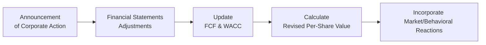

## Introduction and Overview

Imagine this: You’re analyzing a company, let’s call it GlobalTech, that has just announced not one but three different corporate actions—an upcoming stock split, a brand-new dividend policy, and a share repurchase program. You already suspect those decisions might have complicated implications for GlobalTech’s market valuation, but you’re not totally sure how all the moving pieces fit together. Throw in some updates to their earnings guidance, plus chatter from analysts who seem a bit exuberant, and you’ve got a recipe for a tricky Level II exam vignette question.

In this section, we’ll walk through how to handle precisely this kind of complex scenario—where multiple corporate actions can intersect in ways that shift valuations, alter capital structures, modify risk profiles, and even spark odd behavioral biases. We’ll look at best practices for staying organized under exam conditions, performing quick yet accurate calculations, and applying professional judgment on intangible factors that might inflate—or deflate—stock prices.

Our journey here touches on the critical intersection of accounting, finance, and market psychology. We’ll also reference prior chapters of this volume (such as Chapter 3 for cost of capital calculations, Chapter 6 and 7 for dividend models, and Chapter 10 for price multiples) to illustrate how the entire curriculum can converge into a single, multi-dimensional item set.

## Why Vignette Analysis Matters for Corporate Actions

At Level II, vignettes aren’t just quick one-topic quizzes. They’re integrative question sets that build a story—sometimes with red herrings, data overload, or partial disclosures. In real life, corporate actions like dividends, share repurchases, and rights issues rarely happen in a vacuum. Financial analysts must consider:

• How the action changes the firm’s ownership structure.  
• Whether the action is financed with internal cash or external debt.  
• Its impact on key metrics: EPS, book value per share, free cash flow, and WACC.  
• Behavioral dimensions: is management overly optimistic, or is the market overreacting?

By learning to dissect these item sets, you’ll get an advantage that extends beyond the exam. You’ll gain practical skill in synthesizing data from financial statements, anticipating how capital markets might respond, and identifying mispricings when the market’s excitement (or fear) runs too high.

## Multi-Dimensional Corporate Actions in One Scenario

Corporate actions often come as a package. Let’s break down typical events that might appear all at once in a hypothetical vignette:

• Stock Splits:  
  A forward split (e.g., 2-for-1) doubles the number of shares outstanding and halves the share price, theoretically leaving market capitalization unchanged. Reverse splits (e.g., 1-for-2) do the opposite. In practice, though, the market might read signals into the announcement—a forward split might boost retail interest, for example.

• Dividend Initiations or Increases:  
  Stepping into or boosting regular dividend payments can raise questions about the sustainability of future cash flows. It’s also a direct signal of management confidence in stable or rising earnings. But if a dividend is too large, the market may wonder if the firm is draining valuable investment capital.

• Share Repurchases:  
  A repurchase (buyback) reduces the number of shares outstanding. This can lift EPS, all else equal, but at the cost of cash outflow. If the firm finances the buyback with debt, the capital structure changes, possibly raising the cost of equity. If management times repurchases well (e.g., when shares seem undervalued), there may be value added for shareholders.

• Rights Issues:  
  If the firm raises new equity capital by issuing rights to existing shareholders, the immediate effect may be dilution for those who don’t exercise their rights. The proceeds can pay down debt or fund new projects. At times, a rights issue is seen as a sign of financial distress—particularly if the timing is suspicious. Or, the market might applaud the capital infusion if it’s part of a growth plan.

• Updated Earnings Guidance:  
  Management might simultaneously announce new earnings targets. Such guidance can overshadow the direct mechanical changes of a corporate action, especially if the updated forecast is significantly higher or lower than expected. Understanding how to weigh intangible signals in your valuation is essential.

## Analyzing Financial Statements and Disclosures

When unraveling a vignette that includes multiple corporate actions, keep a close eye on the provided balance sheets, income statements, or statement of cash flows. Common changes include:

• Increased Interest Expense from Debt-Funded Buybacks:  
  The income statement might show rising interest expense, which can eat into net income. Make sure you’re consistent in adjusting your future net income or free cash flow projections for these changes.

• Changes in Retained Earnings after Dividends:  
  Dividends reduce retained earnings. You might be asked to recast the balance sheet or determine new book value per share. Also, watch for notes about policy changes—for instance, moving from a stable dividend policy to a more variable policy tied to earnings or free cash flow.

• Dilutive or Anti-Dilutive Effects of Rights Issues:  
  A successful rights offering will pump new equity capital into the balance sheet, changing the overall capital structure. You might see higher cash (or the repayment of debt) and a higher share count. Similarly, we can have partial subscription, meaning the final share count is not as large as the maximum.

## Adjusting Free Cash Flow Forecasts

In prior chapters (Chapters 8 and 9), we covered how to forecast free cash flow to equity (FCFE) or free cash flow to the firm (FCFF). When corporate actions enter the frame:

• Share Repurchases:  
  Reduce the firm’s cash. But also watch if management is incurring new debt to finance the repurchase. That changes interest expense and modifies cost of capital. If the question demands modeling subsequent periods, you’ll need to reflect those changes in your free cash flow streams.

• Dividends:  
  Payment of a dividend directly lowers FCFE in that period (less cash remains for equity holders after distribution). However, if the market perceives a new dividend policy as a strong sign of stable or growing earnings, you might see a lower cost of equity (due to reduced uncertainty around cash payouts).

• Rights Issues:  
  Inject new cash into the system, which might be used to reduce debt or invest in growth projects—potentially enhancing future FCFF or FCFE. Don’t forget to incorporate the new shares outstanding when projecting per-share figures.

## Impact on the Weighted Average Cost of Capital (WACC)

When new debt is issued or old debt is retired, or even if the equity portion changes drastically after a massive new issuance, WACC is likely to shift. The formula:


\text{WACC} = \left(\frac{E}{V}\right) r_{e} + \left(\frac{D}{V}\right) r_{d}(1 - T)


Where:  
• E = market value of equity  
• D = market value of debt  
• V = E + D  
• \\( r_{e} \\) = cost of equity  
• \\( r_{d} \\) = cost of debt  
• T = tax rate  

In a share buyback scenario financed by debt, D increases while E decreases, which can raise the levered cost of equity \\( r_{e} \\). On the other hand, reducing debt (say, via a rights issue) might lead to a less risky capital structure and a lower overall WACC. Always track how these movements form a feedback loop: changing capital structure can raise or lower the discount rates you use to value future cash flows.

## Scenario-Based Modeling

Many exam questions will ask you to determine an appropriate valuation metric under different sets of assumptions. For instance:

• “What if the firm does not pay the announced dividend?”  
• “How would your FCFF or FCFE estimates change if management decides to finance the buyback with 60% new debt instead of 40%?”  
• “What happens if the rights issue is only half subscribed?”

During the exam (or real practice), it helps to keep a short list of crucial data points to compute in each scenario:

1. Number of shares outstanding.  
2. Per-share values (EPS, DPS, book value per share).  
3. New debt levels and interest expenses.  
4. Post-transaction cost of equity (and WACC).  
5. Updated free cash flow estimates, factoring in changed capital structure or dividend policies.

You might see a table in the vignette with partial data: some indicating the old share count, the new share count under each scenario, the projected net income, or cost of debt. Use these systematically. Don’t skip details about partial exercises of rights, ex-rights prices, or share price assumptions. They can drastically alter your final answer.

## Diagram: Flow of Analysis for Corporate Actions

Below is a flowchart illustrating how you might approach analyzing a complex corporate action scenario on exam day:



Start with the announcement details, check how they tear through the financial statements and operational assumptions, recast your cash flows and discount rates, then finally weigh in any intangible or behavioral factors that might cause mispricing.

## Behavioral Factors and Possible Mispricing

Behavioral finance pops up in surprising ways in corporate action vignettes. For example, investors may overreact to a flashy share split announcement, driving the stock price to overvalued territory. Or they might be overly skeptical of a new dividend policy if they suspect management is trying to conceal weak future earnings. Look for cues in the narrative:

• Phrases like “the market reacted enthusiastically,” or “management provided bullish statements” might point to a scenario where sentiment is out of line with fundamentals.  
• Contrasting data, like stable cash flows but a sudden large dividend, might make you question management’s motivations or the longevity of that payout.

In some item sets, you may have to identify if the market’s trading price is disconnected from your intrinsic valuation. If so, the question may invite you to decide whether to “recommend purchase” or “recommend sale” based on that discrepancy.

## Practical Example

Let’s do a quick example, albeit simplified. Suppose you have:

• Current net income: \$10 million.  
• Current shares outstanding: 2 million.  
• A planned buyback of 200,000 shares, financed entirely by issuing \$3 million in new debt at 5% interest, with a 30% corporate tax rate.  
• No change in operating income from the buyback.

First, interest expense from new debt is \$3 million × 5% = \$150,000. After tax, that’s \$150,000 × (1 – 0.30) = \$105,000. So your implied net income becomes:


\$10,000,000 - \$105,000 = \$9,895,000


Now, new shares outstanding are:


2,000,000 - 200,000 = 1,800,000


New EPS:


\$9{,}895{,}000 / 1{,}800{,}000 \approx \$5.50 \text{ per share}


That’s a boost from the prior \$10,000,000 / 2,000,000 = \$5.00 per share. So from an EPS viewpoint, the buyback “helped.” But the increased leverage means your cost of equity might tick up. If the question asks for new WACC or new share price, you must incorporate that levered cost of capital—especially if the firm has become riskier in the eyes of the market.

In a typical exam vignette, you might then be asked whether you believe the net effect is good news, bad news, or a wash for shareholders. You’d weigh that higher EPS (and possibly higher share price) against increased financial risk from more leverage.

## Python Snippet for Quick Checks

If you’re exploring scenario analysis on your own (outside the exam environment), you might do a small calculation loop like:

```python

net_income = 10_000_000
shares_outstanding = 2_000_000

buyback_shares = 200_000
new_debt = 3_000_000
interest_rate = 0.05
tax_rate = 0.30

after_tax_interest = new_debt * interest_rate * (1 - tax_rate)

updated_net_income = net_income - after_tax_interest

updated_shares_outstanding = shares_outstanding - buyback_shares

new_eps = updated_net_income / updated_shares_outstanding
print(f"Updated Net Income: ${updated_net_income:,.2f}")
print(f"New EPS: ${new_eps:,.2f}")
```

## Exam Day Strategy & Tips

• Read Every Detail: Keep an eye out for any potential interest rate changes or partial subscription to new equity issues. The exam will likely ask you to interpret how incomplete data or hidden footnotes affect your calculations.  
• Organize the Information: It might be helpful to use a scratch diagram (like the mermaid flowchart we discussed), quickly listing out share counts, interest expenses, and updated free cash flows in a rough schedule.  
• Reconcile Conflicting Signals: The question may mention bullish management commentary but also provide data that suggests a fundamental slowdown in revenue. Part of your job is to decide if the new corporate action is a genuine attempt to maximize shareholder value or a smokescreen to distract from weakening metrics.  
• Avoid Calculation Mistakes: Re-check the arithmetic on share count changes, especially with splits or rights issues. Mark yourself an easy point by verifying you have the correct denominator for EPS.  
• Be Wary of Time Traps: Sometimes, a question might try to absorb you in complex dilution calculations, but the final question might revolve around intangible factors or the final stock price. Manage your time well.

## Common Pitfalls

• Forgetting to Adjust the Discount Rate: Many candidates remember to adjust net income or FCFE for the effect of new debt but forget that higher financial leverage likely affects \\( r_{e} \\).  
• Mixing Up Pre- and Post-Action Data: Be sure you’re using the “post-buyback” share count where appropriate.  
• Neglecting Behavioral Elements: If the vignette mentions “investor euphoria,” align your final recommendation with an awareness that the stock price might be temporarily inflated.  
• Over-Focusing on One Action: Avoid analyzing a dividend initiation in isolation if the vignette also indicates a new stock split and a rights issue. The real exam question might revolve around the synergy (or conflict) among all these actions.

## Quick Glossary

• Item Set (Vignette): A condensed case study with multiple choice questions requiring integrated analysis.  
• Sensitivity Analysis: Assessing how outcome variables (EPS, share price) change under different assumptions (e.g., changes in debt financing or subscription rates).  
• WACC (Weighted Average Cost of Capital): Measures the overall required return on the firm’s capital, factoring both debt and equity costs.  
• Free Cash Flow (FCF): Cash flow available after operating expenses and capital expenditures. FCFE focuses on what’s available to equity holders, while FCFF is for all capital providers.

## References

• CFA Institute. (2025). CFA® Program Curriculum for Level II, Equity Investments.  
• Corporate Finance textbooks with dedicated chapters on payout policy, capital structure, and share repurchases.  
• Historical exam questions from CFA Institute (particularly item sets that integrate corporate finance concepts with equity valuation techniques).

## Test Your Knowledge: Corporate Actions & Valuation Scenarios



### Which of the following is most likely an immediate effect of a company’s stock split on its market capitalization?

- [ ] It will always increase market capitalization.
- [ ] It will always decrease market capitalization.
- [x] It typically has no direct, intrinsic effect on market capitalization.
- [ ] It leads market capitalization to drop unless earnings grow proportionally.

> **Explanation:** A stock split changes the number of shares outstanding and the share price in roughly inverse proportions. In theory, this should not impact total market capitalization if all else is equal. Market psychology can have a minor effect, but intrinsically, there is no direct change in total value.


### A firm announces a one-time cash dividend that significantly depletes its cash reserves. How might free cash flow to equity (FCFE) be affected?

- [x] FCFE for that period is reduced because of the outflow of cash to shareholders.
- [ ] FCFE increases because fewer shares remain outstanding.
- [ ] FCFE is not affected by dividends.
- [ ] FCFE goes up if the dividend matches net income.

> **Explanation:** Dividend payments represent a direct use of cash and thereby reduce the free cash flow available to equity holders. Fewer shares outstanding would be relevant only after a share repurchase, not a dividend payment.


### In a rights issue scenario, a current shareholder who does not exercise the rights might experience:

- [x] Dilution of ownership percentage if the shares are offered to others.
- [ ] An increase in ownership percentage without any cost.
- [x] Potential negative price impact if the market perceives the issue as a distress signal.
- [ ] Guaranteed higher dividends on existing shares.

> **Explanation:** A rights issue lets existing shareholders buy newly issued shares at a discount proportional to their holdings, preventing dilution if they exercise. If they don’t, their ownership percentage shrinks, and the market often reacts negatively in the short term, especially if it suspects urgent capital needs.


### Which of the following best describes the main difference in how share repurchases and dividends affect the number of shares outstanding?

- [x] Dividends do not affect the share count, while repurchases reduce the share count.
- [ ] Dividends increase the share count, while repurchases have no effect on the share count.
- [ ] Both dividends and share repurchases increase the share count.
- [ ] Both dividends and share repurchases reduce the share count.

> **Explanation:** Dividends are a distribution of cash with no direct effect on the total number of shares. Repurchases, in contrast, buy shares back from the market, thereby reducing outstanding shares.


### If a company finances a share repurchase entirely with new debt, which of the following factors is most likely to increase?

- [ ] Earnings per share (EPS) might decrease immediately due to higher interest payments.
- [x] The firm’s levered cost of equity (rₑ).
- [x] The company’s risk of financial distress.
- [ ] The company’s book value of equity after the buyback.

> **Explanation:** Issuing debt raises the firm’s leverage and typically increases the required return on equity. Heightened leverage also elevates the risk of financial distress. Book value of equity could decrease if repurchased shares are removed from equity at cost, depending on the firm’s method of accounting.


### After a 2-for-1 stock split, an investor’s total value of the holdings in the company:

- [x] Remains generally the same, barring market psychology changes.
- [ ] Doubles, because the investor now holds twice as many shares.
- [ ] Decreases, because the share price usually halves.
- [ ] Quadruples, because the capital structure is more favorable.

> **Explanation:** A split merely changes the share count and share price in equal and opposite directions, so the total investment value remains the same. Any actual increase or decrease stems from behavioral or market sentiment changes, not the mechanics of the split itself.


### Which statement is most accurate when a firm initiates dividends and signals strong confidence in future earnings?

- [x] The cost of equity could decline given reduced uncertainty around future cash flows.
- [ ] The cost of equity will necessarily rise due to the outflow of cash.
- [x] Market participants may bid the stock price up if they interpret the dividend as a positive signal.
- [ ] Retained earnings remain unaffected by dividend distributions.

> **Explanation:** A firm that confidently offers dividends can lower perceived risk, potentially reducing the cost of equity. Dividends reduce retained earnings, but in some circumstances, the market reaction can be positive if the dividend implies strong future earnings.


### In a Level II CFA vignette that references management’s “exceptionally bullish” commentary on share repurchases, what might you watch out for?

- [x] Overoptimism that inflates management estimates for EPS growth.
- [ ] A guarantee the market will always adopt management's view of higher share prices.
- [x] Potential mispricing or an inflated share price driven by sentiment.
- [ ] A certain drop in the firm’s cost of capital.

> **Explanation:** “Exceptionally bullish” commentary can signal overconfidence, so you pay attention to possible overvalued stock prices or inflated growth forecasts. The market can latch onto management’s optimism, leading to potentially higher prices than fundamentals justify.


### If a question in the vignette explicitly states that only 75% of a rights issue is taken up by existing shareholders, how should you adjust your calculations?

- [x] Include a smaller increase in total shares outstanding and equity capital, reflecting partial subscription.
- [ ] Assume the entire planned capital infusion occurs but it’s financed with new debt.
- [ ] Treat the final subscription as zero and ignore the capital infusion.
- [ ] Increase the share count by 100% of the new offering.

> **Explanation:** Partial subscription means not all rights are exercised, resulting in less equity capital raised and fewer new shares issued. You need to recast your share count and proceeds based on the 75% subscription rate.


### True or False: A new share repurchase program will always be beneficial to shareholders because it automatically increases EPS.

- [x] True
- [ ] False

> **Explanation:** Tricky, but from a mechanical standpoint, share repurchases reduce the denominator for EPS. So if net income doesn’t drop too steeply (for instance due to financing costs), the immediate per-share earnings can rise. However, whether this is beneficial in the long term depends on the cost of the repurchase, financing impact, and the overall strategic rationale.


