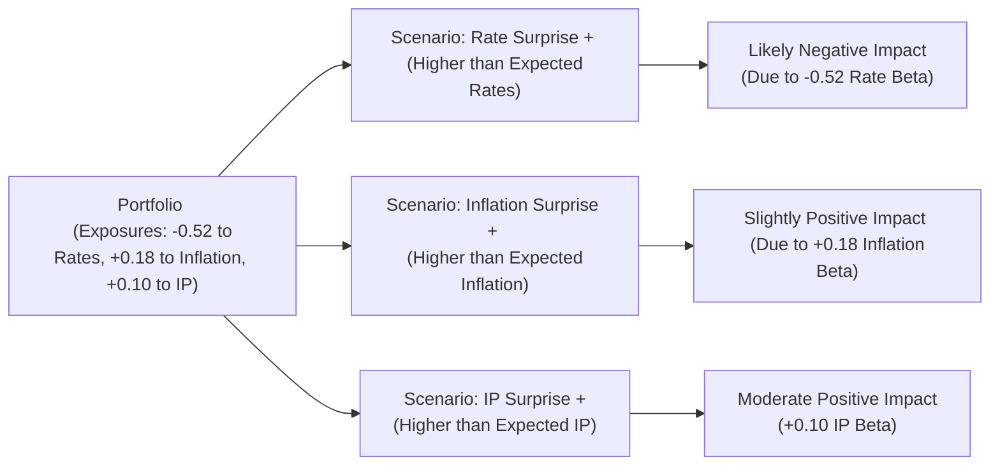

## Overview

Well, let's open up with a quick personal story that might ring a bell for many of you. I once had a conversation with a portfolio manager who seemed almost obsessed with how unexpected changes in inflation—what we might call “inflation surprises”—were eating into the returns of his meticulously constructed equity portfolio. That chat really drove home the idea that what you don’t expect in the macro environment can sometimes matter more than the headline numbers you’ve been following. That is precisely where macroeconomic factor models come into play. 

These models, in a nutshell, say something like this: “Equities (or any asset returns, if you like) aren’t driven just by random forces; they are significantly influenced by a short list of fundamental economic variables.” That could be GDP growth, inflation, interest rate shifts, or maybe a sudden spike in oil prices, among many other possibilities. In this section, we’ll uncover how these models are constructed, how you can interpret their outputs, and what pitfalls to watch out for. 

## Core Elements of Macroeconomic Factor Models

Macroeconomic factor models provide a framework for explaining or predicting equity returns based on an asset’s sensitivity to discrete market or economic forces. In practice, a simple representation of such a model might look like:


R_{i, t} = \alpha_i + \beta_{i, 1} F_{1, t} + \beta_{i, 2} F_{2, t} + \dots + \beta_{i, k} F_{k, t} + \varepsilon_{i, t},


where:  
• \\(R_{i, t}\\) is the return on asset (or portfolio) \\(i\\) at time \\(t\\).  
• \\(\alpha_i\\) is the intercept term, often viewed as asset \\(i\\)’s idiosyncratic (or unexplained) portion of return.  
• \\(F_{j, t}\\) represents the unexpected (surprise) portion of the \\(j\\)-th macroeconomic factor at time \\(t\\).  
• \\(\beta_{i, j}\\) captures how sensitive asset \\(i\\) is to factor \\(j\\).  
• \\(\varepsilon_{i, t}\\) is a noise term or random error.

### Identifying Relevant Macroeconomic Factors

So, which factors do we include? Generally, each factor should be:  
• Theoretically plausible and economically meaningful: It should capture an actual driver of returns that aligns with market behavior.  
• Empirically tested: There should be some historical evidence that indicates a factor has explanatory power for asset returns.  
• Measurable: Factor data must be publicly available and well-defined (e.g., inflation, GDP growth, industrial production, oil prices, or risk-premium proxies).  

Common macro factors include real GDP growth, inflation, money supply changes, interest rate shifts, changes in credit spreads, or commodity price spikes. You might also see “unexpected factors,” like surprise announcements from central banks or unexpected changes in unemployment numbers.

### Factor Surprises

A hallmark of macro factor models is their emphasis on “surprises” rather than absolute levels. If the consensus forecast says inflation will be 3%, and actual inflation shows up at, say, 3.4%, we have a +0.4% unexpected shock, or “surprise.” Markets react to what was not priced in. If that portfolio manager I mentioned earlier had recognized the potential for large inflation surprises, they might have positioned differently.

### Estimating Factor Loadings

Once you’ve pinned down your macro factors and computed your factor surprises, you typically run a multi-regression of the asset (or portfolio) returns on these factor surprises:


R_{i,t} - R_{f,t} = \alpha_i + \beta_{i,1}(F_{1,t} - E[F_{1,t}]) + \dots + \beta_{i,k}(F_{k,t} - E[F_{k,t}]) + \varepsilon_{i,t},


where \\(R_{f,t}\\) is the risk-free rate, and \\(F_{j,t} - E[F_{j,t}]\\) is the surprise component for factor \\(j\\). From this regression, you’ll get the betas (\\(\beta_{i,j}\\)), which measure sensitivity. For example, a positive beta for an inflation factor means that security or portfolio \\(i\\) on average does well when there’s an inflation surprise.

## Visualization of a Macroeconomic Factor Model

Below is a conceptual Mermaid diagram that visually depicts the flow of modeling steps:

This diagram highlights how you typically proceed: you pick your factors, measure the surprises, regress them against returns, and interpret the results.

## Interpreting Factor Exposures

So, you’ve run a regression and found that your portfolio has a \\(\beta\\) of +0.45 on the inflation factor. That means, all else equal, a positive inflation surprise is linked to above-average returns for your portfolio. Alternatively, a negative factor loading might signify that your portfolio is somewhat “short” or vulnerable to that economic dimension—like having a \\(\beta\\) of -0.30 on an oil price factor, meaning a shock in oil prices might harm your portfolio’s performance relative to the broad market.

It’s not always straightforward to interpret a single beta in isolation. Often, you look at the sum of your exposures. For instance, maybe your portfolio is +0.45 on inflation surprise, but it’s -0.55 on an interest rate surprise. In that sense, your net exposure to a “high inflation, rising rates” environment might be different from your exposure to a “high inflation, stable rates” environment. 

## Real-World Applications

### Risk Management

Portfolio managers use macro factor models to monitor how “shifts” in the economy might ripple through their portfolios. If you see that your portfolio has large negative exposure to unexpected interest rate hikes, you might lighten your holdings in growth stocks (which typically are hammered when yields rise faster than expected).

### Asset Allocation

Deciding how to tilt a portfolio can often hinge on macro factor exposures. For example, if your economic outlook is that inflation data might keep surprising to the upside, you might lean into materials, commodities-oriented equities, or certain cyclical plays that historically do well with unexpected inflation. This is sometimes referred to as a “tactical tilt.”

### Performance Attribution

Imagine you post a stellar quarter. But was that because of your brilliant individual stock picks, or because high inflation surprised the market and your portfolio happened to be well-aligned to that factor? Factor-based performance attribution helps you dissect what portion of your returns came from macro factors vs. skill-based alpha (which might be captured in the intercept \\(\alpha\\)).

## Pitfalls and Complexities

As powerful as macro factor models can be, they’re neither foolproof nor static. Let’s see why:

• **Structural Breaks:** Economic relationships are not etched in stone. A government policy shift, a global crisis, or a technological innovation can abruptly change how a certain factor influences returns. If you’ve loaded on “higher interest rate sensitivity,” but the Federal Reserve changes its policy regime drastically, the old betas might not hold.  

• **Overfitting and Spurious Results:** Sometimes, you might be tempted to throw in every single macro variable you can imagine—GDP, money supply, commodity prices, metals indexes, you name it. But that can create a “too many variables” problem, leading to inflated R-squared values that trick you into thinking you’ve discovered stable relationships. Less is often more.  

• **Data Revisions and Lags:** Macro data (GDP or inflation) can get revised weeks or months after initial release. If you’re modeling in real time, the “actual data” you used might not be the final figure. These revisions introduce noise.  

• **Short Sample Periods:** If you only have a couple of years of data, your estimates of factor exposures might be unreliable. A single shock can skew your entire regression, especially if your sample is too narrow.  

• **Regime Shifts:** Macroeconomic factor behavior can change under certain conditions, such as the economy moving from expansion to recession. Portfolio managers often segment factor exposures by economic regime.

## Tips for Best Practices

• **Keep the Model Parsimonious:** Focus on a handful of well-established macro drivers and do them well, rather than trying to guess every possible variable.  

• **Update Factor Exposures Periodically:** The world changes—especially monetary policy, commodity prices, or demand for risk assets. Regularly re-estimate betas as new data come in.  

• **Combine with Qualitative Insights:** A purely quantitative approach can miss the bigger picture if a major, unquantifiable event occurs (like geopolitical crises). Incorporate a sense check, and maybe even chat with macroeconomists.  

• **Monitor for Breakdowns:** If your factor exposures suddenly flip sign for no obvious reason, check whether you might be experiencing a structural break.  

• **Use Rolling Windows:** A common trick is to use rolling or expanding window regressions to see whether factor loadings remain stable over time.

## Brief Case Study Example

Let’s say you manage a $100 million equity portfolio. Over the past two years, you’ve noticed that the returns are suspiciously correlated with unexpected changes in interest rates. You suspect a factor model might help. So you gather monthly data on your portfolio returns (\\(R_p\\)) minus the risk-free rate (\\(R_f\\)), as well as consensus forecasts for certain macro variables. You decide to test for surprising movements in:  

• Rate Surprise (\\(F_{rates} = \text{Actual rates} - \text{Forecast rates}\\))  
• Inflation Surprise (\\(F_{inf} = \text{Actual inflation} - \text{Forecast inflation}\\))  
• Industrial Production Surprise (\\(F_{ip} = \text{Actual IP} - \text{Forecast IP}\\))  

You regress \\((R_p - R_f)\\) on these factor surprises:


(R_p - R_f)_t = \alpha_p + \beta_{p,\text{rates}} \times (F_{\text{rates},t}) + \beta_{p,\text{inf}} \times (F_{\text{inf},t}) + \beta_{p,\text{ip}} \times (F_{\text{ip},t}) + \varepsilon_t.


Suppose the resulting loadings are:  

\beta_{p,\text{rates}} = -0.52, \quad \beta_{p,\text{inf}} = 0.18, \quad \beta_{p,\text{ip}} = 0.10.


Interpretation:

• **Rates:** A negative loading on rate surprises indicates that when rates rise more than expected, the portfolio typically underperforms. You might suspect your portfolio is heavy in growth stocks or high-duration equities.  
• **Inflation:** A small positive loading means the portfolio moderately benefits from inflation surprises, but the effect is not as large as the negative effect from rising rates.  
• **Industrial Production (IP):** The portfolio benefits somewhat from positive IP surprises, which usually align with expansions.  

With that knowledge, you can weigh your next steps: rebalance holdings, hedge rate risk, or accept these exposures if you believe your active view is correct.

## Additional Visual Aid

To map how final loadings might affect your portfolio in different economic scenarios, consider the following schematic:

This flow highlights how each macro scenario can produce a distinct effect on your overall returns, thanks to those factor exposures.

## Concluding Thoughts

Macroeconomic factor models are invaluable for shining a spotlight on the underlying drivers of equity returns. They let you see how a portfolio (or a single stock) might behave when the economy surprises us all. Still, watch out for the usual suspects: data revision, structural breaks, and overfitting. And remember that these models are only as good as the insights and assumptions that go into them. Keeping a pulse on the broader macroeconomy—and occasionally having a healthy dose of skepticism—can go a long way toward making these models work for you rather than against you.

## References and Further Exploration

• CFA Institute’s Official Curriculum (2025 Edition), Equity Investments volume, for a deeper, exam-focused perspective on macroeconomic factor models.  
• Fama, E. F., and K. R. French. “Common Risk Factors in the Returns on Stocks and Bonds,” Journal of Financial Economics, for an academic discussion of factor-based modeling.  
• Damodaran, A. (NYU Stern) – Online resources covering macro factors’ role in valuation: http://pages.stern.nyu.edu/~adamodar/  
• “Asset Pricing and Portfolio Choice Theory,” by Kerry Back, for more technical treatments of factor models.  

Anyway, factor modeling in a macro sense doesn’t have to be complicated, so long as you’re systematic about it. With that in mind, the following practice questions should help you reflect on how comfortable you are with these ideas and how they might appear in a CFA-type exam environment.

## Practice Questions on Macroeconomic Factor Models



### Under a macroeconomic factor model, which of the following best describes a "factor surprise"?

- [ ] The absolute level of an economic indicator such as GDP or inflation.
- [ ] The average forecasted level for an economic indicator.
- [x] The difference between an economic indicator’s actual value and the consensus forecast.
- [ ] The long-run trend of the selected economic indicator.

> **Explanation:** Factor surprises capture the unexpected component (actual minus forecast). Markets react to the unanticipated portion of macro data releases.

### A portfolio exhibits a strong negative factor loading to unexpected interest rate increases. This implies that:

- [x] The portfolio tends to underperform when rates rise more than expected.
- [ ] The portfolio tends to outperform when rates rise more than expected.
- [ ] The portfolio is insensitive to changes in interest rates.
- [ ] The portfolio’s overall beta to the market must also be negative.

> **Explanation:** A negative beta (factor loading) on an interest rate surprise means the portfolio is likely to suffer when rates rise unexpectedly.

### Which of the following is most likely a potential pitfall when constructing a macroeconomic factor model?

- [ ] Archival data availability from central banks.
- [x] Overfitting the model by including too many macroeconomic factors.
- [ ] Using historical data to estimate factor sensitivities.
- [ ] Excluding the risk-free rate from the regression equation.

> **Explanation:** Overfitting occurs if the analyst includes an excessive number of factors, creating spurious correlations and volatile model parameters.

### In a macroeconomic factor model, a positive loading on the inflation factor generally indicates that:

- [ ] The asset or portfolio is hedged against unexpected inflation.
- [x] The asset or portfolio performs well when inflation exceeds expectations.
- [ ] The asset or portfolio is negatively correlated with inflation surprises.
- [ ] The asset or portfolio is completely insulated from changes in inflation.

> **Explanation:** A positive loading means the asset’s return moves in the same direction as inflation surprises, benefiting when inflation is higher than expected.

### After running a macroeconomic factor model, it is discovered that a portfolio has factor loadings of +0.30 on an oil-shock factor and -0.25 on a growth (GDP) factor. Which scenario describes the likely performance of this portfolio?

- [x] It might see gains if oil prices surprise on the upside, but struggles if GDP growth disappoints.
- [ ] It will always outperform if the overall market goes up.
- [x] It might see gains when GDP growth is below forecasts but struggles if oil prices decline.
- [ ] It becomes completely uncorrelated with the market index.

> **Explanation:** A positive loading on oil-shock indicates outperformance when oil prices rise unexpectedly. Negative loading on growth means it underperforms if GDP surpasses expectations (and might do better if GDP disappoints).

### How can macroeconomic factor models assist in performance attribution?

- [ ] By removing all macro influences from the returns.
- [x] By decomposing returns into factor-driven (systematic) components and stock-specific (idiosyncratic) components.
- [ ] By ensuring that structural breaks do not occur in the economy.
- [ ] By providing a perfect forecast of future returns.

> **Explanation:** Performance attribution dissects how much of a portfolio’s returns come from exposure to systematic factors versus manager-driven alpha.

### Which of the following describes a “structural break” in macroeconomic factor modeling?

- [ ] A short-term fluctuation in factor betas that is expected to revert.
- [x] A change in the underlying relationship between factor surprises and returns, often triggered by major economic or policy shifts.
- [ ] A sudden increase in the R-squared of the regression.
- [ ] A consistent pattern in factor exposures across economic cycles.

> **Explanation:** A structural break refers to a situation where the prior relationship between macro factors and asset returns no longer holds, possibly due to regime changes.

### If a macro factor surprises market participants favorably, and your portfolio has a significantly positive beta to that factor, what would you expect?

- [x] Your portfolio will likely experience a relative increase in returns.
- [ ] Your portfolio returns will always be negative.
- [ ] Your portfolio remains unchanged as macro factors do not affect it.
- [ ] Your portfolio must have a high alpha.

> **Explanation:** A positive factor exposure means the portfolio tends to move in the same direction as that factor surprise, implying outperformance if the surprise is favorable.

### What is a common reason that macroeconomic data can complicate factor modeling efforts?

- [ ] Economic indicators are negligible in global financial markets.
- [ ] Consensus forecasts are always correct.
- [ ] There is only one universally accepted macro model.
- [x] Many economic data points are subject to revisions that can alter the “actual” figure post-release.

> **Explanation:** Data revisions can render the allegedly “actual” release figures different from the final ones, complicating real-time analysis.

### True or False: A macroeconomic factor model that includes multiple factors can guarantee the identification of alpha in a portfolio.

- [x] True
- [ ] False

> **Explanation:** While multi-factor models help capture systematic influences, they do not guarantee the isolation of alpha. Even with many factors, idiosyncratic returns may remain, and the model’s accuracy depends on correctly selected and stable factors.


