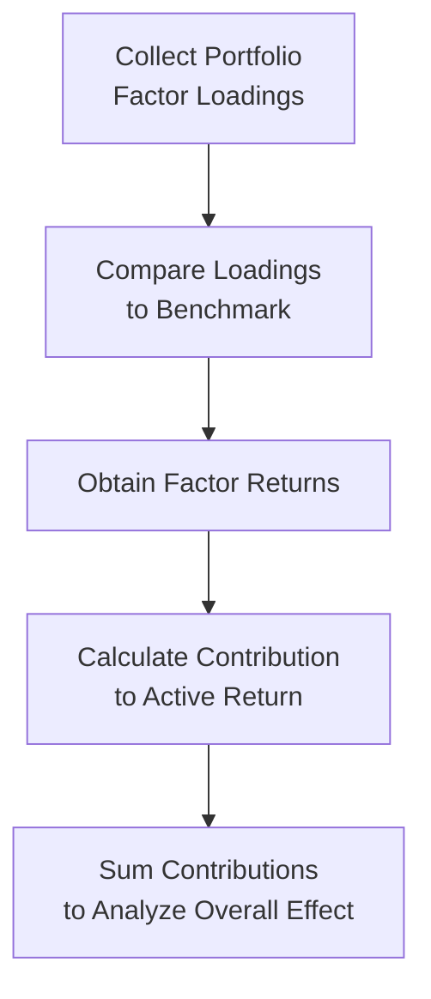

## Vignette Overview and Background

Imagine you’re an equity analyst at Eagle Eye Asset Management. You’ve been tasked with evaluating a client’s portfolio that’s exposed to several key factors—both macroeconomic (like interest rates and inflation) and fundamental (like value, momentum, and size). The portfolio also contains a small position in a quirky “statistical factor” derived from principal component analysis, which at first might have you scratching your head, thinking: “Wait, how did that get in there?” Well, it happens. In a perfectly typical CFA® Level II scenario, your role is to interpret these factor loadings, measure overall risk contributions, and propose potential rebalancing strategies.

We’ll step through each element of this practice vignette, building on the multifactor models discussed earlier in Chapter 31. The end goal is to prepare you for exam-style item sets—where you have a chunk of data and a series of questions teasing apart your ability to apply these factor-exposure insights in real time.

## Understanding Factor Exposures

Before diving into the scenario, let’s quickly recall the multifactor approach:

• A portfolio can be viewed as having exposure to several risk factors.  
• Each factor comes with its own expected return premium (positive or negative) and its own volatility.  
• By measuring factor loadings—how sensitive the portfolio (or stock) is to each factor—you can figure out how those factors influence both returns and risk.  

### Macro, Fundamental, and Statistical Factors

1. Macroeconomic Factors  
   These reflect broad economic conditions. For instance, interest rates, GDP growth, or inflation rate changes. When exposure is positive to the inflation factor, you might anticipate doing better if inflation unexpectedly trends upward and vice versa.

2. Fundamental Factors  
   These typically stem from company-specific financial metrics, like price-to-book (value), trailing returns (momentum), or earnings growth (growth tilt). If the portfolio has a robust momentum factor loading, it is likely to outperform when hot stocks keep rallying—but might underperform if the market abruptly switches to a contrarian tilt.

3. Statistical Factors  
   These are discovered through purely data-driven techniques such as principal component analysis. Think of them kind of like “mystery factors” that cluster certain return patterns without a clear narrative at first. They can capture shared variance across a set of stocks, even if we can’t always label them with a simple macro or fundamental theme.

## The Scenario: Eagle Eye’s Equity Portfolio

Let’s put some hypothetical numbers on the table. You’re given the following data for the Eagle Eye Equity Portfolio (EEEP), the Benchmark Index (BI), and each factor’s recent performance. The portfolio invests in about 50 mid-cap stocks with varied exposures.

Suppose your factor loadings and factor returns look something like this:

| Factor                      | EEEP Loading | BI Loading | Factor Return (Last Month) |
|-----------------------------|--------------|-----------:|---------------------------:|
| Interest Rate Sensitivity   | 0.80         | 0.50       | -2.0%                      |
| Inflation Sensitivity       | 0.60         | 0.60       |  1.0%                      |
| Value (P/B)                 | -0.20        | 0.10       |  0.5%                      |
| Momentum                    | 0.70         | 0.40       |  3.0%                      |
| Growth (EPS Growth)         | 0.55         | 0.35       |  2.5%                      |
| Statistical Factor #1 (PC1) | -0.05        | 0.00       | -1.0%                      |

A few things jump out:

• The portfolio is more sensitive (0.80) to interest rate changes than the benchmark (0.50). So if rates move sharply, EEEP’s performance will be impacted disproportionately.  
• EEEP has a negative value loading (-0.20) relative to the benchmark’s +0.10. That suggests a “growth tilt.”  
• Momentum factor exposure is significantly higher (0.70 vs. 0.40), which is one reason the portfolio might benefit during a bull run.  
• The portfolio has a minor negative exposure (-0.05) to some intangible statistical factor, which is effectively neutral but might still matter under certain market conditions.

## Calculating Factor Contributions

Let’s do a simplified calculation of factor contributions to active return. Active return is typically:


\text{Active Return} = \sum ( \text{Loading}_{\text{portfolio}} - \text{Loading}_{\text{benchmark}} ) \times \text{Factor Return}


In our scenario:

1. Interest Rate Sensitivity:  
   Loading difference = (0.80 – 0.50) = 0.30  
   Factor return = –2.0% = –0.02  
   Contribution to active return = 0.30 × (–0.02) = –0.006, or –0.60%  

2. Inflation Sensitivity:  
   Loading difference = (0.60 – 0.60) = 0.00  
   Factor return = +1.0% = 0.01  
   Contribution to active return = 0.00 × 0.01 = 0.0, or 0.00%  

3. Value (P/B):  
   Loading difference = (–0.20 – 0.10) = –0.30  
   Factor return = +0.5% = 0.005  
   Contribution to active return = –0.30 × 0.005 = –0.0015, or –0.15%  

4. Momentum:  
   Loading difference = (0.70 – 0.40) = 0.30  
   Factor return = +3.0% = 0.03  
   Contribution = 0.30 × 0.03 = 0.009, or +0.90%  

5. Growth (EPS Growth):  
   Loading difference = (0.55 – 0.35) = 0.20  
   Factor return = 2.5% = 0.025  
   Contribution = 0.20 × 0.025 = 0.005, or +0.50%  

6. Statistical Factor #1 (PC1):  
   Loading difference = (–0.05 – 0.00) = –0.05  
   Factor return = –1.0% = –0.01  
   Contribution = –0.05 × (–0.01) = +0.0005, or +0.05%  

Now summing these up:


\text{Total Active Return} = -0.60\% + 0.00\% - 0.15\% + 0.90\% + 0.50\% + 0.05\% 
= 0.70\% 


So, the portfolio’s approximate active return is +0.70% relative to the benchmark over this period.

## Visualizing the Factor Analysis

To depict the flow of how we gather these factors and measure contributions, we can visualize it in a flowchart.



From this flowchart, you can see that once we have the portfolio’s factor loadings, the benchmark’s factor loadings, and each factor’s actual return, the next steps follow naturally: you calculate the difference in loadings, multiply by the respective factor’s return, and then sum all contributions to see the total active return (positive or negative).

## Connecting Factor Exposures to Economic Environments

We also want to consider how these exposures would fare in different economic environments.

1. Rate Hikes or Rising Rate Environment  
   With a higher interest rate sensitivity (0.80 vs. 0.50), EEEP might underperform if rates keep going up—unless there’s some offsetting factor that thrives in a rising rate environment (like strong momentum or growth).

2. Inflation Shocks  
   The portfolio’s inflation sensitivity is on par with the benchmark. If inflation surprises turn negative (meaning actual inflation is less than expected), EEEP’s relative performance from an inflation-factor standpoint is basically zero. The big difference is going to come from other factor exposures like momentum or growth.

3. Recession vs. Expansion  
   A negative value tilt (–0.20 vs. +0.10) means EEEP is less oriented to “cheap” stocks, so in a deep recession—where battered value stocks might eventually bounce—EEEP could underperform. Then again, if the recession is shallow or growth stocks hold up better, EEEP might do fine.

## Risk Measures: Tracking Error and Factor-Based VaR

While active return is good to know, it doesn't tell us the potential downside or volatility associated with these factor exposures. Two important measures are:

• Tracking Error (Active Risk): The standard deviation of the portfolio’s active returns—i.e., how widely do the portfolio’s returns deviate from the benchmark’s returns?

• Factor-Based VaR: By combining each factor’s volatility and the portfolio’s loadings, you can estimate how bad losses might get under extreme conditions. It’s basically a risk model that uses factor sensitivities to measure tail risk.

Here’s a typical representation in formula form for factor-based VaR:


\text{VaR}_{\alpha} \approx \mu_p - z_{\alpha} \times \sigma_{p}


But \\(\sigma_{p}\\) (the portfolio volatility) can be decomposed into factor exposures and factor covariances:


\sigma_p^2 = \mathbf{X}^T \Sigma \mathbf{X}


where \\(\mathbf{X}\\) is the vector of factor loadings, and \\(\Sigma\\) is the covariance matrix of factor returns. Of course, for your Level II exam, you should be comfortable with the conceptual layering: changes in any factor’s covariance have an impact on the final risk measure.

## Example: Quick Python Snippet to Aggregate Factor Returns

If you were to do some quick spadework on factor returns, you might use a Python snippet like this:

```python
import numpy as np
import pandas as pd

portfolio_loadings = {
    'InterestRate': 0.80,
    'Inflation': 0.60,
    'Value': -0.20,
    'Momentum': 0.70,
    'Growth': 0.55,
    'PC1': -0.05
}

benchmark_loadings = {
    'InterestRate': 0.50,
    'Inflation': 0.60,
    'Value': 0.10,
    'Momentum': 0.40,
    'Growth': 0.35,
    'PC1': 0.00
}

factor_returns = {
    'InterestRate': -0.02,
    'Inflation': 0.01,
    'Value': 0.005,
    'Momentum': 0.03,
    'Growth': 0.025,
    'PC1': -0.01
}

pf_loadings = pd.Series(portfolio_loadings)
bm_loadings = pd.Series(benchmark_loadings)
fr = pd.Series(factor_returns)

active_exposure = pf_loadings - bm_loadings

contrib_active_return = active_exposure * fr
total_active_return = contrib_active_return.sum()

print("Active Factor Contributions:\n", contrib_active_return)
print("Total Active Return:", total_active_return)
```

This snippet basically does the same math we did by hand—just in a more automated fashion.

## Potential Rebalancing Strategies

After you’ve identified the factor exposures that are beneficial (or detrimental), consider how to rebalance:

• Reduce or hedge out the big negative active exposure, if you believe that factor is going to keep hurting your performance. For example, if you think interest rates will keep rising, you might reduce the portfolio’s interest rate sensitivity to be closer in line with the benchmark.  
• Increase exposure to a factor if you have a strong reason to believe it will outperform in the coming market environment. For instance, if you expect a sustained growth rally, you may want to tilt further into growth.  
• Rebalance frequently or set a threshold (e.g., once the factor tilt drifts outside ±0.25 from the intended tilt, you rebalance to your target).

## Common Pitfalls and Best Practices

1. Overreliance on One Factor  
   Sometimes a single factor can overshadow all others. Beware of letting your entire portfolio be driven by, say, one macro view on interest rates.

2. Ignoring Factor Correlation  
   Momentum and growth might be correlated (especially in certain market cycles). Double-check that you’re not unintentionally doubling up on the same risk.

3. Changing Factor Definitions  
   A “value factor” can be built from different metrics (P/B, P/E, DCF-based). Consistency matters—shifting definitions can create mismatched signals.

4. Not Accounting for Regime Changes  
   Factor relationships are not static. A factor that worked well in an expansion might behave very differently in a downturn (as we discussed in Chapter 20: Industry and Competitive Analysis—Deep Dive).

## A Quick Personal Anecdote

You might be surprised how quickly factor exposures creep up on you. I remember working with a small hedge fund manager who insisted they were “neutral” to interest rates. Then we ran the factor-based scenario analysis: turned out they had inadvertently picked securities that all responded positively to falling rates. As soon as the Fed hinted at hikes, their portfolio took a nosedive. It was a sobering reminder that your intuition alone can be misleading!

## Scenario Analysis: Practical Application

Let’s do a quick scenario test. Suppose the central bank hints at multiple rate hikes, and interest rates jump by 50 basis points. The “Interest Rate Sensitivity” factor might post a return of –5% next quarter if you’re severely overweight. That’s a big watch-out. Meanwhile, maybe “Growth” factor sees a small setback of –1% if rising rates dampen growth stock optimism. With your exposures (0.80 vs. 0.50 in interest rate and 0.55 vs. 0.35 in growth), you would factor these new hypothetical returns in the same manner to see the updated predicted performance. This helps you decide if you’re comfortable with the new risk-return trade-off.

## Exam Strategy Tips 

• Thoroughly read the vignette for any directional clues: Are they hinting that the economy is slowing? Are they hinting that inflation is picking up? Connect those hints to your factor exposures to anticipate which factor might see a higher return.  
• Watch out for negative vs. positive loadings. A negative loading means you benefit when the factor goes down (or lose when the factor is up), etc.  
• If you see a question about how the portfolio would perform if “inflation is lower than expected,” interpret factor returns accordingly.  
• For item-set questions, you’ll likely see rebalancing logic or “which factor is driving the biggest chunk of active return?” type questions.  

## Concluding Thoughts

Understanding factor exposures is like shining a bright flashlight on your portfolio in a dark room—suddenly, you see which corners are stuffed with hidden risk and which areas are your prime return drivers. Whether you love or hate the details of factor models, they’re powerful tools for dissecting performance, diagnosing imbalances, and anticipating how your portfolio might behave under a range of possible future states.

Feel free to revisit Chapter 3 on required rates of return or Chapter 27 on risk management if you need a deeper refresh on how we integrate factor-based discount rates and measure extremes in equity portfolios, respectively.

## Evaluate Your Factor Exposure Mastery



### Which factor exposure in the provided scenario contributed the most to the portfolio’s active return?

- [ ] Interest Rate Sensitivity (–0.60%) 
- [ ] Value (P/B) (–0.15%) 
- [x] Momentum (+0.90%) 
- [ ] Growth (+0.50%)  

> **Explanation:** As calculated, the momentum factor contributed +0.90% to active return—the largest single-source driver of the portfolio’s outperformance.

### If inflation surprises turn negative, how would the portfolio likely perform relative to the market?

- [ ] Likely underperform due to negative inflation exposure
- [x] Likely see no major impact from inflation exposure
- [ ] Strongly outperform because the portfolio is heavily inflation-sensitive
- [ ] Significantly underperform due to high correlation with inflation  

> **Explanation:** The portfolio’s inflation sensitivity matches the benchmark, so its relative performance in that factor alone is expected to be neutral.

### Why might a large negative exposure to the value factor indicate a growth tilt?

- [x] The negative loading suggests the portfolio avoids “cheap” stocks in favor of growth
- [ ] The value factor is unavailable in the global market
- [ ] All factor definitions with negative loadings indicate growth
- [ ] Negative loadings always mean zero exposure to any factor  

> **Explanation:** A negative value exposure implies the portfolio is holding fewer traditional “cheap” stocks than the benchmark, leaning more toward growth-oriented ones.

### Which of the following is the best justification for adding a fundamental momentum factor to a portfolio?

- [ ] It is uncorrelated with macroeconomic factors
- [ ] It guarantees outperformance during recessions
- [x] It captures the trend where stocks that have performed well historically may continue to do so
- [ ] It helps eliminate all factor-related risks  

> **Explanation:** A momentum factor typically captures the trend that previous winners tend to keep winning in the short to medium term, although there’s no guarantee of outperformance in every market environment.

### Which approach best summarizes factor-based VaR?

- [ ] It focuses only on historical returns without forward-looking estimates
- [ ] It zeroes in on single stocks with no reference to other holdings
- [ ] It ignores correlation between factors
- [x] It measures the tail risk by looking at factor exposures and their covariances  

> **Explanation:** Factor-based VaR uses factor loadings, factor variances, and their covariances to estimate potential extreme losses.

### A negative contribution to active return for the “Value” factor implies what about the portfolio’s relative performance?

- [ ] The portfolio outperformed in high P/E stocks
- [x] The portfolio underperformed because it was underweight value stocks
- [ ] The portfolio's net effect is zero
- [ ] It only happens if the factor has positive returns  

> **Explanation:** A negative contribution indicates the portfolio’s loading on value was below that of the benchmark, and since the value factor had a positive return, the portfolio realized a drag relative to the benchmark.

### A portfolio’s factor exposure to GDP growth is +1.2, while its benchmark is +0.6. Which scenario likely benefits the portfolio the most?

- [x] Strong GDP growth forecast 
- [ ] Deflationary environment
- [ ] Sudden interest rate spike
- [ ] Commodity price collapse  

> **Explanation:** A higher GDP growth exposure means you likely reap gains if actual growth is stronger than expected.

### How should one interpret an extremely high exposure to momentum?

- [ ] The portfolio is extremely defensive
- [ ] The portfolio has no directional bias
- [x] The portfolio tilts aggressively toward stocks with strong recent performance
- [ ] The portfolio invests exclusively in value stocks  

> **Explanation:** A strong momentum exposure signals a tilt toward recent winners and an expectation that these stocks may continue to rise.

### In a factor-based model, which statement about correlations is most accurate?

- [ ] Ignoring correlations often leads to a more accurate model
- [x] High factor correlations can lead to double-counting certain risks
- [ ] Factors are always perfectly correlated
- [ ] Correlations never change  

> **Explanation:** Factors can exhibit correlations, and failing to account for that can cause an overestimation or underestimation of risk when combining exposures.

### A large negative exposure to Interest Rate Sensitivity means:

- [x] The portfolio potentially benefits when interest rates rise
- [ ] The portfolio underperforms when interest rates rise
- [ ] The portfolio has no exposure to rates
- [ ] The portfolio's beta is effectively zero  

> **Explanation:** A negative interest rate sensitivity loading suggests the portfolio moves inversely to changes in rates, benefiting if rates rise unexpectedly.



## References for Additional Reading

• Bender, J., Briand, R., Melas, D., & Subramanian, R. (2013). “Foundations of Factor Investing.” MSCI Research.  
• Bender, J., LeHeux, C., & Sun, X. (2018). “Multifactor Exposures and Portfolio Construction.” The Journal of Portfolio Management.  
• “Equity Investments,” CFA Program Curriculum, Level II (2025 edition).  
• Bloomberg PORT, MSCI Barra, or similar factor analytics tools.  

Always remember: stay curious, test scenarios, and never let hidden factor risk derail your investment strategy. If you keep these principles in mind, dealing with loading differentials in your next CFA item set should be a whole lot more manageable—and maybe even a bit fun. Good luck!
